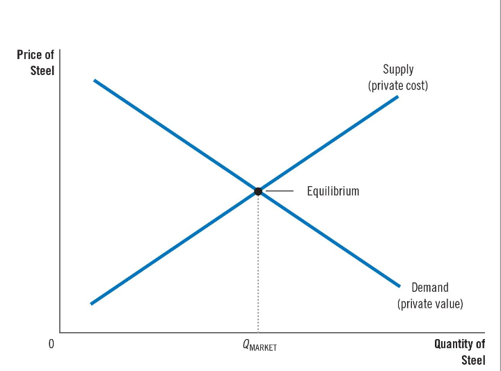
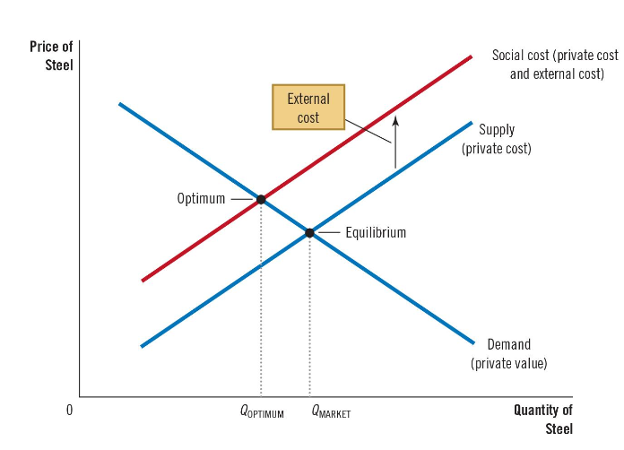
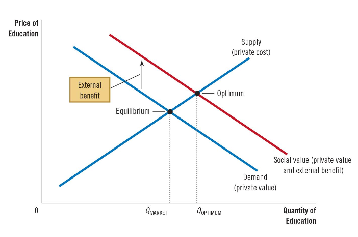

## Externalities and Market Inefficient

### Externality外部性

The uncompensated impact of one person’s actions on the well-being of a bystander

指的是某种经济活动（例如生产或消费）对第三方产生的影响，这种影响既不体现在市场交易中，也没有通过价格来反映。

外部性可以是正的或者负的

Example: 

* Positive
  * 接受良好的教育提升收入
  * research
  * technology spillovers 技术溢出效应
* Negative
  * 工厂污染排放，价格或许低廉，但对环境和健康不利
  * Noise
  * Smoking

### 对市场的影响

* 当存在外部性时，社会对市场结果的关注不仅限于交易参与者本身的利益，还需要考虑对旁观者（即没有直接参与交易但受到影响的人）福祉的影响
* 此时market equilibrium并不是有效的，因为此时demand and supply curve并不能很好地反映实际情况
  * negative externality: market supply usual higher then the theoretic production 因为没有考虑如污染的影响
  * postive externality: vice versa 生产的社会效益没计入

#### 如何解决

也就是外部性发生时市场无法自行调整到最优，那么这时候需要政府干预和政策

### Supply&demand curve

#### Negative

在外部性不存在的情况，我们的demand-supply curve 应该长这样，here take steel as example

而当我们有负的外部性存在 social cost == private cost of the producers + the cost to bystander who are harmed by the negative externality. 把实际的外部性加上时，我们的生产成本会上涨，达到实际的optimal equilibrium 
we have $Q_{OPTIMUM} < Q_{MARKET}$ 

#### postive

正外部性可以增加社会收益，而这部分没有考虑进来，所以  $Q_{OPTIMUM} > Q_{MARKET}$ 

### 政府政策-Internalizing the Externality

Altering incentives so that people take into account the external effects of their actions

内化外部性：通过市场激励和政策，让生产者和消费者在决策时考虑他们的行为对第三方的影响

#### Ex

* Negative: 对污染排放收税相当于把环境污染的成本考虑进来，shift demand and supply curve upward

* Positive: 对教育提供补贴(Subsidy)

由此我们可以得到新的平衡点，有Market equilibrium = Socially optimal quantity 

## Public policies toward Externalities

### Command-and-Control Policies: Regulation法律法规

政府通过通过立法来强制要求如最大排放量，生产规范来纠正外部性。同时加以监管机构来确保正确执行

### Market-Based Policy1: Tax and Subsidies

Provide incentives so that private decision makers will choose to solve the problem on their own

通过税收和补贴来激励他们自行解决

对 negative externalities 收税 ideal corrective tax = external cost 

对 postive externalities 补贴 ideal corrective subsidy = external benefit

这样我们就将社会成本忽略的地方带进了市场

#### Corrective tax的好处

* 内生动力
* 更趋近社会最优的平衡点
* 增加政府收入

### Tradable Pollution Permit

一种市场化的环境管理工具，允许政府对污染物的排放总量设定上限，并将该总量分配为若干许可证，供企业在市场上进行买卖。

#### 优势

自由流通，自行调整各自的permit数量

### Regulation or Permit

