# Tax

### Def

Governments use taxes to raise money for public projects

### Tax Incidence(税收归宿)

Manner in which the burden of a tax is shared among participants in a market

用于分析税收负担的分配情况，即税收最终由哪一方承担。税收归宿关注税收的最终经济影响，尤其是在买方和卖方之间的负担分配，而不仅仅是税款名义上的支付方。它通常涉及供给和需求弹性的讨论，用以了解税收如何影响价格和市场行为。

### Concept

​	1.	**法定税负（Statutory Incidence）**：

这是税收在法律上的缴纳方，也就是税款名义上谁来支付。例如，销售税在法律上可能由卖方上缴，所得税可能由雇主代扣代缴。

​	2.	**实际税负（Economic Incidence）**：

这是税收的实际经济负担分配。即便法律上税款由某一方支付，税收成本可能通过价格调整转嫁给另一方。例如，销售税可能部分或完全通过价格转嫁给消费者。

### Influence

* Taxes discourage market activity
  * Quantity sold is smaller in the new equilibrium

* Buyers and sellers share the tax burden
  * Buyers pay more, and sellers receive less
  * Sellers send the money to the government
  * Buyers pay a lower market price but effective price (with tax) rises

### Analyse from demand supply curve

#### Tax on Sellers

这张图是**对卖家收税**。有税收到无税收相当于从S1-S2的过程。买家承担多了30cent，卖家承担多20cent

虽然法定上应该是卖家承担的，但是却分给了买家。

#### Tax on Buyers

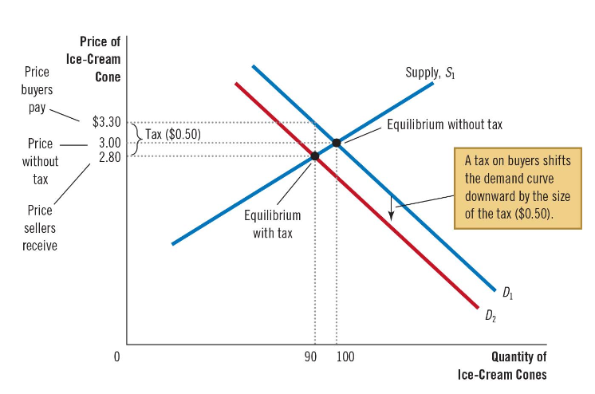

这张图是**对买家收税**。有税收到无税收相当于从S1-S2的过程。买家承担多了30cent，卖家承担多20cent

虽然法定上应该是买家承担的，但是却分给了卖家。

#### Conclu

* Taxes on sellers and taxes on buyers are equivalent

* The tax
  * Inserts a wedge between price that buyers pay and price that sellers receive
  * Shifts the relative position of the supply and demand curves
  * Buyers and sellers share the tax burden in the new equilibrium

#### Payroll Tax（出粮）

对于工资税，我们有

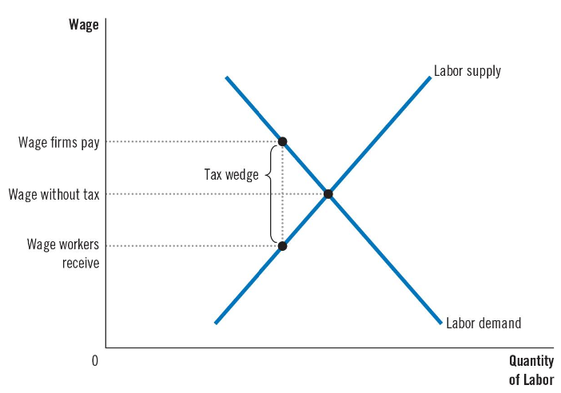

从这个图我们可以更清晰地知道雇主和雇员的tax burden

工资税在企业支付的总薪资和员工实际收到的薪资之间产生了一个“税楔”（tax wedge），也就是因为税的存在导致雇主支出和员工所得之间存在差距。

通过对比有税和无税情况下的工资水平，可以明显看出，工资税的负担实际上是由雇主和员工共同承担的。并且，这种负担的分摊方式不受税收形式的影响——无论政府将税款全部加在员工身上、全部加在企业身上，还是将税款平摊给两方，最终的负担分担情况都是一样的。因为市场会调节

#### CN

税收由卖家和买家共同承担是因为经济学中的**税收负担分摊原理**，即市场上价格和交易量受供需弹性影响，使得税收成本分摊在买卖双方之间，具体原因如下：

​	1.	**供需弹性决定税负分摊**：税收对价格的影响通常导致商品价格上涨或利润下降。在需求弹性较小（即买家对价格不敏感）时，卖家可以将更多的税负转嫁给买家，价格涨幅大，税负主要由买家承担；反之，当供给弹性较小（即卖家难以减少供应）时，卖家承担更多税负。

​	2.	**价格机制的调节作用**：税收通常会增加商品的价格或降低卖家的收入。由于市场中的价格调节作用，卖家为了保持销售，会适度吸收税负而不完全提高价格，而买家为了保持消费也会接受部分价格上涨，从而实现税负的自动分摊。

​	3.	**政策和法律影响**：在不同的税制设计下（如增值税、消费税等），税负会在卖家、买家之间通过市场价格和供需弹性自动调整。例如增值税是以增值额为基础，通常由卖家上缴，但由于价格变化，最终买家也会间接分担。

这种共同承担的现象在经济学上称为**税收转嫁和分配**，是供给和需求两方在市场上互动的结果。这也解释了为何经济政策往往会在分析市场弹性时考虑税收分摊，以便合理调节经济影响。

### Elasticity and Tax Incidence

* Tax burden falls more heavily on the side of the market that is less elastic

| Elastic Supply / Inelastic Demand            | Inelastic Supply / Elastic Demand             |
| -------------------------------------------- | --------------------------------------------- |
| Price received by sellers does not fall much | Price received by sellers does not fall much  |
| Price paid by buyers rises substantially     | Price received by sellers falls substantially |
| Buyers bear most of the tax burden           | Sellers bear most of the tax burden           |

#### Elastic Supply Inelastic Demand

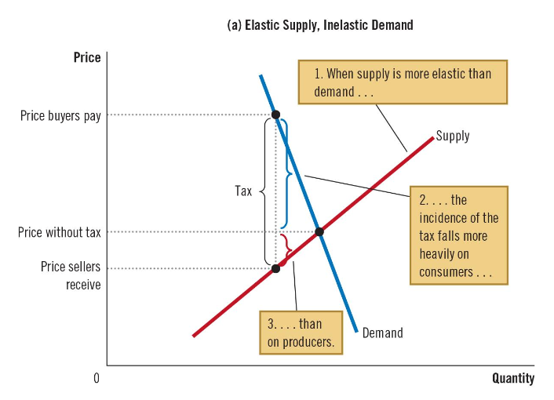

#### Inelastic Supply Elastic Demand

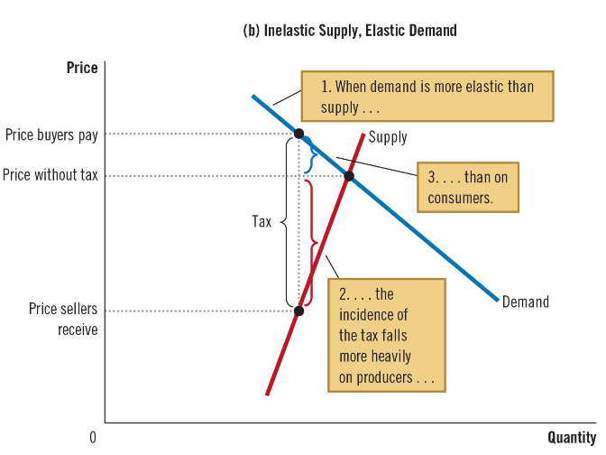

## Welfare & Tax	 

### Economic Welfare(经济福祉)

* Welfare of buyers is measured by comsumer surplus: Amount buyers are willing to pay for the good minus the amountthey actually pay
* Welfare of sellers is measured by producer surplus: Amount sellers receive for the good minus their costs of producing it

### Tax affects market

* Welfare without tax

Total = Comsumer surplus + Producer surplus  which max at equilibrium

没有税之前，社会总福利来自买家和卖家的surplus sum

* Welfare without tax

Comsumer surplus falls, Producer surplus falls, Quantity sold falls

Total  = Comsumer surplus + Producer surplus + Tax revenue

有税之后，社会总福利来自买家和卖家的surplus sum + 税收收入，但总有一部分损失，也就是Deadweight loss

### Deadweight loss(无谓损失)

The fall in total surplus that results when a tax (or some other policy) distorts the outcome in an otherwise efficient market

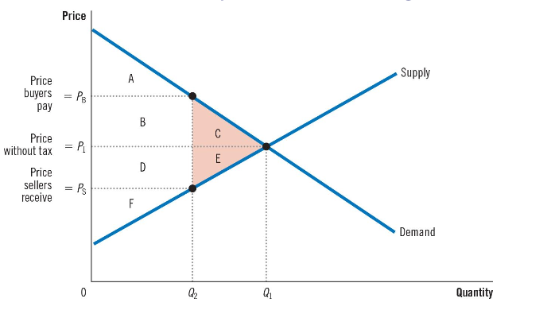

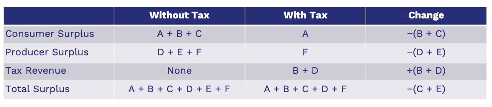

上面这里的Total surplus with tax 那里没有C 写错了

其中C+E是deadweight loss

税收越高，deadweight loss越大

### Deadweight loss & the Gains from Trade

Gains from trade = the difference between buyers’ value and sellers’ cost

Deadweight loss可以理解为因为税收导致的未能实现的交易，从而带来整体社会总福利的损失

因为收入小于税收，所以这部分不会有交易

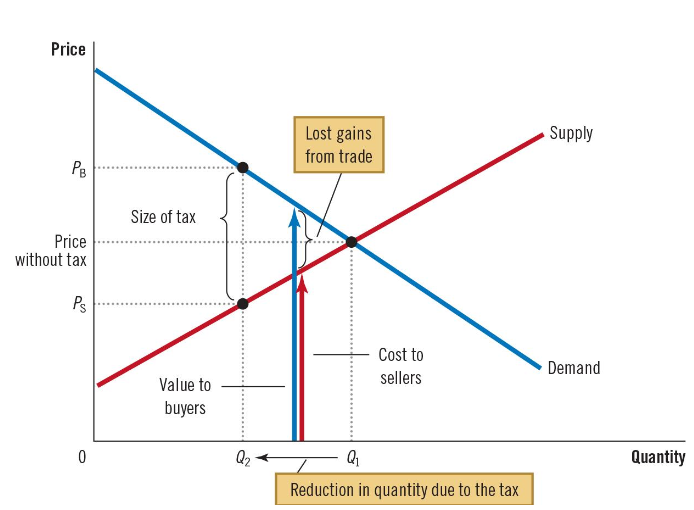

在deadweight loss 之间，没有收入的，自然没有交易

### Factor affects the size of Deadweight Loss

#### Elasticity

More elastic supply curve, Larger deadweight loss

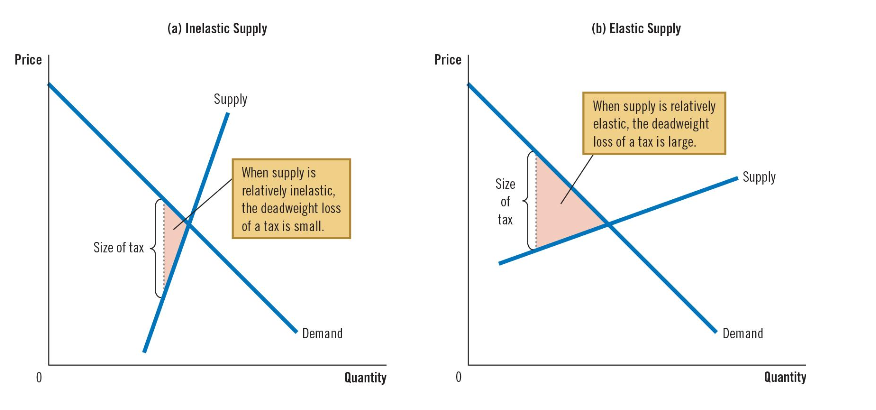

More elastic demand curve, Larger deadweight loss

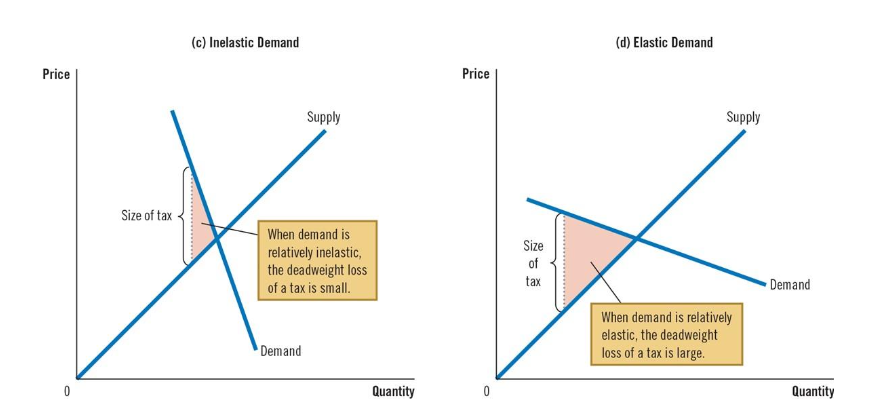

The larger the elasticities of supply and demand. The larger the deadweight loss of a tax

#### Tax

As the size of a tax grows larger, the deadweight loss grows larger. Tax Revenus并不会一直增长，会在中间某个值达到最大之后减小

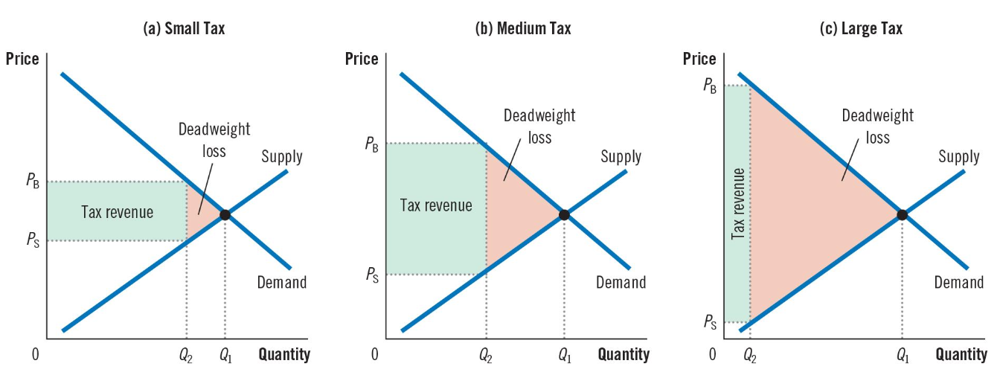

下面这张图是Deadweight loss 和 Tax Revenus与 Price变化的关系。 其中Tax Revenus的曲线也叫做Laffer Curve

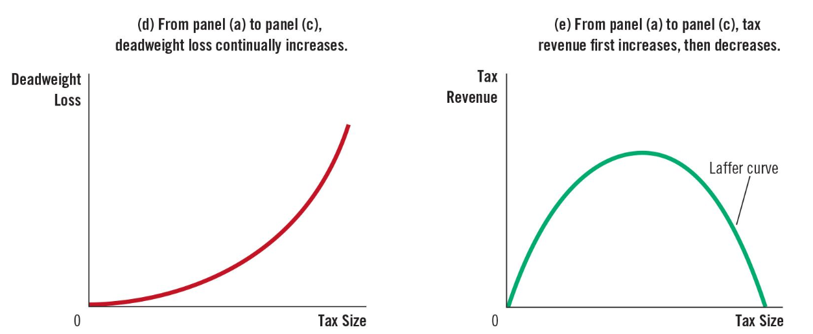