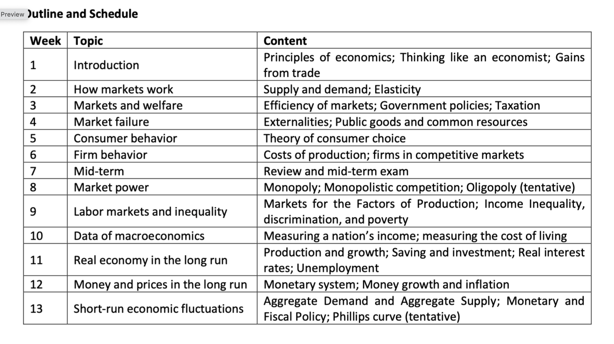

### Outline

### 分类

Macro and Micro

### Definition

Economy comes from greek words "house" and "manage", which means "one who manages a household" so the when economic first used, it is for the micro level. 它的中文翻译为经济，即经世济民的简化，所以它从一个微观的角度进化成为了国家的任务，即宏观的角度。

