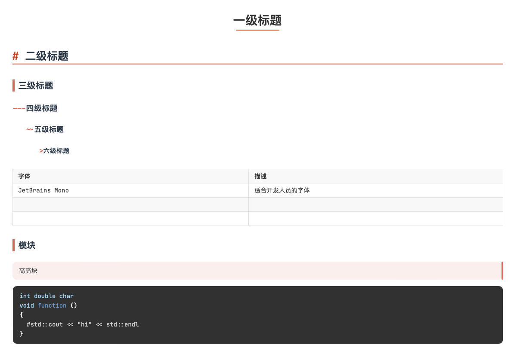

# Note

------

### 打个招呼

哈喽我是yanlin，大一大学生。本仓库旨在交流学习，提高GPA，考试复习使用。记得顺手点一下小星星噢

### 目录

* applied_statistic 应用统计（大一下）
* c++ （大一上）
* css 网站前端，视频自学
* data 数据结构（大一下）
* Embed RM嵌入式笔记，主要搭配Keil，CubeMX进行stm32开发
* hardware 硬件
* html 网站，视频自学
* math 微积分内容（大一）
* others 杂七杂八
* physics 大学物理（大一下-
* python （大一上）
* Stm32 嵌入式开发，b站视频自学
* typora_tech typora中 latex 和 mermaid 的使用方法总结

### 使用方法

* 目前搭配typora软件进行markdown语言编辑阅读
* Typora 中的CSS采用开源+自己魔改的（放在上面typora_tech文件夹）

  * reference [theme 1](https://github.com/liangjingkanji/DrakeTyporaTheme) [theme 2](https://github.com/Theigrams/My-Typora-Themes) 
* Latex 快捷键（辛苦研究了好久）

  * window 使用 autohotkey + gpt
  * mac bettertouchtool / hammerspoon
* others

### En

Hello, I am yanlin, please feel free to take my work to review for the respective course. Don't forget to subscribe and give my repo a small star. Thx!

