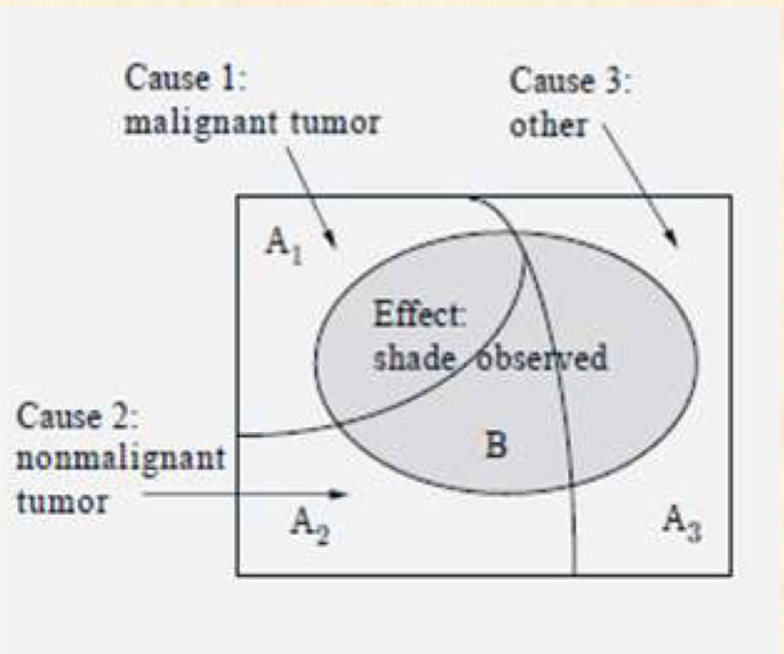

## Sets

A set is a collection of objects, which are the elements of the set

### element relation

#### in

$x \in S$: $S$ is a set and  $x$ is an element of $S$​

#### not in

$x \notin S$: $x$ is not an element of  $S$​

#### empty set

$\emptyset$: A set that has no element --> empty set

### set relation

#### subset

 $S\subseteq T$

#### equal set

 $S = T$

#### universal set

 $\Omega$ : a set that holds all the element in the sample

#### complement

 $\bar{S} = S^c = \Omega - S$

### set operation

#### union of sets

 $S \cup T$ 

#### intersection of sets

 $S \cap T \ \  \cap^{\infty}_{i = 1}S_i \ \ \ \cap_{i\in I}S_i$ 

#### De Morgan's laws

 $\bar{U_iS_i}$ =  $\cap_i\bar{S_i}$ ,  $\bar{\cap_iS_i} = \cup_i\bar{S_i}$ 

## Probabilistic models

a probabilistic model is a mathematical description of a uncertain situation

#### experiment

a underlying process involves in every probabilistic model

E.g. Flip 2 coins

#### outcomes

one out of several possible outcomes that experiment produces

E.g. head or tail for flipping coins

#### sample space

the set of all possible outcomes, usually denoted by $\Omega$ 

E.g. both head and tail are in the sample space of flipping coins

##### Attention

* different element of the sample space should be distinct and mutually exclusive
* the sample space should be collectively exhaustive, which means that it should cover all the possible outcome

#### event

a subset of the sample space

 $A \subseteq \Omega$ is a set of possible sample space

E.g.  $A = \{HH,TT\}$ , this is a event that 2 coins give the same side

### capacity of sample space

sample space may consist of finite or infinite number of possible outcome

E.g. throwing dice -- **finite**/ throwing dart(扔飞镖) -- **infinite** 

### sequential models

it is a model used to describe experiments by the mean of tree-based sequential description

E.g.  tossing a coin 3 times/observing the value of a stock on 5 successive(continuous) days

#### characteristic

* produce exactly one out of several possible outcomes
* sample space is the set of all possible outcomes
* Events are subset of the sample space
* every event  $A$ has the feature of  $P(A)\geq 0$

### Probabilistic law

the probabilistic law assigns to a set $A$ of possible outcomes a nonnegative number  $P(A)$ 

the value of $P(A)$ can be view as the likelihood of element $A$ 

#### e.g.

for tossing 2 coins

What's  $P(HH),P(HT),P(TT),P(TH)$ ?

for uniform distribution, we have

 $P(HH) = P(HT) = P(TH) = P(TT) = \frac{1}{4}$ 

for  $A = \{HH, TT\}$, we have  

$P(A) = \frac{1}{2} $ in uniform distribution

### Probability Axioms(公理)

#### non-negativity

for every event of $A$, we have  $P(A)\geq 0$

#### additivity

for any 2 disjoint events  $A$ and $B$ ，  $P(A \cup B) = P(A)+P(B)$ 

In general, if  $A_1,A_2,\cdots$ are disjoint events, we have $P(A_1 \cup A_2 \cup \cdots) = P(A_1) + P(A_2)+ \cdots$ 

#### normalization

 $P(\Omega) = 1$ ,where  $\Omega$ stands for the sample space

### Discrete Model(离散模型)

the name come from that the sample space is discrete and actually finite, which is the opposite of continuous 

#### formula

* it holds that for any event  $A = \{a_1,a_2,\cdots,a_n\}$ 

$$
P(A) = P(a_1) + \cdots + P(a_n)
$$

* when the probability law is uniform(which means that all the event in the sample space have the same opportunity to occur, then we have 

$$
P(A) = |A|/|\Omega|
$$

in this case,  $|A|$ and  $|\Omega|$ are not denoting the number, instead it is denoting the concept of the probability

#### E.g.

tossing a coin three times, we have 8 different situations in the sample space and each possible outcome has the same possibility of  $\frac{1}{8}$ 

consider event  $A = \{exactly\ \ 2 \ \ head \ \ appear\} = \{THH,HTH,HHT\} = \frac{3}{8}$ 

 $P(A) = P\{HHT\}+P\{HTH\}+P\{THH\} = \frac{3}{8}$ 

### Continuous Model(连续模型)

opposite from the discrete model, continuous model's sample space can be **infinite** and **continuous**

#### attention

for continuous sammple spaces, the probabilities of the single-element events may not be sufficient to characterize the probability law. That is, when the event is for a single element, while the sample space be a range of infinite number, then the denominator of the fraction may be infinite which we can not get the accurate result. Or we can express the situation like the following
$$
lim_{x\rightarrow \infty}\frac{1}{x} = 0
$$

#### E.g.(non example)

consider $\Omega = [0, 1]$ , because it is a continuous model, then any number in the interval is a possible outcome.

We assume it is a uniform distribution(all outcomes happen equally likely)

Then, what's the probability of  $\frac{1}{2}$ as an outcome means? What about other probability you can think of 

#### Contradict?(discuss in math thought)

suppose the probability of a single element is  $\epsilon > 0$

No matter how small the  $\epsilon$ is, there is an integer  $n > 0$ such that  $\frac{1}{n} < \epsilon$ 

Consider disjoint events  $A_k = \{\frac{k}{n}\}$ for  $k = 1, 2,\cdots,n$​ 

> disjoint events: If event A and event B are disjoint events, they are events that can not happen at the same time, they can be represented in math notation as follow
> $$
> A \cap B = 0 \ \ P(A \ and \ B) = 0
> $$

By additivity axiom,  $P(\Omega) \geq P(A_1)+P(A_2)+\cdots + P(A_n) = n\epsilon > 1$ contradict with the rule the  $P(\Omega) = 1$ 

We get the conclusion  $P(a) = 0$ for any outcome  $a \in [0,1]$ 

is that true?

##### solution

Define the probability on any subinterval $[a,b] \subseteq [0,1]$ to be $P([a,b]) = b-a$ , which means that the probability itself equal to "**the length of the interval**"

for disjoint union of intervals, we have 
$$
A = [a_1,b_1]\cup[a_2,b_2]\cup\cdots\cup[a_k,b_k]\cup\cdots,
$$
define its probability by $P(A) = \sum_{i=1,2,\cdots,}^{}(b_i - a_i)$ 

in this way, all 3 axioms are satisfied

##### e.g. Juliet(check out on the lecture note)

### Properties of Probability laws

consider a probability law, and let A, B and C be events

* if $A \subseteq B$, then $P(A)\leq P(B)$ 
* $P(A\cup B)= P(A)+P(B)-P(A\cap B)$ (omit the  $P(A\cup B)$ if it's disjoint)
*  $P(A\cup B) \leq P(A)+P(B)$ 
*  $P(A\cup B\cup C) = P(A)+P(A^c\cap B)+P(A^c\cap B^c \cap C)$ # while $A^c$ is the complement of $A$

## Conditional probability

Provide us a tool to calculate the probability when given a partial information

### Definition

Conditional probability of $A$ given $B$ (which condition $B$ is known) is 
$$
P(A|B) = \frac{P(A\cap B)}{P(B)}
$$
where we assume that $P(B)>0$

> Fact.  $P(A|B)$ form a legitimate probability law satisfying the three axioms

### verification of the basic 3 law

#### nonnegativity

 $P(A|B) = \frac{P(A\cap B)}{P(B)} \geq 0$

#### normalization

 $P(\Omega|B) = \frac{P(\Omega \cap B)}{P(B)} = \frac{P(B)}{P(B)} = 1$

#### additivity

for 2 disjoint events $A_1$ and  $A_2$ ,we have
$$
P(A_1\cup A_2 | B) = \frac{P((A_1 \cup A_2)\cap B)}{P(B)} \\
= \frac{P((A_1\cap B)\cup(A_2\cap B))}{P(B)} \\
=\frac{P(A_1\cap B)+P(A_2 \cap B)}{P(B)}\\
=\frac{P(A_1\cap B)}{P(B)}+\frac{P(A_2\cap B)}{P(B)}\\
=P(A_1|B)+P(A_2|B)
$$

### conditional probability: uniform case

if the possible outcomes are finite and uniform(same probability to occur), then
$$
P(A|B)=\frac{|A\cap B|}{|B|}
$$
in this case $|A\cap B|$​ means the number of possible outcome of the event

简单来说就是把概率之比转化为数目之比

### Multiplication rule

Assuming all of the conditional events  $A_1, A_1\cap A_2\cdots$ have positive probability, we have
$$
P(\cap_{i = 1}^nA_i) = P(A_1)\cdot P(A_2| A_1)\cdot P(A_3 | A1\cap A_2)\cdots P(A_n|\cap_{i=1}^{n-1}A_i)
$$
in this case  $\cap_{i=1}^{n}A_i$ represent $A_1\cap A_2\cdots\cap A_n$ 

经常出现在抽卡游戏，即不放回问题

## Total probability theorem and Bayes' rule

### Total probability theorem

#### Definition

Let $A_1,A_2,\cdots,A_n$ be disjoint events that form a partition of the sample space. Assume $P(A_i) > 0$ for all $i$ . Then for any event  $B$​ we have
$$
P(B) = P(A_1\cap B)+\cdots+P(A_n \cap B)\\
= P(A_1)P(B|A_1) + \cdots + P(A_n)P(B|A_n)
$$
  $B$ is the disjoint union of $P(A_1\cap B),\cdots,P(A_n\cap B)$​​

### Bayes' Rule

#### Definition

Let $A_1,A_2,\cdots,A_n$ be disjoint events that form a partition of the sample space, and assume that $P(A_i)>0$ for all $i$ 

Then for any event $B$ with $P(B)>0$​, we have 
$$
P(A_i|B)=\frac{P(A_i\cap B)}{P(B)}\\
$$

##### Proof

$$
P(A_i|B)=\frac{P(A_i\cap B)}{P(B)}\\
=\frac{P(A_i)P(B|A_i)}{P(B)}\\
=\frac{P(A_i)P(B|A_i)}{P(A_1)P(B|A_1)+\cdots+P(A_n)P(B|A_n)}
$$

while the process in the third line adapting the total probability theorem, mention that the $P(B)$ should be converted into $P(A_1)P(B|A_1)$ instead of $P(B)P(A_1|B)$ because $P(B)$ are what we are looking for. If $P(B)$​ is given, no need to use total probability theorem.

#### Inference using Bayes' rule

Baye

s rule is often used for inference

* there are a number of causes that may result in a certain effect and we wish to infer the cause

Causes: $A_1$,$\cdots$, $A_n$

Effects: event $B$ 

 $P(B|A_i)$ = suppose known

 $P(A_i|B)$ = posterior probability

 $P(A_i)$ = prior probability

## Independent

### Definition

Event $A$ and event $B$ are independent when $B$ provides no information of $A$ 
$$
P(A|B) = P(A)
$$
Equivalently, we have
$$
P(A\cap B) = P(A)P(B) \\
$$
proof: by definition we have $P(A|B) =\frac{P(A\cap B)}{P(B)} $

we have  $P(A|B) = P(A)$  , then multiply the demoninator with the other side, we have the formula

#### Notice

> $A\cap B = \empty$(disjoint) $\neq$ independent

if $P(A\cap B) = 0$ , then we have $P(A)P(B) \neq P(A\cap B) = 0$ 

Therefore they are not independent

### Conditional independence

Given an event $C$, the events $A$ and $B$ are conditional independent if
$$
P(A\cap B|C) = P(A|C)\cdot P(B|C)
$$
or equivalently we have
$$
P(A|B\cap C) = P(A|C)
$$

#### proof of equivalence

 $P(A\cap B | C) = \frac{P(A\cap B\cap C)}{P(C)} = \frac{P(C)P(B|C)P(A|B\cap C)}{P(C)} = P(B|C)P(A|B\cap C)$​  

using the multiplication rule

### Independence of many events

we say that the events $A_1$,$A_2$, $\cdots$, $A_n$ are independn=ent if for every subset $S$ of ${1,2,\cdots, n}$ 
$$
P(\cap_{i\in S} = \Pi_{i\in S}P(A_ii))
$$
note, pairwise independence does not imply independence

## Counting

### Definition

The calculation of probabilities often involves counting the number of outcomes in various events

* when it is uniform distribution over finite sample space

$$
P(A) = \frac{|A|}{|\Omega|}
$$

* when an event $A$ with a finite number of equally likely outcomes, each of which has probability $p$
$$
P(A) = p\cdot |A|
$$

### Combinatorics(组合)

The art of counting constitutes a large portion of the field of combinatorics

#### 2 stage

Consider an experiment that consists of 2 consecutive stages

* the possible results at the first stage are $a_1,a_2,\cdots,a_m$ 

* the possible results at the second stage are $b_1,b_2,\cdots,b_n$ 

then the possible results of the 2-stage experiment are all possible ordered pairs $(a_i,b_j)$ where $i = 1,\cdots,m$ and $j = 1,\cdots,n$

the number of such ordered pairs: mn

#### Multiple stages

extend the conclusion into multiple stages, suppose there are r stages 

* there are $n_1$ possible results at the first stage
* for every possible result at the first stage, there are $n_2$ possible result at the second stage.
* General case: for every possible result at the $i - 1$ stage, there are $n_i$ possible result at the $i$ th stage

the total number of possible result of the r-th stage process is $n_1n_2\cdots n_r$ 

### K-permutation(排列)

we start with $n$ distinct objects, and let $k$ be some positive integer, with $k \leq n$ 

we wish to count the number of different ways that we can pick $k$ out of these $n$ objects and arrange them in a sequence

or to sum up the number of distinct k-object sequence

#### formula

1. We can choose any of the $n$ object to be the first one

2. having chosen the first, there are only $n-1$ possible choices for the second.
3. Given the choice of first 2, there only remain $n-2$ available objects for the third stage.
4. when we are ready to select the last(the k th) object, we have already chosen $k-1$ objects, which leaves us with $n-(k-1)$ choices for the last one.

the number of possible sequences, called k-permutations, is
$$
n(n-1)\cdots (n-k+1) = \frac{n!}{(n-k)!}
$$
In the case of $k = n$, the number of possible sequences, **called permutations**, is
$$
n(n-1)\cdots(n-k+1) = n!
$$
Notice 0! = 1 in convention

### Combination

#### intro

##### Question:

when we are facing the problem of diving $n$ people into a group of $k$​, how many groups are there?

##### Solution

We find that in a combination, there is no ordering for selected elements, so the sample group with different order would be considered as only one possible results

In general each combination is associated with $k!$ duplicate k-permutations, so the number $\frac{n!}{(n-k)!}$ of k-permutations = the number of combinations times $k!$ 

Hence, the nubmer of possible combination is equal to 
$$
\frac{n!}{k!(n-k)!}
$$
This is same as the binomial coefficient $(_k^n)$ 跟大陆的表示方式相反

