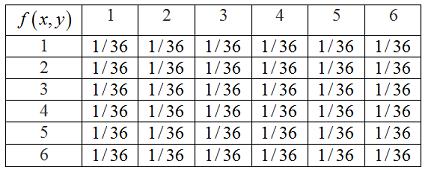

## Basic concepts

### random variable

#### Definition

when dealing with these numberical values, it is useful to assign probabilities to them, this is done through the notion of a random variable

#### Main concepts

* starting with a probabilistic model of an experiment
* a random variable is a real-valued function of the outcome of the experiment
* a function of a random variable defines another random variable

#### personal understanding

* Random variable is actually a function, so you can rewrite it into $f(x)$ to understand

#### example

* **Evenness Indicator**: $X$ could be defined to indicate whether the outcome is even or odd.

$\begin{cases}1, i \ is \ even\\ 0, i \ is \ odd \end{cases}$

So for a roll of 2, $X(2)=1$, and for a roll of 3, $X(3)=0$

* **Greater Than Four Indicator**: X*X* might indicate whether the roll is greater than 4.

$\begin{cases}1, i > 4\\ 0, i \leq 4 \end{cases}$

* **Modulo Mapping**: $X$ could map the outcome of the die to its remainder when divided by 3 (mod 3). $X(i)=i \ mod \ 3$

  This would give $X(1)=1$, $X(2)=2$, $X(3)=0$, etc.

* **Squared Outcome**: $X$ might be the square of the outcome. $X(i)=i^2$ Which would yield $X(1)=1$$, $$X(2)=4$, $X(3)=9$, etc.

* **Prime Number Indicator**: $X$ could indicate whether the outcome is a prime number.

$\begin{cases}1, i \ is \ prime\\ 0, otherwise \end{cases}$

### Discrete random variable

#### Definition

A random variable is called discrete if its range is either finite or countably infinite

#### e.g.

a random variable of the sum of 2 rolls of a die

Or

$sign(a) = \begin{cases}1, a > 0 \\ 0, a = 0 \\ -1, a < 0  \end{cases}$​

#### concepts

* A discrete random variable is a real-valued(range $\in R$) function of the outcome of a discrete experiment
* A discrete random variable has an associated probability mass function(PMF) which gives the probability of each numerical value that the random variable can take
* A function of a discrete random variable defines another discrete random variable, whose PMF can be obtained from the PMF of the original random variable（类似复合函数，可以从原函数PMF得到衍生函数的PMF，后面再看看怎么解释，

### Continuous random variable

Later on next chapter

## Probability mass function

### Probability mass function

#### Definition

For a discrete random variable $X$, the probability mass function(PMF) of $X$ captures the probabilities of the values that it can take

#### Notation

if $x$ is any possible value of $X$, the probability mass of $x$ , denoted $p_X(x)$, is the probability of the event $\{X = x\}$ consisting of all outcomes that give rise to a value of $X$ equal to x:
$$
p_X(x) = P(\{X = x\})
$$

* Upper case characters to denote random variables, $X,Y,Z$ 
* Lower case characters to denote real numbers, $ x,y,z$
* we will write $P(X = x)$ in place of notation $P(\{X = x\})$ ,and similarly $P(X\in S)$ 

####  e.g.

Two independent tosses of a fair coin

 $X$ is the number of heads obtained

The PMF of $X$ is
$$
p_X(x) = \begin{cases}\frac{1}{4}, \ if \ x = 0 \ or \ x = 2 \\ \frac{1}{2}, \ if \ x = 1 \\ 0 \ \ otherwise \end{cases}
$$

> remember the otherwise, that's the point

#### the adaption of basic law

##### Additivity and normalization axioms

* follow from the additivity and normalization axioms

$$
\sum_{x:all\ possible \ values \ of X}^{} p_X(x) = 1
$$

The events ${X = x}$ are disjoint, and they form a partition of the sample space

* for any set $S$ of real numbers

$$
P(X\in S) = \sum_{x\in S}^{}p_X(x)
$$

* for each possible value $x$ of $X$
  * collect all the possible outcomes that give rise to the event $\{X = x\}$ 
  * add their probabilities to obtain $pX(x)$ 

### Important specific distribution

#### Binomial random variable

##### Definition

The bernoulli random variable takes the two values 1 and 0

##### PMF

$$
p_X(x) = \begin{cases}p \ \ if \ x = 1 \\ 1-p \ \ if \ x = 0 \end{cases}
$$

##### for k times

sometimes we refer binomial random variable $X$ as $X~Bio(n,p)$ which $n$ refer to the repeat time of the experiment and $p$​ refer to the probability

for $k = 0,1,\cdots,n$
$$
p_X(k) = P(X = k) = (_k^n)p^k(1-p)^{n-k}
$$

##### normalization

$$
\sum_{k = 0}^{n}(_k^n)p^k(1-p)^{n-k} = 1
$$

##### graph

#### Geometric random variable

##### intro scenario

Independently and repeatedly toss a biased coin with probability of head $p$, where $0<p<1$

The $k$ is the number $X$ of tosses needed for a head to come up for the first time

##### PMF

$$
p_X(k) = (1-p)^{k-1}p
$$

 $k - 1$ tails followed by a head

##### normalization

$$
\sum_{k = 1}^{\infty}p_X(k) = \sum_{k = 1}^{\infty}(1-p)^{k-1}p = p\sum_{k = 0}^{\infty}(1-p)^k = p\frac{1}{1-(1-p)} = 1
$$

While $p\sum_{k = 0}^{\infty}(1-p)^k$ are using summation of geometric progression(等比数列求和) and limit

##### graph

#### Poisson random variable

##### Definition

A poisson random variable takes nonnegative integer values

##### PMF

$$
p_X(k) = e^{-\lambda}\frac{\lambda^k}{k!}, \ \ \ k = 0, 1, 2,\cdots 
$$

##### Normalization condition

$$
\sum_{k = 0}^{\infty}e^{-\lambda}\frac{\lambda^k}{k!} = e^{-\lambda}(1+\lambda+\frac{\lambda^2}{2!}+\cdots) = e^{-\lambda}e^{\lambda} = 1 
$$

##### feature

* poisson random variable can be viewed as a binomial random variable with very small $p$ and very large $n$ 
* precisely Poisson PMF with parameter $\lambda$ is a good approximation for a binomial PMF with parameters $n$ and $p$ where $ \lambda = np$, $n$ is large and $p$ is small

##### graph

* for $\lambda \leq 1$, it is monotonically decreasing
* for $\lambda > 1$ first increases and then decrease

## Functions of random variable

### Functions of random variable

In general, if $Y = g(X)$ is a function of a random variable $X$, then $Y$ is also a random variable

The PMF $p_Y$ of $Y = g(X)$ can be calculated as
$$
p_Y(y) = \sum_{x:g(x) = y}^{}p_X(x)
$$

## Expectation,mean,and variance

### Expectation

#### Intro scenario

Sometimes we are desired to summarize the values and probabilities by one number

#### Definition

The expectation of $X$ is a weighted average of the possible values of $X$ (Weight:probabilities)

In math, formally, we denote as
$$
E[X] = \sum_{}^{}xp_X(x)
$$

#### Mean of $aX+b$

let $Y$ be a linear function of $X$, we have $Y = aX+b$

The mean of $Y$
$$
E[Y] = E[aX+B] = \sum_{x}^{}(aX+b)p_X(x) = a\sum_{x}^{}x \ p_X(x)+\sum_{x}^{}b \ p_X(x) = aE[x] + b
$$
using the definition of expectation and the normalization condition

#### Expectation for g(X)

there is a simple way of computing $E[g(X)]$

Let $X$ be a random variable with PMF $p_X(x)$ and let $g(X)$ be a real-valued function of $X$, the expected value of the random variable $Y = g(X) is$
$$
E[g(X)] = \sum_{x}^{}g(x)p_X(x)
$$

##### proof

Using the formula $p_Y(y) = \sum_{x|g(x) = y}p_X(x)$​ 
$$
E[g(X)] = E[Y] = \sum_{y}^{}yp_Y(y) \\
= \sum_{y}^{}y \ \sum_{x|g(x) = y}^{}p_X(x) \\
= \sum_{y}^{}\sum_{x|g(x) = y}^{}y \ p_X(x) \\
= \sum_{y}^{}\sum_{x|g(x) = y}^{}g(x)p_X(x) \\
=\sum_{x|g(x) = y}^{}g(x)p_X(x)
$$

### Variance

#### notice

the $k$th moment of $E[x]$ is $E[x^k]$, so when $k = 1$, or just say the first moment is just the mean. I think the moment here is the to the $k$th power of the variable.

#### Definition

Variance of $X$, denoted by var$(X)$ is
$$
var(X) = E[(X - E[X])^2]
$$
which is the second moment of $X - E[x]$, therefore the variance is always non-negative
$$
var(X) \geq 0
$$

#### Question

**why did the researcher define the var as the second moment?**

if we define the var as the first moment, we have
$$
E[X - E[X]] = E[X]-E[E[X]] = E[X] - E[X] = 0
$$
while $E[E[X]]$ is a constant $E[X]$​ 

#### variance of $aX+b$​

let $Y$ be a linear function of $X$, we have $Y = aX + b$, using the [formula (99)](# expectation for g(x))

The variance of $Y$​​ is 
$$
var(Y) = var(aX+b) = a^2var(X)
$$

##### proof

$$
var(Y) = E[(Y-E[Y])^2] \\
= E[(ax+b-E[ax+b])^2] \\
=\sum_{x}^{}(ax+b-E[ax+b])^2p_X(x) \\
=\sum_{x}^{}(ax+b-aE[x]-b)^2p_X(x) \\
=a^2\sum_{x}^{}(x-E[x])^2p_X(x) \\
=a^2var(x)
$$

#### Variance as moments

$$
var(X) = E[X^2]-(E[X])^2
$$

##### proof

$$
var(X) = E[(X-E[X])^2]\\
=E[X^2-2XE[X]+E[X]^2] \\
=E[X^2]-E[2XE[X]] +E[E[X]^2]\\
=E[X^2]-2E[X]E[X]+(E[X])^2 \\
=E[X^2]-(E[X])^2
$$

### Standard deviation

#### Definition

Standard deviation of $X$, denoted by $\sigma_X$ is
$$
\sigma_X = \sqrt{var(X)}
$$

## Joint PMFs of multiple random variables

### Joint PMFs

#### Intro Scenario

Probabilistic models often involve several random variables of interest

e.g. In a networking context, the workloads of several gateways may be of interest

#### Definition

Consider two discrete random variables $X$ and $Y$ associated with the same experiment

The joint PMF of $X$ and $Y$ is denoted by $P_{{X,Y}}$.

If $(x,y)$ is a pair of values that $(X,Y)$ can take, then the probability mass of $(x,y)$ is the probability of the event

$\{X=x,Y=y\}$, which is
$$
P_{X,Y}(x,y) = P(X = x, Y = y)
$$

* The joint PMF determines the probability of any event that can be specified in terms of random variables $X$ and $Y$ 

* The joint PMF $p_{{X,Y}}$ is arranged in a two-dimensional table

  

#### formula

  The respective PMFs of $X$ and $Y$ is 
$$
  p_X(x) = \sum_{y}^{}p_{X,Y}(x,y), \ \ \ \ p_Y(y) = \sum_{x}^{}p_{X,Y}(x,y)
$$

meaning to get $P_X(x)$ we have to go through all the value of y, similar for $p_Y(y)$ 

*  $p_X,p_Y$ are the **marginal PMFs**

##### verification

$$
p_X(x)= P(X = x)\\
=\sum_{y}^{}P(X=x,Y=y)\\
=\sum_{y}^{}p_{X,Y}(x,y)
$$

#### graphical meaning

The marginal PMF of $X$ or $Y$ at a given value is obtained by adding the table entries along a corresponding column or row, respectively

### Functions of multiple random variable

#### New random variable

One can generate new random variables by applying functions on several random variables

1. Consider $Z = g(X, Y)$
2. Its PMF can be calculated from the joint PMF $P_{X,Y}$ according to $P_Z(z) = \sum_{x,y|g(x,y )= z}^{}p_{X,Y}(x,y)$

#### Expect value rule

$$
E[g(X,Y)] = \sum_{x,y}^{}g(x,y)P_{X,Y}(x,y)
$$

### More than two random variable

We can also consider 3 or more random variable

#### Joint PMF of 3 variable

The joint PMF of three random variables $X,Y,Z$
$$
p_{X,Y,Z}(x,y,z) = P(X = x,Y=y,Z=z)
$$

#### Marginal PMF

$$
p_{X,Y}(x,y) = \sum_{z}^{}p_{X,Y,Z}(x,y,z)
$$

others are the same

#### Expected value rule

$$
E[g(X,Y,Z)] = \sum_{x,y,z}^{}g(x,y,z)p_{X,Y,Z}(x,y,z)
$$

#### Generalization

For any random variables $X_1,X_2,\cdots,X_n$ and any scalars $a_1,a_2,\cdots,a_n$, wehave 
$$
E[a_1X_1+a_2X_2+\cdots+a_nX_n] = a_1E[X_1]+a_2e[X_2]+\cdots + a_nE[x_n]
$$

## Conditioning

### review

* Conditional probability captures the event which has occurred in a probabilistic model
* Conditional probability are like ordinary probabilities(satisfy the three axioms)
* it refer to a new universe: an event A which is known to have occurred

### Conditioning a random variable

The conditional PMF of a random variable $X$ conditioned on a particular event $A$ with $P(A)> 0$ is defined by
$$
p_{X|A}(x) = p(X = x|A) \\
= \frac{P(\{X = x\}\cap A)}{P(A)}
$$

* Consider the events $\{X=x\}\cap A$
  * they are disjoint for different values of $x$
  * their union is $A$​ , thus we have $P(A) = \sum_{x}^{}P(\{X = x\}\cap A)$​
* Combining the formula 33, we have $\sum_{x}^{}p_{X|A}(x) = 1$ 
* so $p_{X|A}$ is a legitimate PMF

#### reflect

为什么所有随机变量取值与事件A的交集的所有并集是A, 即 $\sum_{x}^{}\{X = x\}\cap A = A$

首先我没有搞明白样本空间的含义，简单来说是指所有可能出现的值，其次是随机变量，我一开始的理解是函数黑盒子，但是我漏掉了一点是，“所有的可能值”，

随机变量 $X$ 是一个映射，它将样本空间中的每个可能结果映射到一个实数。这个映射定义了随机变量的全部可能值，这些值构成了随机变量的值域。所以才一定要说otherwise

### Conditioning one random varaible on another

Let $X$ and $Y$ be two random variables associated with the same experiment, the experimental value $Y = y(p_Y(y) > 0)$ provides partial knowledge about the value of $X$

#### Definition

The knowledge is captured by the conditional PMF $p_{X|Y}$ of $X$ given $Y$
$$
p_{X|Y}(x|y) = P(X = x|Y = y)
$$
 

by the definition of conditional probabilities, we have
$$
p_{X|Y}(x|y) = \frac{P(X=x,Y = y)}{P(Y = y)} = \frac{p_{X,Y}(x,y)}{p_Y(y)}
$$
where $p_{X,Y}(x,y)$ is the joint PMF of $x$ and $y$, and $p_{Y}(y)$ is the marginal PMF of $y$ 

*  when we calculate $p_{X,Y}(x,y)$ , we fix some $y$, see $y$ as constant with $p_Y(y)>0$ (this is important because it shows that it can provide some knowledge), see the whole thing is the function of $x$ 
* This funcction is a valid PMF for $X$:
  * each possible $x$ is nonnegative
  * these value add to 1
  * has the same shape as $p_{X,Y}(x,y)$
  *  $\sum_{x}^{}p_{X|Y}(x|y) = 1 $

#### calculation technique

* it is convenient to calculate the joint PMF by the conditional PMF

$$
p_{X,Y}(x,y) = p_Y(y)p_{X|Y}(x|y)
$$

or its counter part
$$
p_{X,Y}(x,y) = p_X(x)p_{Y|X}(y|x)
$$
