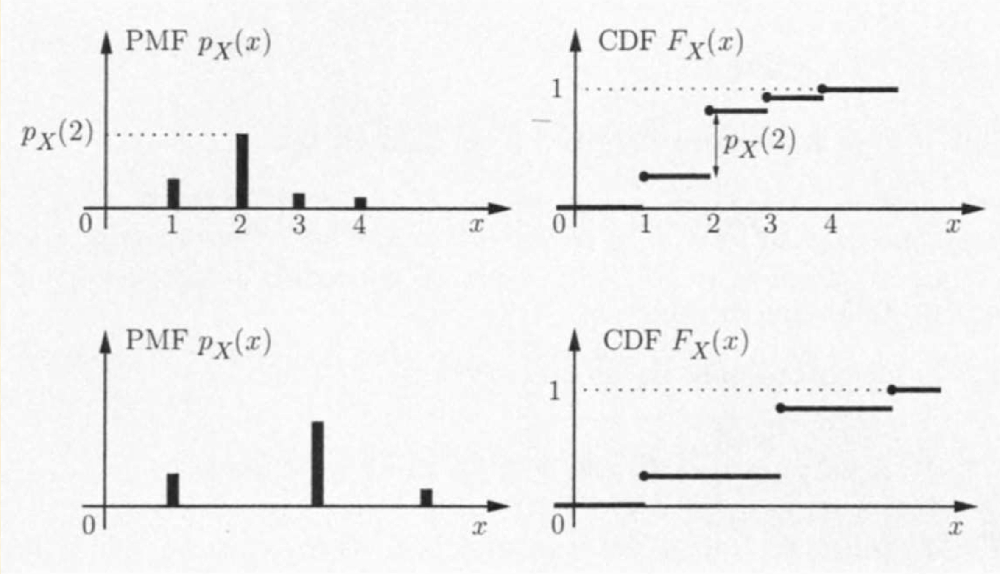

# General random variable

## Continuous random variables and pdfs

### feature of continuous r.v.

* with a continuous range of possible values
* Finer-grained than discrete r.v.
* able to exploit powerful tools from calculus

### Definition

A random r.v. $X$ is called continuous if there is a function $f_X \geq 0$ , called the probability density function of $X$, or PDF, s.t.
$$
P(X \in B) = \int_{B}^{}f_X(x)dx
$$
for every subset $B \subseteq \R$ (we assume the integral is well-defined)

* compare to the discrete case, we replace summation by integral

> it is called density because PDF can be interpret as probability per unit area.
>
> PDF is only the function and the curve but the area represent the probabilities mass.
>
> By the way, area time density equal to mass, in this way you can know why they named it like this 细品

### Extension 

#### PDF and area

when $B = [a,b]$ we have
$$
P(a \leq X \leq b) = \int_{a}^{b}f_X(x)dx
$$
which is the **area under the graph of PDF** 

> PDF is only the curve line, while area stand for the probabilities

#### Total probabilities

the entire area under the graph is equal to 1
$$
\int_{-\infty}^{\infty}f_X(x)dx = P(-\infty \leq X \leq \infty) = 1
$$

#### Probabilities of point

$$
P(a\leq X \leq a) = \int_{a}^{a}f_X(x)dx = 0 
$$

so we have  $P(a \leq X \leq b) = P(a < X \leq b)= P(a \leq X < b)=P(a < X < b)$

#### Interpretation of PDF

 $f_X(x)$​ can be interpret as **probability mass per unit length**
$$
P([x,x+\delta]) = \int_{x}^{x+\delta}f_X(t)dt \approx f_X(x)\cdot \delta
$$

#### Large value

e.g. consider a r.v. $X$ with PDF
$$
f_X(x) = \begin{cases}\frac{1}{2\sqrt{x}} \ \ \ \ if \ \ 0 < x \leq 1  \\ 0 \ \ \ \ otherwise\end{cases}
$$
by integrating $\frac{1}{2\sqrt{x}}$ we can know this PDF satisfy total probabilities theorem, but consider the case when we have
$$
lim_{x\rightarrow 0^+}f_X(x) = lim_{x\rightarrow 0^+}\frac{1}{2\sqrt{x}} = \infty
$$
Therefore we come to the conclusion that a PDF can take arbitrarily large values

### Expectation

#### Definition

The expectation of a continuous r.v. $X$ is defined by 
$$
E[X] = \int_{-\infty}^{\infty}xf_X(x)dx
$$
the expectation can be interpret as the anticipated average value of $X$ in a large number of independdent repetitions of the experiment

### Functions of r.v.

For any real-valued function $g$, $Y = g(X)$ is also a r.v.

The expectation of $g(X)$ is 
$$
E[g(X)] = \sum_{-\infty}^{\infty}g(x)f_X(x)dx
$$

### Moments and variance

The $n^{th}$ moment of $X$ is defined by $E[X^n]$

the variance of $X$ is defined by
$$
var[X] = E[(X - E[X])^2]\\
= \int_{-\infty}^{\infty}(x-E[X])^2f_X(x)dx\\
= E[X^2] - 2E[X]^2+E[X]^2 \\
= E[X^2] - (E[X])^2
$$
If $Y = aX+b$, then
$$
E[Y] = E[aX+b] = aE[X]+b \\
var[Y] = var[aX+b] = a^2var[X]
$$

### Exponential

An exponential r.v. has PDF
$$
f_X(x) = \begin{cases}\lambda e^{-\lambda x} \ \ \ \ if  \ \ x \geq 0 \\
0 \ \ \ \ otherwise\end {cases}
$$
while $\lambda $ is positive and $f_X(0) = \lambda$

#### Verification of total probability theorem

$$
\int_{0}^{\infty}\lambda e^{-\lambda x} dx = -e^{-\lambda x}|_0^\infty = 1
$$

#### Tail of exponential

$$
P(X \geq a) = \int_{a}^{\infty} f_X(x)dx = \int_{a}^{\infty}\lambda e^{-\lambda x}dx = -e^{-\lambda x}|_a^\infty = e^{-\lambda a}
$$

#### Mean 

$$
E[X] = \frac{1}{\lambda}
$$

##### proof

$$
E[X] = \int_{0}^{\infty}xf_X(x) dx \\= \int_{0}^{\infty}x\cdot \lambda e^{-\lambda x}dx \\ 
= -xe^{-\lambda x}|_0^\infty - \int_{0}^{\infty}-e^{-\lambda x}dx\\
=0 - \int_{0}^{\infty}e^{-\lambda x}dx \\
= -\frac{e^{-\lambda x}}{\lambda}|_0^\infty\\
= \frac{1}{\lambda}
$$

##### $E[X^2]$ 

$$
E[X^2] = \int_{0}^{\infty}x^2\lambda e^{-\lambda x}dx \\ 
 = -x^2e^{-\lambda x} |_0^\infty - \int_{0}^{\infty}-2xe^{-\lambda x}dx\\
 = 0+\int_{0}^{\infty}2xe^{-\lambda x}dx\\
 = \frac{2}{\lambda}E[X]\\
 =\frac{2}{\lambda^2}
$$

#### variance

$$
var[X] = E[X^2] - (E[X])^2 \\
 = \frac{2}{\lambda^2} - \frac{1}{\lambda^2}\\
 = \frac{1}{\lambda^2}
$$

## Cumulative Distribution Function

### Definition

The cumulative distribution function or CDF of a r.v. $X$ is
$$
F_X(x) = P(X \leq x)\\
= \begin{cases}\sum_{k\leq x}^{}p_X(k) \ \ \ \ discrete \\
\int_{-\infty}^{x}p_X(y)dy \ \ \ \ continuous\end{cases}
$$
The CDF $F_X(x)$ accumulates probabilities up to the value $x$

#### graph

* graph for discrete case

* graph for continuous case

### Property

*  $F_X$ is monotonically increasing: if $x \leq y$, then $F_X(x)\leq F_X(y)$

* $lim_{x\rightarrow -\infty}F_X(x) = 0$  $lim_{x\rightarrow\infty}F_X(x) = 1$
* If $X$ is discrete, $F_X$ is piecewise constant
* If $X$ is continuous, $F_X$ is continuous and

$$
F_X(x) = \int_{-\infty}^{\infty}f_X(t)dt, \ \ \ \ f_X(x) = \frac{dF_X(x)}{dx}
$$

> CDF and PDF is the same relation of integral and differentiation

### E.g.

#### maximum of several r.v.

Take a test 3 times with score in {1,2,3,...,10}. The final score is the maximum of the scores which is $ X = max(X_1,X_2,X_3)$ 

Each $X_i$ takes values {1,2,3,...,10} equally likely and different $X_i$ are independent

##### CDF

the CDF of the final score $X$ is
$$
F_X(k) = P(X \leq k)\\
= P(X_1 \leq k)P(X_2 \leq k)P(X_3 \leq k)\\
=( \frac{k}{10})^3
$$

##### PMF

the PMF of the final score $X$​ is
$$
P_X(k) = F_X(k) - F_X(k-1) = (\frac{k}{10})^3 - (\frac{k-1}{10})^3
$$

#### Geometric and exponential

* CDF for geometric r.v.

$$
F_{geo}(n) = \sum_{k = 1}^{n}p(1-p)^{k-1} = p\frac{1-(1-p)^n}{1-(1-p)} = 1-(1-p)^n \ \ \ \ for \ \ n = 1,2,\cdots
$$

* CDF for exponential r.v.
  * while $x\geq 0$​
  
  $$
  F_{exp}(n) = \int_{0}^{x}\lambda e^{-\lambda t}dt = -e^{-\lambda t}|_0^x = 1 - e^{-\lambda t}
  $$
  
  
  
  * while $x\leq 0$​
  
  $$
  F_{exp}(n) = P(X \leq 0) = 0
  $$
  
  

From observation, we see that if $e^{-\lambda x} = 1-p$ , then $F_{exp}(n\delta) = F_{geo}(n)$

## Normal random variable 正态分布

### Definition

A continuous random variable $X$ is normal, or Gaussian, if it has a PDF
$$
f_X(x) = \frac{1}{\sqrt{2\pi}\sigma}e^{-\frac{(x-\mu)^2}{2\sigma^2}}
$$
for some $\sigma > 0$

#### Verification of total probabilities

$$
\int_{-\infty}^{\infty}\frac{1}{\sqrt{2\pi}\sigma}e^{-\frac{(x -\mu)^2}{2\sigma^2}}dx = 1
$$

### Graph

This is the graph of a normal PDF and CDF with $\mu = 1$ and $\sigma^2 = 1$ where $\mu$ stands for the mean and $\sigma^2$ stands for the variance. 

### Feature

* The normal PDF is symmetric around its mean $\mu$​ 
* as $x$ get further from $\mu$​ , the value decrease rapidly
*  $E[X] = \mu$ and $var(X) = \sigma^2$

### Mean and variance

Since the graph is symmetric around mean $\mu$ so the mean $E[X] = \mu$ 

for variance $var(X)$ we have $var(X) = \sigma^2$ 

#### proof

$$
var(X) = \int_{-\infty}^{\infty}\frac{1}{\sqrt{2\pi}\sigma}(x-\mu)^2e^{-\frac{(x-\mu)^2}{2\sigma^2}}dx\\
take \ \ y = \frac{x-\mu}{\sigma}, \ \ dx = \sigma  \ dy\\
=\int_{-\infty}^{\infty}\frac{1}{\sqrt{2\pi}\sigma}\sigma^2y^2e^{-\frac{y^2}{2}}\sigma  \ dy \\
= \frac{\sigma^2}{\sqrt{2\pi}}\int_{-\infty}^{\infty}y^2e^{-\frac{y^2}{2}}dy\\
=\frac{\sigma^2}{\sqrt{2\pi}}(y(-e^{-\frac{y^2}{2}})|_{-\infty}^{\infty} - (\int_{-\infty}^{\infty}-e^{-\frac{y^2}{2}})dy) \ \ integration \ \ by \ \ part\ \ taking \ \ u = y \ \ v = -e^{-\frac{y^2}{2}}\\
= \frac{\sigma^2}{\sqrt{2\pi}}\int_{-\infty}^{\infty}e^{-\frac{y^2}{2}}dy\\
=\sigma^2
$$

**having question with the last step and the first step why the variance should be calculated like that**

第一步中我们从方差的定义我们可以知道 $var(X) = E[(X-\mu)^2]$ ,则定义中的式子则是表示概率， $(X-\mu)^2$ 的部分则相当于 $x$ 

关于最后一步 $\int_{-\infty}^{\infty}e{-\frac{y^2}{2}}dy$ 的证明好像要用到二重积分，先暂且放一放

### Standard normal

#### Definition

The normal r.v. with 0 mean and unit variance (which is 1) is a standard normal. Its CDF is denoted by
$$
\phi(y) = P(Y \leq y) = \frac{1}{\sqrt{2\pi}}\int_{-\infty}^{y}e^{-\frac{t^2}{2}}dt
$$
by symmetry, it holds
$$
\phi(y) = 1 -\phi(-y)
$$

#### graph

#### Tabel of $\phi(x)$ for positive $x$

Remember: row first then column

#### transform into standard normal

Let $X$ be a normal r.v. with mean $\mu$ and variance $\sigma^2$ . Then we have
$$
Y = \frac{X - \mu}{\sigma}
$$
is also a normal which we can prove by
$$
E[Y] = E[\frac{X-\mu}{\sigma}] = \frac{E[X]-\mu}{\sigma} = 0 \\
var(Y) = var(\frac{X-\mu}{\sigma}) = \frac{var(X)}{\sigma^2} = 1
$$

> This fact allow us to calculate any normal r.v. by redefining the r.v. $X$ in terms of $Y$, then we can use the standard normal table

## Joint PDF of multiple r.v.

### Definition

Two continuous r.v. associated with the same experiment are jointly continuous and can be described in terms of a joint PDF $f_{X,Y}$ if $f_{X,Y}$ is nonnegative function that satisfied

$$
P((x,y)\in B) = \int_{}\int_{(x,y)\in B}^{}f_{X,Y}(x,y)dxdy
$$
for every subset $B$ of 2 dimensional plane

#### Verification 

##### Normalization

$$
\int_{-\infty}^{\infty}\int_{-\infty}^{\infty}f_{X,Y}(x,y)dxdy = 1
$$

### Interpretation

To interpret the joint PDF, let $\delta$ be a small positive number, 
$$
P(a \leq X \leq a+\delta, c\leq Y\leq c+\delta) = \int_{c}^{c+\delta}\int_{a}^{a+\delta}f_{X,Y}(x,y)dxdy \approx f_{X,Y}(a,c)\delta^2
$$
 $f_{X,Y}(a,c)$ can be interpret as **probability per unit area** in the vicinty of $(a,c)$ 

### Marginal probability

we have
$$
P(X\in A) = P(X \in A, Y \in (-\infty,\infty)) = \int_{A}^{}\int_{-\infty}^{\infty}f_{X,Y}(x,y)dxdy
$$
recalled that
$$
P(X\in A) = \int_{X \in A}^{}f_X(x)dx
$$
Thus we have the marginal probability
$$
f_X(x) = \int_{-\infty}^{\infty}f_{X,Y}(x,y)dy
$$
Similar with y we have
$$
f_Y(y) = \int_{-\infty}^{\infty}f_{X,Y}(x,y)dx
$$

### 2D uniform PDF

In general, let $S$ be a subset of the 2 dimensional plane. The corresponding uniform joint PDF on $S$ is defined by
$$
f_{X,Y}(x,y) = \begin {cases}\frac{1}{area \ \ S} \ \ \ \ if (x,y)\in S \\
0 \ \ \ \ otherwise\end {cases}
$$
For any subset $A \subset S$ , the probabilities that $(X,Y) $ lies in $A$ is
$$
P((X,Y)\in A) = \int_{}^{}\int_{(x,y)\in A}^{}f_{X,Y}(x,y)dxdy\\
= \frac{1}{area \ \ S}\int_{}^{}\int_{(x,y)\in A}^{}dxdy\\
=\frac{area \ \ A}{area \ \ S}
$$

### Joint CDFs

#### Definition

If $X$ and $Y$ are 2 r.v. associated with the same experiment, we define their joint CDF by
$$
F_{X,Y}(x,y) = P(X\leq x,Y\leq y)
$$
If $X$ and $Y$ are described by a joint PDF $f_{X,Y}$, then
$$
F_{X,Y}(x,y) = P(X\leq x,Y\leq y) = \int_{-\infty}^{x}\int_{-\infty}^{y}f_{X,Y}(s,t)dsdt
$$
and
$$
f_{X,Y}(x,y) = \frac{\part^2 F_{X,Y}}{\part x \part y}(x,y)
$$
其中 $\part$ 这个符号可以念partial或者偏，即偏导的意思

need further review

### Expectation

#### Definition

If $X$ and $Y$ are jointly continuous r.v. and $g$ is some function, then
$$
Z = g(X,Y)
$$
is also a r.v.,and we have
$$
E[g(X,Y)] = \int_{-\infty}^{\infty}\int_{-\infty}^{infty}g(x,y)f_{X,Y}(x,y)dxdy
$$
If $g(X,Y) $ is a linear function where $g(X,Y) = aX+bY+c$, for some scalars $a,b,c$, then we have

$$
E[aX+bY+c] = aE[X]+bE[Y]+c
$$
from linearity of expectation

### More than 2 r.v.

* Joint PDF of $X,Y,Z$ satisfies the following formula for any set B

$$
P((X,Y,Z)\in B) = \int_{}^{}\int_{}^{}\int_{(X,Y,Z)\in B}^{}f_{X,Y,Z}(x,y,z)dxdydz
$$

* Marginal PDF

$$
f_{X,Y}(x,y) = \int_{-\infty}^{\infty}f_{X,Y,Z}(x,y,z)dz \\
f_X(x) = \int_{-\infty}^{\infty}\int_{-\infty}^{\infty}f_{X,Y,Z}(x,y,z)dydz
$$

* Expectation

$$
E[g(X,Y,Z)] = \int_{}^{}\int_{}^{}\int_{(X,Y,Z)\in B}^{}g(x,y,z)f_{X,Y,Z}(x,y,z)dxdydz
$$

## Conditioning

### Conditioning on an event

#### Definition

The conditional PDF of a continuous r.v. $X$, given an event $A$ with $P(A > 0)$ is defined as a nonnegative function $f_{X|A}$ that satisfies
$$
P(X\in B | A) = \int_{B}^{}f_{X|A}(x)dx
$$
for any subset $B$ of the real line

#### verification

by taking $B = \R$, we have
$$
P(X\in B|A) = \int_{-\infty}^{\infty}f_{X|A}(x)dx = 1
$$
so $f_{X|A}$ is a legitimate PDF

### Conditioning on event $\{X \in A\}$

If we condition on event $\{X\in A\}$, with $P(X\in A)> 0$, then
$$
P(X\in B|X\in A) = \frac{P(X\in B \ , X \in A)}{P(X\in A)} = \frac{\int_{A\cap B}^{}f_{X}(x)dx}{P(X\in A)}
$$
By taking the derivatives, we can get
$$
f_{X|\{X\in A\}}(x) = \begin{cases}\frac{f_X(x)}{P(X\in A)}\ \ \ \  if \ \ X \in A\\
0 \ \ \ \  \ \ \ \  \ \ \ \ otherwise \end{cases}
$$
Hence we get

* The conditional PDF is 0 outside the conditioning set
* within the conditioning set, the conditional PDF has the same shape with the unconditional one except that it times by a factor $\frac{1}{P(X\in A)}$ 

#### graph

#### e.g. proving exponential r.v. is memoryless

##### Memoryless property

the distribution of the remaining is the same as it was original, regardless of how long it goes.

[youtube video to demonstrate](https://www.youtube.com/watch?v=YPb59pZLWjQ) 虽然讲的一般般，但是看看图也好

就像这幅图中，经过证明会得到，我们已知 $X > s$ 求 $P（X>(s+t))$ 会跟什么都不知道求 $P(X>t)$ 一样。这个特性直译过来就是无记忆性，我们引入题目

#### problem

The time $T$ until a new light bulb burns out is an exponential r.v. with parameter $\lambda$. Alice turns the light on, leaves the room and when she returns, $t$ time units later, finds the light bulb is still on, which corresponds to the event $A = \{T > t\}$ 

Let $X$ be the additional time until the light bulb burns out. What's the conditional CDF of $X$​ given the event A?

$$
P(X > x|A)
=P((X > x+t)|A)\\
= P((T>x+t)|T>t)\\
= \frac{P((T>x+t)\ and \ \ T > t )}{P(T > t)} \\
= \frac{P(T>x+t)}{P(T>t)}\\
$$
需要注意的是，第一行中的 $P(X > x|A)=P((X > x+t)|A)\\$ 可以理解为x大于额外的这一**时间段**的概率相当于x大于x+t这一刻之前的所有时间，当时理解老半天

recall that the probabilities of exponential r.v. of $X > t$ is the **tail probabilities** , hence we have
$$
=\frac{e^{-\lambda(x+t)}}{e^{-\lambda t}}\\
=e^{-\lambda x}
$$
Analyse the result, we have $P(X>x|A) = e^{-\lambda x}$ , while the tail probabilities is $P(X>a) = e^{-\lambda a}$ which is the same. So they are memoryless.

### Conditioning with multiple r.v.

Suppose $X$ and $Y$ are jointly continuous r.v. with joint PDF $f_{X,Y}$, if we condition on a positive probability event of the form $C = \{(X,Y)\in A\}$, we have
$$
f_{X,Y|C}(x,y) = \begin{cases} \frac{f_{X,Y}(x,y)}{P(C)} \ \ \ \ if \ \ (x,y) \in A\\
0 \ \ \ \ \ \ \ \ \ \ \ \ \ \ \ \ otherwise\end{cases}
$$

* The conditional PDF of $X$, given event $C$, is

$$
f_X(x) = \int_{-\infty}^{\infty}f_{X,Y|C}(x,y)dy
$$

### Total probability theorem

Let $A_1,A_2,\cdots,A_n$ be disjoint events that form a partition of the sample space. Assume $P(A_i) > 0$ for all $i$​ .By the total probability theorem from chapter 1, we have
$$
P(X \leq x) = \sum_{i = 1}^{n}P(A_i)P(X\leq x|A_i)
$$
Rewritting the formula in continuous form, we have
$$
\int_{-\infty}^{x}f_X(t)dt = \sum_{i = 1}^{n}P(A_i)\int_{-\infty}^{x}f_{X|A_i}(t)dt
$$
Then take the derivative on $x$ we have 
$$
f_X(x) = \sum_{i = 1}^{n}f_{X|A_i}(x)
$$

### Conditioning one r.v. on another

Let $X$ and $Y$ be continuous r.v. with joint PDF $f_{X,Y}$ , for any $y$ with $f_Y(y) > 0$, the conditional PDF of $X$ given that $Y = y$ is
$$
f_{X|Y}(x|y) = \frac{f_{X,Y}(x,y)}{f_Y(y)}
$$
similar with the discrete case,  $P(x|y) = \frac{P_{X,Y}(x,y)}{P_Y(y)}$ 

Because $f_Y(y) = \int_{-\infty}^{\infty}f_{X,Y}(x,y)dx$ , so by integrating  $f_{X|Y}(x|y)$ we have
$$
\int_{-\infty}^{\infty}f_{X|Y}(x|y)dx = \int_{-\infty}^{\infty}\frac{f_{X,Y}(x,y)}{f_Y(y)}dx\\
=\frac{1}{f_Y(y)}\int_{-\infty}^{\infty}f_{X,Y}(x,y)dx\\
= \frac{1}{f_Y(y)}f_Y(y) \\= 1
$$

* Thus $f_{X|Y}(x|y)$ is a legitimate PDF

