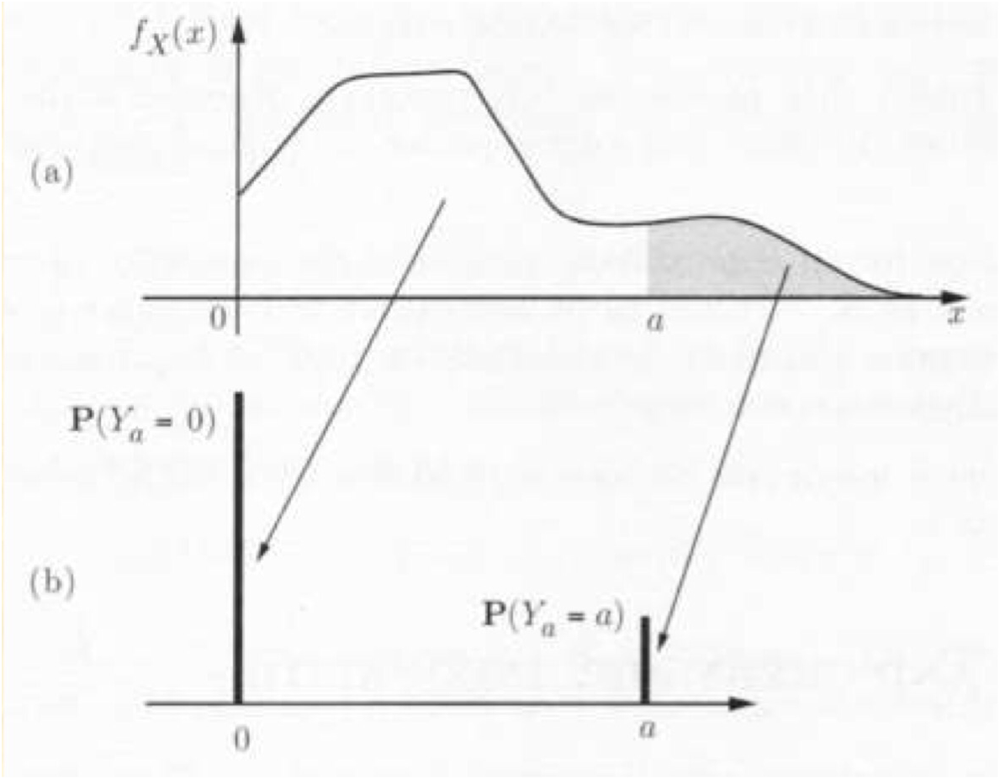

# Limit theorem

## Markov and Chebyshev Inequalities

### Markov inequality

#### Definition

If a random variable $X$ can only take **nonnegative values**, then
$$
P(X\geq a)\leq\frac{E[X]}{a} \ \ \ \ for \ \ all \ \ a >0
$$

* if a nonnegative r.v. has a small mean, then the probability that it takes a large value must also be small

#### proof

fix a positive number $a$ and consider the r.v. $Y_a$ defined by
$$
Y_a = \begin{cases}0 \ \ \ \ if \ \ X \leq a \\
a \ \ \ \ if \ \ X \geq a \end{cases}
$$
the relation  $Y_a \leq X$ always hold because the value of $Y_a$ is never greater than $X$ and $X$ only take **nonnegative values**, therefore we have  $E[Y_a] \leq E[X]$ , for $E[Y_a]$ , we have 
$$
E[Y_a] = aP(Y_a = a) = aP(X\geq a)
$$
substitute into the original formula, we have
$$
aP(X\geq a) \leq E[X] \\
P(X\geq a)\leq\frac{E[X]}{a}
$$

#### illustration in graph

from the picture we can see

* part(a): the PDF of a nonnegative r.v. $X$
* Part(b): the PMF of a related r.v. $Y_a$ 

> the process from (a) to (b) is the remapping from r.v. $X$ to the r.v. $Y_a$, comparing the probabilities of these 2 r.v.

* for part(a): the mass can be calculated by
  * for $X\in [0,a], P(X \in [0,a]) = \int_{0}^{a}f_X(x)$ while $X$ can only take nonnegative, the min is 0
  * For $X \in[a,\infty], P(X \in [a,\infty]) = \int_{a}^{\infty}f_X(x)$ 
  
* for part(b): the mass can be notated by
  * for $X\in [0,a],P(Y_a = 0)$​ 
  * for $X\in [a,\infty],P(Y_a = a)$ 
  
* for $E[X]$, we have
  *  $E[X]$ we have  $E[X] = \int_{0}^{\infty}xf_X(x) = \int_{0}^{a}xf_X(x) + \int_{a}^{\infty}xf_X(x)$ while when all the possible outcome respectively become $0$ or $a$ we have $E[X] = E[Y_a]$
  *   $E[Y_a]$ we have $E[Y_a] = 0*P(Y_a = 0)+a*P(Y_a = a) = aP(Y_a = a)$ 
  
  用英文讲的有点复杂，就是从PDF转化成PMF，所有从0到a的值变成了0，所有从a到无穷的值变成了a。而两个区域的概率不变，值变小了，所以最后的 $E[Y_a]\leq E[X]$ 只能在 $X$ 的值为类似 $Y_a$ 的PMF的情况才能相等吧 

## The Weak Law of Large Numbers

### sample mean and true mean

* sample mean is the mean of the sample you choose from the sample space (which could be only a part of them)

* true mean is the mean of the whole sample space

### Weak law of large number

consider a sequence $X_1,X_2,\cdots$ of r.v. with mean $\mu$ and variance $\sigma^2$ , the sample mean is $M_n = \frac{X_1+\cdots+X_n}{n}$ while the true mean is $\mu$ 

we have
$$
E[M_n] = \frac{E[X_1]+\cdots+E[X_n]}{n} = \frac{n\mu}{n} = \mu
$$

$$
var(M_n) = \frac{var(X_1+\cdots+X_n)}{n^2} \\ 
 = \frac{var(X_1)+\cdots+var(X_n)}{n^2}\\
  = \frac{n\sigma^2}{n^2}\\
  =\frac{\sigma^2}{n}
$$

