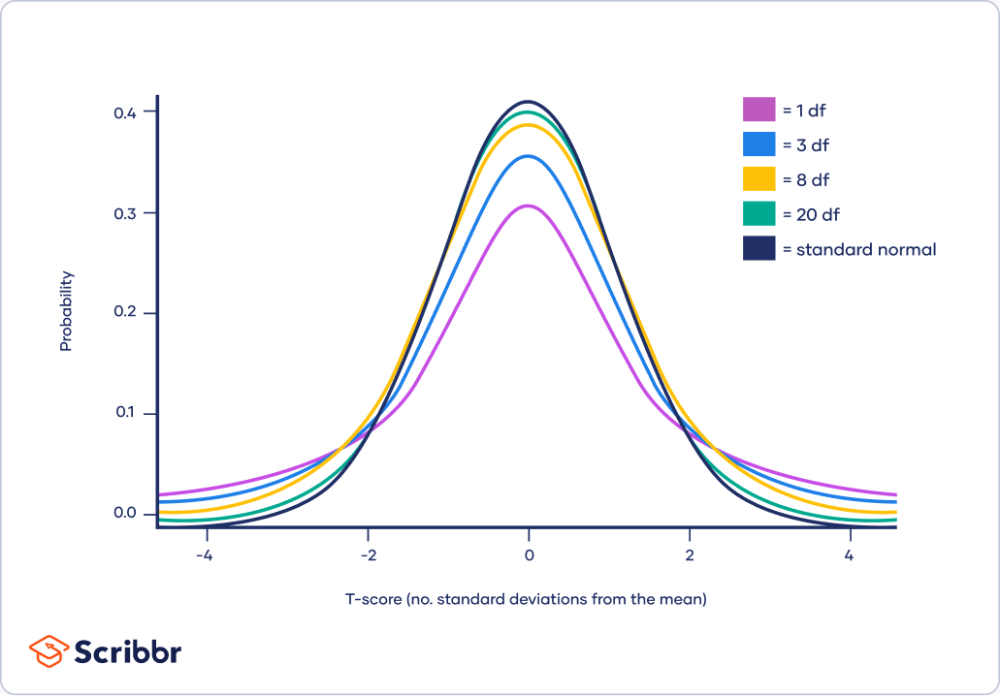
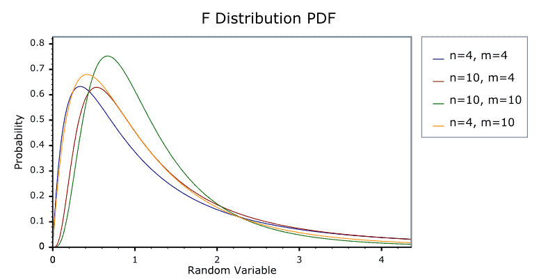

# Basics of statistics

## Intro

### key words

* **Sum(Population)**: In statistics, a population refers to the entire group or set of individuals, objects, or events that we are interested in studying or making inferences about
* **Individual**: An individual refers to a single member or element of a population
* **Sample**: A sample is a subset of individuals or observations taken from a large population. It is used to make inferences or draw conclusions about the population
* **Statistic**: A statistic is a numerical measure or characteristic that is calculated from a sample. It provides information about a specific aspect of the population based on the sample data. Examples of statistics include the mean, standard deviation, and corrlation coefficient

### Difference between probability and statistics

#### 统计和概率有什么区别？

这里引用一位知乎网友的回答，就如同这张图一般

The basic problem that we study in probability is:
Given a data generating process, what are the properities of the outcomes?
...
The basic problem of statistical inference is the inverse of probability:
Given the outcomes, what can we say about the process that generated the data?

* **概率论**是统计推断的基础，在给定数据生成过程下观测、研究数据的性质；

* 而**统计推断**则根据观测的数据，反向思考其数据生成过程。预测、分类、聚类、估计等，都是统计推断的特殊形式，强调对于数据生成过程的研究。

## 6.1 random sample and Statistic

### Key words 

* **Population**: The entirety of the research subject
* **Individual**: A member within the population
* **Capacity of the population**: The number of individuals contained within the overall
* **Finite population**: A sum with a limited capacity
* **Infinite population**: A sum with an unlimited capacity, often used to refer to a sum with a very large capacity

#### Sample

* **Random sample**: n individuals are randomly taken from the population, called a random sample
* **Simple random sample**: a random sample satisfying the following 2 conditions, then ( $X_{1},X_{2},X_{3},\cdots,X_{n}$) is called a simple random sample with capacity $n$ 
>  * Each $X_{i}$ is identically distributed with $X$
  *  $X_{1},X_{2},\cdots,X_{n}$ are mutually independent random variable

> [!note]
>
> The **samples** mentioned later all refer to **simple random samples**. According to probability theory, if the population $X$ has probability density $f(x)$, then the sample $(X_{1},X_{2},\cdots,X_{n})$  has the joint density function:
> $$
> f_{n}(x_{1},x_{2},\cdots,x_{n}) = \Pi_{i = 1}^{n}f(x_{i})
> $$

* **Statistic**: A function of the sample without any unknown parameters

### How to get simple random samples

* For a **finite population**, simple random samples can be obtained by using replacement sampling（即会放回）
* For an **infinite population**, sampling without replacement is usually treated as simple random samples

#### reasoning

For an infinite population, we have 2 property

* The population capacity is relatively large
* Sometimes it's convenient to put back sampling (fireworks, mask)

For large population capacity, consider replacement and reverse, suppose there is n sample in the population:

Replacement: we have probabilities of  $\frac{1}{n}*\frac{1}{n}$

Reverse: we have probabilties of  $\frac{1}{n}*\frac{1}{n-1}$ 

The difference between 2 situations could be really small when the denominator become relatively large $n \rightarrow \infty$ 

### common statistics

let $(X_{1},X_{2},\cdots,X_{n})$ be the sample taken from the population $X$. The common used statistics are the following

* **Sample average**: $\bar{X}=\frac{1}{n}\sum_{i=1}^{n}X_{i}$ which is the estimate of the population mean $\mu = E(X)$
* **Sample variance**: $S^{2} = \frac{1}{n-1}\sum_{i=1}^{n}(X_{i}-\bar{X})^{2}$ where $S$ is the standard deviation of the sample, which is the estimate of the population variance $\sigma^{2} = E(X-\mu)^2$ 

> [!Caution]
>
> here we have the $\frac{1}{n-1}$ in front of the summation for sample variance instead of $\frac{1}{n}$, suggest this blog
>
> [Click here to teleport](https://www.zhihu.com/question/20099757) 

* **$k_{th}$ moment**:  $A_{k}=\frac{1}{n}\sum_{i=1}^{n}X_{i}^{k} \ \ (k = 1,2,\cdots)$ The origin moment of the sample $A_{k}$ is used as estimates of the origin moments of the population $\mu_{k} = E(X^{k})$ 
*  **$k_{th}$ center moment**:  $B_{k}=\frac{1}{n}\sum_{i=1}^{n}(X_{i}-\bar{X})^{k} \ \ (k=1,2,\dots)$ The central moment of the sample $B_{k}$ is used as the estimate of the central moment of the population $v_{k} = E(X-\mu)^{k}$ (suppose that the moments of the population exist)

> [!note]
>
> here is an article about the moment and the origin moment 
>
> [Click here to teleport](https://congleetea.github.io/blog/2019/10/18/math-moment/)

## 6.2 $\chi^{2}$ distribution, $t$ distribution, $F$ distribution

The distribution of the statistic is called the sampling distribution, above is the 3 most important distribution

###  $\chi^2$ distribution

#### Definition

> Assume the random variables $X_{1},X_{2},\cdots,X_{n}$ are independent with each other, $X_{i}\sim N \ (0,1)$ $(i = 1,2,\cdots,n)$, then we call $\chi^{2}_{n}=\sum_{i=1}^{n}X_{i}^{2}$ conforms to the $\chi^2$ distribution with degree of freedom $n$. We denote it as $\chi^{2}\sim \chi^{2}(n)$  

For the terms $\chi^2\sim\chi^{2}(n)$​, 

* For $\chi^{2}\sim\chi^{2}(1)$, it is read as $\chi^{2}$ distribution with 1 degree of freedom

* The first $\chi^{2}$ represent the random variable follow PDF. You can replace it as other letter, e.g. $Y\sim\chi^{2}(n)$

* The symbol $\sim$ represent "is distributed as". 

* The second $\chi^{2}(n)$ is just notation, while the $n$ represent how many terms are there in $\chi^{2}_{n}$ . e.g. For $\chi^{2}\sim\chi^{2}(2)$, $\chi_{n}^{2}=\sum_{i=1}^{n}X_{i}^{2}=X_{1}^{2}+X_{2}^{2}$ 

The probability density function of $\chi^2$ distribution is given as
$$
f_{n}(y)=\begin{cases} \frac{1}{2\Gamma(\frac{n}{2})}(\frac{y}{2})^{\frac{n}{2}-1}e^{-\frac{y}{2}} \ \ \ \ y>0\\
0 \ \ \ \ \ \ \ \ y\leq 0 \end{cases}
$$
Where  $\Gamma(\alpha)=\int_{0}^{+\infty}x^{\alpha-1}e^{-x}dx$ 

#### graph

From $k = 3$, the graph starts from the origin point

#### properties

* Assume $\chi^{2}\sim\chi^2(n)$, then we have $E(\chi^2)=n$, $D(\chi^{2}=2n)$ 
* Assume  $Y_{1}\sim\chi^{2}(n_{1})$, $Y_{2}\sim\chi^{2}(n_{2})$, $Y_{1}$ and $Y_{2}$ are independent with each other, then we have $Y_{1}+Y_{2}\sim\chi^{2}(n_{1}+n_{2})$ 

The second property is the additivity. It can be extended to a finite number of cases: $Y_{i}\sim\chi^{2}(n_{i})=1,2,\cdots,m$

* Assume that $Y_{1},Y_{2},\cdots,Y_{m}$ are independent with each other, then we have

$$
\sum_{i=1}^{m}Y_{i}\sim\chi^2(\sum_{i=1}^{m}n_{i})
$$

#### e.g.

### t-distribution

#### Definition

> Assume $X\sim N(0,1),Y\sim \chi^{2}(n)$ and $X,Y$ are independent with each other. Then we call the random variable $T = \frac{X}{\sqrt{\frac{Y}{n}}}$ conforms to the $t$ distribution with degree of freedom $n$. We note it as $T\sim t(n)$ 

The probability density of $t(n)$ distribution is
$$
f(t,n)=\frac{\Gamma(\frac{n+1}{2})}{\sqrt{n\pi}\Gamma(\frac{n}{2})}(1+\frac{t^{2}}{n})^{-\frac{n+1}{2}}, \ \ \ \ -\infty < t<+\infty
$$

#### Graph

The 'df' in the image represent degree of freedom

From the graph, we can conclude that as df grow greater, the shape of it becomes more similar to the standard normal

### F distribution

#### Definition

> Assume $X\sim \chi^{2}(n_{1}),Y\sim \chi^{2}(n_{2})$ , and $X,Y$ are independent with each other. Then we call the random variable $F=\cfrac{\cfrac{X}{n_{1}}}{\cfrac{Y}{n_{2}}}$ Conforms to the $F$ distribution with degree of freedom $(n_{1},n_{2})$, noted as $F\sim F(n_{1},n_{2})$ while $n_{1}$ is the first degree of freedom and $n_{2}$ is the second degree of freedom

The probability density of $F(n_{1},n_{2})$ is 
$$
f(x;n_{1},n_{2})=\begin{cases}\cfrac{1}{B(\frac{n_{1}}{2},\frac{n_{2}}{2})}n_{1}^{\frac{n_{1}}{2}}n_{2}^{\frac{n_{2}}{2}}x^{\frac{n_{1}}{2}-1}(n_{2}+n_{1}x)^{-\frac{n_{1}+n_{2}}{2}} \ \ x>0\\
0  \ \ \ \ \ \ \ \ x \leq 0 \end{cases}
$$

$$
B(a,b) = \int_{0}^{1}x^{a-1}(1-x)^{b-1}dx = \cfrac{\Gamma(a)\Gamma(b)}{\Gamma(a+b)}
$$

#### graph

## 6.3 Sampling distribution under the normal population

### Conclusion for certain scenarios

#### CONDITION 1

Assume $X_{1},X_{2},\cdots,X_{n}$ are simple random variables coming from the normal population, $\bar{X}$ is the average value of the sample while $S^2$ is the variance of the sample, then we have

##### Conclusion 1

$$
\bar{X}\sim N(\mu,\frac{\sigma^{2}}{n})
$$

###### proof

$$
E[\bar{X}]=E[\frac{1}{n}\sum_{i=1}^{n}X_{i}]=\frac{1}{n}\sum_{i=1}^{n}E[X_{i}] = \frac{1}{n}\cdot n \ \mu = \mu
$$

$$
var(\bar{X}) = var(\frac{1}{n}\sum_{i=1}^{n}X_{i})=\frac{1}{n^2}\sum_{i=1}^{n}var(X_{i}) = \frac{1}{n^{2}}\cdot n\cdot \sigma^{2}=\frac{\sigma^{2}}{n}
$$

by **Central Limit Theorem (CLT):** The Central Limit Theorem states that the distribution of the sum (or average) of a large number of i.i.d. random variables, each with finite mean and variance, will be approximately normally distributed, regardless of the underlying distribution. In the case where the $X_{i}$'s are already normally distributed, the distribution of $\bar{X}$ will be exactly normal, not just approximately, regardless of the sample size *n*. 

##### Conclusion 2

$$
\cfrac{(n-1)S^{2}}{\sigma^{2}}\sim \chi^{2}(n-1)
$$

######  proof

[Click here teleport](proof1.md)

##### Conclusion 3

 $\bar{X}$ and $S^{{2}}$ are independent with each other

##### Conclusion 4

$$
\frac{\bar{X}-\mu}{\frac{S}{\sqrt{n}}}\sim t(n-1)
$$

###### proof

From conclusion 1 and conclusion 2, we have  $\bar{X}\sim N(\mu,\frac{\sigma^{2}}{n})$ and  $\cfrac{(n-1)S^{2}}{\sigma^{2}}\sim \chi^{2}(n-1)$

From the definition of $t$ distribution, we have $T =\frac{X}{\sqrt{\frac{Y}{n}}}$ where  $X,Y \sim N(0,1)$ and $n$ stands for degree of freedom.

First, we transform $\bar{X}$ into a standard normal. We have 
$$
X = \frac{\bar{X}-\mu}{\sqrt{\frac{\sigma^{2}}{n}}}
$$
Therefore, we have
$$
T = \frac{X}{\sqrt{\frac{Y}{n}}} = \frac{\frac{\bar{X}-\mu}{\sqrt{\frac{\sigma^{2}}{n}}}}{\sqrt{\frac{\frac{(n-1)S^{2}}{\sigma^{2}}}{n-1}}}\\
=\frac{\bar{X}-\mu}{\frac{S}{\sqrt{n}}}
$$

> [!caution]
>
> Be careful for the n in the definition, it refers to the degree of freedom which is substituted as (n-1) in this case, so we have t(n-1) in the end.

#### CONDITION 2

Assume  $(X_{i},X_{{2}},\cdots,X_{n1})$ and  $(Y_1,Y_{{2}},\cdots,Y_{n2})$ are samples coming from the population $N(\mu_{1},\sigma^{2}_{{1}})$ and  $N(\mu_{{2}},\sigma^2_{{2}})$, respectively and they are independent from each other, while their variances of the samples are $S_{{1}}^{2},S_{{2}}^{{2}}$ 

##### Conclusion 5

$$
\cfrac{\cfrac{S_{1}^{2}}{\sigma^2_{1}}}{\cfrac{S_{2}^{2}}{\sigma^{2}}} \sim F(n_{1}-1,n_{2}-1)
$$

###### proof

By the definition of $F$ distribution, we have $F=\cfrac{\cfrac{X}{n_{1}}}{\cfrac{Y}{n_{2}}}$ Be cautious that $n_{1},n_{2}$ is the degree of freedom . Recall that from conclusion 2, we have $\cfrac{(n-1)S^{2}}{\sigma^{2}}\sim \chi^{2}(n-1)$ , substitute it into the term, we have
$$
\cfrac{\cfrac{X}{n_{1}}}{\cfrac{Y}{n_{2}}} = \frac{\cfrac{\cfrac{(n_{1}-1)S^{2}}{\sigma^{2}}}{n_{1}-1}}{\cfrac{\cfrac{(n_{2}-1)S^{2}}{\sigma^{2}}}{n_{2}-1}} \\
=\frac{\cfrac{S_{1}^2}{\sigma_{1}^{2}}}{\cfrac{S_{2}^{2}}{\sigma_{2}^{2}}}\sim F(n_{1}-1,n_{2}-1)
$$

##### Conclusion 6

$$
\cfrac{(\bar{X}-\bar{Y})-(\mu_{1}-\mu_{2})}{\sqrt{\frac{\sigma^2_{1}}{n_{1}}+\frac{\sigma^{2}_{2}}{n_{2}}}} \sim N(0,1)
$$

In which $\bar{X},\bar{Y}$ are the average value of the sample

###### Proof

to prove this term is a standard normal, we need to prove its $E[X] = 0$ and $var(X) = 1$. Hint, you can use the conclusion proved in conclusion 1

##### Conclusion 7

when $\sigma^{2}_{1} = \sigma^{2}_{2}=\sigma^{2}$, we have
$$
\frac{(\bar{X}-\bar{Y})-(\mu_{1}-\mu_{2})}{S_{w}\sqrt{\frac{1}{n_{1}}+\frac{1}{n_{2}}}} \sim t(n_{1}+n_{2}-2)
$$
Where  $S_{W}^{{2}}=\frac{(n_{1}-1)S_{1}^{{2}}+(n_{2}-1)S_{2}^{2}}{n_{1}+n_{2}-2}$

###### proof

Given tha $\sigma^{2}$ is the same. From conclusion 6, let $U = \cfrac{(\bar{X}-\bar{Y})-(\mu_{1}-\mu_{2})}{\sigma\sqrt{\frac{1}{n_{1}}+\frac{1}{n_{2}}}}$ 

Let $V = \frac{(n_{1}-1)S_{1}^{{2}}}{\sigma^{2}} + \frac{(n_{2}-1)S_{2}^{{2}}}{\sigma^2}$ from conclusion 2

Using the property, we have  $V\sim\chi^{{2}}(n_{1}+n_{2}-2)$

By the definition of $t$ distribution, substitute all these into the formula, you can have the answer
