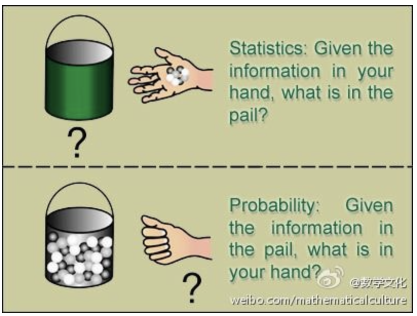

# Basics of statistics

## Intro

### key words

* **Sum(Population)**: In statistics, a population refers to the entire group or set of individuals, objects, or events that we are interested in studying or making inferences about
* **Individual**: An individual refers to a single member or element of a population
* **Sample**: A sample is a subset of individuals or observations taken from a large population. It is used to make inferences or draw conclusions about the population
* **Statistic**: A statistic is a numerical measure or characteristic that is calculated from a sample. It provides information about a specific aspect of the population based on the sample data. Examples of statistics include the mean, standard deviation, and corrlation coefficient

### Difference between probability and statistics

#### 统计和概率有什么区别？

这里引用一位知乎网友的回答，就如同这张图一般

The basic problem that we study in probability is:
Given a data generating process, what are the properities of the outcomes?
...
The basic problem of statistical inference is the inverse of probability:
Given the outcomes, what can we say about the process that generated the data?

* **概率论**是统计推断的基础，在给定数据生成过程下观测、研究数据的性质；

* 而**统计推断**则根据观测的数据，反向思考其数据生成过程。预测、分类、聚类、估计等，都是统计推断的特殊形式，强调对于数据生成过程的研究。

## 6.1 random sample and Statistic

### Key words 

* **Population**: The entirety of the research subject
* **Individual**: A member within the population
* **Capacity of the population**: The number of individuals contained within the overall
* **Finite population**: A sum with a limited capacity
* **Infinite population**: A sum with an unlimited capacity, often used to refer to a sum with a very large capacity

#### Sample

* **Random sample**: n individuals are randomly taken from the population, called a random sample
* **Simple random sample**: a random sample satisfying the following 2 conditions, then ( $X_{1},X_{2},X_{3},\cdots,X_{n}$) is called a simple random sample with capacity $n$ 
>  * Each $X_{i}$ is identically distributed with $X$
  *  $X_{1},X_{2},\cdots,X_{n}$ are mutually independent random variable

> [!note]
>
> The **samples** mentioned later all refer to **simple random samples**. According to probability theory, if the population $X$ has probability density $f(x)$, then the sample $(X_{1},X_{2},\cdots,X_{n})$  has the joint density function:
> $$
> f_{n}(x_{1},x_{2},\cdots,x_{n}) = \Pi_{i = 1}^{n}f(x_{i})
> $$

* **Statistic**: A function of the sample without any unknown parameters

### How to get simple random samples

* For a **finite population**, simple random samples can be obtained by using replacement sampling（即会放回）
* For an **infinite population**, sampling without replacement is usually treated as simple random samples

#### reasoning

For an infinite population, we have 2 property

* The population capacity is relatively large
* Sometimes it's convenient to put back sampling (fireworks, mask)

For large population capacity, consider replacement and reverse, suppose there is n sample in the population:

Replacement: we have probabilities of  $\frac{1}{n}*\frac{1}{n}$

Reverse: we have probabilties of  $\frac{1}{n}*\frac{1}{n-1}$ 

The difference between 2 situations could be really small when the denominator become relatively large $n \rightarrow \infty$ 

### common statistics

let $(X_{1},X_{2},\cdots,X_{n})$ be the sample taken from the population $X$. The common used statistics are the following

* **Sample average**: $\bar{X}=\frac{1}{n}\sum_{i=1}^{n}X_{i}$ which is the estimate of the population mean $\mu = E(X)$
* **Sample variance**: $S^{2} = \frac{1}{n-1}\sum_{i=1}^{n}(X_{i}-\bar{X})^{2}$ where $S$ is the standard deviation of the sample, which is the estimate of the population variance $\sigma^{2} = E(X-\mu)^2$ 

> [!Caution]
>
> here we have the $\frac{1}{n-1}$ in front of the summation for sample variance instead of $\frac{1}{n}$, suggest this blog
>
> [Click here to teleport](https://www.zhihu.com/question/20099757) 

* **$k_{th}$ moment**:  $A_{k}=\frac{1}{n}\sum_{i=1}^{n}X_{i}^{k} \ \ (k = 1,2,\cdots)$ The origin moment of the sample $A_{k}$ is used as estimates of the origin moments of the population $\mu_{k} = E(X^{k})$ 
*  **$k_{th}$ center moment**:  $B_{k}=\frac{1}{n}\sum_{i=1}^{n}(X_{i}-\bar{X})^{k} \ \ (k=1,2,\dots)$ The central moment of the sample $B_{k}$ is used as the estimate of the central moment of the population $v_{k} = E(X-\mu)^{k}$ (suppose that the moments of the population exist)

> [!note]
>
> here is an article about the moment and the origin moment 
>
> [Click here to teleport](https://congleetea.github.io/blog/2019/10/18/math-moment/)

## 6.2 $\chi^{2}$ distribution, $t$ distribution, $F$ distribution

The distribution of the statistic is called the sampling distribution, above is the 3 most important distribution

###  $\chi^2$ distribution

#### Definition

> Assume the random variables $X_{1},X_{2},\cdots,X_{n}$ are independent with each other, $X_{i}\sim N \ (0,1)$ $(i = 1,2,\cdots,n)$, then we call $\chi^{2}_{n}=\sum_{i=1}^{n}X_{i}^{2}$ conforms to the $\chi^2$ distribution with degree of freedom $n$. We denote it as $\chi^{2}\sim \chi^{2}(n)$  

For the terms $\chi^2\sim\chi^{2}(n)$​, 

* For $\chi^{2}\sim\chi^{2}(1)$, it is read as $\chi^{2}$ distribution with 1 degree of freedom

* The first $\chi^{2}$ represent the random variable follow PDF. You can replace it as other letter, e.g. $Y\sim\chi^{2}(n)$

* The symbol $\sim$ represent "is distributed as". 

* The second $\chi^{2}(n)$ is just notation, while the $n$ represent how many terms are there in $\chi^{2}_{n}$ . e.g. For $\chi^{2}\sim\chi^{2}(2)$, $\chi_{n}^{2}=\sum_{i=1}^{n}X_{i}^{2}=X_{1}^{2}+X_{2}^{2}$ 

The probability density function of $\chi^2$ distribution is given as
$$
f_{n}(y)=\begin{cases} \frac{1}{2\Gamma(\frac{n}{2})}(\frac{y}{2})^{\frac{n}{2}-1}e^{-\frac{y}{2}} \ \ \ \ y>0\\
0 \ \ \ \ \ \ \ \ y\leq 0 \end{cases}
$$
Where  $\Gamma(\alpha)=\int_{0}^{+\infty}x^{\alpha-1}e^{-x}dx$ 

#### graph

From $k = 3$, the graph starts from the origin point

#### properties

* Assume $\chi^{2}\sim\chi^2(n)$, then we have $E(\chi^2)=n$, $D(\chi^{2}=2n)$ 
* Assume  $Y_{1}\sim\chi^{2}(n_{1})$, $Y_{2}\sim\chi^{2}(n_{2})$, $Y_{1}$ and $Y_{2}$ are independent with each other, then we have $Y_{1}+Y_{2}\sim\chi^{2}(n_{1}+n_{2})$ 

The second property is the additivity. It can be extended to a finite number of cases: $Y_{i}\sim\chi^{2}(n_{i})=1,2,\cdots,m$

* Assume that $Y_{1},Y_{2},\cdots,Y_{m}$ are independent with each other, then we have

$$
\sum_{i=1}^{m}Y_{i}\sim\chi^2(\sum_{i=1}^{m}n_{i})
$$

