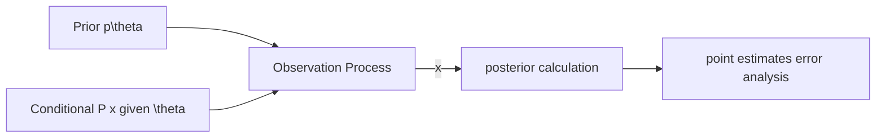

# Bayesian Statistical Inference

## Intro

### Statistical Inference

#### Definition

Statisticcal Inference is the process of extracting information about an unknown variable or an unknown model from available data

#### Approaches

* Bayesian statistical inference
* Classical statistical inference

#### Main categories of inference problems

* Parameter estimation
* Hypothesis testing
* significance testing

#### Important methodologies

* maximum a posteriori(MAP)
* probability rule
* least mean squares estimation
* maximum likelihood
* regression
* likelihood ratio tests

### Bayesian

#### Definition

Bayesian inference is used to infer the nature of an unknown model by assuming that the model comes from a certain group of models we know something about.

During this process, 3 concept is introduced

* A random variable $\theta$ represent the unknown parts of the actual data
* A prior distribution $p_{\theta}(\theta)$ represent the best guess about $\theta$ before we see any actual data
* Once we have obserbed some data, denoted as $x$, we can use Bayes' rule to derive a posterior distribution $p_{\theta|X}(\theta|x)$ to update our guess which captures all information that $x$ can provide about $\theta$​ 

## Bayesian inference, the posterior distribution

### Review:Bayes theorem

$$
P(A|B) = \frac{P(A)P(B|A)}{P(B)}
$$

If we divide the event $B$ into multiple intersection with event $A$, we have
$$
P(B) = P(A_{1}\cap B)+P(A_{2}\cap B)+\cdots+P(A_{n}\cap B)\\
=P(A_{1}|B)P(B)+P(A_{2}|B)P(B)+P(A_{n}|B)P(B)\\
=\sum_{i=1}^{n}P(A_{i}|B)P(B)
$$
so another form of bayes theorem is 
$$
P(A|B) = \frac{P(A)P(B|A)}{\sum_{i=1}^{n}P(A_{i}|B)P(B)}
$$

### Bayesian inference

We defined the unknown quantity of interest is modeled as a random variable as $\theta$ and obtain information about $\theta$ by observing a collection $X=(X_{1},X_{2}\cdots,X_{n})$ of related random variables.(The obtaining information process is called observations, measurement or an observation vector)

### Basic procedure

1. We assume that we know the joint distribution of $\theta$ and $X$ 
2. Equivalently, we assume we know a prior distribution $p_{\theta}$¬ or $f_{\theta}$ depending on whether $\theta$ is discrete or continuous. 
3. We also assume that we know a conditional distribution $p_{X|\theta}$ or $f_{X|\theta}$ depending on whether $X$ is discrete or continous.

After a particular value $x$ of $X$ has been observed, we can calculate the posterior distribution of $\theta$ using the appropriate version of Bayes' rule

### Different version of Bayes' rule

| Condition                            | Formula                                                      |
| ------------------------------------ | ------------------------------------------------------------ |
| $\Theta$ discrete,  $X$ discrete     | $p_{\Theta | X}(\theta |x)=\cfrac{p_{\Theta}(\theta)p_{X|\Theta}(x|\theta)}{\sum_{\theta '}^{}p_{\Theta}(\theta')p_{X|\Theta}(x|\theta')}$ |
| $\Theta$ discrete,  $X$ continuous   | $p_{\Theta|X}(\theta |x)=\cfrac{p_{\Theta}(\theta)f_{X|\Theta}(x|\theta)}{\sum_{\theta'}^{}p_{\Theta}(\theta')f_{X|\Theta}(x|\theta')}$ |
| $\Theta$ continuous, $X$ discrete    | $p_{\Theta|X}(\theta|x)=\cfrac{f_{\Theta}(\theta)p_{X|\theta}(x|theta)}{\int f_{\Theta}(\theta')p_{X|\Theta}(x|\theta') \ d\theta'}$ |
| $\Theta$ Continuous,  $X$ continuous | $p_{\Theta|X}(\theta|x)=\cfrac{f_{\Theta}(\theta)f_{X|\Theta}(x|\theta)}{\int f_{\Theta}(\theta')f_{X|\Theta}(x|\theta') \ d\theta'}$ |

## MAP, Point estimation, hypothesis testing

### MAP

#### Definition

MAP denoted **Maximum A Posteriori** 

Given the value $x$ of the observation, we select a value of $\theta$ , denoted $\hat{\theta}$, that maximizes the posterior distribution

Recalled that we have $p_{\theta|x}(\theta|x)$ if $\theta$ is discrete and $f_{\Theta|x}(\theta|x)$ if $\Theta$​​ is continuous

#### Notation

We denoted MAP as

 $\hat{\theta} = argmax \ p_{\Theta|X}(\theta|x)$, if $\Theta $ is discrete

 $\hat{\theta} = argmax \ f_{\Theta|X}(\theta|x)$ if $\Theta$ is discrete 

or we can denote it in a more easy way to understand

 $p_{\Theta|X}(\theta|x) = max(p_{\Theta|X}(\theta|x))$

 $f_{\Theta|X}(\theta|x) = max(p_{\Theta|X}(\theta|x))$

