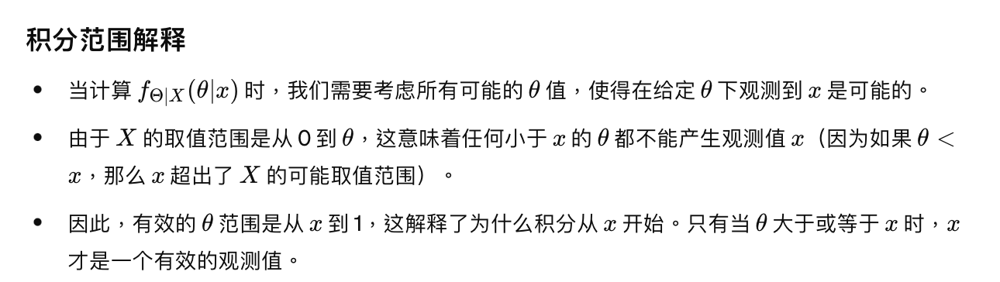

# Bayesian Statistical Inference

## Intro

### Statistical Inference

#### Definition

Statisticcal Inference is the process of extracting information about an unknown variable or an unknown model from available data

#### Approaches

* Bayesian statistical inference
* Classical statistical inference

#### Main categories of inference problems

* Parameter estimation
* Hypothesis testing
* significance testing

#### Important methodologies

* maximum a posteriori(MAP)
* probability rule
* least mean squares estimation
* maximum likelihood
* regression
* likelihood ratio tests

### Bayesian

#### Definition

Bayesian inference is used to infer the nature of an unknown model by assuming that the model comes from a certain group of models we know something about.

During this process, 3 concept is introduced

* A random variable $\theta$ represent the unknown parts of the actual data
* A prior distribution $p_{\theta}(\theta)$ represent the best guess about $\theta$ before we see any actual data
* Once we have obserbed some data, denoted as $x$, we can use Bayes' rule to derive a posterior distribution $p_{\theta|X}(\theta|x)$ to update our guess which captures all information that $x$ can provide about $\theta$​ 

## Bayesian inference, the posterior distribution

### Review:Bayes theorem

$$
P(A|B) = \frac{P(A)P(B|A)}{P(B)}
$$

If we divide the event $B$ into multiple intersection with event $A$, we have
$$
P(B) = P(A_{1}\cap B)+P(A_{2}\cap B)+\cdots+P(A_{n}\cap B)\\
=P(B|A_{1})P(A_{1})+P(B|A_{2})P(A_{2})+P(B|A_{n})P(A_n)\\
=\sum_{i=1}^{n}P(B|A_{i})P(A_{i})
$$
so another form of bayes theorem is 
$$
P(A|B) = \frac{P(A)P(B|A)}{\sum_{i=1}^{n}P(B|A_{i})P(A_{i})}
$$

### Bayesian inference

We defined the unknown quantity of interest is modeled as a random variable as $\Theta$ and obtain information about $\Theta$ by observing a collection $X=(X_{1},X_{2}\cdots,X_{n})$ of related random variables.(The obtaining information process is called observations, measurement or an observation vector)

### Basic procedure

1. We assume that we know the joint distribution of $\Theta$ and $X$ 
2. Equivalently, we assume we know a prior distribution $p_{\theta}$ or $f_{\theta}$ depending on whether $\theta$ is discrete or continuous. 
3. We also assume that we know a conditional distribution $p_{X|\theta}$ or $f_{X|\theta}$ depending on whether $X$ is discrete or continous.

After a particular value $x$ of $X$ has been observed, we can calculate the posterior distribution of $\theta$ using the appropriate version of Bayes' rule

### Different version of Bayes' rule

| Condition                            | Formula                                                      |
| ------------------------------------ | ------------------------------------------------------------ |
| $\Theta$ discrete,  $X$ discrete     | $p_{\Theta | X}(\theta |x)=\cfrac{p_{\Theta}(\theta)p_{X|\Theta}(x|\theta)}{\sum_{\theta '}^{}p_{\Theta}(\theta')p_{X|\Theta}(x|\theta')}$ |
| $\Theta$ discrete,  $X$ continuous   | $p_{\Theta|X}(\theta |x)=\cfrac{p_{\Theta}(\theta)f_{X|\Theta}(x|\theta)}{\sum_{\theta'}^{}p_{\Theta}(\theta')f_{X|\Theta}(x|\theta')}$ |
| $\Theta$ continuous, $X$ discrete    | $f_{\Theta|X}(\theta|x)=\cfrac{f_{\Theta}(\theta)p_{X|\theta}(x|\theta)}{\int f_{\Theta}(\theta')p_{X|\Theta}(x|\theta') \ d\theta'}$ |
| $\Theta$ continuous,  $X$ continuous | $f_{\Theta|X}(\theta|x)=\cfrac{f_{\Theta}(\theta)f_{X|\Theta}(x|\theta)}{\int f_{\Theta}(\theta')f_{X|\Theta}(x|\theta') \ d\theta'}$ |

* 

## MAP, Point estimation, hypothesis testing

### MAP

#### Definition

MAP denoted **Maximum A Posteriori** 

Given the value $x$ of the observation, we select a value of $\theta$ , denoted $\hat{\theta}$, that maximizes the posterior distribution

Recalled that we have $p_{\theta|x}(\theta|x)$ if $\theta$ is discrete and $f_{\Theta|x}(\theta|x)$ if $\Theta$​​​ is continuous

To simplify, MAP chooses value with highest possibility

#### Notation

We denoted MAP as

 $\hat{\theta} = argmax \ p_{\Theta|X}(\theta|x)$, if $\Theta $ is discrete

 $\hat{\theta} = argmax \ f_{\Theta|X}(\theta|x)$ if $\Theta$ is discrete 

or we can denote it in a more easy way to understand

 $p_{\Theta|X}(\theta|x) = max(p_{\Theta|X}(\theta|x))$

 $f_{\Theta|X}(\theta|x) = max(p_{\Theta|X}(\theta|x))$

#### graphic 

#### feature

When $\Theta$ is discrete, the MAP rule has an important optimality property. Since it chooses $\theta$ to be the most likely value of $\Theta$, it maximizes the probability of correct decision for any given value x

This implies that it also maximizes (over all decision rules) the overall (averaged over all possible values $x$) probability of correct decision

#### Computational shortcut

for the posterior, for example PMF: $p_{\Theta|X}(\theta|x) = \frac{p_{\Theta}(\theta)p_{X|\Theta}(x|\theta)}{\sum_{\theta'}^{}p_{\Theta}(\theta')p_{X|\Theta}(x|\theta')}$, because the denominator is independent of $\theta$, which is a constant. To maximize the posterior, we only need to maximize the numerator $p_{\Theta}(\theta)p_{X|\Theta}(x|\theta)$, calculation of the denominator is unnecessary.

similar expressions for continuous case

### Point Estimation

#### Definition

**Point estimate:** a value that represents our best guess of the value of $\Theta$ 

**Estimate:** the numerical value $\hat{\theta}$ that we choose on observation $x$. The value of $\hat{\theta}$ is to be determined by applying some function $g$ to the observation $x$, resulting in $\hat{\theta} = g(x)$ 

**Estimator:** the random variable $\hat{\Theta} = g(X)$, where $X$​ is the collection of observation

#### Two popular estimators:

**MAP:**  $\hat{\theta} = argmax \ p_{\Theta|X}(\theta|x)$ 

**Conditional Expectation:**  $\hat{\theta} = E[\Theta|X = x]$ 

> [!note]
>
> Conditional Expectation estimator is also called least mean squares(LMS) estimator.
>
> It minimizes the mean squared error over all estimators
>
> It will be elaborate later

#### Graphic comparison

### Hypothesis testing

It is used to judge whether a hypothesis is true or not.

#### Definition

 $\Theta$ takes one of $m$ values, $\theta_{1},\cdots,\theta_{m}$, where $m$ is usually a small integer, usually $m = 2$ which is called a binary hypothesis testing. We will elaborate it later.

For the $i$th hypothesis, we have $H_{i} =^{def} \{\Theta = \theta_i\}$ 

Once the value $x$ of $X$ is observed, we may use Bayes' rule to calculate the posterior probabilities 
$$
P(\Theta = \theta_{i}|X = x) = P_{\Theta|X}(\theta_{i}|x)
$$
for each i. Every hypothesis have its respective probability.

When we calculate them all, we can select the hypothesis $H_{i}$ with the largest posterior probability  $P(\Theta = \theta_{i}|X = x)$ don't forget using computational shortcut

#### Correct probability

**$g_{MAP}(x)$:** the hypothesis selected by the MAP rule when $X = x$

The probability of correct decision is
$$
P(\Theta = g_{MAP}(x)|X = x)
$$
 If $S_i = \{x:g_{MAP}(x) = H_{i}\}$ 某一种假设下的对应的不同x？, then the overall probability of correct decision is 
$$
P(\Theta = g_{MAP}(X)) = \sum_{i}^{}P(\Theta = \theta_{i}, X\in S_{i})
$$
sum of all map probability

And the corresponding probability of error is
$$
\sum_{i}^{}P(\Theta \neq \theta_{i}, X \in S_{i})
$$
这一段真心不是很懂，之后再看

Then the overall probability of wrong decision is the sum of probability except for MAP
$$
\sum_{i}^{}P(\Theta \neq \theta_{i}, X \in_{}^{} S_{i}) = 1 - \sum_{i}^{}P(\Theta = \theta_{i}, X \in S_{i})
$$

## gpt

当然可以，我将继续讲解关于最大后验概率（MAP）规则在这个图中的知识。

### 正确决策的概率

#### 记号和定义

1. **\( $g_{MAP}(x)$ \)**：
   - 这是当观测值 \($X = x$\) 时，由 MAP 规则选择的假设。
   - 即，\( $g_{MAP}(x)$ \) 是使后验概率 \($P(\Theta = \theta | X = x)$\) 最大的 \($\theta$\) 值。

2. **正确决策的概率**：
   - 当观测值 \($X = x$\) 时，正确决策的概率是 $( P(\Theta = g_{MAP}(x) | X = x) )$。
   - 这个概率表示在给定观测 \($x$\) 的情况下，实际参数 \($\Theta$) 与 MAP 估计 \($\hat{\Theta}$\) 相等的概率。

3. **整体正确决策的概率**：
   - 假设 \($S_i$\) 是一个集合，包含所有使得 \( $g_{MAP}(x) = \theta_i$ \) 的观测值 \(x\)：
     \[
     $S_i = \{ x : g_{MAP}(x) = \theta_i \}$
     \]
   - 整体正确决策的概率是对所有可能的 \( $\theta_i$ \) 进行加总的概率：
     \[
     $P(\Theta = g_{MAP}(X)) = \sum_i P(\Theta = \theta_i, X \in S_i)$
     \]
     这表示在所有观测值 \(x\) 下，做出正确决策的总体概率。

4. **错误决策的概率**：
   - 对应的错误决策的概率是对所有错误情况进行加总的概率：
     \[
     $\sum_i P(\Theta \neq \theta_i, X \in S_i)$
     \]
     这表示在所有观测值 \(x\) 下，做出错误决策的总体概率。

### 理解和应用

1. **假设和正确决策**：
   - \( $g_{MAP}(x)$ \) 是基于观测值 \(x\) 做出的最有可能的假设。
   - \( $P(\Theta = g_{MAP}(x) | X = x)$ \) 是在观测值 \(x\) 下，MAP 规则选择的假设是正确的概率。

2. **划分观测值空间**：
   - 将所有可能的观测值 \(x\) 划分成不相交的子集 \(S_i\)，每个子集对应一个假设 \($\theta_i$\)。
   - \( $S_i$ \) 包含所有使得 \( $g_{MAP}(x) = \theta_i$ \) 的观测值 \(x\)。

3. **整体正确决策的概率计算**：
   - 对于每个子集 \($S_i$\)，计算在观测值 \(x\) 属于 \(S_i\) 时做出正确决策的概率。
   - 通过对所有子集的概率加总，得到整体正确决策的概率。

4. **整体错误决策的概率计算**：
   - 对于每个子集 \($S_i$\)，计算在观测值 \(x\) 属于 \(S_i\) 时做出错误决策的概率。
   - 通过对所有子集的概率加总，得到整体错误决策的概率。

### 例子

假设我们有三个假设 \($\theta_1, \theta_2, \theta_3$\)，对应的观测值区域分别为 \($S_1, S_2, S_3$\)。对于给定的观测值 \($x$\)，我们根据 MAP 规则选择 \($\theta_i$\)：

1. **计算每个区域的概率**：
   - \( $P(\Theta = \theta_i, X \in S_i)$ \)：在观测值 \($x$\) 属于 \($S_i$\) 时，实际参数 \($\Theta$\) 等于 \($\theta_i$\) 的概率。

2. **整体正确决策的概率**：
   - \( $P(\Theta = g_{MAP}(X)) = \sum_i P(\Theta = \theta_i, X \in S_i)$ \)。

3. **整体错误决策的概率**：
   - \( $\sum_i P(\Theta \neq \theta_i, X \in S_i)$ \)。

通过这种方式，我们可以评估 MAP 规则在做出决策时的整体性能，并计算正确和错误决策的概率。

## Bayesian least mean squares estimation

### MAP and LMS

MAP can be useful in many case, how every when it comes to the problem where all the PDF are the same for any $x$​ (e.g. the figure beneath)​, it doesn't work.     

Hence we introduce the second method: Lease Mean Squares or Conditional Expectation. It is divide into 2 cases:

* Estimation without observation
* Estimation with observation

### Estimation without observation

#### Intro

Considering the simpler problem of estimating $\Theta$ with a constant $\hat{\theta}$, in the absence of an observation $X$​

we have the following concept:

* **estimation error:**  $\hat{\theta} - \Theta$ 
* **mean squared error:**  $E[(\hat{\theta} - \Theta)^{2}]$ 

**Question: What's the minimum $E[(\hat{\theta} - \Theta)^{2}]$ over choices of $\hat{\theta}$ ?** var[$\Theta$]  when $\hat{\theta} = E[\Theta]$ 

##### Proof1 

$$
E[(\hat{\theta}-\Theta)^{2}] = var(\hat{\theta} - \Theta) + (E[\hat{\theta}-\Theta])^{2} \\
= (-1)^2var(\Theta - \hat{\theta}) + (-1)^{2}(E[\Theta- \hat{\theta}])^{2}\\
$$

given that $\hat{\theta}$ is a constant, so we have
$$
E[(\hat{\theta}-\Theta)^{2}] = var(\Theta) + (E[\Theta]-\hat{\theta})^{2}\\
\geq var(\Theta)
$$
"=" achieved when $\hat{\theta} = E[\Theta]$ 

##### Proof2 

$$
E[(\hat{\theta}-\Theta)^{2}] = E[\hat{\theta}^2-2\hat{\theta}\Theta + \Theta^{2}]\\
=E[\Theta^{2}] - 2\hat{\theta}E[\Theta]+\hat{\theta}^{2}
$$

take derivative, we have
$$
2\hat{\theta} - 2E[\Theta] = \frac{dE[(\hat{\theta} - \Theta)^{2}]}{d\hat{\theta}}
$$
let the derivative equal to 0, we have $\hat{\theta} = E[\Theta]$.

#### graphic

### Estimation with observation

Suppose that we have observation $X$, we still like to estimate $\Theta$ to minimize the mean squared error. 

Once we observed the value $x$ of $X$, the situation is identical to the one considered before, except everything is conditioned on $X = x$

Just like we have the min mean squared estimation when $\hat{\theta} = E[\Theta]$, we assert that with the condition of observation, the conditional expectation $E[\Theta|X = x]$ minimizes the conditional  mean squared error $E[(\Theta - \hat{\theta})^2|X = x]$ over all constants $\hat{\theta}$​ 

Generally, the mean squared estimation error associated with an estimator $g(X)$ is defined as
$$
E[(\Theta - g(X))^2]
$$
View $E[\Theta|X]$ as an estimator/function of $X$, the preceding analysis shows that out of all possible estimators, the mean squared estimation error is minimized when
$$
g(X) = E[\Theta|X]
$$
不是很理解

## Bayesian linear least mean squares estimation

