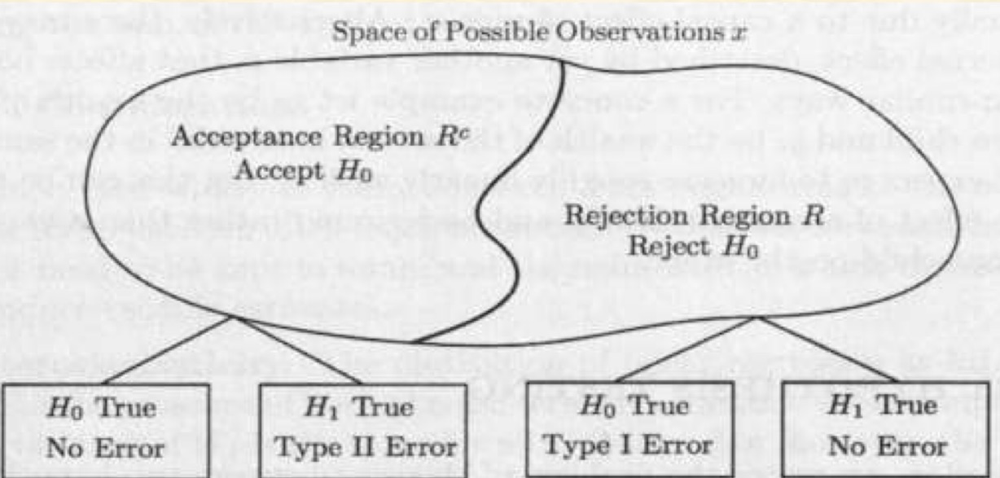
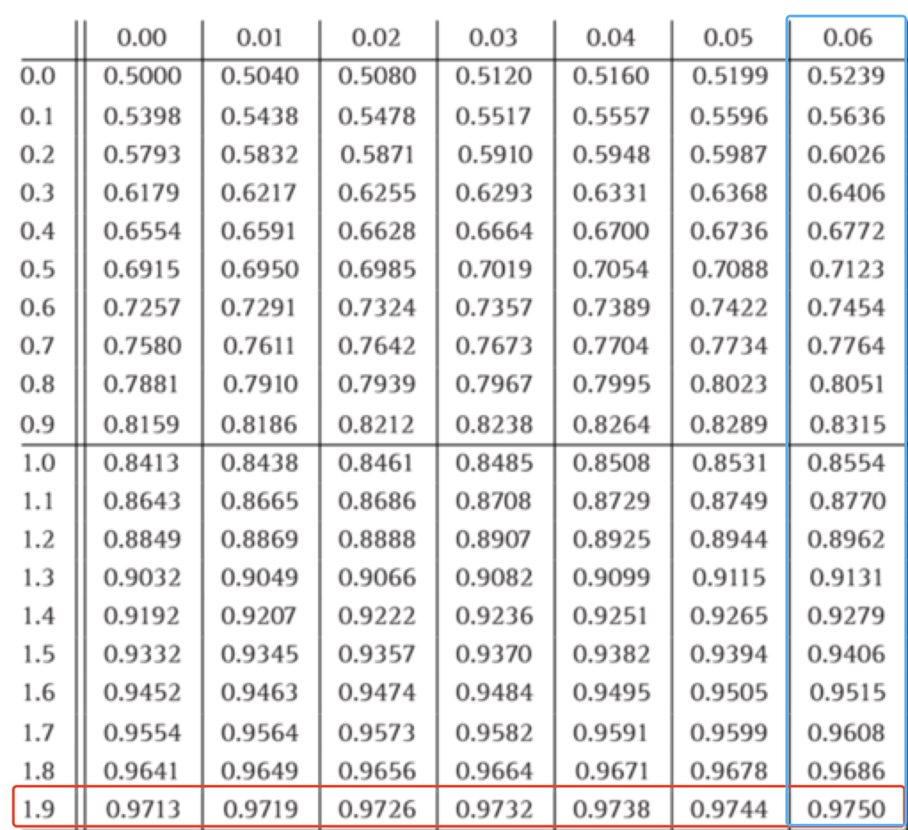

# Classical Statistical Inference

## Comparison

### Before

On Bayesian inference, we have following features.

*  Unknown parameters are modeled as random variables
*  Work within a single, fully-specified probabilistic model 说实话还不是很明白这里

*  Compute posterior distribution by application of Bayes' rule

### This chapter

* View the unknown parameter $\theta$ as a deterministic (not random) but unknown quantity.
* The observation $X$ is random and its distribution depends on the value of $\theta$ 
  *  $p_{X}(x;\theta)$ if $X$ is discrete
  *  $f_{X}(x;\theta)$ if $X$ is continuous

> [!note] 
>
> 这里两者的区别在于贝叶斯统计推断把未知参数(parameter)看成是随机变量，利用贝叶斯公式进行统计推断。 而经典统计推断则认为未知参数 $\theta$ 是确定的， 但取值未知，观测 $X$ 是随机的

At the same time, we also have other features

* Deal simultaneously with multiple candidate models, one model for each possible value of $\theta$ 

* A "good" hypothesis testing or estimation procedure will be one that possesses certain desirable properties under every candidate model(for every possible value of $\theta$ )

### Notation

Indicating the dependence of probabilities and expected values on $\theta$ , we denote 

* $E_{\theta}[h(X)]$ of the expected value of a random variable $h(X)$ as a function of $\theta$​ 
* $P_{\theta}(A)$ to denote the probability of an event $A$

> [!note]
>
> 这里的 $\theta$ 只是表示期望和概率与 $\theta$ 有关系，而不是随机变量

## Classical Parameter Estimation

### Definition

* Given observations $X = (X_{1}, X_{2},\cdots,X_{n})$ an estimator is a random variable of the form $\hat{\Theta} = g(X)$ for some function $g$ 

*  $\hat{\Theta}$ depends on the distribution of $\theta$ as well. 

* We use the term estimate to refer to an actual realized value of $\hat{\Theta}$ 
* When we are interested in the role of the number of observations $n$, we use the notation $\hat{\Theta}_{n}$ for an estimator. Or in another understanding, we can view $\hat{\Theta}_{n}$ as a sequence of estimators. 

> [!note]
>
> 这里的n实时对应样本量，而当样本量变多或变少时，这个estimator也会发生变化，所以说像一个序列，由这个n来决定第n项的值

* Because $\hat{\Theta}_{n}$ is also a r.v., so we have its mean and variance respectively. They are denoted as $E_{\theta}[\hat{\Theta}_{n}]$ and $var_{\theta}[\hat{\Theta}_{n}]$. (Sometime the small $\theta$ can be ommited when the context is clear)

### Clarify

* Estimator: $\hat{\Theta}_{n}$ a function of $n$ observations for an $(X_{1},X_{2},\cdots,X_{n})$ whose distribution depends on $\theta$

* Estimation error: $\tilde{\Theta}_{n} = \hat{\Theta}_{n} - \theta$ (this is a r.v. as well)

* Bias of the estimator(偏差):$b_{\theta}(\hat{\Theta}_{n}) = E_{\theta}[\hat{\Theta}_{n}-\theta] = E_{\theta}[\hat{\Theta}_{n}]-\theta$ (the mean of a constant is the constant itself)

### Property

#### Bias

*  $\hat{\Theta}_{n}$ is unbiased if $b_{\theta}(\hat{\Theta}_n) = 0$ 
*  $\hat{\Theta}_{n}$ is asymptotically unbiased if $\lim_{n\rightarrow \infty} E_{\theta}[\hat{\Theta}_{n}] = 0$ which means $\hat{\Theta}_{n}$ become desirable when the number $n$ of observations increase and when $n$​ is large enough

#### Consistent

*  $\hat{\Theta}_{n}$ is consistent if the sequence $\hat{\Theta}_{n}$ converges to the true value $\theta$ , in probability, for every possible value of $\theta$ 

Recall that we have

*  $X_{n}$ converges to $a$ in probability if $\forall \epsilon > 0, P(|X_{n} - a| \geq \epsilon)\rightarrow 0$, as $n\rightarrow \infty$ 
*  $X_{n}$ converges to $a$ with probability 1 (or almost surely) if $p(\lim_{x\rightarrow \infty}X_{n} = a) = 1$ 

#### Mean squared error

From the formula $E[X^2] = (E[X])^{2}+var(X)$, and $X = \tilde{\Theta}_n - \theta$ , we have
$$
E_{\theta}[\tilde{\Theta}_{n}^2] = b_{\theta}^{2}[\hat{\Theta}_{n}]+var_{\theta}[\hat{\Theta}_{n}]
$$
This formula inform that there can be a tradeoff between the two terms on the right-hand side. By fixing $E_{\theta}[\tilde{\Theta}_{n}^{2}]$, A reduction in the variance is accompanied by an increase in the bias.

### Maximum Likelihood Estimation(最大似然估计)

Let the vector of observations $X = (X_{1},\cdots,X_{n})$ be described by a joint PMF $p_{X}(x;\theta)$ . Note that, $p_{X}(x;\theta)$ is PMF for $X$ only,  recall that $\theta$ here is only a constant and $p_{X}(x;\theta)$ depend on $\theta$ 

Suppose we observe a particular value $x = (x_{1},\cdots,x_{n})$ of $X$. A Maximum likelihood Estimation is a value of the parameter $\theta$ that maximizes the numerical function $p_{X}(x_{1},\cdots, x_{n};\theta)$ over all $\theta$ 
$$
\hat{\theta}_{n} = argmax \ p_{X}(x_{1},\cdots,x_{n};\theta) \ \ \ \ or \\
\hat{\theta}_{n} = argmax \ f_{X}(x_{1},\cdots,x_{n};\theta)\\
$$
Generally, the observations $X_{i}$ are assumed to be independent, then we have
$$
p_{X}(x_{1},\cdots,x_{n};\theta) = \Pi_{i = 1}^{n}p_{X_{i}}(x_{i};\theta)
$$

> [!caution]
>
> $p_{X}(x;\theta)$ is not the probability that the unknown parameter is equal to $\theta$
>
> It is the probability that the observed value $x$ can arise when the parameter is equal to $\theta$ 这里还不是很明白

To be convenient in calculation, we often use logarithm to calculate, called the log-likelihood function
$$
log \ p_{X}(x_{1},\cdots, x_{n};\theta) = \sum_{i=1}^{n}log \ p_{Xi}(x_{i};\theta)
$$

### Summary

总结最大似然估计方法找estimate/estimator

1. 首先我们列出我们的likelihood function
2. 两边取对数来方便计算，通常为ln
3. 最后求导令导数为0来求 $\theta$ 最大值

### 例题

Customers arrive to a facility, with the its customer arriving at time $Y_{i}$.

We assume that the ith interarrival time is $X_{i}= Y_{i}-Y_{i-1}$ is exponentially distributed with parameter $\theta$ ( $Y_{0}=0$)

Assume that $X_{1},\cdots,X_{n}$ are independent

We wish to estimate the value of $\theta$ (interpreted as the arrival rate), on the basis of the observations $X_{1},\cdots,X_{n}$ ​

------

Solution:

1. First we list the likelihood function, notice that we set the $\theta$ as the parameter in the function instead of the variable.(Hence here we replace $\lambda$ with $\theta$ 

   The corresponding likelihood function is
   $$
   f_{X}(x;\theta) = \Pi_{i=1}^{n}f_{X_{i}}(x_{i};\theta) = \Pi_{i=1}^n \theta e^{-\theta x_{i}}
   $$

   > [!note]
   >
   > recall that the $f_{X}(x;\theta)$ is a joint PDF related to the value of $\theta$. Given that they are independent, so that we can multiply them all together. 

2. We take log on both sides
   $$
   ln \ f_{X}(x;\theta) = ln \ \Pi_{i = 0}^{n}\theta e^{-\theta x_{i}}\\
   = \Pi_{i = 0}^{n}ln(\theta e^{-\theta x_{i}})\\
   =nlog\theta - \theta \sum_{i=1}^{n}x_{i}\\
   =nlog\theta - \theta y_{n}
   $$
   here we have $y_{n} = \sum_{i=1}^{n}x_{i}$ 

   不懂那个n怎么来的

3. We take derivative and set it to 0. Here we take derivative with respect to the parameter
   $$
   \frac{d}{d\theta} \ nlog\theta - \theta y_{n} = 0\\
   \frac{n}{\theta} - y_{n} = 0
   $$
   Hence we derive $\hat{\theta} = \frac{n}{y_{n}}$ (estimate)

   and $\hat{\Theta} = (\frac{\sum_{i=1}^{n}x_{i}}{n})^{-1}$​ (estimator) 
   
   From estimator, we can find out that the result is the inverse of the sample mean of the interarrival times(即到达间隔时间的样本空间的倒数)， it can be interpreted as an empirical arrival rate.

### Confidence Intervals(置信区间)

#### Definition

Consider an estimator $\hat{\Theta}_{n}$ of an unknown parameter $\theta$. Besides the numerical value provided by an estimate, we are often interested in constructing a so-called confidence interval. To be frank, this is an interval that contains $\theta$ with a certain high probability for every possible value of $\theta$​ 

> 置信区间给出一个范围，我们相信这个范围会以一定的概率，即置信水平(confidence level),包含真实的参数值。比如，我们说一个参数的95%置信区间是从20到30。这一位这我们如果我们从同一个样本空间中反复抽样并计算置信空间，大约95%的置信区间会包含真实的参数值。

#### e.g. 

Let us first fix a desired confidence level, $1-\alpha$ where $\alpha$ is typically a small number. We then replace the point estimator $\hat{\Theta}_{n}$ by a lower estimator $\hat{\Theta}_{n}^-$ and an upper estimator $\hat{\Theta}_{n}^{+}$ s.t.
$$
P(\hat{\Theta}_{n}^- < \theta < \hat{\Theta}_{n}^{+}) \geq 1-\alpha 
$$
for every possible value of $\theta$. We then call $[\hat{\Theta}_{n}^{-}, \hat{\Theta}_{n}^{+}]$ a $(1-\alpha)$​ confidence interval

因为 $\alpha $ 是一个很小的值，所以$1-\alpha$ 是一个很大的值

## Linear Regression(线性回归)

### 出发点

Here we will consider the case of only two variables for illustration.

1. What we want is to model the relation between two variables of interest, based on a collection of data pairs $(x_{i},y_{i})$ where $i = 1,2,\cdots,n$  e.g. $x$ and $y$, years of education and income, and $x_{i},y_{i}$ are the data plots

2. Usually we would like to choose a two-dimensional plot in order to find out some systematic linear relation between $x_{i}$ and $y_{i}$, and build a linear model of the form  $y\approx \theta_{0}+\theta_{1}x$ where $\theta_{0},\theta_{1}$ are unknown parameter to be estimated

3. By giving some estimate $\theta_{0},\theta_{1}$ , we can calculate the corresponding $y_{i}$ to $x_{{i}}$ as predicted by the model $\hat{y}_{{i}} =\hat{\theta}_{{0}}+\hat{\theta}_{{1}}x_{i}$ which is different from the actual value $y_{{i}}$. We call the corresponding difference $\tilde{y}_{{i}} = \hat{y}_{i}-y_{i}$ the $i$ th residual

4. Of course we want to make this residual as small as possible to provide a good fit to the data. So the linear regression approach chooses the parameter estimates $\hat{\theta}_{{0}}$ and $\hat{\theta}_{{1}}$ that minimize the sum of the squared residuals
   $$
   \sum_{i=1}^{n}(y_{i}-\hat{y}_{i})^2 = \sum_{i=1}^{n}(y_{i}-\theta_{0}-\theta_{1}x_{i})^2
   $$

> [!note]
>
> * the postulated linear modeal may or may not be true
> * The true relation between the two variables may be nonlinear
> * In practice, we may have an additional phase where we examine whether the hypothesis of a linear model is supported by the data and try to validate the estimated model.

### 计算

Given $n$ data pairs $(x_{i},y_{i})$, the estimates that minimize the sum of the squared residuals are given by
$$
\hat{\theta_{1}} = \frac{\sum_{i=1}^{n}(x_{i}-\bar{x})(y_{i}-\bar{y})}{\sum_{i=1}^{n}(x_{i}-\bar{x})^{2}} \\
\hat{\theta}_{0} = \bar{y}-\hat{\theta}_{1}\bar{x}
$$
Where $\bar{x} = \frac{1}{n}\sum_{i=1}^{n}x_{i}$,  $\bar{y} = \frac{1}{n}\sum_{i=1}^{n}y_{i}$  

## Binary Hypothesis Testing(二元假设检测)

### Intro

We revisit the problem of choosing between two hypothesis. We assume we have no prior probabilities but with two hypothesis: $H_{0}$ and $H_{1}$. 

In traditional language, hypothesis $H_{0}$ is often called null hypothesis(虚假设) and hypothesis $H_{1}$ is called alternative hypothesis(替代假设).  $H_{0}$ can be seemed as the default model to be proved or disproved on the basis of available data.

We have corresponding observation a vector $X=(X_{1},\cdots, X_{n})$ of random variables whose distribution depends on the hypothesis.

### Notation

 $P(X\in A;H_{j})$: This is the probability that the observation $X$ belongs to a set $A$ when hypothesis $H_{j}$ is true

 $p_{X}(x;H_j)/f_{X}(x;H_{j})$: This the PMF or PDF of the vector $X$ under hypothesis $H_{j}$ 

Same with the classical inference framework, here notice that $P(X\in A;H_{j})$ is not conditional probability 

### Further

Given that we have a vector observation, we can apply decision rule which makes a partition of the set of all possible $X = X_{1},\cdots, X_{n}$ into two subsets: the rejection region $R$ and the acceptance region $R^{c}$ .

For a particular choice of the rejection region $R$, there are two possible types of errors.

* Type I error(false rejection): Reject $H_{0}$ even though $H_{0}$ is true. Happen with probability $\alpha(R)=P(X\in R; H_{0})$ 
* Type II error(false acceptance): Accept $H_0$ even though $H_{0}$ is false. Happen with probability $\beta(R) = P(X \notin R;H_{1})$ 

> [!caution]
>
> Here $P(X\in R;H_{0})$ means $X$ in Rejection Region $R$ instead of the Real number set. Same with $P(X\notin R; H_1)$​ 

------

To motivate a particular form of rejection region, we draw an analogy with Byesian hypothesis testing 虽然我不知道为什么要引入先验概率和贝叶斯公式 

We involve two hypothesis $\Theta = \theta_{0}$ and $\Theta = \theta_{1}$ with respective prior probabilities $p_{\Theta}(\theta_{0})$ and $p_{\Theta}(\theta_{1})$, by using the MAP rule, we can minimize the overall probability of error.

Given the observed value $x$ of $X$, declare $\Theta = \theta_{1}$ be true if
$$
p_{\Theta}(\theta_{0})p_{X|\Theta}(x|\theta_{0}) < p_{\Theta}(\theta_{1})p_{X|\Theta}(x|\theta_{1})
$$
Or equivalently by dividing each side, we have
$$
\frac{p_{\Theta}(\theta_{0})}{p_{\Theta}(\theta_{1})}<\frac{p_{X|\Theta}(x|\theta_{1})}{p_{X|\Theta}(x|\theta_{0})}
$$
We define the left side of the above equation as the critical value $\xi$ and the right side as the likelihood ratio $L(x)$​, we can also declar $\Theta = \theta_{1}$ to be true if the realized value $x$ of the observation vector $X$ satisfies $L(x)\geq \xi$ 

> [!note] 
>
> If $X$ is continuous, the approach is the same, except the likelihood ratio is defined as a ratio of PDFs: $L(x) = \frac{f_{X|\Theta}(x|\theta_{1})}{f_{X|\Theta}(x|\theta_{0})}$​ 

Conclude by above, motivated by the preceding form of the MAP rule(这段话我不是很理解，先按照课间写下来), we can consider the rejection regions of the form $R = \{x|L(x)>\xi\}$ 不知道这里为什么又不用取等号了where the likelihood ratio could be in either discrete case or continuous case. 

The critical value $\xi$ remains free to be chosen on the basis of other considerations

### Likelihood Ratio Test(LRT)(似然比)

Start with a target value $\alpha$ for the false rejection probability. We choose a value for $\xi$ such that the false rejection probability is equal to $\alpha$:
$$
P(L(x)>\xi) = \alpha
$$
Once the value $x$ of $X$ is observed, we reject $H_{0}$ if $L(x)>\xi$. 

Usually we have some typical choices for $\alpha$ like $\alpha = 0.1$, $\alpha = 0.05$, or $\alpha = 0.01$, depending on the degree of undesirability of false rejection

To be able to apply the LRT to a given problem, the following are required.

* We must be able to compute $L(x)$ for any given observation value $x$ so that we can compare it with the critical value $\xi$ 
* We must either have a given exression for the distribution of $L(X)$ or of a related r.v. such as $logL(x)$ or we must be able to approximate it analytically computationally, or through simulation.

This is needed to determine the critical value $\xi$ that corresponds to a given false rejection probability $\alpha$​ 

## Significance Testing(显著检验)

### Intro

We introduce hypothesis testing in the prior chapter. However, in realistic setting, it doesn't always involve two well-specified alternatives so in these situation, the methodology can't be applied.(see non example)

In this section we introduce an approach to this more general class of problems.

> [!note] 
>
> A unique or universal methodology is not available. 

#### non example

* A coin is tossed repeatedly and independently, is the coin fair?
* We observe a sequence of i.i.d. normal r.v. $X_{1}, \cdots, X_{n}$. Are they standard normal?
* Two different drug treatments are delivered to two different groups of patients with the same disease. Is the first treatment more effective than the second?
* On the basis of historical data(e.g. based on the last year), is the daily change of the Dow Jones Industrial Average normally distributed?
* On the basis of several sample pairs $(x_{i}, y_{i})$ of two r.v. $X$ and $Y$, can we determine whether the two r.v.s are independent?
* r.v. refers to random variable

### Feature

In all above non-example, they involves uncertainty, presumably governed by a probabilistic model.

* Same with the hypothesis testing, we have 还不确定这个 same with hypothesis 是不是对的
  * a default hypothesis, or null hypothesis, denoted by $H_{0}$ 
  * We wish to determine on the basis of the observations $X = (X_{1},\cdots, X_n)$, whether the null hypothesis should be rejected or not
* We also have following characteristic to restrict the scope of our discussion
  * **Parametric models:** We assume that the observations $X_{1},\cdots, X_{n}$ have a distribution govern by a joint PMF/PDF, which is determined by a unknown parameter $\theta$ belonging to a given set of $M$ of possible parameters.
  * **Simple null hypothesis:** The null hypothesis asserts that the true vale of $\theta$ is equal to a given element $\theta_{0}$ of $M$​
  * **Alternative hypothesis:** The alternative hypothesis denoted by $H_1$, is just the statement that $H_0$​ is not true

### Main logic

we will go through a practial example to demonstrate the main process and then we will summary the ideas

### Example: Is my coin fair?

#### Question:

A coin is tossed independently $n= 1000$ times. Let $\theta$ be the unknown probability of heads at each toss. The set of all possible parameters is $M = [0,1]$. (Here we have $M= [0,1]$ Because it represent the probability) The null hypothesis $H_{0}$ (the coin is fair) is of the form $\theta = \frac{1}{2}$. The alternative hypothesis is that $\theta \neq \frac{1}{2}$ 

------

#### Analysis

The observed data is a sequence $X_{1},\cdots,X_{n}$ where $X_{i}$ equals 1 or 0, depending on whether the  $i$th toss resulted in heads or tails. We choose to address the problem by considering the value of $S = X_{1}+\cdots+X_{n}$ , the number of heads observed, and using a decision rule of the form:
$$
reject \ H_{0} \ if  \ |S-\frac{n}{2}| > \xi
$$
where $\xi$ is a suitable critical value to be determined. 

> [!note]
>
> Here we use $\frac{n}{2}$ because we assume the probability is $\frac{1}{2}$.
>
> The decision rule here means the condition whether should reject $H_{0}$​​ or not.

> [!caution]
>
> Not all problems can use the absolute value here, you should base on the specific question.

However, the problem comes which $\xi$​ we should use to make it suitable enough to be the condition, we can't make it random. So we will calculate it beneath.

In order to calculate the value of $\xi$, we need to specify the probability of false rejection $\alpha$ such that it satisfies
$$
P(reject \ H_{0};H_{0}) = \alpha
$$
Typically, $\alpha$, called the significant level, is a small number. In this example, we use $\alpha = 0.05$ 

After specifying the value of $\alpha$, we can then calculate the value of $\xi$ 

#### Calculate $\xi$

> Under the null hypothesis, the r.v. $S$ is binomial with parameters $n = 1000$ and $p = \frac{1}{2}$. Using the normal approximation to the binomial and the normal tables, we find that an appropriate choice is $\xi = 31$​ 

1. we first have the inequality of the condition of rejection, we want to calculate the $\xi$ when the probability equal to the significant level $\alpha$

$$
|S-\frac{n}{2}| > \xi \\
P(|S-\frac{n}{2}| > \xi) = \alpha
$$

2. Because the value of sample $n$​​ is great, we can assume it follows a normal distribution. From the property of symmetry in normal, we have
   $$
   P(|S-\frac{n}{2}| > \xi) = 2P((S - \frac{n}{2}) > \xi) \\
   = 2(1 - P((S - \frac{n}{2}) \leq \xi)\\
   =\alpha
   $$

3. And then, in order to get the specific value, we need to transform $S-\frac{n}{2}$ into a standard normal, so we have

$$
2(1 - P((S - \frac{n}{2}) \leq \xi) = 2(1 - P(\frac{S - \frac{n}{2}}{\sigma} \leq \frac{\xi}{\sigma})\\
=\alpha
$$

4. The variance of a binomial is $np(1-p)$, so the standard deviation $\sigma = \sqrt{np(1-p)}$ , we substitute the $\sigma$ and $n = 1000$, $p = \frac{1}{2}$ into the formula, we have

$$
2(1 - P(\frac{S - 500}{\sqrt{250}}) < \frac{\xi}{\sqrt{250}}) = 0.05
$$

5. we then have the result $p(\frac{S - 500}{\sqrt{250}}) < \frac{\xi}{\sqrt{250}})) = 0.975$. What's left is to look up the table.

6. We find out that the position of 0.9750 is on the right bottom corner of the above figure. Then, we first look at the left most number on the row(the red triangle). We have 1.9
   Then, we look at the up most number on the column(the blue triangle). We have 0.06.
   So we have the value of $\frac{\xi}{\sqrt{250}} = 1.96$​
7. By calculation, we have $\xi = 31$ 

#### Conclusion

Hence, we have the decision rule equal to reject $H_{0}$ if $|S - 500| > 31$. 

For example, we have the observed value of $S$ turns out to be $472$, we have
$$
|s-500| = |472-500| = 28 < 31
$$
And the hypothesis $H_{0}$ is not rejected at the 5% significance level. 

> [!caution] 
>
> * **"not rejected"**(as opposed to "accepted") means: We do not have any firm grounds to say that $\theta$ equals $\frac{1}{2}$, as opposed to say 0.51
> * We can only assert that the observed value of $S$ does not provide strong evidence against hypothesis $H_{0}$ 

> 相当于我们没有证明说概率等于二分之一是对的，而是说它不错。类似老师上课举的例子，评价一个人说他/她好和不坏是不一样的对吧 

### Summary: Methodology

A statistical test of a hypothesis  $H_{0}:\theta = \theta^{*}$ is to be performed, based on the observations $X = X_{1}, \cdots,X_{n}$ 

#### before observed

1. choose a statistic $S$, that is, a scalar random variable that will summarize the data $X$. This involves the choice of a function $h:R^{n}\rightarrow R$, resulting in the statistic $S = h(X)$ 

2. Determine the shape of the rejection region by specifying the set of values of $S$ for which  $H_{0}$ will be rejected as a function of a yet undetermined critical value $\xi$.

   In specific, the rejection region could be either one-tailed$(S > \xi$ or $S < \xi)$ or two-tailed $(|S-\mu| > \xi)$ depending on the pracital example

3. Choose the significant level, the value of probability $\alpha$ of a false rejection of $H_{0}$ 

4. Calculate the critical value $\xi$ so that the probability of false rejection is equal to $\alpha$​ 

#### After observed

Once the values $x_{1},\cdots,X_{n}$ of $X_{1},\cdots, X_{n}$ are observed

1. Calculate the value  $s = h(x_{1}, \cdots, x_{n})$ of the statistic $S$
2. Reject the hypothesis $H_{0}$ if $s$ belongs to the rejection region

### Comments

There is no universal method for choosing the "right" statistic $S$.

* The set of values of $S$ underwhich $H_{0}$ is not rejected is usually an interval surrounding the peak of the distribution of $S$ under $H_0$ .

* Typical choices for the false rejection probability a range between $\alpha = 0.1$ and $\alpha = 0.01$

* Step 4 in **before observed** section is the only place where probabilistic calculations are used.

* Given the value of $\alpha$, if the hypothesis $H_{0}$ ends up being rejected,one says that $H_{0}$ is rejected at the a significance level.

  > [!note] 
  >
  > It does not mean that the probability of $H_{0}$ being true is less than $\alpha$. nstead, it means that when this particular methodology is used, we will have false rejections a fraction  $\alpha$ of the time

## 区别

> 来点中文，英文看累了，以下由gpt生成

显著性检验和二元假设检验实际上常常在统计实践中有交集，但可以从其定义和应用的侧重点上进行区分。

### 显著性检验

显著性检验主要用来判断样本中观察到的效果是否足够强烈，以至于可以推断出总体中也存在这种效果。它基于一个设定的显著性水平（如5%），计算得出的p值用于决定是否拒绝空假设。如果p值小于显著性水平，我们拒绝空假设，认为结果具有统计学上的显著性。显著性检验广泛应用于各种类型的数据分析，以确定结果是否偶然发生。

### 二元假设检验

二元假设检验是显著性检验的一种形式，特点在于它涉及两个互斥的假设：空假设（H0*H*0）和对立假设（H1*H*1 或 Ha*H**a*）。这种检验的目的是在两个假设之间做出选择。它通常应用于实验设计和质量控制等领域，例如检验药物是否有效、新工艺是否改善了生产效率等。

### 主要区别

* **目的和侧重点**：显著性检验更侧重于评估数据中观察到的效果是否不太可能仅由随机因素引起。而二元假设检验侧重于在两个明确的假设之间做选择。
* **应用背景**：虽然二者在许多统计分析中都是相关且常用的，但显著性检验的应用更为广泛，不局限于只有两个特定假设的情况。

总的来说，二元假设检验可以被看作是显著性检验的一个特定应用情形，其中专门涉及两个明确且对立的假设。

