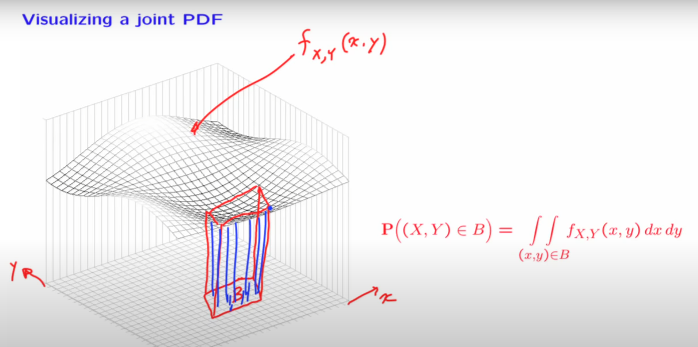

## Joint PDF of multiple r.v.

### Definition

Two continuous r.v. associated with the same experiment are jointly continuous and can be described in terms of a joint PDF $f_{X,Y}$ if $f_{X,Y}$ is nonnegative function that satisfied

$$
P((x,y)\in B) = \int_{}\int_{(x,y)\in B}^{}f_{X,Y}(x,y)dxdy
$$
for every subset $B$ of 2 dimensional plane

#### Verification 

##### Normalization

$$
\int_{-\infty}^{\infty}\int_{-\infty}^{\infty}f_{X,Y}(x,y)dxdy = 1
$$

### Visualization

* just like in this picture, we can see the wave on the surface is the PDF
* by integrating the PDF 2 times, we can get the volume sit on the top of the set B which is the probabilities

### Interpretation

To interpret the joint PDF, let $\delta$ be a small positive number, 
$$
P(a \leq X \leq a+\delta, c\leq Y\leq c+\delta) = \int_{c}^{c+\delta}\int_{a}^{a+\delta}f_{X,Y}(x,y)dxdy \approx f_{X,Y}(a,c)\delta^2
$$
 $f_{X,Y}(a,c)$ can be interpret as **probability per unit area** in the vicinity of $(a,c)$ 

### Marginal probability

we have
$$
P(X\in A) = P(X \in A, Y \in (-\infty,\infty)) = \int_{A}^{}\int_{-\infty}^{\infty}f_{X,Y}(x,y)dxdy
$$
recalled that
$$
P(X\in A) = \int_{X \in A}^{}f_X(x)dx
$$
Thus we have the marginal probability
$$
f_X(x) = \int_{-\infty}^{\infty}f_{X,Y}(x,y)dy
$$
Similar with y we have
$$
f_Y(y) = \int_{-\infty}^{\infty}f_{X,Y}(x,y)dx
$$

### 2D uniform PDF

In general, let $S$ be a subset of the 2 dimensional plane. The corresponding uniform joint PDF on $S$ is defined by
$$
f_{X,Y}(x,y) = \begin {cases}\frac{1}{area \ \ S} \ \ \ \ if (x,y)\in S \\
0 \ \ \ \ otherwise\end {cases}
$$
>  $\frac{1}{area \ \ S}$ can be visually interpreted as the height of the object

For any subset $A \subset S$ , the probabilities that $(X,Y) $ lies in $A$ is
$$
P((X,Y)\in A) = \int_{}^{}\int_{(x,y)\in A}^{}f_{X,Y}(x,y)dxdy\\
= \frac{1}{area \ \ S}\int_{}^{}\int_{(x,y)\in A}^{}dxdy\\
=\frac{area \ \ A}{area \ \ S}
$$

* 其中 $\int_{}^{}\int_{(x,y)\in A}^{}dxdy$ 可以理解为所有属于集合 $A$ 的点聚在一起组合成的二维图形的面积

### Joint CDFs

#### Definition

If $X$ and $Y$ are 2 r.v. associated with the same experiment, we define their joint CDF by
$$
F_{X,Y}(x,y) = P(X\leq x,Y\leq y)
$$
If $X$ and $Y$ are described by a joint PDF $f_{X,Y}$, then
$$
F_{X,Y}(x,y) = P(X\leq x,Y\leq y) = \int_{-\infty}^{x}\int_{-\infty}^{y}f_{X,Y}(s,t)dsdt
$$
and
$$
f_{X,Y}(x,y) = \frac{\part^2 F_{X,Y}}{\part x \part y}(x,y)
$$
