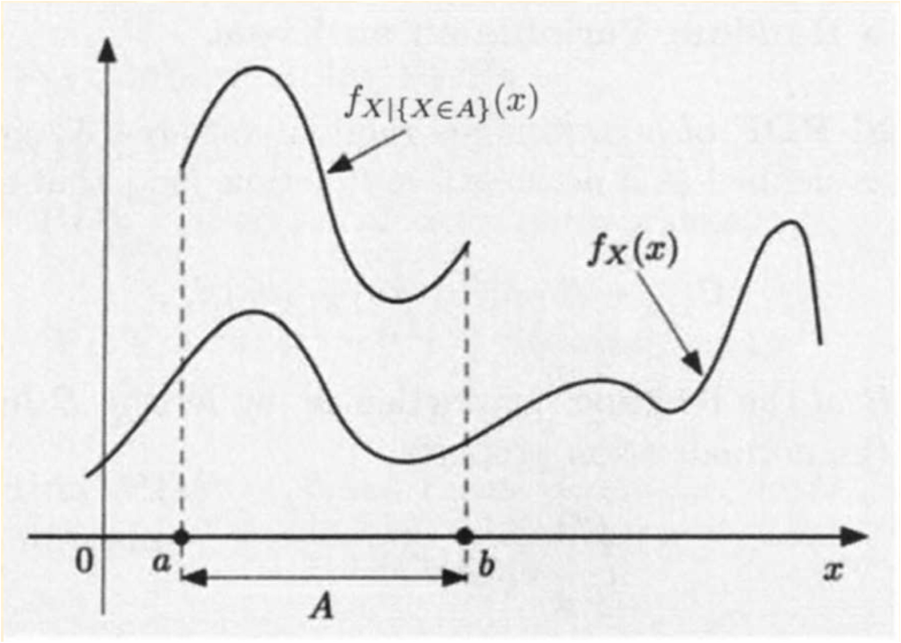

## Joint PDF of multiple r.v.

### Definition

Two continuous r.v. associated with the same experiment are jointly continuous and can be described in terms of a joint PDF $f_{X,Y}$ if $f_{X,Y}$ is nonnegative function that satisfied

$$
P((x,y)\in B) = \int_{}\int_{(x,y)\in B}^{}f_{X,Y}(x,y)dxdy
$$
for every subset $B$ of 2 dimensional plane

#### Verification 

##### Normalization

$$
\int_{-\infty}^{\infty}\int_{-\infty}^{\infty}f_{X,Y}(x,y)dxdy = 1
$$

### Interpretation

To interpret the joint PDF, let $\delta$ be a small positive number, 
$$
P(a \leq X \leq a+\delta, c\leq Y\leq c+\delta) = \int_{c}^{c+\delta}\int_{a}^{a+\delta}f_{X,Y}(x,y)dxdy \approx f_{X,Y}(a,c)\delta^2
$$
 $f_{X,Y}(a,c)$ can be interpret as **probability per unit area** in the vicinty of $(a,c)$ 

### Marginal probability

we have
$$
P(X\in A) = P(X \in A, Y \in (-\infty,\infty)) = \int_{A}^{}\int_{-\infty}^{\infty}f_{X,Y}(x,y)dxdy
$$
recalled that
$$
P(X\in A) = \int_{X \in A}^{}f_X(x)dx
$$
Thus we have the marginal probability
$$
f_X(x) = \int_{-\infty}^{\infty}f_{X,Y}(x,y)dy
$$
Similar with y we have
$$
f_Y(y) = \int_{-\infty}^{\infty}f_{X,Y}(x,y)dx
$$

### 2D uniform PDF

In general, let $S$ be a subset of the 2 dimensional plane. The corresponding uniform joint PDF on $S$ is defined by
$$
f_{X,Y}(x,y) = \begin {cases}\frac{1}{area \ \ S} \ \ \ \ if (x,y)\in S \\
0 \ \ \ \ otherwise\end {cases}
$$
For any subset $A \subset S$ , the probabilities that $(X,Y) $ lies in $A$ is
$$
P((X,Y)\in A) = \int_{}^{}\int_{(x,y)\in A}^{}f_{X,Y}(x,y)dxdy\\
= \frac{1}{area \ \ S}\int_{}^{}\int_{(x,y)\in A}^{}dxdy\\
=\frac{area \ \ A}{area \ \ S}
$$

### Joint CDFs

#### Definition

If $X$ and $Y$ are 2 r.v. associated with the same experiment, we define their joint CDF by
$$
F_{X,Y}(x,y) = P(X\leq x,Y\leq y)
$$
If $X$ and $Y$ are described by a joint PDF $f_{X,Y}$, then
$$
F_{X,Y}(x,y) = P(X\leq x,Y\leq y) = \int_{-\infty}^{x}\int_{-\infty}^{y}f_{X,Y}(s,t)dsdt
$$
and
$$
f_{X,Y}(x,y) = \frac{\part^2 F_{X,Y}}{\part x \part y}(x,y)
$$
其中 $\part$ 这个符号可以念partial或者偏，即偏导的意思

need further review

### Expectation

#### Definition

If $X$ and $Y$ are jointly continuous r.v. and $g$ is some function, then
$$
Z = g(X,Y)
$$
is also a r.v.,and we have
$$
E[g(X,Y)] = \int_{-\infty}^{\infty}\int_{-\infty}^{infty}g(x,y)f_{X,Y}(x,y)dxdy
$$
If $g(X,Y) $ is a linear function where $g(X,Y) = aX+bY+c$, for some scalars $a,b,c$, then we have

$$
E[aX+bY+c] = aE[X]+bE[Y]+c
$$
from linearity of expectation

### More than 2 r.v.

* Joint PDF of $X,Y,Z$ satisfies the following formula for any set B

$$
P((X,Y,Z)\in B) = \int_{}^{}\int_{}^{}\int_{(X,Y,Z)\in B}^{}f_{X,Y,Z}(x,y,z)dxdydz
$$

* Marginal PDF

$$
f_{X,Y}(x,y) = \int_{-\infty}^{\infty}f_{X,Y,Z}(x,y,z)dz \\
f_X(x) = \int_{-\infty}^{\infty}\int_{-\infty}^{\infty}f_{X,Y,Z}(x,y,z)dydz
$$

* Expectation

$$
E[g(X,Y,Z)] = \int_{}^{}\int_{}^{}\int_{(X,Y,Z)\in B}^{}g(x,y,z)f_{X,Y,Z}(x,y,z)dxdydz
$$

## Conditioning

### Conditioning on an event

#### Definition

The conditional PDF of a continuous r.v. $X$, given an event $A$ with $P(A > 0)$ is defined as a nonnegative function $f_{X|A}$ that satisfies
$$
P(X\in B | A) = \int_{B}^{}f_{X|A}(x)dx
$$
for any subset $B$ of the real line

#### verification

by taking $B = \R$, we have
$$
P(X\in B|A) = \int_{-\infty}^{\infty}f_{X|A}(x)dx = 1
$$
so $f_{X|A}$ is a legitimate PDF

### Conditioning on event $\{X \in A\}$

If we condition on event $\{X\in A\}$, with $P(X\in A)> 0$, then
$$
P(X\in B|X\in A) = \frac{P(X\in B \ , X \in A)}{P(X\in A)} = \frac{\int_{A\cap B}^{}f_{X}(x)dx}{P(X\in A)}
$$
By taking the derivatives, we can get
$$
f_{X|\{X\in A\}}(x) = \begin{cases}\frac{f_X(x)}{P(X\in A)}\ \ \ \  if \ \ X \in A\\
0 \ \ \ \  \ \ \ \  \ \ \ \ otherwise \end{cases}
$$
Hence we get

* The conditional PDF is 0 outside the conditioning set
* within the conditioning set, the conditional PDF has the same shape with the unconditional one except that it times by a factor $\frac{1}{P(X\in A)}$ 

#### graph

#### e.g. proving exponential r.v. is memoryless

##### Memoryless property

the distribution of the remaining is the same as it was original, regardless of how long it goes.

[youtube video to demonstrate](https://www.youtube.com/watch?v=YPb59pZLWjQ) 虽然讲的一般般，但是看看图也好

就像这幅图中，经过证明会得到，我们已知 $X > s$ 求 $P（X>(s+t))$ 会跟什么都不知道求 $P(X>t)$ 一样。这个特性直译过来就是无记忆性，我们引入题目

#### problem

The time $T$ until a new light bulb burns out is an exponential r.v. with parameter $\lambda$. Alice turns the light on, leaves the room and when she returns, $t$ time units later, finds the light bulb is still on, which corresponds to the event $A = \{T > t\}$ 

Let $X$ be the additional time until the light bulb burns out. What's the conditional CDF of $X$​ given the event A?

$$
P(X > x|A)
=P((X > x+t)|A)\\
= P((T>x+t)|T>t)\\
= \frac{P((T>x+t)\ and \ \ T > t )}{P(T > t)} \\
= \frac{P(T>x+t)}{P(T>t)}\\
$$
需要注意的是，第一行中的 $P(X > x|A)=P((X > x+t)|A)\\$ 可以理解为x大于额外的这一**时间段**的概率相当于x大于x+t这一刻之前的所有时间，当时理解老半天

recall that the probabilities of exponential r.v. of $X > t$ is the **tail probabilities** , hence we have
$$
=\frac{e^{-\lambda(x+t)}}{e^{-\lambda t}}\\
=e^{-\lambda x}
$$
Analyse the result, we have $P(X>x|A) = e^{-\lambda x}$ , while the tail probabilities is $P(X>a) = e^{-\lambda a}$ which is the same. So they are memoryless.

### Conditioning with multiple r.v.

Suppose $X$ and $Y$ are jointly continuous r.v. with joint PDF $f_{X,Y}$, if we condition on a positive probability event of the form $C = \{(X,Y)\in A\}$, we have
$$
f_{X,Y|C}(x,y) = \begin{cases} \frac{f_{X,Y}(x,y)}{P(C)} \ \ \ \ if \ \ (x,y) \in A\\
0 \ \ \ \ \ \ \ \ \ \ \ \ \ \ \ \ otherwise\end{cases}
$$

* The conditional PDF of $X$, given event $C$, is

$$
f_X(x) = \int_{-\infty}^{\infty}f_{X,Y|C}(x,y)dy
$$

### Total probability theorem

Let $A_1,A_2,\cdots,A_n$ be disjoint events that form a partition of the sample space. Assume $P(A_i) > 0$ for all $i$​ .By the total probability theorem from chapter 1, we have
$$
P(X \leq x) = \sum_{i = 1}^{n}P(A_i)P(X\leq x|A_i)
$$
Rewritting the formula in continuous form, we have
$$
\int_{-\infty}^{x}f_X(t)dt = \sum_{i = 1}^{n}P(A_i)\int_{-\infty}^{x}f_{X|A_i}(t)dt
$$
Then take the derivative on $x$ we have 
$$
f_X(x) = \sum_{i = 1}^{n}f_{X|A_i}(x)
$$

### Conditioning one r.v. on another

Let $X$ and $Y$ be continuous r.v. with joint PDF $f_{X,Y}$ , for any $y$ with $f_Y(y) > 0$, the conditional PDF of $X$ given that $Y = y$ is
$$
f_{X|Y}(x|y) = \frac{f_{X,Y}(x,y)}{f_Y(y)}
$$
similar with the discrete case,  $P(x|y) = \frac{P_{X,Y}(x,y)}{P_Y(y)}$ 

Because $f_Y(y) = \int_{-\infty}^{\infty}f_{X,Y}(x,y)dx$ , so by integrating  $f_{X|Y}(x|y)$ we have
$$
\int_{-\infty}^{\infty}f_{X|Y}(x|y)dx = \int_{-\infty}^{\infty}\frac{f_{X,Y}(x,y)}{f_Y(y)}dx\\
=\frac{1}{f_Y(y)}\int_{-\infty}^{\infty}f_{X,Y}(x,y)dx\\
= \frac{1}{f_Y(y)}f_Y(y) \\= 1
$$

* Thus $f_{X|Y}(x|y)$ is a legitimate PDF
