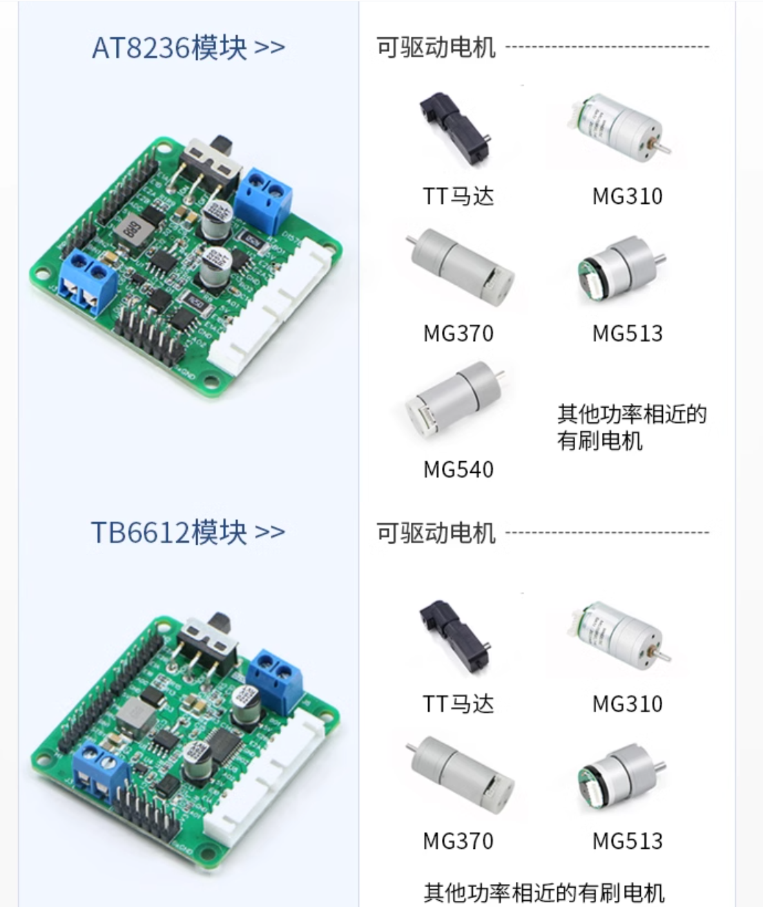

# 电控学习项目--循迹小车

## 引入

### 电控学习路径总结：（stm32HAL库）

1. MPU6050陀螺仪
2. JDY 蓝牙通信
3. 超声波模块
4. 测距传感器
5. OLED屏幕
6. 电机驱动
7. CCD？
8. 红外传感器
9. 灰度传感器
10. 电磁传感器
11. Openmv
12. adc 监测电量
13. 蜂鸣器 电量过低报警

## 前期准备

### 任务分配：

硬件成员：各个模块的电路集成设计+焊接

电控成员：代码学习+调试

### 时间轴：

6.15-7.15 硬件画板子加测试+试试写代码

7.15 ~ 电控调车

### 思路参考

1. 一定一定要看这个视频，只看这一个视频就好，对理清思路非常有帮助

[传送门立创系列视频第二课](https://www.bilibili.com/video/BV1zh4y1b7gi/?spm_id_from=333.788&vd_source=4ae85c9aa63e99071b3c53715d6ff461)

2. 感觉还不错的HAL库+openmv系列

[大佬](https://www.bilibili.com/video/BV1SS4y1v7eg/?spm_id_from=333.337.search-card.all.click&vd_source=4ae85c9aa63e99071b3c53715d6ff461)

### 需求和路径

#### 基本运动

* 前进
* 后退
* 左转
* 右转
* 刹车
* 自稳平衡

#### 运动速度

挡位可调

#### 供电

独立电源

#### 电量检测

检测小车目前的电量状态，提醒

#### 自主避障

自动避让前方障碍

#### 循迹

沿着黑线走

#### 模式

可以通过按键进行模式切换

#### 显示状态

可以通过一块屏幕显示当前小车的模式，转速，温度等基本功能

## 方案策划

### 基本运动

#### 电机

需求：带/不带编码器， 高/低转速, 供电电压(12V/6V)

1. MG513
2. GB37-520电机
3. N20

#### 轮子

* 65mm + 六角口（需要搭配六角联轴器
* 85mm + 六角口（需要搭配六角联轴器

#### 编码器

* 霍尔编码器(双)
* GMR 编码器

#### 电机驱动芯片

* RZ78XX(RZ7899/RZ7889) 待机电流小，控制逻辑简单，芯片小
* TB6612 经典电机驱动芯片，但电机堵转容易烧芯片
* L298N 经典电机驱动芯片，但电机堵转容易烧芯片

摘自立创视频

#### 轮子

* 正常大小轮子
* 麦轮（贵）
* 万向轮
* 牛眼轮

#### 平衡控制

* MPU6050陀螺仪
* PWM控制电机转速

### 运动速度

按键进行切换

### 供电

* 锂电池组（如7.4V 2S或11.1V 3S）

* 电池管理系统（BMS）模块

### 电量检测

* 电压传感器

* 单片机ADC
* 蜂鸣器警报（可选）

### 自主避障

* 超声波传感器HC-SR04
* 红外避障传感器

### 循迹

* 红外循迹传感器(TCRT5000)
* 灰度传感器
* 电磁传感器
* openmv
* ccd

### 模式

按键

### 显示

* 0.96寸OLED屏幕

* 墨水屏
* LCD屏幕

### 主控

* stm32f103/f407

### 实际方案与物资采购

1. 65mm轮子+MG513电机+霍尔传感器[传送门](https://item.taobao.com/item.htm?spm=pc_detail.29232929/evo365560b447259.guessitem.d1.56107dd6sIOvtd&id=43575097124&skuId=4815263617183)

## 知识库

### 霍尔编码器

[b站原理传送门](https://www.bilibili.com/video/BV1Th4y1f7cp/?spm_id_from=333.337.search-card.all.click&vd_source=4ae85c9aa63e99071b3c53715d6ff461)

[知乎专栏传送门](https://zhuanlan.zhihu.com/p/630652844)

[霍尔效应视频](https://www.bilibili.com/video/BV15W4y1g7AC/?spm_id_from=333.337.search-card.all.click&vd_source=4ae85c9aa63e99071b3c53715d6ff461)

### 连接顺序

电源 -> 降压模块 -> 电机驱动 -> 编码器 -> 电机 

编码器 ->　霍尔编码器

电机驱动　-> TB6612

### 电机驱动芯片

* RZ78XX
* TB6612
* L298N

