### 情况同步

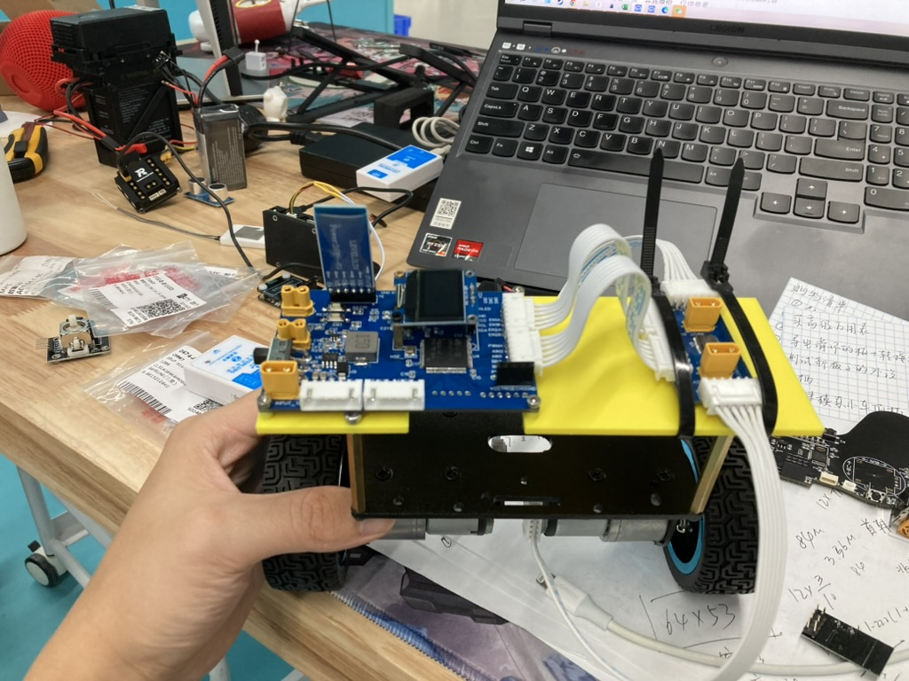

这里是目前的一个工作进度，我给这个小车重新打印了第二层的板子，用几个螺丝固定。下面那一层是用来放一个12V的电源，我放在我的小车第二层，你可以找找。上面那一层是用来放主控和电机驱动板。

板子的话左边是主控板子，集成了超声波，OLED，CCD，红外和电磁巡线模块，蓝牙，DBUS的接口，右边只有一个TB6612电机驱动芯片，听说这个芯片容易烧所以单独分开了。电源从左边的XT30公头输入然后通过降压电路转化为5V，左边剩下的两个XT30母头分别是输出12V和5V的，通过XT30公到母的线来给右边电机驱动芯片供电，分别需要一个5V和12V。

电机的信号线已经连好，特别设计的直接插就完事了，不用搞些有的没的。

目前我只验证了电机的驱动芯片是没有问题的，但是其他模块还没有写程序来验证功能，如果你有时间的话，可以帮我看看。芯片是STM32F407VET6。

### 电机介绍

电机我们用的是直接带霍尔编码器的电机，就是绿色那一个PCB板子。它分别引出了6个引脚，分别是

* GND
* 5V
* Encoder1
* Encoder2
* AOUT1
* AOUT2

其中Encoder1,2是编码器的AB相，具体就看霍尔编码器原理，需要连接到stm32的定时器通道1，2上并开启Encoder Mode（而且好像只能是1和2， 你可以搜一下。

另外AOUT1,2 是控制电机方向的，1高电平二低电平正转，1低电平2高电平反转，你可以写个程序试一下。直接接到stm32的2个普通IO引脚就好。

### CubeMX配置

定时配置编码器原理，

[传送门](https://blog.csdn.net/as480133937/article/details/98750922)

**注意事项：**

* 需要增加测量的精度时，可以采用4倍频方式，即分别在A、B相波形的上升沿和下降沿计数，分辨率可以提高4倍，

* 如果只是测速,不要求方向，那么只需要用单片机随意选择一个信号线就行了,,然后定时器边沿触发，检测脉冲计数即可
* 一般是定时器的通道1和2才能作为编码器输入口，对应编码器输出的两相。
* GPIO配置为配置为上拉输入模式
* 一个定时器做一种工作，如果你配置了编码器模式，那么剩下的通道就不能配置其他模式
* 两相计数模式下即TL1和TL2都计数，  读出来数需要/4，一个脉冲信号对应四次计数   

### 蓝牙模块硬件部分

[蓝牙模块硬件讲解视频](https://www.bilibili.com/video/BV1hP4y1x7Nv/?spm_id_from=333.788.recommend_more_video.6&vd_source=4ae85c9aa63e99071b3c53715d6ff461) 硬件部分电控不需要看

#### 蓝牙天线

##### 种类

1. 陶瓷贴片天线：体积小，成本高，蓝牙耳机，跟贴片电容差不多
2. PCB天线：用PCB画，成本小，蓝牙鼠标键盘用的多。效果比陶瓷天线好
3. FPC天线：FPC天线就是柔性PCB，用在手机上多一点
4. SMA IPEX天线连接器：通过延长线伸出去，路由器上比较多，效果最好，体积最大

#### 参考设计

**陶瓷天线**

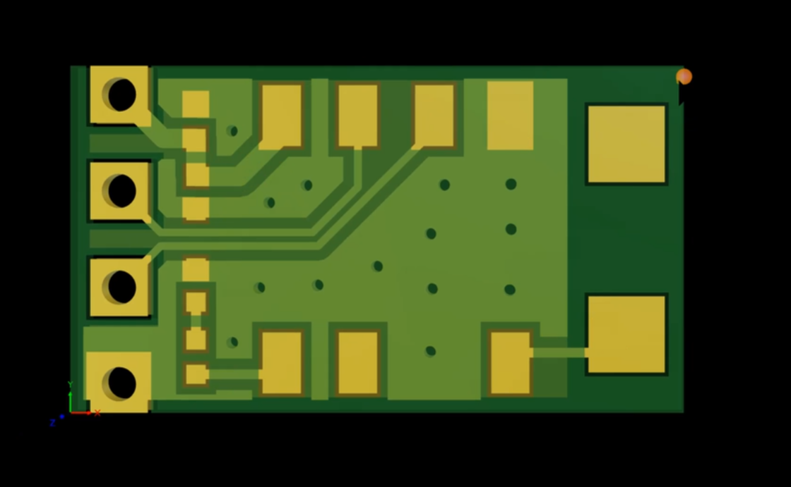

中间铺铜的是蓝牙模块，右边的两个大焊盘就是天线的位置，只用一端接，天线附近不要铺铜，最好天线部分是伸出去的，保证天线周围是净空的。

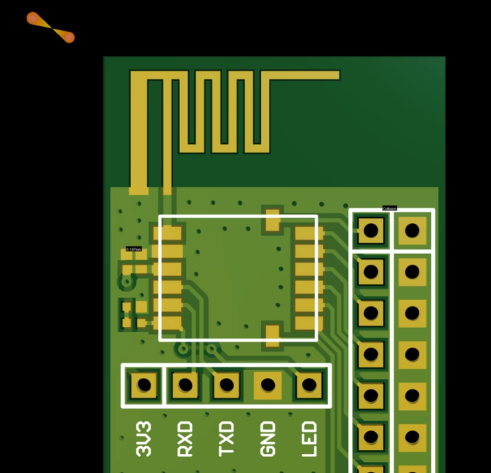

PCB天线，也是不能铺铜，一边接焊盘，一边接GND，要注意打充足的过孔，天线2.4G都是固定的。上面这个图是信号最好的天线

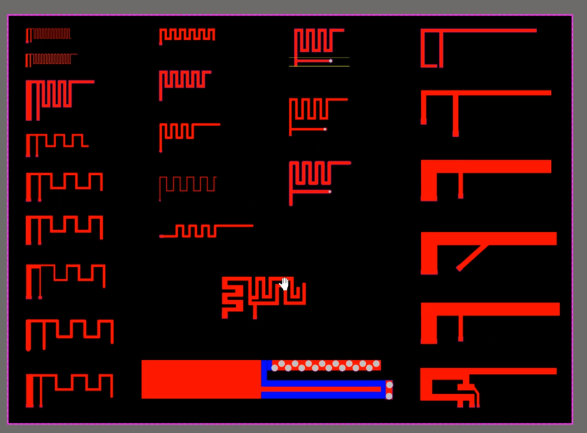

这么多都是天线

IPX

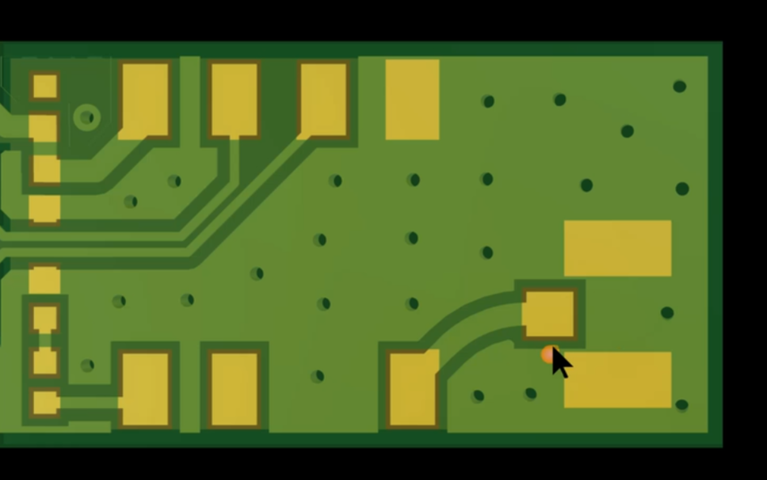

需要铺铜，在封装焊盘上焊上连接器就可以了，再接上外置的天线

> 天线，晶振下面禁止走信号线，会造成阻抗变化

### 蓝牙模块软件部分

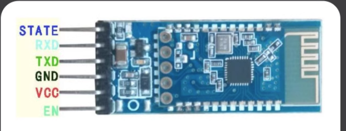

我在PCB中只引出了5个引脚，STATE,RXD,TXD,GND,VCC EN，因为买的优信电子的蓝牙模块它的EN引脚就是空的，当然我还是设计的6p的排母对着插就行了

### 线性CCD TSL1401模块

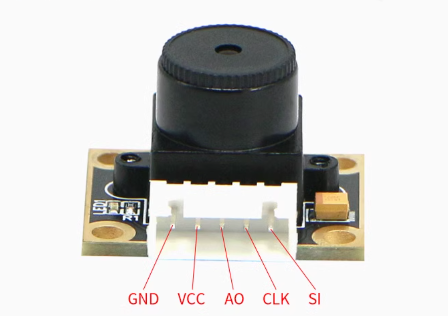

#### 接线

* SI--串行输入口，决定数据序列的起始，用单片机IO口控制即可；

* CLK--时钟管脚，控制电荷转换、输出像素和芯片复位，可用单片机IO口或者PWM控制；

* AO--模拟输出，接单片机的ADC口进行采集；

* VDD--接电源正 （3.3V—5.2V）；

* GND--接电源地

### 4路红外巡线传感器

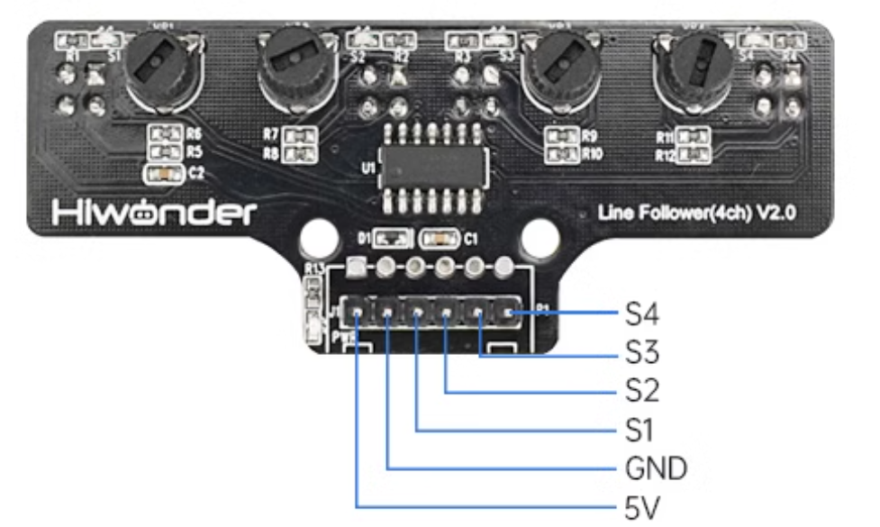

#### 接线

* S1-S4 用单片机IO口控制即可

* GND 电源地
* 5V

### 电磁传感器

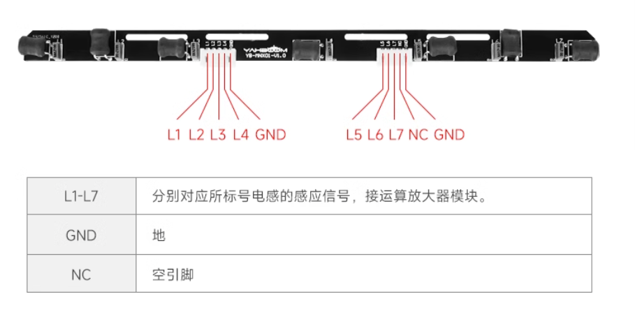

### MPU6050（I2C通信）

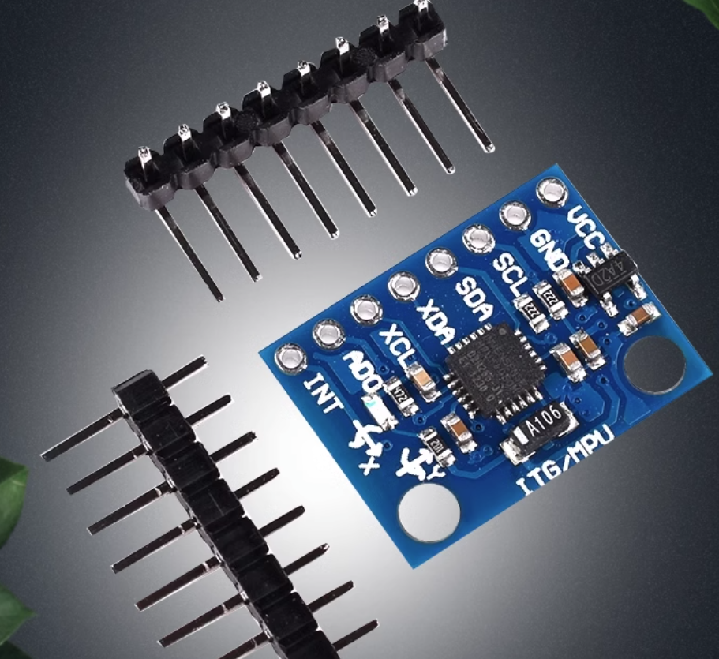

#### 引脚

总共有8个引脚可供选择

* VCC
* GND
* SCL I2C时钟线
* SDA I2C信号线
* XDA 外部传感器信号线
* XCL 外部传感器时钟线
* ADO 设置MPU6050的I2C从机地址引脚
* INT 中断引脚

### 超声波模块 HC-SR04

#### 引脚

* VCC
* Trig 向此引脚输入一个10us以上的高电平可以触发模块测距，接单片机IO引脚就好
* Echo 测距结束时会输出一个高电平，电平宽度为超声波往返时间之和，接定时器的一个通道
* GND

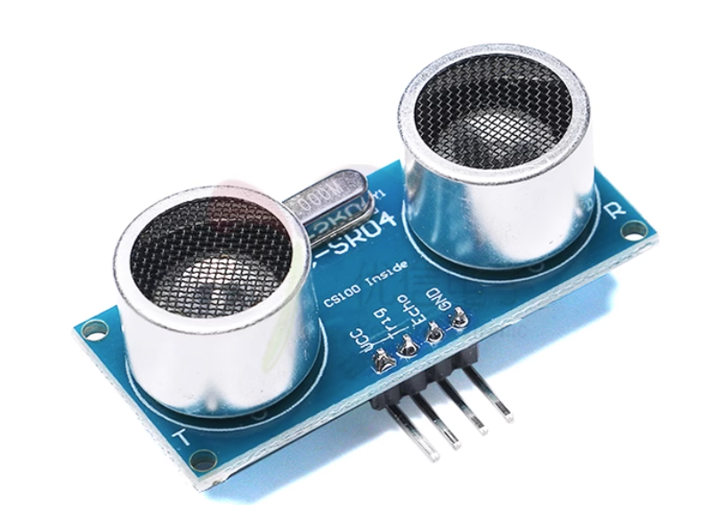

### 平衡小车参数

**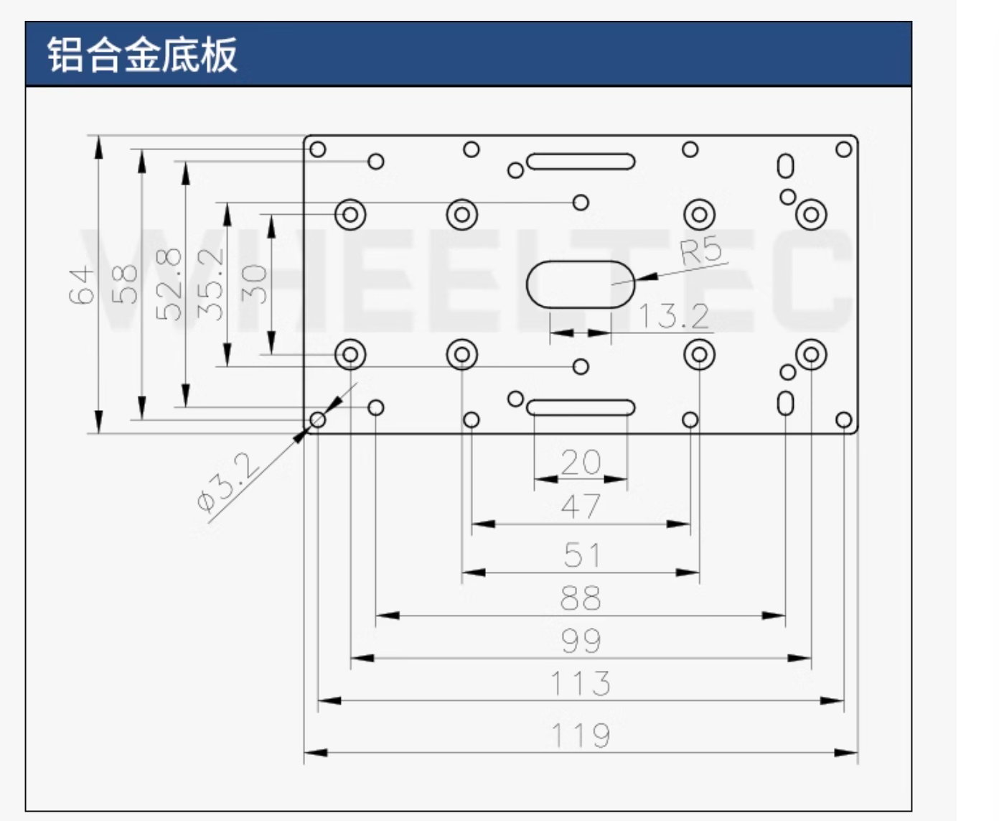**

