### 情况同步

板子的话左边是主控板子，集成了超声波，OLED，CCD，红外和电磁巡线模块，蓝牙，DBUS的接口，右边只有一个TB6612电机驱动芯片，听说这个芯片容易烧所以单独分开了。电源从左边的XT30公头输入然后通过降压电路转化为5V，左边剩下的两个XT30母头分别是输出12V和5V的，通过XT30公到母的线来给右边电机驱动芯片供电，分别需要一个5V和12V。

目前我验证了电机，超声波，OLED，编码器等是没有问题的

https://blog.csdn.net/weixin_43323255/article/details/123628999

## 机械部分

### 平衡小车参数

## 硬件部分

### STM32芯片

使用的是STM32F407VET6

### 电机介绍

电机我们用的是直接带霍尔编码器的电机，就是绿色那一个PCB板子。它分别引出了6个引脚，分别是

* GND
* 5V
* Encoder1 
* Encoder2
* AOUT1
* AOUT2

其中Encoder1,2是编码器的AB相，需要连接到stm32的定时器通道1，2上并开启Encoder Mode，目前这块板子上两个电机的编码器分别连接TIM3和TIM4

另外AOUT1,2 是控制电机方向的，1高电平二低电平正转，1低电平2高电平反转,直接接到stm32的2个普通IO引脚。 

#### 有点问题

我发现左边的轮子，以超声波模块对着的方向为正前方，它好像有个霍尔元件坏了，导致如果用Tl1和Tl2模式的话，左边的编码器计数会比右边的少一半

### PWM控速

由于我硬件的问题，我将一个电机的PWM控速引脚分给了开启编码器模式的定时器下，会出现开启编码器模式的时钟无法正常用PWM进行电机控速，所以目前的电机PWM引脚为

* TIM1_CH3
* TIM12_CH1

### MPU6050（I2C通信）

#### 引脚

总共有8个引脚可供选择

* VCC
* GND
* SCL I2C时钟线
* SDA I2C信号线
* XDA 外部传感器信号线
* XCL 外部传感器时钟线
* ADO 设置MPU6050的I2C从机地址引脚
* INT 中断引脚

#### 有点问题

由于在硬件上忘记对I2C的SDA和SCL线进行上拉，于是配置CubeMX的时候一定要记得配置MCU内部的弱上拉，虽然不知道为什么OLED没这个问题

[参考启发](https://blog.csdn.net/m0_38118202/article/details/135815994)

### 超声波模块 HC-SR04

#### 引脚

* VCC
* Trig 向此引脚输入一个10us以上的高电平可以触发模块测距，接单片机IO引脚就好
* Echo 测距结束时会输出一个高电平，电平宽度为超声波往返时间之和，接定时器的一个通道
* GND

目前已经测试应该没问题

### OLED

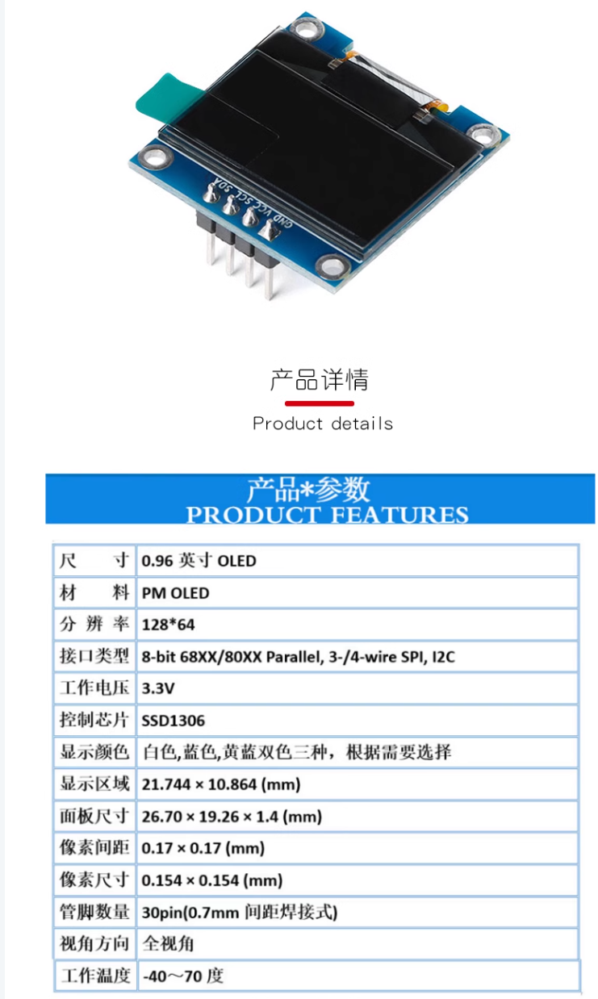

我们选择的OLED屏幕是I2C白色的，使用的芯片是SSD1306

### 蓝牙模块软件部分

我在PCB中只引出了5个引脚，STATE,RXD,TXD,GND,VCC EN，因为买的优信电子的蓝牙模块它的EN引脚就是空的，当然我还是设计的6p的排母对着插就行了

### 线性CCD TSL1401模块

#### 接线

* SI--串行输入口，决定数据序列的起始，用单片机IO口控制即可；

* CLK--时钟管脚，控制电荷转换、输出像素和芯片复位，可用单片机IO口或者PWM控制；

* AO--模拟输出，接单片机的ADC口进行采集；

* VDD--接电源正 （3.3V—5.2V）；

* GND--接电源地

### 4路红外巡线传感器

#### 接线

* S1-S4 用单片机IO口控制即可

* GND 电源地
* 5V

### 电磁传感器

### 飞机NRF24L01

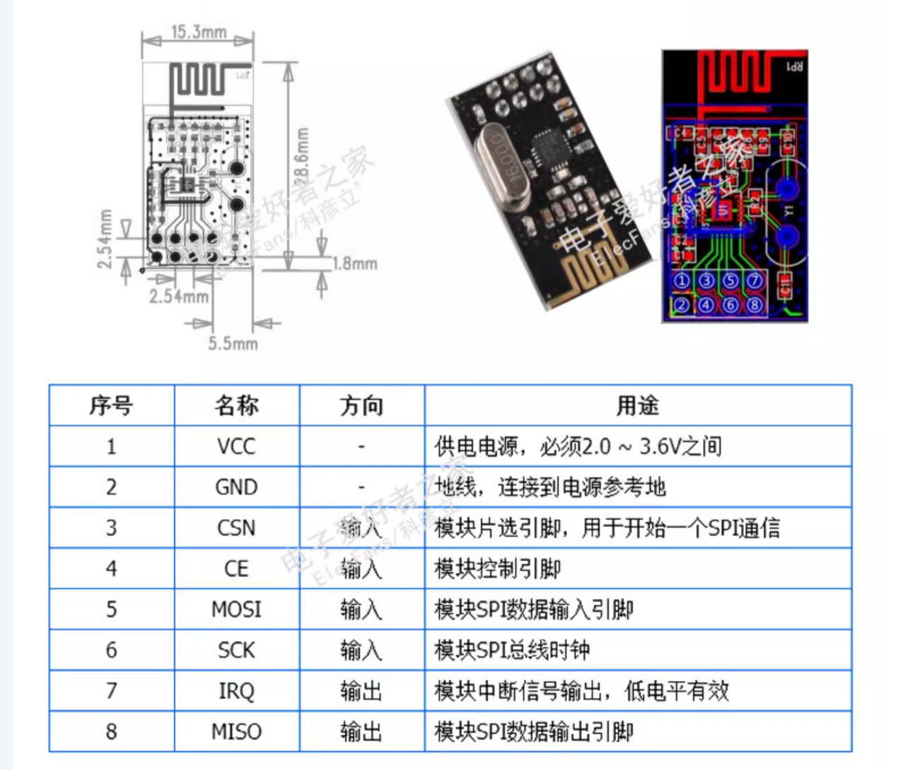

## 软件部分

### CubeMX配置

#### PWM控速

TIM1_CH3和TIM12_CH1 配置PWM输出模式，然后这个下面的这个重装载值（Auto Reload Register)网上很多调这个平衡车的都设置成7200，不知道为啥

#### 超声波输入捕获

TIM2_CH4 配置输入捕获模式(Input Capture Direct Mode)，并开启中断(这个看你代码结构)

#### 编码器模式

TIM3和TIM4直接找到混合通道选择编码器模式(Encoder Mode)

[正交解码编码器原理csdn传送门](https://blog.csdn.net/as480133937/article/details/98750922)

**注意事项：**

* 需要增加测量的精度时，可以采用4倍频方式，即分别在A、B相波形的上升沿和下降沿计数，分辨率可以提高4倍，

* 如果只是测速,不要求方向，那么只需要用单片机随意选择一个信号线就行了,,然后定时器边沿触发，检测脉冲计数即可
* 一般是定时器的通道1和2才能作为编码器输入口，对应编码器输出的两相。
* GPIO配置为配置为上拉输入模式
* 一个定时器做一种工作，如果你配置了编码器模式，那么剩下的通道就不能配置其他模式
* 两相计数模式下即TL1和TL2都计数，  读出来数需要/4，一个脉冲信号对应四次计数   

#### MPU6050

打开I2C1，开启I2C快速模式（可选），并在GPIO Setting选项栏中对两个引脚进行上拉

#### OLED

打开I2C3， 开启I2C快速模式（可选）

### OLED

[SSD1306 datasheet](https://cdn-shop.adafruit.com/datasheets/SSD1306.pdf)

推荐直接看b站keysking的教程，亲测我们的SSD1306和up主的芯片使用上来区别不大，并且up提供的个人网站上也有我们这个芯片的驱动库。

#### 注意事项

1. OLED的I2C地址与视频中的有点出入，如果使用的是优信电子的OLED屏，将OLED模块翻至背面可以看到它的I2C地址由一个芯片引脚的高低电平决定，默认设置的是0x78，如果将电阻换一边焊接可以改变它的从机地址

2. 部分OLED屏幕的VCC和GND的引脚方向可能相反，使用前千万要小心
3. OLED可以直接使用驱动库来搞，省事，不过keysking的驱动库中没有直接输出数字的，需要将int或者float类型的数据转化成string才可以用它的函数，我使用的是sprintf这个函数

### 超声波模块

可以直接参考csdn上的代码，基本问题不大

### MPU6050

前面焊了2块都不是很行，目前的芯片已经确认是ok的了，放心用

[MPU6050 datasheet](https://invensense.tdk.com/wp-content/uploads/2015/02/MPU-6000-Datasheet1.pdf)

[MPU6050 register map](https://invensense.tdk.com/wp-content/uploads/2015/02/MPU-6000-Register-Map1.pdf)

#### 注意事项

* CubeMX记得上拉SCL和SDA

* I2C通信时的从机地址为7位，但是因为hal库需要7位地址在高七位，所以需要将从机地址向左移一位，所以MPU6050的从机地址为0x68<<1 = 0xD0

* 接收数据的格式要注意，可以看看例程那里怎么写的，我是强转成int16_t

### 解算角度

解算MPU6050角度有三种方法

* 利用MPU6050公司弄的DMP库，可以很方便的得到数据
* 利用一阶互补滤波，用加速度的高频和陀螺仪的低频互补，各有一定占比得到的
* 利用卡尔曼滤波（不会

#### DMP库

可以借鉴一下这个up的系列[stm32移植mpu6050 DMP库 b站](https://www.bilibili.com/video/BV13N4y1y7Js/?spm_id_from=333.337.search-card.all.click&vd_source=4ae85c9aa63e99071b3c53715d6ff461) 但是它没给DMP库的源文件，于是我又另外找了一篇csdn的文章下载，不知道会不会有问题，因为找不到视频里说的test.c案例文件，所以视频里的函数都是我手码进去的，非常原始。

[csdnDMP库下载](https://blog.csdn.net/Rare_Hunter/article/details/134200468?utm_medium=distribute.pc_relevant.none-task-blog-2~default~baidujs_baidulandingword~default-0-134200468-blog-123320781.235^v43^pc_blog_bottom_relevance_base5&spm=1001.2101.3001.4242.1&utm_relevant_index=3)

打开下载之后我们解压，然后进入

motion_driver_6.12 > arm > STM32F4_MD6 > Projects > eMD6 > core > driver > eMPL > 

按照上面的代码写完之后,如果只对DMP文件夹用c99编译就会出现下面的情况

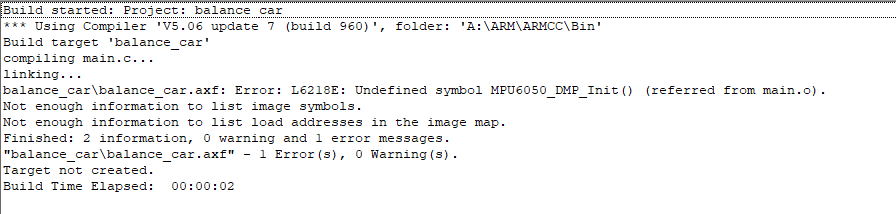

如果用cpp11就会报出一堆错

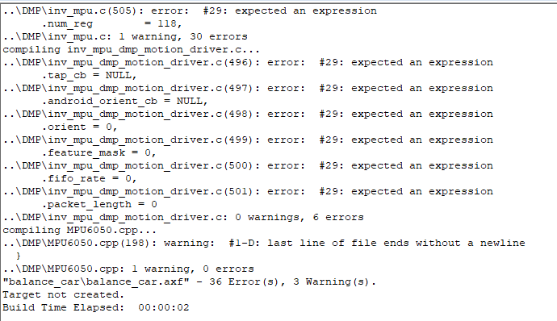

选择报错看看就会发现是struct这堆东西的问题

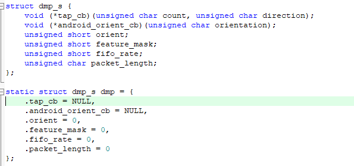

熬了好久没找出问题又不敢动乱改，对比了一下标准库里的c文件发现已经有改动了

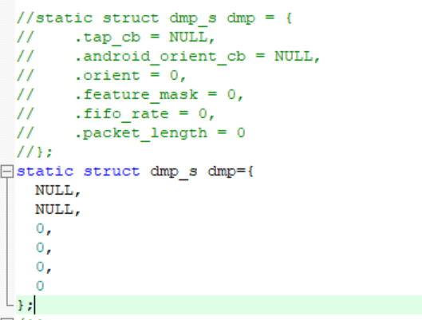

太神了，最后还是用cpp11编译，找了个标准库的inv_mpu.c 和 inv_mpu_dmp_motion_driver.c一个个对比发现有很多被注释和替换的，估计以前移植的人也有这个问题，然后按照那个文件这么走就搞定了。

但是坏了问题又来了

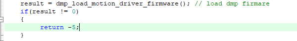

自检卡在了这一步，没办法了，看B站下面评论有说这个问题，说I2C的write 和read函数的timeout时间给大点，但是试过没用，迫于ddl就先放弃了

#### 移植一阶互补滤波代码

虽然不知道怎么来的但是能用就先凑合吧

移植完之后发现yaw轴根本不能用，听说是mpu6050的问题，然后是pitch轴的检测最大只能到80度，过80之后就会慢慢减小，不知道为什么

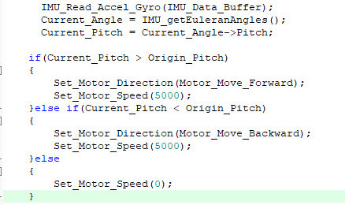

直接while开环试试效果，果然寄了，接下来试试pid

### Cube Monitor

https://www.bilibili.com/video/BV1th4y1g7Mc/?spm_id_from=333.788&vd_source=4ae85c9aa63e99071b3c53715d6ff461

https://blog.csdn.net/ybhuangfugui/article/details/104787761

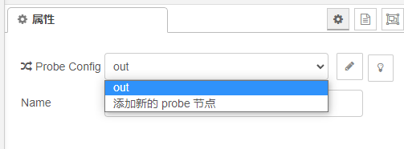

点击MyProbe_out 这里是可以用的仿真器，如果没有直接显示st-link或者说没有配置过st-link可以点击右边的铅笔

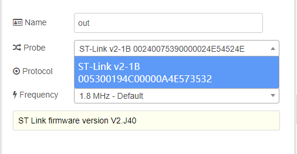

我们在Probe中选择st-link就可以啦

这里如果选完还是显示没有可以试试按一下deploy看看

### 踩坑

#### 同一个定时器不能同时用作编码器模式和pwm输出

https://blog.csdn.net/D586058/article/details/131872964

### 调pid

https://blog.csdn.net/m0_74732150/article/details/136838892

https://blog.csdn.net/best_xiaolong/article/details/105153978

https://www.guyuehome.com/34381

目前我只调了直立环，速度环还没搞

### 目前我的代码结构

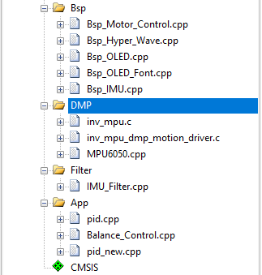

* Bsp 板间支持包

* DMP是DMP库，如果不用可以不需要
* Filter是那个一阶滤波的文件夹
* App有pid.cpp那个是抄c板例程pid函数，pid_new.cpp是抄b站别人开源的pid函数，balance_control是原本配合pid.cpp一起用的，最新的就暂时没用了

只能说是屎山代码，看看就好了，难用，然后很多东西因为赶时间都没有放在中断回调函数里面而是直接放在main.c，建议不要学。

