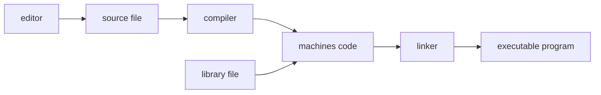

# Intro to c++

## Intro

### computer program

* software
* hardware

### anatomy of a computer

* cpu
* primary storage
* secondary storage (hard disk)


### <u>simple process</u>

machine language --> compiler --> high level language


### developing environment

* integrated environment
* editor
* website


### <u>developing process</u>



## example


### the first program

```c++
#include <iostream>  //stream input and output
using namespace std; //standard namespace (not recommend)

int main() //define a main function (every function have a main)
{
    cout << "hello, world" << endl; // print out "hello world"
    return 0; //indicate that the program is output successfully
}

```


| symbol | function                            | example                                       |
| ------ | ----------------------------------- | --------------------------------------------- |
| ;      | every statement ends in a semicolon | nope                                          |
| \      | mark quotation mark, show backslash | cout << "hello, \"world\"" --> Hello, "world" |
| \n     | indicate a new line                 | nope                                          |

### error

* compile-time error(syntax error)

    <font color='OrangeRed'>will be detected by debugger</font>

* run-time error(logical error)  

    <font color='OrangeRed'>won't be detected</font>


