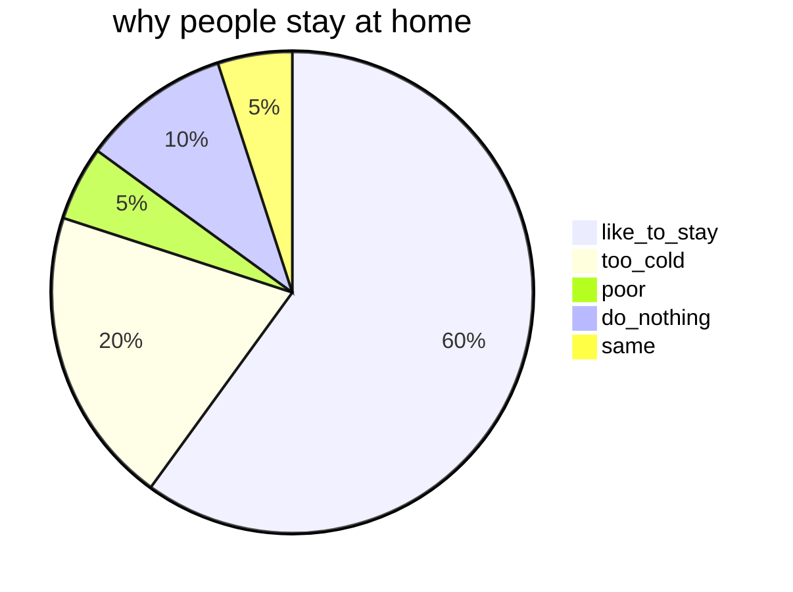
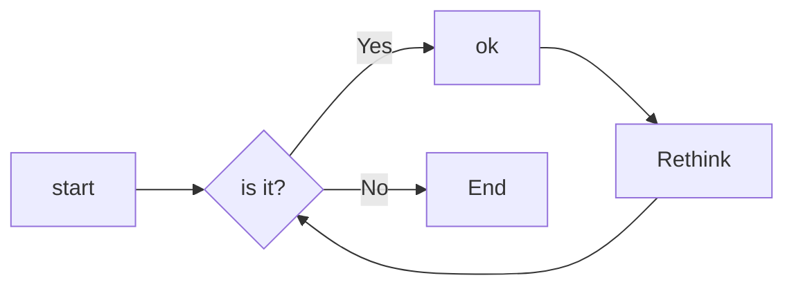
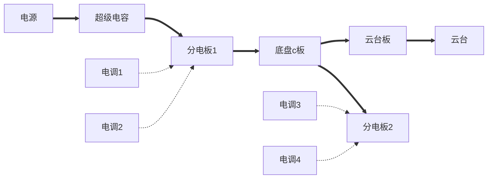

```mermaid
pie
	title why people stay at home
	"like_to_stay" : 60
	"too_cold" : 20
	"poor" : 5
	"do_nothing" : 10
	"same" : 5
```

```mermaid
graph LR
	A[start] --> B{is it?};;
	B -- Yes --> C[ok];
	C --> D[Rethink];
	D --> B;
	B -- No --> E[End]
```

```mermaid
graph LR
电源 ==>  超级电容 ==> a[分电板1] ==> b[底盘c板] ==> 云台板 ==> 云台
电调1 -.-> a
电调2 -.-> a
b ==> c[分电板2]
电调3 -.-> c
电调4 -.-> c

```

