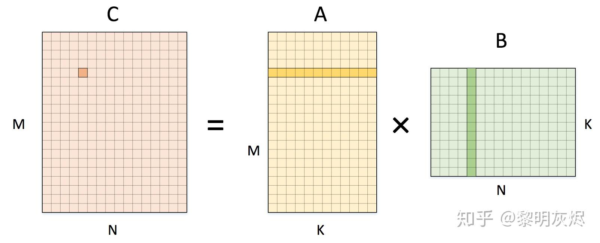

## 计算斐波那契数列

### 方法1:Bottom-up（自底向上）

直接由定义出发，依次相加得到每一项 $F_1,F_2,F_3\cdots F_n$​

* 运行时间是线性的 $O(n)$ 

### 方法2:Naive recursive squaring（朴素递归平方）

利用公式 $F_n = \frac{\phi^n}{\sqrt{5}}$ 来计算第n项，其中 $\phi$ 是黄金分割比例（1.61803）

* 运行时间 $O(log\ n)$ 
* 不太可靠，浮点数计算容易产生误差

### 小知识点

#### Declarative programming(声明式编程)

只告诉你想要的结果(what)，不理会过程，让机器自己摸索(how)

##### e.g.

打车，只管目的地，不管怎么去，类似vector

#### Imperative programming(命令式编程)

详细告诉机器怎么去做(how)

##### e.g.

打车告诉司机怎么走

### 方法3:matrix

#### Matrix multiplication

$$
c_{ij} = \sum_{k = 1}^{n}a_{ik}\cdot b_{kj}
$$

while i denote the row and j denote the column in c, similar for a and b

so it is the sum of every number in the row i for a and every number in the column j in b multiply together

 $o(n^3)$​ while i,j,k both iterate from 1 to n

how to try to improve it?(have a try in divide and conquer)

#### divide and conquer

### 作业--matrix的分而治之的简化算法

#### 普通长乘法

#### karatsuba算法

## Quick sort

### quick sort与merge sort

#### quick sort

将整个list分成两个部分，一边是所有数小于x，一边是所有数大于等于x

* 分割复杂，融合简单
* 占地方（有没有办法可以不用再创建LR，下面）

#### merge sort

* 分割简单，融合复杂

### quick sort partition（in place)

