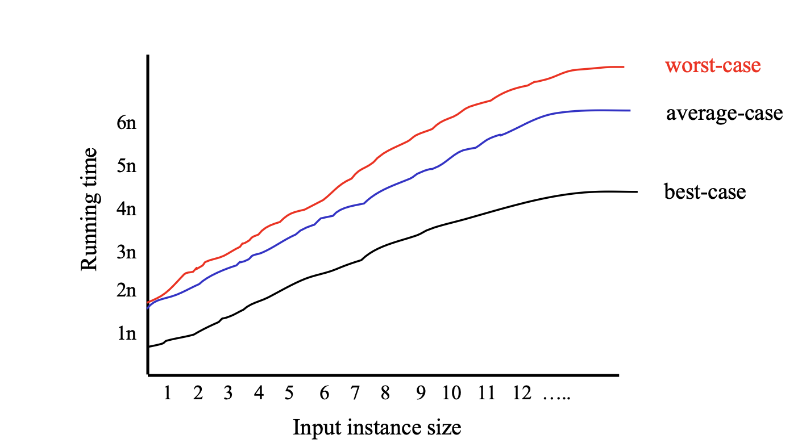

# Insertion Sort 插入排序

### Intro

对于一系列乱序输入的数字，输出从小到大正确的排序。应该怎样排序比较好？

这里我们介绍一种方法--**插入排序**

### 核心思想

从空数列开始，每接收一个数，就将它放在已经排好序的部分的正确位置直到所有数都排好

### Pseudo-code 伪代码

#### 思路1（不递归）

```python
for j<-1 to n-1 do #从数列的第二项开始，遍历未排序的数列，直到末尾
	key<-A[j] #赋值
  i=j-1 #当未排序的数列是j时，已排序数列的元素个数i为j-1（为了遍历已排序的数列）
  while i >= 0 and A[i]>key do #从已排序的数列最后一项开始，如果还没遍历完整个数列且这一项如果比要插入的元素大，就进入循环
  	A[i+1] = A[i] #将此项向前移动一位
  	i-- 
  A[i+1] = key #如果前面跳出了while循环，情况1:找到第A[i]项比要插入元素小，那么第A[i+1]项就是合适的位置，情况2:所有元素都比插入元素大，那么就放在第一项，情况3，o.w.
  
```

#### 思路2（递归）

```python
algorithm insertionSort(A[0..n-1]) #对一个数组进行排序
{
	A[0] 		if n = 1 #处理返回值
	insert(insertionSort(A[0..n-2]), A[n-1]) o.w. #insert函数将A[n-1]插入到已经排好序的A[0..n-2]中
}

algorithm insert(A[0..n-1], key) 
{
  append(A[0..n-1], key) if key >= A[n-1] # 新插入的值比目前的最大值还大
  append(newarray[key],A[0..n-1]) if n = 1 & key < A[0] #插入的值比最小值还小，创建一个array把key存进去 #也是下一行递归的返回条件
  append(insert(A[0..n-2], key), A[n-1]) o.w. # 如果位置不合适就反复调用
}
```

> [!note] 
>
> 对于插入的值比最小值还小但是`n`不等于`0`的情况，会进入 `o.w.`的条件然后反复递归直到 `n=1` 进入 `if n=1 & key < A[0]` 的条件

### 时间复杂度分析


#### 详细分析

* C1,C2,...C7代表不同操作的常数时间成本，`n`是元素的总数，`tj`表示第`j`次迭代中while循环的执行次数，是一个变量。对于每个`tj`，其成本为C4+C5+C6
* 左边的cost代表执行一次所需要的时间成本，times则是执行次数
* C1包含了赋值与比较，当到第n项时发现不符合条件了才跳出，所以times会是`n`
* C2与C3则因为第n次跳出循环少了一次，所以为`n-1`
* C4与C1同理，包含当i为负数时与while条件进行比较的一次，所以下面两行命令为`tj-1`
* C5,C6则在每次while的第tj次时就跳出循环没有执行，所以为`tj-1`

#### Best/Worst/Average Case

* 最优结果

Running time = f(n), each element already sorted, only need to go through and check

* worst case

Running time = f(n^2), elements are in inverse order, tj = j + 1

* average case

Running time = f(n^2), tj = (j+1)/2,



将上面对时间复杂度大致的分析用数据表现出来我们可以绘制如上图一样的图表。但是我们会发现，有些算法可能在数据量小的时候时间复杂度小，但是在数据量大的时候，便成指数般地增长，这就让我们对描述算法增加了难度。

那么这样比较准确地描述算法在长期的表现呢？我们引入了渐进记号来帮助我们表述。