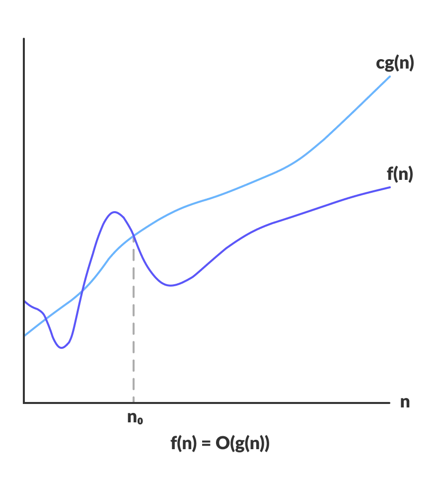
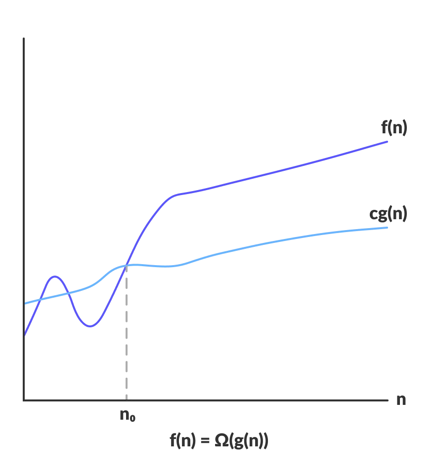
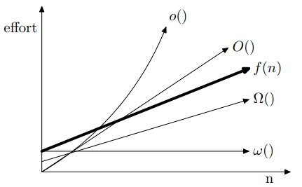

# Asymptotic Notation 渐进记号

[recommend webpage csdn](https://blog.csdn.net/so_geili/article/details/53353593?ops_request_misc=%257B%2522request%255Fid%2522%253A%2522171169602016800180667167%2522%252C%2522scm%2522%253A%252220140713.130102334..%2522%257D&request_id=171169602016800180667167&biz_id=0&utm_medium=distribute.pc_search_result.none-task-blog-2~all~top_positive~default-1-53353593-null-null.142^v100^pc_search_result_base2&utm_term=%E6%B8%90%E8%BF%9B%E8%AE%B0%E5%8F%B7&spm=1018.2226.3001.4187)

### Big O-NOTATION 渐进上界符号

- **定义**：O-Notation（大O表示法）是一种用于描述算法复杂度的数学符号，它表示了**算法执行时间与输入数据量**之间的关系。大O表示法通常用于算法分析中，以估计算法在**最坏情况**下的性能表现。

- 数学定义:  $f(n)$ is $O(g(n))$, if there exists constants $c$ and $n_0$ s.t. $f(n)\leq c\ g(n)$ for all $n \geq n_0$ 

- 大O表示法主要用于理论分析，它**忽略了常数因子和低阶项**，因为当输入数据足够大时，这些因素对算法的影响相对较小。它允许我们专注于算法性能随输入规模增长的主要趋势，而不是具体的执行时间。

- 因为表示算法的上界，所以经常用于对最坏情况的分析

- 根据符号O的定义，我们可以知道这个上界阶越低，评估越精确，越有价值。下面的 $c$ 和 $n_{0}$ 表示为 $nO(g(n))$ 在 $n_{0}$ 之后就会恒大于 $f(n)$ 
  - e.g.  $f(n) = n^2 + n$, 则 $f(n)=O(n^2)$,取 $c = 2,n_0 = 1$即可， $f(n) = O(n^3)$,取 $c = 1,n_0 = 2$即可，我们可以看出 $O(n^2)$作为上界更为精确，更好地逼近 $f(n)$。 反正就是最高次数相同就最精确了

> 通俗的说n满足一定条件范围内，函数f(n)的阶不高于函数g(n)

- Example:

$$
 f(n)=10n^2*log(n)+100n+10
$$

$$
O(f(n))=n^2
$$

- Some Extra

  - $$
    O[max(f(n),g(n))]=O(f(n)+g(n))
    $$

  

###  $\Omega$ Big Omega 渐进下界符号

  描述的是算法运行时间的**下界**，即算法在任何情况下的**最低性能**。如果一个算法的时间复杂度是 $\Omega(g(n))$，意味着存在一个常数$C$和一个$n_0$，使得当$n \geq n_0$时，算法的运行时间至少是$Cg(n)$​​​。

* 因为表示算法下界，所以经常用于最优情况

* 根据符号 $\Omega$ 的定义，我们可以知道这个下界的阶越高，评估越精确，越有价值
  - e.g.  $f(n) = n^2 + n$, 则 $f(n)=\Omega(n^2)$,取 $c = 1,n_0 = 1$即可， $f(n) = \Omega(100n)$,取 $c = \frac{1}{100},n_0 = 1$即可，我们可以看出 $\Omega(n^2)$作为上界更为精确，更好地逼近 $f(n)$​ 

> 通俗地说，n满足一定条件范围内，函数 $f(n)$的阶不低于函数 $g(n)$ 

###  $\theta$ Big Theta 渐进准确界符号

* 定义

​    在五个记号中要求最严格，因为它**同时描述了上界和下界**。如果说一个算法$f(n)$的时间复杂度是 $\theta(g(n))$，意味着既存在常数$C_1$和$C_2$，也存在一个$N_0$，使得当$n\geq N_0$时，$C_1\ h(n)\leq f(n)\leq C_2\ h(n)$。这意味着算法的运时间随输入大小 $n$ 的增加，其增长率被 $h(n)$ 紧密包围。

> 通俗理解为 $f(n)$ 和 $g(n)$ 同阶

### little o 非渐进紧确上界

#### 定义

设 $f(n)$ 和 $g(n)$ 是定义域为自然数集 $\N$ 上的函数。若对于任意正数 $c$,都存在 $n_0$, 使得对一切 $n \geq  n_0$ 都有 $0 \leq f(n) < cg(n)$成立，则称 $f(n)$ 的渐进的非紧确上界是 $g(n)$, 记作 $f(n) = o(g(n))$ 

> 通俗得说 $n$ 满足一定条件范围内，函数 $f(n)$ 的阶**低于**函数 $g(n)$​

#### 紧确与非紧确

 $2n^2 = O(n^2)$ 是渐进紧确的， $2n = O(n^2)$ 是非紧确上界

e.g.  $f(n) = n^2 + n$, 那么 $f(n) = o(n^3)$,  $f(n) = o(n^2)$ 是错误的

### $\omega$​ small omega 非渐进紧确下界

#### 定义

设 $f(n)$ 和 $g(n)$ 是定义域为自然数集 $\N$ 上的函数。若对于任意正数 $c$,都存在 $n_0$, 使得对一切 $n \geq  n_0$ 都有 $0 \leq cg(n) < f(n) $成立，则称 $f(n)$ 的渐进的非紧确下界是 $g(n)$, 记作 $f(n) = \omega(g(n))$​ 

> 通俗地说 $n$ 满足一定条件范围内，函数 $f(n)$ 的阶**高于**函数 $g(n)$ 

### relationship

| notation | meaning    | frankly speaking    |
| -------- | ---------- | ------------------- |
| $\Theta$ | 紧确界     | 相当于  $f(n)=$     |
| $O$      | 上界       | 相当于  $f(n) \leq$ |
| $o$      | 非紧的上界 | 相当于  $f(n) <$    |
| $\Omega$ | 下界       | 相当于  $f(n) \geq$ |
| $\omega$ | 非紧的下界 | 相当于  $f(n) >$    |

### by the way

#### 常见复杂度关系

 $O(1)<O(log(n))<O(n)<O(nlog\ n)<O(n^2)<O(2^n)<O(n!)<O(n^n)$​

需要注意：对数函数没有底数时，默认底数为2，e.g.  $lg\ n =log \ n = log_2 \ n$ ,因为很多计算中程序都是用二分法来实现的

#### 名称

| name        | notation                |
| ----------- | ----------------------- |
| logarithmic | $O(log \ n)$            |
| linear      | $O(n)$                  |
| quadratic   | $O(n^2)$                |
| polynomial  | $O(n^k)$ and  $k\geq 1$ |
| exponential | $O(a^n)$ and  $a > 1$   |

