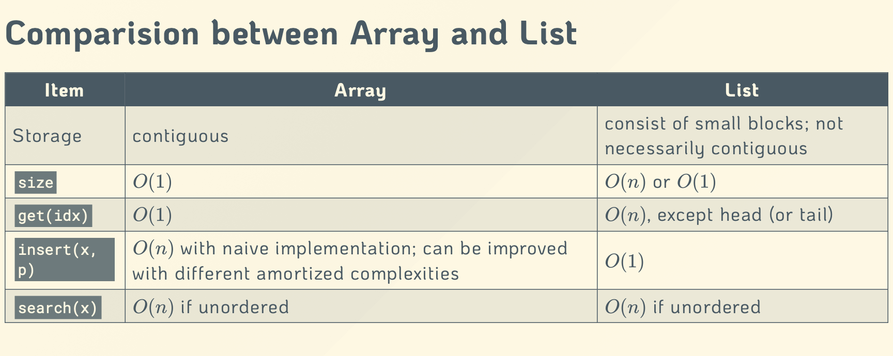

# Abstract Data Type(ADT)

## 简介

ADT，或抽象数据类型（Abstract Data Type），是一种计算机科学中的概念，用来描述数据和对数据操作的一系列规范。ADT 通过提供数据的抽象表示和对数据的操作定义，而不暴露数据的具体实现，使得数据结构的使用和实现可以分离。

### 核心概念

* **抽象**：ADT关注于数据的逻辑特性而不是数据的具体实现。例如，一个列表ADT定义了如何添加元素、删除元素、遍历元素等操作，但不指定这些操作是如何实现的。
* **封装**：ADT通过隐藏其内部结构的具体实现，只通过一组定义良好的接口与外界交互，实现了封装。这样，即使内部实现改变，只要接口保持不变，使用ADT的代码就不需要修改。
* **数据操作**：ADT定义了一组操作，这些操作是与ADT数据结构交互的唯一方式。这包括创建、修改、检索和删除数据等基本操作。

### 实现功能

* 存储数据
* 对数据的操作
* 错误操作的条件

### 常见的ADT示例

* **栈**（Stack）：一种后进先出（LIFO）的数据结构，常见操作有`push`（入栈）、`pop`（出栈）和`peek`（查看栈顶元素）。
* **队列**（Queue）：一种先进先出（FIFO）的数据结构，主要操作包括`enqueue`（入队）、`dequeue`（出队）和`front`（查看队首元素）。
* **列表**（List）：可以存储一序列元素的数据结构，允许添加、删除和访问元素。
* **树**（Tree）：模拟层次结构的数据结构，包括二叉树、平衡树等，常用于实现搜索和排序算法。
* **图**（Graph）：由节点（顶点）和边组成的集合，用于模拟实体之间的多对多关系。

### ADT的优势

* **抽象层次高**：用户只需了解接口的功能，无需关心具体实现细节。
* **可重用性**：同一个ADT可以有多种不同的实现，便于在不同场景下重用。
* **易于维护和修改**：修改ADT的内部实现不会影响到使用它的代码，使得程序更加模块化

## array 数组

### 数组的定义

* 数组是一种将索引集映射到单元格类型的数据结构。
* 通常，数组中的每个单元格（cell）大小相同。如果不相同，则使用指针。
* 数组的对象是一组连续存储的单元格。

### 数组的操作

* **创建数组**：`create(A, n, dtype)`用于创建数组，其中`A`是数组名，`n`是数组大小，`dtype`是数据类型。
* **获取元素**：`A.get(v, idx)`或`A[idx]`用于获取数组中的元素，其中`idx`是索引。
* **修改/设置元素**：`A.put(v, idx)`或`A[idx] = x`用于修改数组中的元素，或者转化数据类型
* **聚合**: sum, count, max, min, avg

### 多维数组

* 对于二维或更高维度的数组，需要将多维索引映射到一维空间。这是因为我们抽象主存储器和外部存储器为连续的一维空间。
* 典型的顺序是按维度从左到右排序，也称为字典顺序。

#### 通过一维数组操作二维数组

引入：为什么可以通过 `int *A = new int[nRow * nCol]` 创建一个一维数组，并使用 `A[i][j]` 的方式来操作它就好像一个二维数组一样？

答： 实际上是在连续的内存当中存储所有元素，通过计算索引，将一维数组的位置映射到二维数组空间中的行和列。索引的计算公式通常是 `index = i * nCol + j` ,其中 `i` 是行索引（即第几行）， `j` 是列索引（即第几列）， `nCol` 是一行的元素个数， 这样 `A[index]`就等价于二维数组中的 `A[i][j]`

### 特殊情况 

1. **空间填充曲线(SFC)**：如Z-order和希尔伯特曲线，这些是处理多维数据索引的特殊方法。
2. **稀疏数组**：特别是在矩阵或张量中使用，用于优化存储和计算效率，避免浪费空间存储大量的零值。


z curve

### 1D数组的其他操作

#### 聚合操作（Aggregation aggr(A)）

* **聚合操作**：这些操作包括计算数组的总和（sum）、计数（count）、最大值（max）、最小值（min）、平均值（avg）等。
* **函数签名**：聚合函数的典型签名为 [dtype]→dtype，表示输入一个数据类型的数组，返回同一数据类型的结果。

#### 实现依赖的方法（Implementation-dependent methods）

* **搜索（search(key)）**：在数组中搜索特定的键。
* **排序（sort()）**：对数组进行排序。
* **插入和删除（insert() and delete()）**：插入和删除数组中的元素（将在本讲座中讨论）。

#### 迭代（Iteration）

* **map** 和 **filter**：Python中的 `map` 和 `filter` 函数，用于对数组进行迭代和过滤操作。
* **列表推导式（list comprehension）**：Python中的列表推导式也是一种常用的迭代方法。

```python
string_numbers = ['1', '2', '3', '4', '5']
int_numbers = list(map(int, string_numbers)) # [1, 2, 3, 4, 5]
int_numbers = [int(s) for s in string_numbers] # using list comprehension
```


### 动态数组 dynamic array

#### 引入

对于一个数组来讲，他们是如何实现insert函数和delete函数

#### 分析

##### time complexity

`Insert`

* Best case: $O(1)$ 
* Worst case: $O(n)$
* Average case:  $\sum_{i = 0}^{n}\frac{1}{n+1}(c_{shift}(n-i)+c_{insert})$
  * While $\frac{1}{n+1}$ 是插入任意一个位置的概率
  * $c_{shift}$ 是移动一个元素的成本
  * $c_{insert}$ 是插入操作的固定成本（如增大数列空间
  * 计算之后大概是 $\frac{1}{2}c_{shift}n+c_{insert}$ ,时间复杂度为 $\theta(n)$​

`Delete`

 $O(n)$ ,similar to insert

##### space complexity

 $O(max)$ due to copy and paste to another array

###### strategy

* if maxsize is too large, space will be wasted
* if maxsize is too small, it is easy to be ran out of space

###### solution

* use a dynamic or growable array when there is limited insertion
* Else use a linked list 

#### 链表

链表（Linked List）是一种基础的数据结构，由一系列节点（Node）组成，每个节点包含两部分：数据域（data）和指向下一个节点的指针（next）。一般我们将他们定义为两个单独的类，如下

##### 分类

###### 单向链表

* 单向链表的特点是每个节点只指向下一个节点，而不指向前一个节点，因此只能从头节点开始逐个遍历节点，不能反向遍历。

* e.g.

```python
class Node:
    def __init__(self, data):
        self.data = data
        self.next = None

class LinkedList:
    def __init__(self):
        self.head = None

    def append(self, data):
        new_node = Node(data)
        if not self.head:
            self.head = new_node
            return
        last_node = self.head
        while last_node.next:
            last_node = last_node.next
        last_node.next = new_node

    def print_list(self):
        current_node = self.head
        while current_node:
            print(current_node.data)
            current_node = current_node.next
```


###### 双向链表

* 有分别指向下一个的指针node.next和前一个的指针node.prev
* 第一个节点的node.prev 和最后一个节点的node.next 都为null
* **问题：**找到head()很容易，但是要循环找tail()需要时间复杂度 $O(n)$ /或者提前定义好tail()，但是额外增加了复杂度
* 在循环中使用`insert`和`delete`有风险，会出问题。

###### 循环链表

* 最后一个节点会指向回开头
* 可以动态地保持空间的平衡
* 可以在结尾使用哨兵节点(sentinel)作为虚拟节点(dummy node)来连接头和尾，就无需检查空指针(NIL)的情况，但占据 $O(1)$ 的空间。如果是有很多小list的情况可能有影响。
* 思考有哨兵节点和没哨兵节点的区别

### array 和 list的区别



这里list指的是Linked list。对于insert(x,p)函数来讲，O(1)是指针已经指向要插入位置的节点了

## Stack 栈

### 定义

栈（Stack）是一种遵循后进先出（LIFO, Last In First Out）原则的数据结构。这意味着最后添加到栈中的元素会是第一个被移除的元素。栈通常支持两种主要操作：**压栈（push）**，即在栈顶添加一个元素；和**弹栈（pop）**，即移除栈顶元素。此外，许多栈实现还提供了**查看栈顶元素（peek 或 top）**的操作，但不移除它。

```python
class Stack:
    def __init__(self):
        self.items = []
    def push(self, item):
        self.items.append(item)
    def pop(self):
        return self.items.pop() if not self.is_empty() else None
    def peek(self):
        return self.items[-1] if not self.is_empty() else None
    def is_empty(self):
        return len(self.items) == 0
    def size(self):
        return len(self.items)
```

### 应用

* 网页浏览器的前进后退
* 文本编辑器的撤销，重做
* c++呼叫主从函数
* 小中大括号前半与后半的对应关系

#### **前缀/后缀表达式 Pre/Postfix Evaluator**

后缀表达式（也称为逆波兰表示法）和前缀表达式（也称为波兰表示法）是两种不同的方式来表示和计算数学表达式，它们都不需要使用括号来指定操作符的优先级。

- 前缀表达式：**操作符位于其操作数之前**。例如，表达式 `(3 + 4) * 5` 在前缀表示法中写作 `* + 3 4 5`。

  ```python
  def evaluate_prefix(expression):
      stack = []
      for token in reversed(expression.split()):
          if token in "+-*/":
              a, b = stack.pop(), stack.pop()  # 这里的顺序也很重要
              stack.append(str(eval(f"{a}{token}{b}")))  # 计算结果并推回栈中
          else:
              stack.append(token)  # 将数字推入栈中
      return int(stack.pop())
  ```

  

- 后缀表达式：**操作符位于其操作数之后**。例如，表达式 `(3 + 4) * 5` 在后缀表示法中写作 `3 4 + 5 *`。

  ```python
  def evaluate_postfix(expression):
      stack = []
      for token in expression.split():
          if token in "+-*/":
              b, a = stack.pop(), stack.pop()  # 注意非交换运算的顺序
              stack.append(str(eval(f"{a}{token}{b}")))  # 计算结果并推回栈中
          else:
              stack.append(token)  # 将数字推入栈中
      return int(stack.pop())
  ```

  

### **摊销时间 Amortized Time**

指在执行一系列操作时，**每个操作的平均时间成本**。这个概念在分析那些**偶尔需要大量时间但通常很快的操作**时特别有用。摊销分析的目的是展示即使单个操作可能昂贵，整个操作序列的平均成本仍然可以保持低。

- 其中增长策略的计算就用到了这个思想，到底是以常数 $c$​ 的增长速度增加还是每次翻倍增加
  - 常数 $c$​​ 增长速度，计算将 $n$ 个数推入栈（或者数组）的总时间 $T(n)$ 
    - 将 $n$ 个数分成 $k = \frac{n}{c}$ 份，那么总时间为 $T(n) = n + c+2c+3c+\cdots+kc = n+ck(k+1)/2$, 其中 $c,2c,3c$ 表示将 $ic$ 个元素( $i \in1,2,3,\cdots ,k$)复制到新数组所用的时间，最终我们有 $T(n)\approx O(n+k^2)$ i.e., $O(n^2)$​
    - thus, the amortized time of a push operation is $O(n)$
  - 翻倍增加
    - 将 $n$ 个数分成 $k = log_2 \ n $ 份，那么总时间为 $T(n) = n + 1+2+4+\cdots+2^k = n+2^{k+1} - 1 =2n-1$, 其中 $1,2,4 $ 表示将 $2^{k+1}$ 个元素( $i \in1,2,3,\cdots ,k$)复制到新数组所用的时间，最终我们有 $T(n)\approx O(n)$ 
    - thus, the amortized time of a push operation is $O(1)$ 

## Queue 队列

### Definition

**定义**：队列（Queue）是一种**先进先出**（FIFO, First-In-First-Out）的数据结构，用于存储对象，并按照元素进入队列的顺序进行**插入**enqueue()和**删除**dequeue()操作。在队列中，插入操作通常发生在队列的后端，而删除操作发生在队列的前端。

```python
class Queue:
    def __init__(self):
        self.items = []
    
    def enqueue(self, item):
        self.items.append(item)
    
    def dequeue(self):
        if not self.is_empty():
            return self.items.pop(0)
        else:
            raise Exception("EmptyQueueException")
    
    def front(self):
        if not self.is_empty():
            return self.items[0]
        else:
            raise Exception("EmptyQueueException")
    
    def size(self):
        return len(self.items)
    
    def is_empty(self):
        return len(self.items) == 0
```

### 应用

* 排队
* 等待队列(printer)

### 基于数组的队列


在描述循环序列的时候，通常会用'f'表示前端(front)，和'r'表示后端(rear)

**Q: 思考一下为什么size()的计算方式为(N+r-f) modN**

可以同时算出f在r前或者r后的情况。 


**Q: 这里为什么size() = N-1就要抛出fullqueueException了，而不是N** 

这里是为了区别队列的空状态和满状态，回看空状态的条件为r = f，如果储存N个元素的话，满状态的条件就和空状态相同了。

区分之后，我们有(r+1) mod N = f。

> [!note]
>
> 这里(r+1) mod N相当于取得r下一位的index。同理(f+1)mod N也是如此

#### 分析

**表现：**

* 空间复杂度为O(n)
* 每个操作的时间复杂度为O(1)

**局限:**

* 数组的最大值必须确定
* 队列满的时候插入元素(enqueue)会报错

### 基于可扩容的序列的队列

扩大操作

* 不断增大策略O(n)
* 翻倍策略O(1)

### 基于单项链表的队列

#### 时间复杂度

* 入队enqueue
  * 维护一个指向末端的指针，只需要O(1)
* 出队enqueue
  * O(1)
* 获取队列大小
  * O(n)
  * O(1)，如果维护一个计数器

#### 空间复杂度

* 节点O(n)
* 指针，每个需要O(1)

#### 优势

不会有序列组成的队列那样的容量限制，永远不会满

### 两端队列

#### 主要操作

* insertFirst()
* insertLast()
* RemoveFirst()
* RemoveLast()

#### 辅助操作

* First()
* Last()
* size()
* isEmpty()

#### 例外

空队列