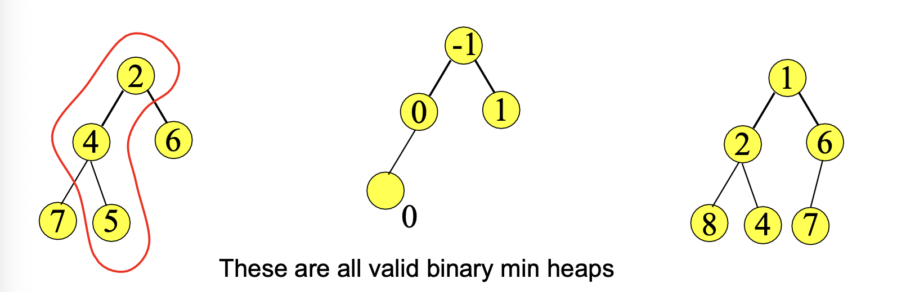
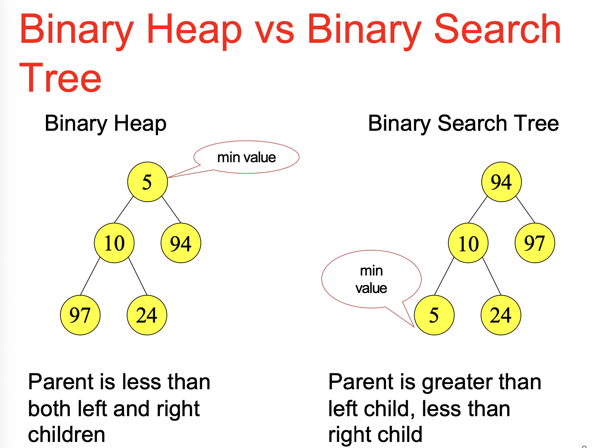
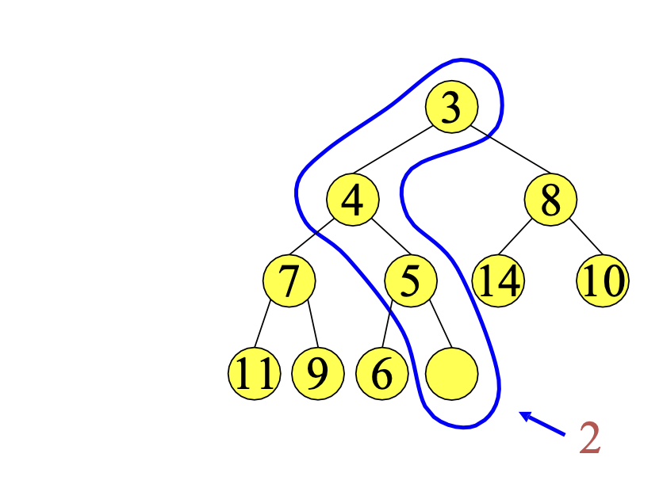
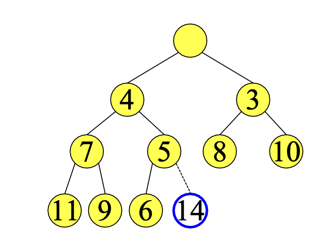
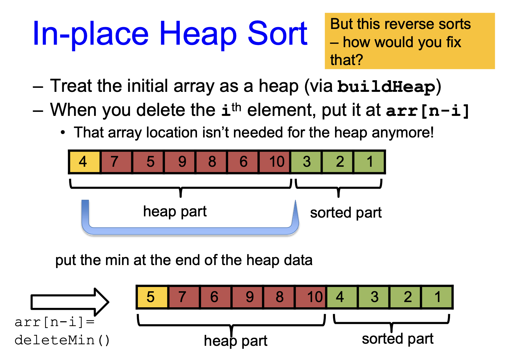

# Heap 堆

### Intro

我们回看一下FindMin函数，其实它在我们的生活中很常见。如

* 操作系统需要从优先度最高的任务开始做起而不是FIFO
* 找到成绩最高的学生，工资最高的员工等等

那么我们分析一下用其他的方法去实现它，它们在FindMin函数和Insert函数上分别表现如何

| method         | FindMin  | Insert   |
| -------------- | -------- | -------- |
| 有序序列       | O(1)     | O(n)     |
| 无序序列       | O(n)     | O(1)     |
| 平衡二叉搜索树 | O(log^N) | O(log^N) |
| Hash Table     | O(N)     | O(1)     |

> 这里解释一下二叉搜索树
>
> 1. **节点规则**：每个节点最多有两个子节点，称为左子节点和右子节点。
>
> 2. 键值规则
>
>    ：对于每个节点：
>
>    * 其左子树中的所有节点的键值都小于该节点的键值。
>    * 其右子树中的所有节点的键值都大于该节点的键值。
>
> 3. **子树规则**：每个子树也是一个二叉搜索树，即上述两个规则在每个子树上都同样适用。
>
> 4. **高度：** 没有严格的高度限制，树的高度取决于插入节点的顺序。如果插入顺序不当，树可能退化成链表，其高度为 $O(N)$ ，其中 $N$ 是节点数量。
>
> 而平衡二叉搜索树除了满足上述特点之外，它还通过某种机制保持树的平衡，确保左右子树的高度差比较小，所以它的高度严格控制在 $O(log^{N})$ 之内

<font color = '#3e9e02'>Hash Table 晚点再看吧</font>

我们可以发现<font color = '#e65529'>Binary Search Tree对FindMin和Insert函数都很高效，但我们只需要FindMin高效优先</font>

我们的目标是 FindMin O(1), Insert O(log N), DeleteMin O(log N),由此我们引入堆(heap)

### 定义

* **定义**：堆（Heap）是一种**特殊的完全二叉树**，它满足特定的堆属性：
  * 在最小堆中，每个节点的值都小于或等于其子节点的值；最小堆的根节点是树中的最小值
  * 而在最大堆中，每个节点的值都大于或等于其子节点的值。在最大堆中根节点是树中的最大值


堆通常用于实现优先队列，因为它可以有效地提供**最小或最大元素的访问**，并且可以在对数时间$log(n)$​​内插入新元素或删除最小（最大）元素

#### 注解

**完全二叉树**：除最后一层外，所有层的节点都是满的，且最后一层的节点尽可能靠左

> [!caution]
>
> 这里的二叉树和二叉搜索树是不一样的概念，需要区分。
>
> 二叉树只要求每个节点最多有两个子节点，并没有依据节点大小排序。因为堆只要求根节点为最小的，所以它根节点的子树互相之间是没有排序的



比如上面的例子，我们可以看到最小堆只要求每一层的节点大于父节点，但是每层之间的两个节点不做要求。所以他们都是有效的最小堆。



这张图片更形象一些

### 操作

值得注意的是，我们对堆进行操作的时候需要保证它为<font color = '#e65529'>完全二叉树</font>

#### Insert 插入

1. 将新元素推入至堆的末尾

2. 将其与父节点比较，若父节点较大则进行交换

3. 重复第二步得到最小堆

时间复杂度：$O(log⁡(n))$

在最坏的情况下，新元素可能需要从最底层一直上浮到根节点。由于堆是一个完全二叉树，树的高度是 $log⁡(n)$，所以上浮操作的最大次数是树的高度，即 $O(log⁡(n))$​。



#### Delete 删除

删除root节点

##### 错误示范

1. 比较左右字节点，较小的节点向上调
2. 重复第一步直到堆底

> 举下图来说，我们我们应该有3变为根节点然后8去到原来3的位置。但是这样就不满足完全二叉树的条件了

##### 正确

1. 将堆的最后一位，在这里是14，放到根节点处。
2. 比较左子节点和右子节点，将较小的节点往上调，
3. 重复第二步直到最后一位，在这里是14，放到了正确的位置。

逻辑其实跟insert函数的类似，时间复杂度： $O(log⁡(n))$​

同样地，在最坏的情况下，这个元素可能需要从根节点下沉到最底层。因此，下沉操作的最大次数也是树的高度 $log(n)$，即 $O(log(n))$​​​。



#### FindMin 输出最小值

时间复杂度： $O(1)$ 

#### Heapify 堆化

1. 从$1$到$N$逐个insert，要进行$n$次$O(log(n))$的操作，时间复杂度近似为$O(nlog(n))$

2. （数组）从$N/2$到$1$进行PercDown（下沉）操作，时间复杂度为$O(n)$​​

   > **时间复杂度分析**
   >
   > 假设 $N = 2^{(h+1)} - 1$​ 其中 $h$ 是树的高度。则$1$到$N/2$皆为非子节点。
   >
   > 对于$N/2$到$N$第$h$层皆为子叶点，无需进行下沉操作。
   >
   > 对于$1$到$h-1$层，第$h-j$层需要下沉$j$​次
   >
   > 公式为：
   > $$
   > T(n) = \sum_{j=0}^{h}j \cdot 2^{h-j}\\ 
   > = \sum_{j = 0}^{h}j\cdot 2^{\frac{h}{j}} = 2^{h}\sum_{j = 0}^{h}\frac{j}{2^j}\\ = 2^{h}(2-(h+2)(\frac{1}{2})^{n}) = 2^{h+1} - (h+2)
   > $$
   >  又因为 $n = 2^{h+1} - 1$ 
   > $$
   > T(n) = n - (h+1)
   > $$
   > <font color = '#3e9e02'>这里那个$\sum_{j=0}^{h}\frac{j}{2^{j}}$ 是高中的等差等比一起求和的那个问题，好久没用了</font>
   >
   > 则$T(n)=O(N)$

> [!note] 
>
> 这里相当于逐层分析需要下降操作的次数。比如倒数第二层h-1的所有节点，总数为 $2^{n-1}$​ 需要下降1次。
>
> 在二叉树中，层数也是从0开始数的，所以第n层才会有总共为 $2^n$​ 个节点

### 伪代码

```python
Root node = A[1]
Children of A[i] = A[2i], A[2i + 1]
Parent of A[j] = A[ j // 2 ]
# Keep track of current size N (number of nodes)

PercDown(i:integer, x: integer): {
# N is the number elements, i is the hole, x is the value to insert
Case{
    2i > N : A[i] := x; 						# at bottom, no child//
    2i = N : if A[2i] < x then					# one child//
    			A[i] := A[2i]; A[2i] := x;
    		 else A[i] := x;
    2i < N : if A[2i] < A[2i+1] then j := 2i;	# two children//
    		 else j := 2i+1;
   			 if A[j] < x then
  				A[i] := A[j]; PercDown(j,x);
   			 else A[i] := x;
}}


BuildHeap{
	for i = N/2 to 1
		PercDown(i,A[i])
}
```

相当于三种情况

1. 子节点不存在： 2i > N
2. 左子节点是末尾： 2i = N
3. 左右子节点都在： 2i < N

### 其他操作

#### Find(X, H)

在堆H中找到元素X， 时间复杂度为O(n)

#### FindMax(H)

在堆H种找到最大值，时间复杂度为O(n)

<font color = '#e65529'>我们牺牲了其他操作的表现来为找到最小值得到最好的表现</font> 

#### DecreaseKey(P, $\Delta$, H)

对处在最小堆H的节点P减去 $\Delta$ , 时间复杂度为O(logN)，即最坏情况需要从底层上浮到根节点。最大堆则相反

#### IncreaseKey(P, $\Delta$, H)

对处在最小堆H的节点P加上 $\Delta$ , 时间复杂度为O(logN)，即最坏情况需要从根节点下沉到最底层。最大堆则相反

#### Delete(P, H)

删除在堆H中P位置的节点，时间复杂度为O(logN)

#### Merge(H1, H2)

融合两个堆H1， H2。他们分别装在两个序列里

**方法一：**用insert函数O(logN)，做n次insert操作O(N)，把H2中的每个值insert进H1，时间复杂度为O(NlogN)

**方法二：** 用将H2的值复制到H1中，再用heapify（堆化），时间复杂度为O(N)

### Heap Sort

用堆来排序。先将给定的序列堆化之后每次把最小的值返回得到从小到大的序列。

```
E[] input = buildHeap(...)
E[] output = new E[n]
for (int i=0,i < n, i++)
{
	output[i] = deleteMin(input)
}
```

#### 时间复杂度

最优情况：O(nlogn)

最坏情况：O(nlogn)

平均情况：O(nlogn)

<font color = '#3e9e02'>这里为啥最优情况也是O(nlogn)还不是很明白，晚点再看</font>

#### 稳定

no，因为堆化设计多次的元素交换，当出现多个相等的数字的时候，尽管数值相等，但他们的位置也还是会发生变化

#### 原地排序

no，但是可以通过一点变换得到

### 原地heap sort



将整个数组分为排好和没排好的部分。每次将排好的输出出来的时候与堆的最后一个元素交换。最后将数组反过来就好啦

### AVL sort？Hash Sort？

<font color = '#3e9e02'>先不管了，应该不考的</font>

