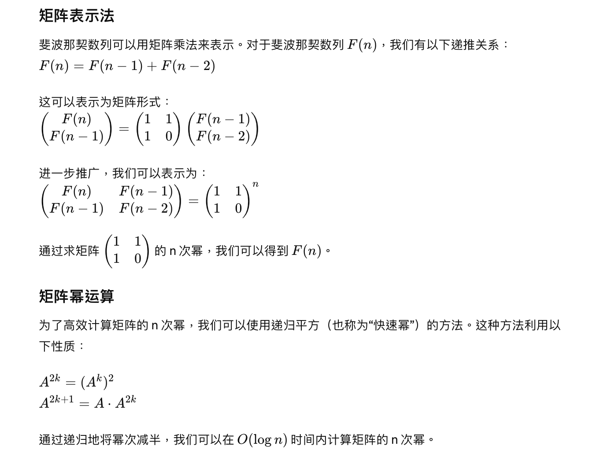
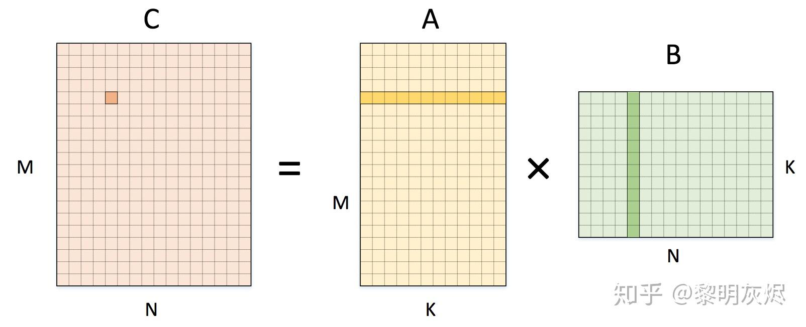

# Divide and Conquer

### 核心概念

**定义**："**分而治之**"（Divide and Conquer）是一种算法设计策略，它将一个复杂的问题分解成几个较小的子问题，每个子问题类似于原问题但规模更小，然后逐个解决这些子问题，并最终将子问题的解合并以得到原问题的解。

1. **分解（Divide）**将大问题分成很多个小问题
2. **递归排序（Recursively Sort）**将小问题用递归的方式来解决
3. **合并（Merge）**将他们组合在一起成为解决方法

### Intro

在这一章节，我们会从问题出发，来看看这个概念的应用。主要有5个部分

1. Binary search
2. Powering a number
3. Fibonacci numbers
4. Matrix multiplication
5. Strassen's algorithm 


------

## Merge Sort（归并排序）

### 定义

**定义**：归并排序是一种高效的排序算法，采用**分治法**的一个典型应用。它将一个列表分成最小可能的单元（通常是一个元素），然后将它们合并成两个有序的序列，最后再将这两个有序序列合并成一个最终的排序序列。

### 基本步骤

1. **分解（Divide）**：将数组从中间分成两半。
2. **递归排序（Recursively Sort）**：对每一半分别进行归并排序。
3. **合并（Merge）**：将两个已排序的子数组合并成一个有序的数组。

### 代码实现

```python
def merge_sort(arr):
    if len(arr) > 1:
        # 分解
        mid = len(arr) // 2
        left_half = arr[:mid]
        right_half = arr[mid:]

        # 递归排序
        merge_sort(left_half)
        merge_sort(right_half)

        # 合并直到某一半已经合并完
        i = j = k = 0
        while i < len(left_half) and j < len(right_half):
            if left_half[i] < right_half[j]:
                arr[k] = left_half[i]
                i += 1
            else:
                arr[k] = right_half[j]
                j += 1
            k += 1

        # 处理剩余元素
        while i < len(left_half):
            arr[k] = left_half[i]
            i += 1
            k += 1

        while j < len(right_half):
            arr[k] = right_half[j]
            j += 1
            k += 1
```

### 时间复杂度

1. 分解阶段：在每一层递归调用中，数组被分成两半。这意味着递归的深度2是 $O(log⁡n)$，因为每次分解操作都将数据集大小减半，直到大小变为1。因此，可以将数组分解成最小单元的操作次数表示为 $O(log⁡n)$​。
2. 合并阶段：对于每一层递归调用，需要将两个有序的数组合并成一个有序数组。不论数组的初始状态如何，这个合并操作的时间复杂度都是 $O(n)$​，因为每个元素最终都需要被比较和移动至其正确的位置。
3. 总和：$O(nlogn)$​

- 分治类型的时间复杂度：$T(n)=2T(n/2)+\theta(n)$​
  * $T(\frac{n}{2})$​ 代表一半的时间复杂度。
  * 2代表两个子问题
  * $\Theta(n)$​​ 代表分解和合并所用的时间


为了能够得到这个方程的解，我们引入**主定理**


### 主定理 Master Theorem

- **定义**：用来分析某些特定类型的**递归算法的**运行时间的一种方法，为具有特定形式的递归关系提供了一种快速解决时间复杂度的技术

- **公式**：$T(n)=aT(\frac{n}{b})+O(n^d)$

  1. $T(n)$ 是解决大小为 $n$ 的问题所需的时间。
  2. $a$ 是每次递归产生的子问题数量。
  3. $\frac{n}{b}$ 是每个子问题的大小，$b$ 是分割因子。
  4. $O(n^d)$​​ 是每次递归在分解和合并步骤中所需的时间。

- **解析**：Total work $= \sum_{i=0}^{\log_b n} O(n^d) \left(\frac{a}{b^d}\right)^i$ 等比数列且公比为$\frac{a}{b^d}$

  > 1. 公比$>1$ :整个算法的时间复杂度由第一项决定，结果为$O(n^{d})$
  > 2. 公比$<1$ :整个算法的时间复杂度由最后一项决定，结果为$O(n^{log_ba})$​
  > 3. 公比$=1$ :整个算法的时间复杂度求和，结果为$O(n^{d}log_bn)$

<font color = '#3e9e02'>感觉有点怪怪的，先不管它</font>

## 二分查找 Binary Search

### 定义

二分查找用于在一个有序的项目列表中查找特定项目。它通过重复地将可能包含目标项的列表部分一分为二，直到将可能的位置缩小到只有一个为止。

### 基本步骤

1. **分解（Divide）**：
   * 在二分查找中，“分解”步骤是通过检查当前范围的中间元素来完成的。将当前数组范围一分为二，以中间元素为基准，比较目标值与中间元素的大小。
   * 如果目标值等于中间元素，则查找成功，返回该元素的索引。
   * 如果目标值小于中间元素，则目标值在左半部分，接下来只需在左半部分继续查找。
   * 如果目标值大于中间元素，则目标值在右半部分，接下来只需在右半部分继续查找。
2. **解决（Conquer）**：
   * “解决”步骤是递归地在分解后的一半数组中继续执行二分查找。如果目标值在左半部分，递归地对左半部分数组执行二分查找；如果目标值在右半部分，递归地对右半部分数组执行二分查找。
   * 每次递归调用都会将问题规模减少一半，直到找到目标值或数组范围为空。
3. **合并（Combine）**：
   * 对于二分查找，合并步骤是微不足道的，因为每次查找不需要合并中间结果。查找操作只需返回找到的索引或者表示未找到的结果（例如 -1）。

### 代码实现

```python
def binary_search(arr, target):
    """
    二分搜索
    :param arr: 有序数组
    :param target: 需要搜索的目标值
    :return: 目标值在数组中的索引，如果不存在则返回-1
    """
    low = 0  # 设置最低索引为数组起始位置
    high = len(arr) - 1  # 设置最高索引为数组的最后一个元素的位置

    while low <= high:  # 当最低索引不大于最高索引时
        mid = (low + high) // 2  # 计算中间索引
        guess = arr[mid]  # 获取中间索引对应的值
        if guess == target:  # 如果猜测值等于目标值，返回中间索引
            return mid
        if guess > target:  # 如果猜测值大于目标值，调整最高索引为中间索引的前一个位置
            high = mid - 1
        else:  # 如果猜测值小于目标值，调整最低索引为中间索引的后一个位置
            low = mid + 1
    return -1  # 如果未找到目标值，返回-1
```

### 时间复杂度

$O(n)=(logn)$​​

运用主定理，我们有 $T(n) = 1T(\frac{n}{2})+\Theta(1)$​ 

## 乘方运算

### Intro

计算 $a^n$， 其中 $n\in N$ 

### 基本步骤

#### 直观

直接从0循环到n，每次乘自己， 时间复杂度 $\Theta(n)$​

#### 分而治之

1. **分解：** 如果n是偶数  $a^n = a^{\frac{n}{2}}\cdot a^{\frac{n}{2}}$
         如果n是基数 $a^n = a^{\frac{n-1}{2}}\cdot a^{\frac{n-1}{2}}\cdot a$ 
2. **递归：** 对每一部分循环函数
3. **合并：** 最后求和

### 时间复杂度

 $\Theta(lg \ n)$, 运用主定理，我们有 $T(n) = T(\frac{n}{2})+\Theta(1)$​ 

## 计算斐波那契数列

### 基本步骤

#### 方法1:Bottom-up（自底向上）

直接由定义出发，依次相加得到每一项 $F_1,F_2,F_3\cdots F_n$​

* 运行时间是线性的 $O(n)$ 

#### 方法2:Naive recursive squaring（朴素递归平方）

利用公式 $F_n = \frac{\phi^n}{\sqrt{5}}$ 来计算第n项，其中 $\phi$​ 是黄金分割比例（1.61803）

问题就变成求黄金分割率的n次方，由上可知为 $\Theta(lg \ n)$ 

* 运行时间 $O(log\ n)$ 
* 不太可靠，浮点数计算容易产生误差

#### 方法3:Recursive squaring(矩阵表示法)




#### 方法4:matrix

$$
c_{ij} = \sum_{k = 1}^{n}a_{ik}\cdot b_{kj}
$$

while i denote the row and j denote the column in c, similar for a and b

so it is the sum of every number in the row i for a and every number in the column j in b multiply together




 $o(n^3)$​ while i,j,k both iterate from 1 to n

how to try to improve it?(have a try in divide and conquer)

#### 方法五：divide and conquer

**分而治之方法**：直接递归计算斐波那契数列，时间复杂度为 O(2n)，使用动态规划后降为 O(n)

#### 方法六：Strassen's idea

利用矩阵快速幂计算斐波那契数列，时间复杂度为O(log n) 

<font color = '#3e9e02'>方法四五六不懂一点</font>


### 小知识点

#### Declarative programming(声明式编程)

只告诉你想要的结果(what)，不理会过程，让机器自己摸索(how)

##### e.g.

打车，只管目的地，不管怎么去，类似vector

#### Imperative programming(命令式编程)

详细告诉机器怎么去做(how)

##### e.g.

打车告诉司机怎么走

## **Karatsuba 算法**

- **定义**：Karatsuba算法是一种快速乘法算法，用于大数的乘法，由安纳托利·卡拉次巴*Anatolii Alexeevitch Karatsuba*在1960年发明。它是基于分治法的原理，通过减少大数乘法问题所需的基本乘法运算次数来提高效率。

- **算法原理**：

  > **原乘法**：两个长度为$n$的大数相乘，$X$每一位对$Y$乘后相加，总时间复杂度为$O(n^2)$
  >
  > **改良**：将$X$和$Y$分成两个部分：$X = 10^{\frac{n}{2}} * A + B$ 以及 $Y = 10^{\frac{n}{2}} * C + D$ ，$a$和$b$是$X$的高位和低位部分，$c$和$d$是$Y$​的高位和低位部分。
  >
  > 传统算法通过计算四个乘积：$ab,cd,ac,bd$，并将其处理后求和，*Karatsuba*则使用三个乘积：
  >
  > 1. 计算$ac$
  > 2. 计算$bd$
  > 3. 计算$(a+b) \times (c+d)$（这实际上等于$ac + ad + bc + bd$​）
  > 4. $X \times Y = 10^n \cdot ac + 10^{n/2} \times [(a+b) \times (c+d) - ac - bd] + bd$

- **代码实现**：

  ```python
  def karatsuba(x, y):
      if x < 10 or y < 10:
          return x * y
  
      # 计算大小
      n = max(len(str(x)), len(str(y)))
      half = n // 2
      
      # 分割输入数字
      a = x // 10**(half)
      b = x % 10**(half)
      c = y // 10**(half)
      d = y % 10**(half)
      
      # 递归计算
      ac = karatsuba(a, c)
      bd = karatsuba(b, d)
      ad_plus_bc = karatsuba(a + b, c + d) - ac - bd
      
      # 合并结果
      product = ac * 10**(2*half) + (ad_plus_bc * 10**half) + bd
  
      return product
  ```

- **时间复杂度**：$O(n^{log_2 3})$或约为$O(n^{1.585})$ 

## **快速排序 Quicksort**

### 定义

快速排序是一种高效的排序算法，由Tony Hoare在1960年代初提出。它使用**分治法**（Divide and Conquer）的策略来对一个数组进行排序，其核心思想是通过一个分区操作将要排序的数组分割成独立的两部分，其中一部分的所有数据都比另一部分的所有数据都要小，然后再递归地对这两部分数据分别进行快速排序。

### 基本步骤

1. **选择基准值（Pivot）**：从数组中选择一个元素作为基准值。基准值的选择可以有多种方式，例如选择第一个元素、最后一个元素、中间元素或随机元素。
2. **分区（Partition）**：重新排列数组，使得所有比基准值小的元素都移动到基准值的前面，所有比基准值大的元素都移动到基准值的后面。这一步结束时，基准值就处于其最终位置。
3. **递归排序**：递归地对基准值前后的两个子数组进行快速排序。

### 代码实现

#### 简单方法

1. 取数列的第一位作为基准值
2. 对于比基准值小的部分，从第二数循环到最后找到符合的元素，
3. 对于比基准值小的部分，同理
4. 返回比基准值小的部分递归+基准值+比基准值小的部分递归

```python
# Simple way
def quicksort(arr):
    if len(arr) <= 1:
        return arr
    else:
        pivot = arr[0]
        left = [x for x in arr[1:] if x <= pivot]
        right = [x for x in arr[1:] if x > pivot]
        return quicksort(left) + [pivot] + quicksort(right)
```
#### 原地排序

1. 定义两个函数， quicksort()作为主体，partition()负责将数列分成高低两部分再返还基准值的位置
2. 后将高低两部分分别递归

**partition()函数**

1. 选择数列的最后一个元素作为基准

2. 从数列的第一项一直循环到最后一项
3. 如果比基准值小，就和i+1交换

<font color = '#3e9e02'>至于为什么i被初始化为low-1,可以看看对应的代码注释</font>

```py
# In-place way 原地排序的方法 空间复杂度优化
def quicksort(arr, low, high):
    if low < high:
        # partitionIndex是分区操作正确放置基准值的索引位置
        partitionIndex = partition(arr, low, high)

        # 分别对基准值左右两边的子数组递归排序
        quicksort(arr, low, partitionIndex - 1)
        quicksort(arr, partitionIndex + 1, high)

def partition(arr, low, high):
    pivot = arr[high]  # 选择最后一个元素作为基准
    i = low - 1  # i是小于基准值元素的最后一个元素的索引，因为每次都要+1，所以初始化为-1
    				# 或者可以初始化为low(或者说0)，每次换完位置之后再+1，最后return i就好，一样的

    for j in range(low, high):
        # 当前元素小于或等于基准值
        if arr[j] <= pivot:
            i += 1
            arr[i], arr[j] = arr[j], arr[i]

    # 将基准值移动到正确的位置
    arr[i+1], arr[high] = arr[high], arr[i+1]
    return i + 1
```

### 时间复杂度分析

- **最好情况**：如果每次都能将数组分为两个几乎相等的部分，那么快速排序的时间复杂度为$\Theta(n \log n)$

  **公式**：$T(n) = 2T(n/2) + \Theta(n)$

  其中，$T(n/2)$表示对半分的子数组排序的时间，$(\Theta(n))$表示分区操作的时间。

- **最坏情况**：如果每次分区操作后，一个子数组包含了除基准元素外的所有元素，那么快速排序的时间复杂度退化为$(O(n^2))$。

  **公式**：$T(n) = T(n-1) + \Theta(n)$

  这种情况通常发生在数组已经是正序或逆序的情况下。

- **平均情况**：考虑到所有可能的分区方式，快速排序的平均时间复杂度也是$(O(n \log n))$​。

  - <font color = '#3e9e02'>课件里面有一大堆的计算，感兴趣可以看看</font>


## 快速搜索 Quick Select

<font color = '#3e9e02'>这跟quick sort是一个东西吗</font>

- **定义**：Quick Select 是一种在未排序的列表中找到第 k 小（或第 k 大）元素的算法。它是由 Tony Hoare 于1961年提出，同样也是快速排序算法的发明者。Quick Select 的工作原理与快速排序相似，但它仅递归地处理找到第 k 个元素所需的那一部分数组，而不是像快速排序那样处理整个数组。这使得它在找到特定顺序元素方面比完全排序整个数组更高效。

- **原理**：

  > 1. **选择一个枢纽（Pivot）元素**：从数组中选择一个元素作为枢纽。
  > 2. **分区（Partitioning）**：重新排列数组，使得所有比枢纽小的元素都移到枢纽的左边，所有比枢纽大的元素都移到枢纽的右边。枢纽元素现在在其最终位置上。
  > 3. 递归选择：
  >    - 如果枢纽元素正好是第 $k$ 小的元素，算法结束。
  >    - 如果枢纽元素的位置大于 $k$，那么只在枢纽的左边数组中递归地执行 Quick Select。
  >    - 如果枢纽元素的位置小于 $k$，那么只在枢纽的右边数组中递归地执行 Quick Select，调整 $k$ 的值为 -$k - (枢纽的位置 + 1)$。

- **代码实现**：

  ```py
  def quick_select(arr, left, right, k):
      """
      找到数组 arr 中第 k 小的元素。
      :param arr: 输入的数组
      :param left: 考虑数组的起始索引
      :param right: 考虑数组的结束索引
      :param k: 找到的元素的顺序（第k小的元素）
      :return: 第 k 小的元素
      """
      if left <= right:
          # 进行分区
          pivot_index = partition(arr, left, right)
          # 如果 pivot 正好是第k小的元素
          if pivot_index == k:
              return arr[pivot_index]
          elif pivot_index < k:
              # 在右侧寻找
              return quick_select(arr, pivot_index + 1, right, k)
          else:
              # 在左侧寻找
              return quick_select(arr, left, pivot_index - 1, k)
      return -1  # 如果 k 超出范围
  
  def partition(arr, left, right):
      """
      以最右侧的元素作为枢纽进行分区，并返回枢纽的索引。
      :param arr: 输入的数组
      :param left: 考虑数组的起始索引
      :param right: 考虑数组的结束索引
      :return: 枢纽的索引
      """
      pivot = arr[right]
      i = left
      for j in range(left, right):
          if arr[j] < pivot:
              arr[i], arr[j] = arr[j], arr[i]
              i += 1
      arr[i], arr[right] = arr[right], arr[i]  # 将枢纽放到最终位置
      return i
  ```

- **复杂度**：

  > **平均时间复杂度**：$O(n)$，其中 n 是数组的大小。
  >
  > **最坏情况时间复杂度**：$O(n²)$，这发生在每次分区操作都极度不平衡时。
  >
  > **空间复杂度**：$O(1)$（迭代实现）或 $O(log(n))$（递归实现，因为递归调用堆栈）。


------


### bubble sort(冒泡排序)

因为越小的数字会逐渐到数列的开头就像泡泡浮上来所以得名

#### 原理

从数列的第一位到最后，将自己与下一位进行比较，如果比下一位大，就互换位置

#### 循环次数

循环一次就将该数列最大的数放到最后

当数列有n个数的时候，最坏情况就是循环n次把所有放好，或者n-1次（最后一次都放好了没必要）

#### 伪代码

```python
for i=1 to n-1:
	for j = 1 to n-i:
    if A[j + 1] < A[j]:
      swap(j+1 and j)
```

##### 整体思想

每循环一次把一个最大放最后，对数列里的每个数都这么做就好

##### 为什么是n-1呢？

对于第i次循环开始时，也就是你已经放好了i-1个最大的数在数列的最后，那么数列剩下没有排列好的数就有n-(i-1)个

对于这n-(i-1)个元素，我们就循环n-(i-1)-1次（最后一次不循环是因为1.循环一次比较两个数，n-1次就可以完成所有。2.最后一次会数组越界）

#### 优化

按照上述方法，我们最后得到的 $\theta(n^2)$ ，有没有可能更快呢

##### if statement

如果本身是好的，就不需要重新排列那就是 $\theta (n)$, 但是属于非常特别的最优情况

##### check

如果已经有一部分排列好了，那么我们检查出已经排好序了就可以结束循环

用和if statement同样的办法，我们就可以解决，如果这个循环没有换位置，那么就是排好了就可以break

* 在比较大的程度上优化了算法

