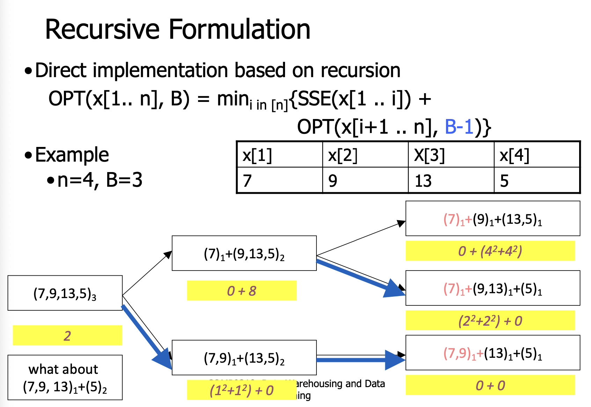
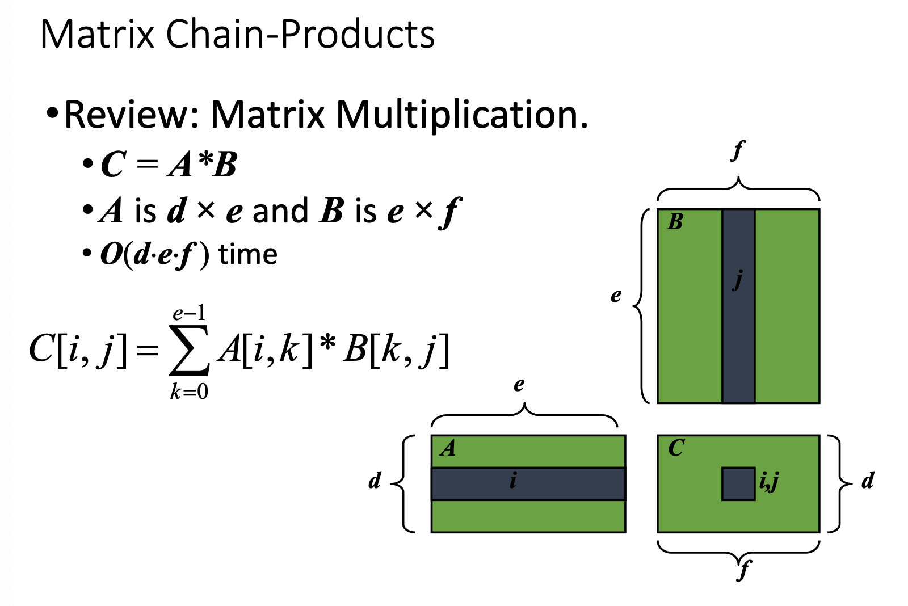
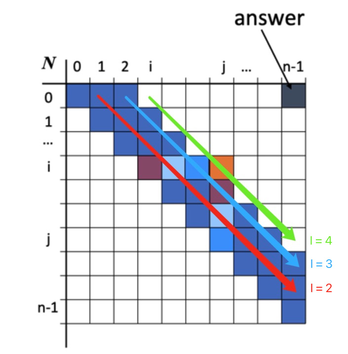
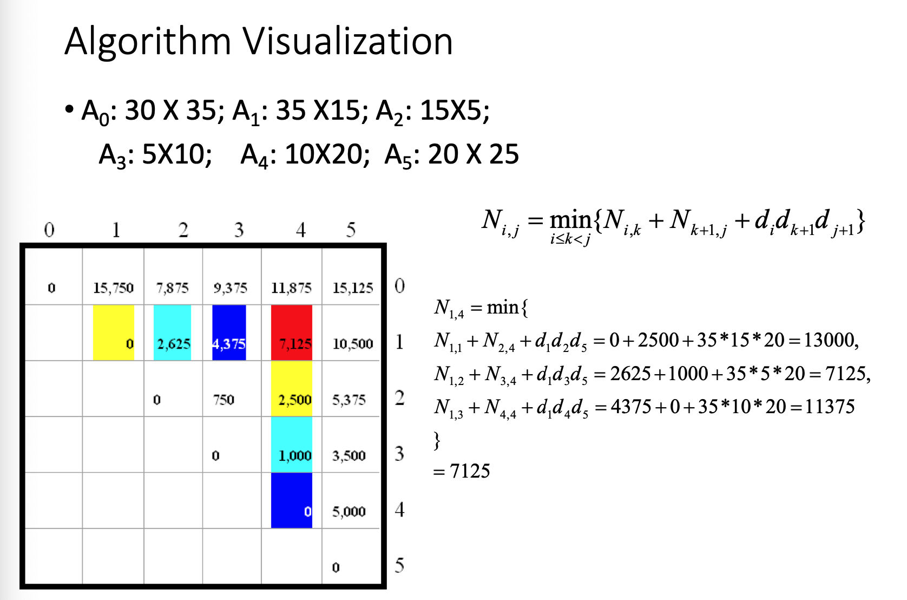
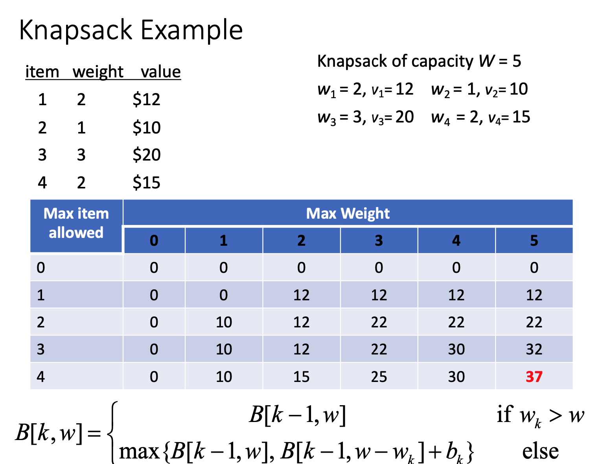

# 动态规划 Dynamic Programming

### 引入

在计算斐波那契数列的那个问题上，我们发现递归算法的问题在于，它不断递归的过程中，需要反复计算某些值。这浪费了很多的时间和空间。如果我们能够把这些值记录下来，等到程序需要的时候，再通过查找来得到答案，就可以优化这部分的时间。因此我们引入Dynamic Programming。

### 定义

动态规划（Dynamic Programming，简称 DP）是一种算法设计方法，它将复杂问题分解为简单的子问题，并用这些子问题的解来构建原问题的解。动态规划通常用于**优化递归算法**，特别是在递归过程中有大量重复计算时。动态规划的核心思想是**记忆化（Memorization）**与**表格化（Tabulation）**，这两种技术都是为了存储子问题的解以避免重复计算。

DP一般用于计算最大或者最小。可以讲是用空间换时间。和分而治之有点类似，DP将大问题分成小问题，但是区别在于这些小问题不是独立的，而可能共享小小问题。

### 经典问题

* 最优分箱问题(optimal binning problem)
* 矩阵链接优化(matrix chaining optimization)
* 0-1背包问题(0-1 knapsack problem)
* 最长相同子序列(longest common subsequence)
* 有向图的传递闭包(transitive closure of a direct graph)<font color = '#3e9e02'>这个翻译的很怪，不知道真实叫什么</font> 

## 最优分箱问题 Optimal Binning Problem

- **定义**：最优分箱问题（Optimal Binning Problem），这是一个数据分箱（binning）或数据离散化的统计方法。数据分箱通常用于将连续变量转换为分类变量，或者创建数据的分段分布。目标是选择这些区间的边界，以最小化某种损失函数，通常是各区间内部值的总方差。这在统计学中是减少模型过拟合、处理异常值、改善模型性能等方面有很多应用。
- **基本概念**：
  1. **元素（n elements）**：你有一个包含 n 个连续值的数据集。
  2. **分箱（B bins）**：将数据集分割成 B 个连续的段，每个段称为一个箱子。
  3. **代表性（Represent each segment）**：用箱子中所有值的平均值来代表该箱子。

- **成本函数**

  - **单个箱子的成本**：对于每个箱子，成本计算为箱子中所有元素的平方误差和（**SSE**: Sum Square Error）。这是每个元素的值和箱内平均值差的平方的总和。平方误差和是一种常用的度量方法，用来评估数据点与某个中心点（在这种情况下是平均值）之间的差异。

    $cost(bin) = \sum_{i=l}^{m} (x_i - \bar{x})^2$   (其中 $\bar{x}$ 是箱子中所有元素的平均值)

  - **所有箱子的总成本**：将每个箱子的成本相加，得到所有 B 个箱子的总成本。

$$
OPT(x[1..n], B) = \min_{i \in [n]} \{SSE(x[1..i]) + OPT(x[i+1..n], B-1)\}
$$



<font color = '#3e9e02'>终于看懂这张ppt了，太不容易了，还得是gpt4o</font> 

就是对于每一个黑色小方格，我们有(7,9,13,5)_3，这里3是指要把这个数据集分成3份，以此类推

对于每个黄色小方块里面的数字，其实是依照OPT的公式写下来的。

1. 对于`(7,9,13,5)3`，因为还没有分箱子，所以min部分为0，而OPT的结果经过递归后返回来的就是2，所以这里只有一个2。我们将整个数据集递归。
2. 对于`(7)1 +(9,13,5)2`, 我们有7在一个箱子里，9，13，5在另一个箱子里，那么我们就算出7的SSE为0。因为分箱子的数量不为3，所以将9，13，5递归。递归回来之后的答案为8，所以就有 `0+8` 
3. 对于`(7)1+(9)1+(13,5)1`, 因为我们将9，13，5递归，而且分箱子数量不为3，所以衍生出两种小分法。
   1. `(9)1+(13,5)1:` 计算9的SSE，为0。因为分箱子的数量满足3，所以我们要直接算(13，5)的SSE，为 $4^{2}+4^{2} = 32$ 
   2. `(9, 13)1+(5)1:`计算(9,13)1的SSE，为 $2^{2}+2^{2} = 8$。同时因为分箱子的数量已经达到上限，所以我们还要算(5)1的SSE，为0。因为至此为止，递归完成，我们比较两种小情况的值，可以发现最小为8，所以我们返回8到最表层
4. 对于`(7,9)1+(13,5)2:`同理

## 矩阵链接优化

### 定义

假设有一系列矩阵 $(A_1, A_2, \dots, A_n)$，其中每个矩阵 $(A_i)$ 的维度为 $(p_{i-1} \times p_i)$​​​。问题是如何确定乘法的顺序，使得总的标量乘法次数最小。

比如我们有 B:3x100 C:100x5 D:5x5

(BxC)xD = 3x100x5 + 3x5x5 = 1575

(CxD)xB = 3x100x5+ 100x5x5 = 4000

### 复习矩阵乘法

在这里我们复习一下矩阵乘法



如上图， 矩阵A*B得到矩阵C。C中的每个元素都是由A的行与B的列上的每一个元素分别相乘得到的。比如说
$$
C[i,j] = \sum_{k=0}^{e-1}A[i,k]*B[k,j]
$$
所以矩阵乘法有如下性质

1. 矩阵乘法的顺序是不能换的
2. 而且矩阵A的列数与矩阵B的行数e必须是相等的
3. 每两个矩阵乘法的标量运算量为 $d*f*e$

### 方法1: 枚举法 Enumeration Approach

#### 定义

尝试所有可能的括号方法，计算他们对应的标量运算量，然后选择最优解

#### 分析

所有可能的括号方法相当于n个节点的二叉树的形态数目（把一个父节点看成子节点的乘积），这个数目可以有卡特兰数(Catalan number)给出，有公式 $C_{n} = \frac{1}{n+1}(\frac{2n}{n})$ ，几乎可以达到 $4^{n}$ ，很糟糕。

### 方法2: 贪心算法 Greedy Approach

#### 定义

反复地选择最小的标量运算量的操作

#### 反例

A:101x11

B:11x9

C:9x100

D:100x99

AxB = 10000, BxC = 9900, CxD = 89100 按照贪心算法，我们应该有Ax((BxC)xD) = 228789

但是如果我们采用(AxB)x(CxD),我们有189090，会更少，显然，贪心算法不一定会给我们带来最优解

### 方法3:dp

矩阵链接优化问题（Matrix Chain Multiplication Problem）是一个经典的动态规划问题，旨在找到一种最优的矩阵乘法次序，以最小化标量乘法的总次数。

#### 状态定义

令 $( m[i][j] )$ 表示将矩阵链 $( A_i )$ 到 $( A_j )$ 相乘所需的最小标量乘法次数。

#### 递推关系：

为了计算 $m[i][j]$，需要找到一个分割点 $k$，使得：
$$
[ m[i][j] = \min_{i \leq k < j} \{ m[i][k] + m[k+1][j] + p_{i-1} \cdot p_k \cdot p_j \} ]
$$
其中，$m[i][k]$ 表示计算矩阵 $A_i$ 到 $A_k$ 的最小乘法次数，$m[k+1][j]$ 表示计算矩阵 $A_{k+1}$ 到 $A_j$ 的最小乘法次数，而 $p_{i-1} \cdot p_k \cdot p_j$ 表示将两个结果矩阵相乘所需的乘法次数。

#### 初始条件

- 当 $i = j$ 时，$m[i][i] = 0$，因为只有一个矩阵，不需要进行任何乘法。

#### 算法实现

1. 创建一个二维数组 $m$ 来存储最小乘法次数。
2. 创建一个二维数组 $s$ 来存储最优分割点。
3. 填充二维数组 $m$ 和 $s$。
4. 使用数组 $s$ 中的信息构造最优的乘法次序。

#### 算法伪代码

```python
def matrix_chain_order(p):
    n = len(p) - 1
    m = [[0 for _ in range(n)] for _ in range(n)]
    s = [[0 for _ in range(n)] for _ in range(n)]

    for l in range(2, n+1): # 从长度2一直算到长度n的情况
        for i in range(n-l+1): # i为头，l为长度，j为尾
            j = i + l - 1
            m[i][j] = float('inf') # 一开始设置为无限大
            for k in range(i, j): 
                q = m[i][k] + m[k+1][j] + p[i] * p[k+1] * p[j+1]
                if q < m[i][j]: # 如果发现比目前小的， 更新m和s
                    m[i][j] = q
                    s[i][j] = k
    return m, s
```

算法输出两个数组 $m$ 和 $s$：

- $m[i][j]$ 表示从矩阵 $A_i$ 到 $A_j$ 的最小乘法次数。
- $s[i][j]$ 存储最优分割点，构造最优乘法次序。

利用这些信息，我们可以得到最优的矩阵乘法次序，使得计算量最小。

使用动态规划（DP）解决矩阵链乘法问题的时间复杂度可以通过分析算法的主要步骤来确定。我们来一步一步地计算这个算法的时间复杂度：

### 算法步骤分析

1. **初始化**: 创建大小为 $n \times n$ 的两个二维数组 $m$ 和 $s$，用于存储最小乘法次数和分割点。这一步的时间复杂度是 $O(n^2)$，因为需要为每个数组元素赋初值。

2. **填充数组**:
   - **外层循环**: 这个循环控制链的长度 $l$，从 $2$ 到 $n$，共 $n-1$ 次迭代。因为乘积运算最小为2
   - **中层循环**: 这个循环遍历所有可能的起点 $i$， $j$ 为对应的终点，因为终点最大为 $n$, 对于每个链的长度 $l$，所以 $i$ 的可能值从 $1$ 到 $n-l+1$。比如说当 $n = 5$, $l= 3$时，那么中层循环相当于查找0-5中长度为3的数据([0,1,2],[1,2,3],[2,3,4],[3,4,5])
   - **内层循环**: 这个循环找到最优的分割点 $k$，对于每对 $i$ 和 $j$，$k$ 的可能值从 $i$ 到 $j-1$，因此平均情况下有 $l/2$​ 次迭代。


### 图片理解

#### 1. 数据记录

对于我们数据的记录，我们有这样的图



<font color = '#3e9e02'>终于理解这个图是在干嘛了，先多看几遍那个代码和步骤分析，才能get到这个图片</font> 

在上面的代码，我们的控制链是一直从2递增到n的，那么在同一个长度，它在m这个二维列表中记录数据的方向应该是斜着来的，如图所示，注意同一个颜色的箭头和图例是一组的。

举例来看，比如 $n = 5$ , $l = 3$, 那么记录的数据分别在 $m[0,2],m[1,3],m[2,4]$， 每一个数据表示对应 $m[横坐标，纵坐标]$​​ 子集的最小标量计算量


#### 2. 数据使用

对于实际之后使用图中的数据，又会和上面有点不同

这里是我们有从 $A_{0},\cdots,A_{5}$ 共六个矩阵，右上角为核心公式，其中 $N_{i,j}$ 表示对于子集[i,j]的最小标量计算量。如果我们想要找到某一个区间的最小标量计算量，比如 $N_{1,4}$， 那么我们会将它分成3种情况，分别在采集数据中查找对应的数据集

* <font color = 'orange'>黄色</font>的方块对应$N_{1,1}+N_{2,4}+d_{1}d_{2}d_{5}$的情况
* <font color = 'shadowb'>浅蓝色</font>的方块对应 $N_{1,2}+N_{3,4}+d_{1}d_{3}d_{5}$的情况
* <font color = 'blue'>深蓝色</font>的方块对应 $N_{1,3}+N_{4,4}+d_{1}d_{4}d_{5}$的情况



那么经过计算和比较，我们成功得出 $N_{1,4}$ 的值，7125，并把它填入图中红色的方块中

### 时间复杂度计算

内层循环的计算量是这三个循环的核心，因为它涉及到计算和比较乘法操作的成本。对于每个 $i, j$ 对，内层循环平均执行次数为 $(j-i)/2$，随着 $j-i$ 即 $l$ 的增加而线性增加。因此，我们可以估算内层循环的总次数约为：

$$
\sum_{l=2}^{n} \sum_{i=1}^{n-l+1} \frac{l}{2} = \sum_{l=2}^{n} \frac{l}{2} \cdot (n-l+1)
$$

简化上述公式，可以得到内层循环的总执行次数与 $O(n^3)$ 相当。因此，DP算法的整体时间复杂度主要由这个内层循环的计算量决定，即为 **$O(n^3)$**。

### 结论

动态规划方法解决矩阵链乘法问题的时间复杂度是 $O(n^3)$​，这远比枚举所有可能的括号化方案的指数时间复杂度要高效得多。这使得DP方法在实际应用中非常有用，尤其是处理大规模矩阵链乘法时。

### Final thought

动态规划的核心思想是

* 大问题的最优解的前提是小问题是最优解
* 同样的小问题会被解决很多次

对于这个问题，我们的解决方案会设计到 $O(2^{n})$ 个子问题，但实际上存在 $O(n^{2})$ 个子问题，也就是说其他问题都是重复且多次计算的。


## 0-1背包问题

0-1背包问题是一个经典的组合优化问题，常用于资源分配和决策制定中。在这个问题中，你有一个背包和一系列物品，每个物品都有一定的重量和价值。你的目标是选择一些物品放入背包中，使得背包内物品的总价值最大，同时不超过背包的最大承重能力。

- **物品**：每个物品 $i$ 有一个重量 $w_i$ 和一个价值 $v_i$。
- **背包容量**：背包有一个最大承重 $W$。
- **选择**：每个物品只能选择放入背包一次或不放入，即“0-1”选择。

### 目标

最大化背包内物品的总价值，同时保证背包内物品的总重量不超过背包的承重限制。

### 算法

解决 0-1 背包问题通常使用动态规划方法，创建一个二维数组 $dp$，其中 $dp[i][j]$ 表示考虑前 $i$ 个物品，当前背包容量为 $j$ 时能够达到的最大价值。

#### 动态规划方程

$[ dp[i][j] = \max(dp[i-1][j], dp[i-1][j-w_i] + v_i) ]$ 

- $dp[i-1][j]$：不选择第 $i$ 个物品的情况。
- $dp[i-1][j-w_i] + v_i$：选择第 $i$ 个物品的情况（前提是 $j \geq w_i$）。

#### 初始化

- $dp[0][j]$：当没有物品可选时，所有价值都是 0。
- $dp[i][0]$​：当背包容量为 0 时，不能放入任何物品，价值为 0。

### 例子



### 复杂度

- 时间复杂度：$O(nW)$，$n$ 是物品数量，$W$ 是背包容量。
- 空间复杂度：可以优化至 $O(W)$ 如果使用一维数组并适当更新。

通过这种方法，你可以决定在给定的重量限制下，如何选择物品以达到最大价值。这个问题在金融、物流、数据包装等多个领域都有实际的应用。

<font color = '#3e9e02'>这个01背包没搞完，考完试再搞</font>

## 最长相同子序列

最长公共子序列（Longest Common Subsequence, LCS）是一种经典的计算机科学问题，用于比较两个序列（字符串或者数组等）并找出它们所有可能的最长公共子序列。一个子序列是从原序列中删除一些或不删除任何元素，但不改变元素顺序得到的新序列。

### 定义
给定两个序列 $X = \{x_1, x_2, ..., x_m\}$ 和 $Y = \{y_1, y_2, ..., y_n\}$，求这两个序列的最长公共子序列。

### 示例
- $X$ = "ABCDGH"
- $Y$ = "AEDFHR"

这两个序列的一个最长公共子序列是 "ADH"。

### 动态规划解法

动态规划是解决最长公共子序列问题的常用方法。我们可以构造一个二维数组 $dp$，其中 $dp[i][j]$ 表示序列 $X$ 的前 $i$ 个元素和序列 $Y$ 的前 $j$ 个元素的最长公共子序列的长度。

#### 状态转移方程

$$
dp[i][j] = \begin{cases} 0 \ \ \ \ \ \ \ \ \ \ \ \ \ \ \ \ \ \ \ \ \ \ \ \ \ \ \ \ \ \ \ \ \ \ \ \ \ \ \ \ \ \ \ \ \ \ \  \ \ \ if \ i = 0  \ or \ j = 0 \\
dp[i-1][j-1]+1 \ \ \ \  \ \ \ \ \ \ \ \ \ \ \ \ \ \ \ \ \ \ if \  x_{i} = y_{i} \\
max(dp[i-1][j],dp[i][j-1]) \ \ \ \ otherwise
\end{cases}
$$

- 当 $i = 0$ 或 $j = 0$ 时，$dp[i][j] = 0$，表示没有元素可比较。
- 如果 $x_i = y_j$，则这个元素是当前考虑的两个序列的最长公共子序列的一部分，因此 $dp[i][j] = dp[i-1][j-1] + 1$。
- 如果 $x_i \neq y_j$，则最长公共子序列可能不包含 $x_i$ 或 $y_j$，所以我们取 $dp[i-1][j]$ 和 $dp[i][j-1]$ 中的最大值。

### 复杂度
- **时间复杂度**：$O(mn)$，$m$ 和 $n$ 分别是序列 $X$ 和 $Y$ 的长度。
- **空间复杂度**：$O(mn)$，用于存储 $dp$ 表。可以通过优化减少到 $O(\min(m, n))$。

### 应用
最长公共子序列问题在生物信息学、文本编辑、版本控制等领域有广泛应用，例如比较基因序列、计算文档之间的差异等。

<font color = '#3e9e02'>这个我也晚点回来写</font>
