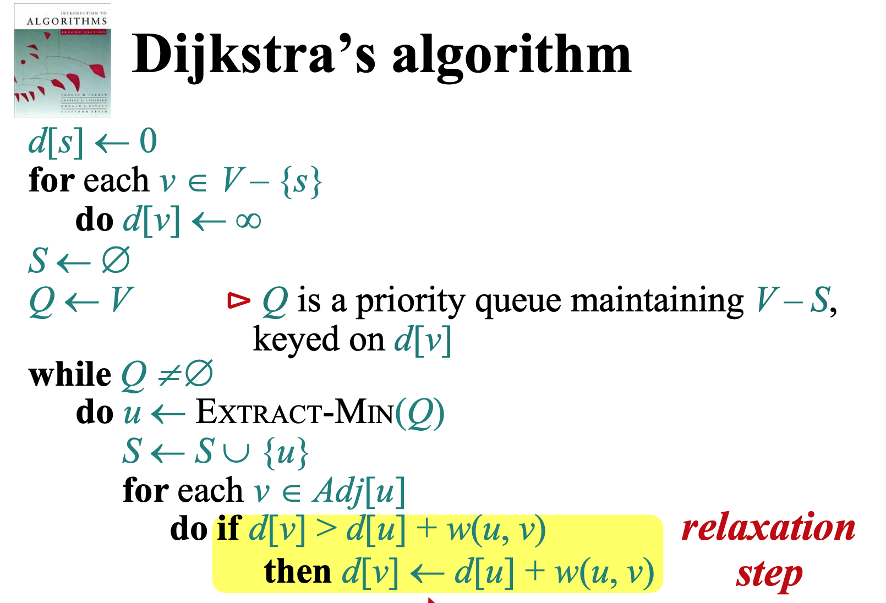
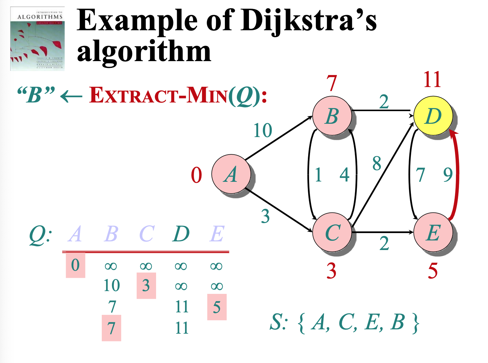

# Graph

图（Graph）是数据结构中的一种，用于表示一组对象及其相互之间的关系。图由节点（也称为顶点）和边组成，其中边表示节点之间的连接。图广泛应用于许多领域，如计算机网络、社交网络、地理信息系统等。

### 图的基本概念

1. **节点（Node/Vertex）**：图中的基本单位，表示对象或元素。
2. **边（Edge）**：连接两个节点的线，表示节点之间的关系或路径。

一般用 $G = (V,E)$， 其中 $V =$ Nodes  $E =$ Edges 

### 图的类型

1. **无向图（Undirected Graph）**：边没有方向性，即边 (u, v) 和 (v, u) 是相同的，表示节点 u 和 v 之间的关系是双向的。
   
2. **有向图（Directed Graph）**：边有方向性，即边 (u, v) 和 (v, u) 是不同的，表示从节点 u 到节点 v 的单向关系。
   
3. **加权图（Weighted Graph）**：边带有权重（Weight），表示边的“成本”或“距离”。
4. **无权图（Unweighted Graph）**：边没有权重。

### 图的表示方法

1. **邻接矩阵（Adjacency Matrix）**：使用一个二维数组来表示图。如果节点 i 和节点 j 之间有边，则数组中的元素 `matrix[i][j]` 为 1（无向图）或权重值（加权图），否则为 0。
   
   ```plaintext
   0 1 2 3
   0 0 1 0 0
   1 1 0 1 1
   2 0 1 0 1
   3 0 1 1 0
   ```

2. **邻接表（Adjacency List）**：使用一个数组（或哈希表）来表示图，其中每个元素是一个链表（或列表），链表中的每个元素表示与该节点相邻的节点。
   
   ```plaintext
   0: 1
   1: 0 2 3
   2: 1 3
   3: 1 2
   ```

### 图的遍历算法

1. **深度优先搜索（Depth-First Search, DFS）**：从起始节点出发，沿着一条路径尽可能深入，直到不能再深入为止，然后回溯并探索其他路径。
   
   ```python
   def DFS(graph, start, visited=None):
       if visited is None:
           visited = set()
       visited.add(start)
       for next in graph[start] - visited:
           DFS(graph, next, visited)
       return visited
   ```

2. **广度优先搜索（Breadth-First Search, BFS）**：从起始节点出发，首先访问所有相邻节点，然后再逐层向外扩展。
   
   ```python
   from collections import deque
   
   def BFS(graph, start):
       visited = set()
       queue = deque([start])
       while queue:
           vertex = queue.popleft()
           if vertex not in visited:
               visited.add(vertex)
               queue.extend(graph[vertex] - visited)
       return visited
   ```

### 图的应用

1. **最短路径问题**：如 Dijkstra 算法用于计算加权图中的最短路径。
2. **最小生成树**：如 Kruskal 算法和 Prim 算法，用于找到连接所有节点的最小权重的无环子图。
3. **网络流问题**：如 Ford-Fulkerson 算法，用于计算流经网络的最大流量。
4. **图着色问题**：用于分配资源，如图书馆的时间表安排等。
5. **Friendster**

这是一个社交网络应用，用户之间的关系可以建模为图中的节点和边。s-t连通性问题可以用来判断两个用户是否是朋友（直接或间接相连），而s-t最短路径问题可以用于计算两个用户之间的最短关系链。

6. **Maze Traversal（迷宫遍历）**

在迷宫中，每个位置可以看作是图中的节点，通路可以看作是边。s-t连通性问题可以用于判断迷宫是否有解（是否存在从起点到终点的路径），而s-t最短路径问题可以用于找到解决迷宫的最短路径。

7. **Kevin Bacon Number（凯文·贝肯数）**

这是一个六度分隔理论的应用，尤其在电影演员之间的关系中。每个演员可以看作一个节点，两位演员共同参演一部电影形成一条边。s-t最短路径问题可以用于计算任意两位演员之间的关系链长度，如计算某演员与凯文·贝肯之间的最短路径，即凯文·贝肯数。

8. **Fewest Hops in a Communication Network（通信网络中的最少跳数）**

在通信网络中，设备和连接可以建模为图。s-t最短路径问题可以用于计算从一个设备到另一个设备之间经过的最少中继点（跳数），这对优化网络路径和减少通信延迟非常重要。

这张PPT讲解了有向无环图（Directed Acyclic Graphs, DAG）以及拓扑排序（Topological Order）。


------

Directed 

### 定义

- **DAG**（有向无环图）：一个有向图（directed graph），其中不包含任何有向环（directed cycle）。也就是说，从任何节点出发，不可能通过有向边回到这个节点。

- **拓扑排序**（Topological Order）：对于一个有向图 \( G = (V, E) \)，拓扑排序是对其节点的一种排序 \( v_1, v_2, ..., v_n \)，使得对于图中的每一条有向边 \( (v_i, v_j) \)，有 \( i < j \)。即，所有的边都从序列中靠前的节点指向靠后的节点。

### 图示说明
- **左图**（a DAG）：展示了一个有向无环图，图中没有任何一个节点可以通过有向边回到自身。节点之间的关系有方向性，但没有形成环。

- **右图**（a topological ordering）：展示了一个节点的拓扑排序，每一个节点和边的关系满足拓扑排序的定义，即每条边都从序列中靠前的节点指向靠后的节点。

### 拓扑排序的应用
1. **任务调度**：确保任务按依赖关系的顺序执行，例如编译程序中的文件依赖。
2. **课程安排**：在课程安排中，确保学生先完成先修课程，再选修后续课程。
3. **数据处理管道**：确保数据处理的步骤按依赖关系正确执行。

### 拓扑排序的算法
#### Kahn's Algorithm（基于入度）
1. 找出所有入度为0的节点，并将它们放入队列。
2. 从队列中移除一个节点，输出该节点，并将其邻接节点的入度减1。
3. 如果某个邻接节点的入度变为0，将其加入队列。
4. 重复上述过程，直到队列为空。如果输出的节点数量不等于图中的节点数量，说明图中有环。

```python
from collections import deque, defaultdict

def kahn_topological_sort(graph):
    in_degree = defaultdict(int)
    for node in graph:
        for neighbor in graph[node]:
            in_degree[neighbor] += 1
    
    queue = deque([node for node in graph if in_degree[node] == 0])
    topo_order = []
    
    while queue:
        node = queue.popleft()
        topo_order.append(node)
        for neighbor in graph[node]:
            in_degree[neighbor] -= 1
            if in_degree[neighbor] == 0:
                queue.append(neighbor)
    
    if len(topo_order) == len(graph):
        return topo_order
    else:
        return "Graph has a cycle!"

# 示例图
graph = {
    'A': ['C'],
    'B': ['C', 'D'],
    'C': ['E'],
    'D': ['F'],
    'E': ['H', 'F'],
    'F': ['G'],
    'G': [],
    'H': []
}

print(kahn_topological_sort(graph))  # 输出可能的拓扑排序: ['A', 'B', 'D', 'C', 'E', 'H', 'F', 'G']
```

#### 深度优先搜索（DFS）法
1. 递归访问每个节点，标记正在访问的节点。
2. 对于每个未访问的邻接节点，递归调用DFS。
3. 递归完成后，将节点加入栈（即反向拓扑排序）。
4. 如果在访问过程中遇到已在访问中的节点，则图中存在环。

```python
def dfs_topological_sort(graph):
    visited = set()
    stack = []
    on_path = set()  # 用于检测环

    def dfs(node):
        if node in on_path:  # 发现环
            return False
        if node not in visited:
            visited.add(node)
            on_path.add(node)
            for neighbor in graph[node]:
                if not dfs(neighbor):
                    return False
            on_path.remove(node)
            stack.append(node)
        return True
    
    for node in graph:
        if node not in visited:
            if not dfs(node):
                return "Graph has a cycle!"
    
    return stack[::-1]  # 返回拓扑排序

# 示例图
graph = {
    'A': ['C'],
    'B': ['C', 'D'],
    'C': ['E'],
    'D': ['F'],
    'E': ['H', 'F'],
    'F': ['G'],
    'G': [],
    'H': []
}

print(dfs_topological_sort(graph))  # 输出可能的拓扑排序: ['B', 'A', 'D', 'C', 'E', 'H', 'F', 'G']
```

这些算法帮助我们有效地找到DAG的拓扑排序，确保在处理依赖关系时能够正确地执行顺序。

------





Dijkstra算法是一种广泛使用的最短路径算法，主要用于加权图（带权重的图）中寻找从一个起始节点到其他所有节点的最短路径。这个算法由计算机科学家Edsger W. Dijkstra在1956年提出。

### Dijkstra算法的基本思想
Dijkstra算法使用贪心策略，通过逐步选择具有最小当前距离的节点，并更新其邻居节点的距离，来找到从起始节点到目标节点的最短路径。

### 算法步骤
1. **初始化**：
   - 设定起始节点的距离为0，其他所有节点的距离为∞（表示尚未访问）。
   - 使用优先队列（通常实现为最小堆）来存储节点及其当前的最短距离。
   - 将起始节点添加到优先队列中。

2. **迭代**：
   - 从优先队列中取出当前距离最小的节点（称为当前节点）。
   - 更新当前节点的所有邻居节点的距离。如果通过当前节点到达某个邻居节点的距离比已知最短距离小，则更新该邻居节点的距离，并将其添加到优先队列中。
   - 将当前节点标记为已访问。

3. **终止条件**：
   - 当优先队列为空时，算法结束，此时所有节点的最短距离已找到。

### 代码实现（Python示例）
下面是一个简单的Python实现，使用优先队列来管理节点和距离：

```python
import heapq

def dijkstra(graph, start):
    # 初始化
    distances = {node: float('inf') for node in graph}
    distances[start] = 0
    priority_queue = [(0, start)]
    
    while priority_queue:
        current_distance, current_node = heapq.heappop(priority_queue)
        
        # 如果当前距离已经大于已知的最短距离，则跳过
        if current_distance > distances[current_node]:
            continue
        
        # 更新邻居节点的距离
        for neighbor, weight in graph[current_node].items():
            distance = current_distance + weight
            if distance < distances[neighbor]:
                distances[neighbor] = distance
                heapq.heappush(priority_queue, (distance, neighbor))
    
    return distances

# 示例图
graph = {
    'A': {'B': 1, 'C': 4},
    'B': {'A': 1, 'C': 2, 'D': 5},
    'C': {'A': 4, 'B': 2, 'D': 1},
    'D': {'B': 5, 'C': 1}
}

# 调用Dijkstra算法
start_node = 'A'
distances = dijkstra(graph, start_node)
print(distances)  # 输出: {'A': 0, 'B': 1, 'C': 3, 'D': 4}
```

### 代码解释
- **初始化**：创建一个`distances`字典来存储从起始节点到所有节点的最短距离。将起始节点的距离设为0，其他节点设为∞。优先队列`priority_queue`用于存储节点及其当前的最短距离。
- **迭代**：使用`heapq`从优先队列中取出当前距离最小的节点，更新其邻居节点的距离。如果通过当前节点到达某个邻居节点的距离更短，则更新该邻居节点的最短距离，并将其添加到优先队列中。
- **终止条件**：当优先队列为空时，所有节点的最短距离已经找到，算法结束。

### 适用范围和局限性
- **适用范围**：Dijkstra算法适用于所有边权重为非负数的图。它在许多实际应用中非常有效，如GPS导航、网络路由优化等。
- **局限性**：Dijkstra算法不能处理负权重边的图。如果图中存在负权重边，应该使用Bellman-Ford算法。

通过上述步骤和代码示例，相信您已经对Dijkstra算法有了一个基本的理解。如果您有任何问题或需要进一步解释，请随时告诉我。