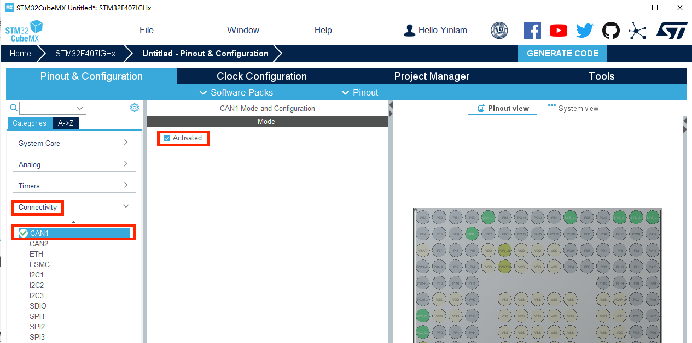
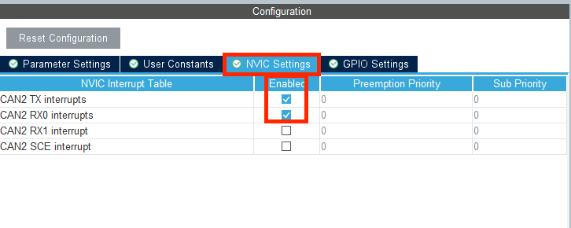

## 基础

### 说明

这个笔记主要按照大疆C型开发板例程的配套PDF教程来学习，配合C型开发板用户手册和6020，3508用户手册来学习食用

### CAN通信理论知识

[传送门](https://blog.csdn.net/weixin_54448108/article/details/125881138?spm=1001.2014.3001.5501csdn的电机驱动教程)

### Github 官方例程

[传送门](https://github.com/RoboMaster/Development-Board-C-Examples) 一定要配合官方例程下面的文档食用

注意，如果使用官方CAN通信代码，检查自己的6020和3508分别接在CAN1，CAN2还是都接在CAN1。例程默认将3508接入CAN1，6020接入CAN2。如果发现只有3508转而6020转，很大可能是上面的这个问题

### 中南大学学长代码

[传送门](https://gitee.com/broofssy/rm_infantry?_from=gitee_search#3-%E6%9D%BF%E8%BD%BDled%E4%BB%BB%E5%8A%A1])

### 配置CubeMX

1. 首先在以上CubeMX入门第六步之后，我们找到Connectivity下的CAN1，进行CAN1的配置。在Mode中，将 Activated 选中打勾

2. 在Configuration界面中，需要进行CAN的波特率的配置。

	注意：要先修改 Time Quanta（tq），再修改Prescaler（分频系数），之后我们会发现下面的波特率变成了1Mbit/s，即CAN总线支持的最高通讯波特率。

	这是因为cubeMX 会自动完成 Time Quantum（简写为 tq）的计算，将 tq 乘以 tBS1 (Time Quanta in

	Bit Segment 1)，tBS2 (Time Quanta in Bit Segment 1)，RJW (ReSynchronization Jump

	Width) 之和刚好为 1 微秒，对应波特率为 1M，这是 CAN 总线支持的最高通讯速率。

	71.42857142857143ns * (10 + 3 + 1) = 1000ns = 1us

	详细的CAN波特率计算原理之后再说

3. 对CAN2进行配置，与CAN1操作相同，这里省略

4. 更改IO口

	

	选中GPIO settings 我们看到CAN1默认使用的IO口为PB8和PB9

由于C板上使用的CANIO口并不是CubeMX默认IO口，所以需要根据C型开发板原理图进行修改

5. 对于CAN1，CubeMX默认IO口为PB8和PB9，我们改成PD0和PD1

在右图中找到PB8和PB9所在的小圆盘，鼠标左键点击

5. 在PD0中找到CAN1_RX，在PD1中找到CAN1_TX，按下

6. 对于CAN2，CubeMX默认IO口为即为PB5和PB6，就不用改了

7. 中断设置，分别为CAN1，CAN2接口开启数据发送中断和数据接收中断，以便在中断函数中处理收发的数据。

	注意，如果你想只写发送函数但不写接收函数就让电机动，就跳过这一步，过来人的经验

	我们选中NVIC Settings 选项栏，打开CAN1 TX interrupts 和 CAN1 RX0 interrupts。对CAN2也进行同样的操作

8. 至此，在CubeMX内对STM32的CAN配置完成。可以接上CubeMX的入门教程创建项目文件

### CAN通信初始化

### PID控制

PID（比例-积分-微分）控制器是一种常见的反馈回路控制技术，广泛应用于工业控制系统中。PID控制器通过计算偏差（即期望值与实际输出值之间的差异），并对比例（P）、积分（I）、微分（D）三个不同的参数进行调整，以控制系统输出。

#### P（比例）项

P项的作用是根据当前的偏差值来产生一个与之成比例的控制作用。其目的是使系统的输出快速接近目标值。然而，单独的P控制往往无法使偏差完全消除，这会导致一个恒定的偏差存在，这就是所谓的“静态误差”或“静差”。

#### I（积分）项

I项的作用是对偏差的历史累积进行控制，帮助系统消除静态误差。积分项会对过去的偏差进行积累，从而在长期内调整控制作用，使系统输出精确达到目标值。积分控制可以补偿比例控制留下的持续偏差。

#### D（微分）项

D项是基于偏差变化率（即偏差的微分）进行控制。它的主要作用是预测偏差的未来趋势，通过对偏差变化的响应来抑制系统的过冲和振荡。微分控制对快速变化的偏差反应敏感，有助于系统更平稳地接近目标值。

### Reference

https://blog.csdn.net/weixin_54448108/category_11929090.html

大疆官方例程配套文档

6020手册

C型开发板手册

## PWM

### PWM基本知识

PWM 即脉冲宽度调制是英文“Pulse Width Modulation”的缩写，简称脉宽调试。是利用微处理器的数字输出来对模拟电路进行控制的一种非常有效的技术。广泛应用在从测量、通信到功率控制与变换的许多领域中。

例如上图中，矩形脉冲是 stm32 输出的数字信号，当这个信号接到外设上时，效果可以等效为这个正弦波。一个周期内高电平的持续时间占总周期的比例成为占空比，通过修改占空比，可以改变输出的等效模拟电压。例如输出占空比为 50%，频率为 10Hz 的脉冲，高电平为 3.3V.则其输出的模拟效果相当于输出一个 1.65V 的高电平。此外 PWM 输出的频率也会影响最终的 PWM输出效果，PWM 输出的频率越高，最终输出的“连续性”越好，越接近模拟信号的效果，频率低则会增强离散性，最终的输出效果会有比较强的“突变”感。脉冲调制有两个重要的参数，第一个就是输出频率，频率越高，则模拟的效果越好。第二个就是占空比。占空比就是改变输出模拟效果的电压大小。占空比越大则模拟出的电压越大。
