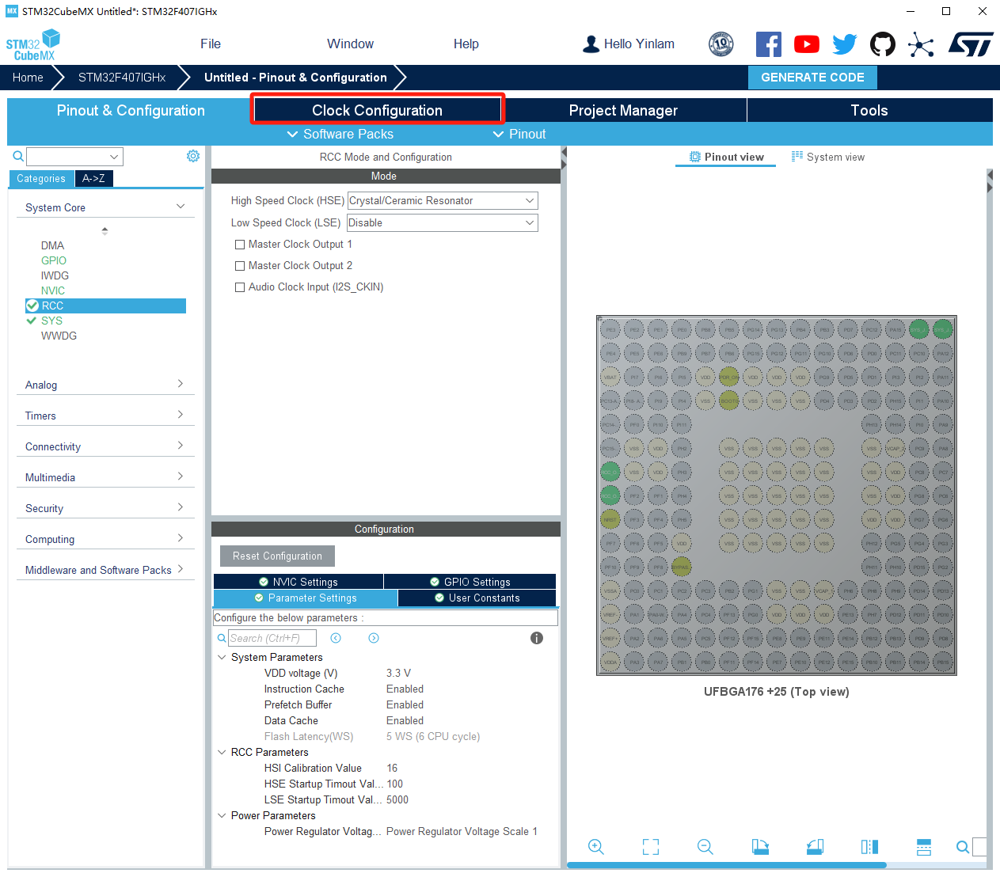
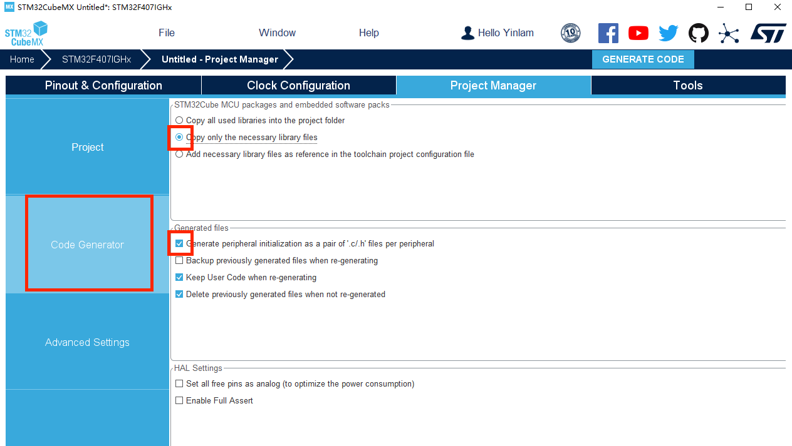
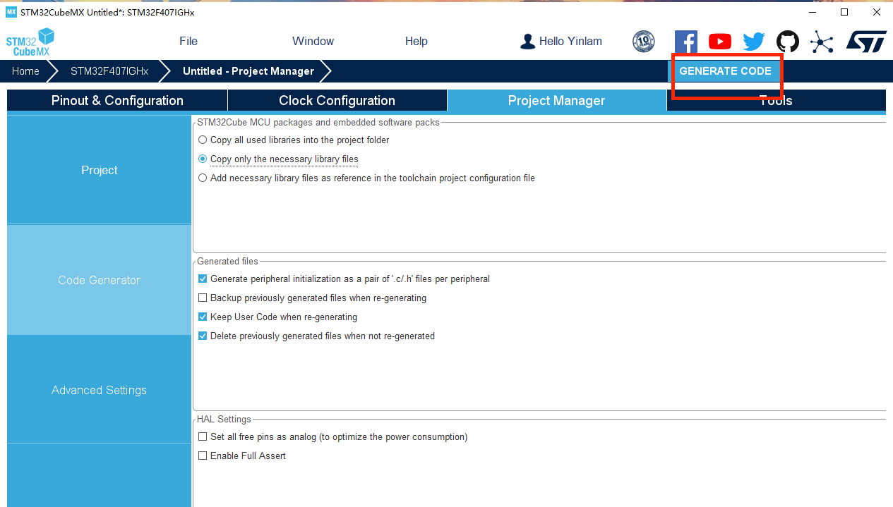
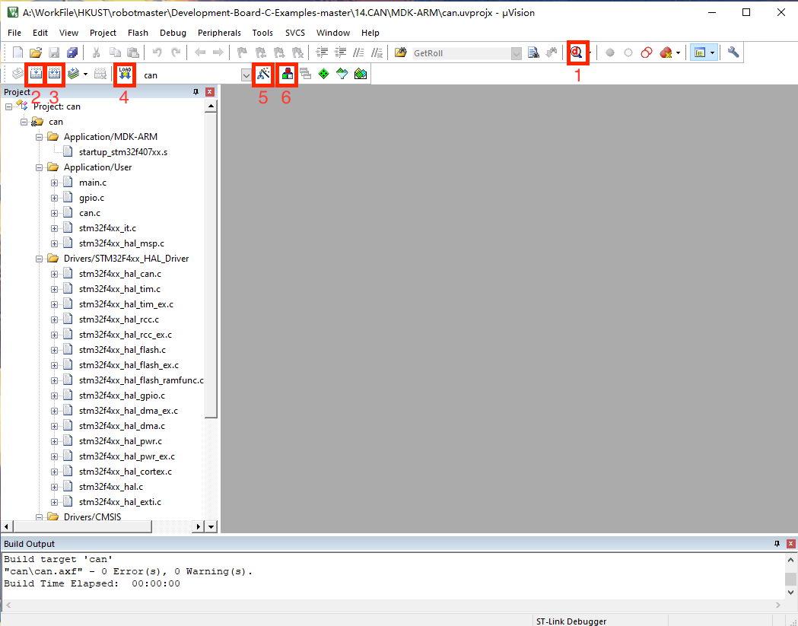
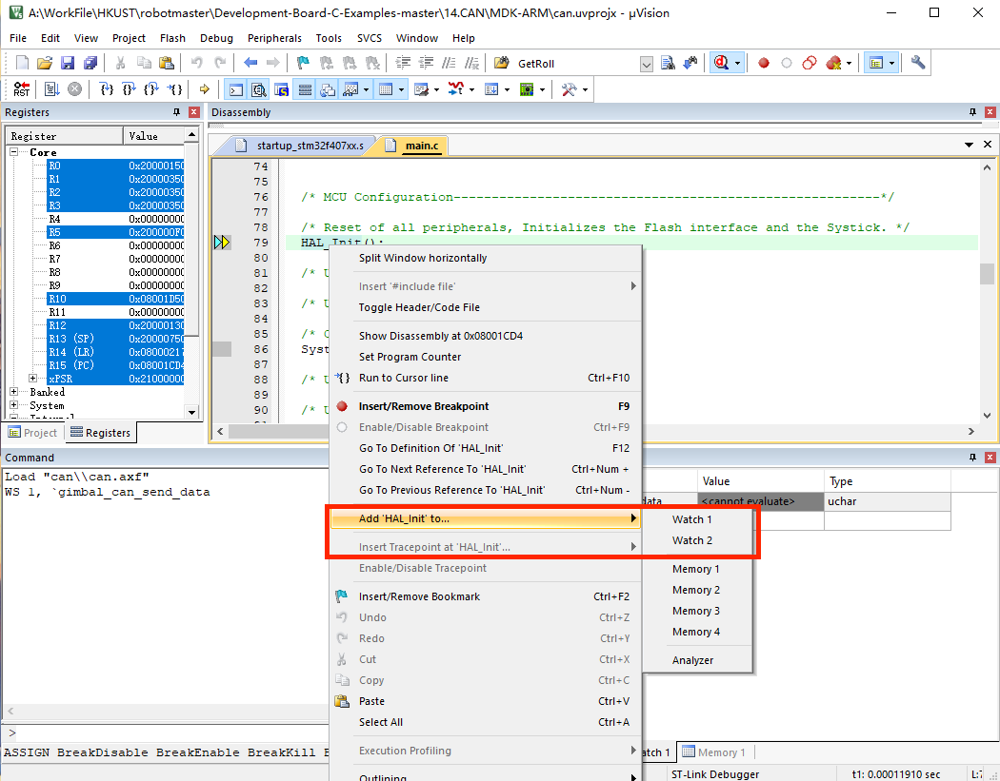
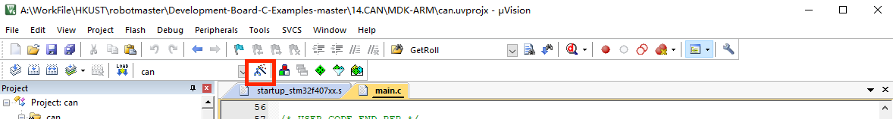
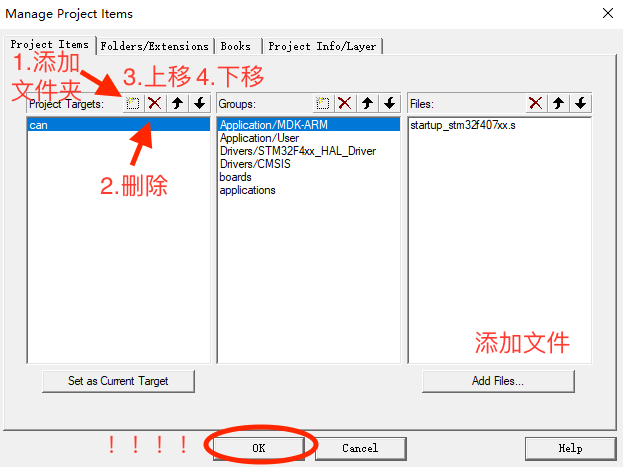

## 基础

### CAN通信理论知识

[传送门](https://blog.csdn.net/weixin_54448108/article/details/125881138?spm=1001.2014.3001.5501csdn的电机驱动教程)

### Github 官方例程

[传送门](https://github.com/RoboMaster/Development-Board-C-Examples) 一定要配合官方例程下面的文档食用

注意，如果使用官方CAN通信代码，检查自己的6020和3508分别接在CAN1，CAN2还是都接在CAN1。例程默认将3508接入CAN1，6020接入CAN2。如果发现只有3508转而6020转，很大可能是上面的这个问题

### 中南大学学长代码

[传送门](https://gitee.com/broofssy/rm_infantry?_from=gitee_search#3-%E6%9D%BF%E8%BD%BDled%E4%BB%BB%E5%8A%A1])

## CubeMX基本使用

1. 打开cubeMX软件，在file选项中选择“New Project”

2. 搜索stm32f407ig，选择STM32F407IGHx芯片（即开发板C的控制芯片），双击后等待加载

3. 在System Core下选择RCC选项，在RCC Mode and Configuration选项中的High Speed Clock（HSE）下选择Crystal/Ceramic Resonator

4. 点击顶部的 Clock Configuration，进行主频配置；将 Input frequecncy 设置为 12，点击

旁边的 HSE 圆形按钮，配置/M 为/6，配置*N 为 X168，配置/P 为/2 ，选择 PLLCLK 圆形

按钮，配置 APB1 Prescaler 为/4，配置 APB2 Prescaler 为/2

5. 点击顶部的 Pinout & Configuartion，选择 SYS，在 Debug 下拉框中选择 Serial Wire；

6. 点击顶部的 Project Manager，给工程起名，选择存放目录，在 Toolchain/IDE 中选择 MDK

	ARM V5

7. 点击旁边的 Code Generator，勾选 Copy only the necessary library files 以及 Generate 

	peripheral initialization as a pair of ‘.c/.h’ files per peripheral；

8. 如果不需要打开并初始化其他接口，就可以导出了

## Keil入门

1. 认识界面

	1.打开生成的工程，keil 界面如图所示，其中 1 为调试模式，2 为编译改变的文件，3 为编

	译全部的文件，4 为下载按键，5 为工程设置选项，6 为工程目录；

2. 点击 5 工程设置，进行工程相关设置，选择 Output，其中 Create HEX file 为是否生成

	HEX 文件，Browse Information 为是否增加浏览信息，选择是，可以使用鼠标右键点击函数

	进行跳转操作，但会增加编译时长；

3. 点击 C/C++，其中 1 方框为工程宏定义设置，可在此添加宏定义；2 方框为头文件引用目

	录，对于项目自行建立的 h 文件需要在此处进行目录录入; 3 如果要支持c++，可以在此加上--cpp11

4. 点击 Debug 选项，设置好对应的下载器；

5. 点击下载器旁边的 Settings 选项，进行下载器相关设置，其中 Clock 中设置下载器的频

	率，频率越高，下载速度越快，但容易受到干扰；

6. 点击 Flash Download，其中 Erase Full Chip 代表下载时擦除芯片内全部页面的 flash，

	Erase Sectors 代表下载时擦除部分页面的 flash，Do not Erase 代表下载时不擦除 flash ；

	点击 Reset and Run 代表下载完程序后立即运行程序。

	

### Keil调试

1. 在 keil 中编译之后，点击调试按键进入调试模式；

2. 进入调试模式后，可以选择 watch 窗口，watch 窗口可以参看变量的数值大小；

3. 可以在需要参看的变量点击右键，将其加入 watch 窗口；

4. 如果数据在程序运行中无变化，除了数据本身没有发生变化的场合，还可能由于未开启

	PeriodicWindows Update。

### Keil添加文件夹目录

[新建文件夹传送门](https://blog.csdn.net/MQ0522/article/details/128147014?spm=1001.2101.3001.6650.6&utm_medium=distribute.pc_relevant.none-task-blog-2%7Edefault%7ECTRLIST%7ERate-6-128147014-blog-45333165.235%5Ev43%5Epc_blog_bottom_relevance_base8&depth_1-utm_source=distribute.pc_relevant.none-task-blog-2%7Edefault%7ECTRLIST%7ERate-6-128147014-blog-45333165.235%5Ev43%5Epc_blog_bottom_relevance_base8&utm_relevant_index=7)

1. 第一步打开工程目录选项

2. 直接应用创建文件夹，添加文件（这里的添加文件不支持.h,.hpp头文件），删除文件，或者上移下移。注意这里只是创建keil的目录而不是实际文件夹。你还要自己在文件夹上移动进去。记得点OK，不要点X，不然不会保存

3. 头文件要到工程设置选项下添加，在最后一张图片的地方复制文件地址

## 从零开始控制电机

### 知识学习

### 配置CubeMX

1. 首先在以上CubeMX入门第六步之后，我们找到Connectivity下的CAN1，进行CAN1的配置。在Mode中，将 Activated 选中打勾

2. 在Configuration界面中，需要进行CAN的波特率的配置。

	注意：要先修改 Time Quanta（tq），再修改Prescaler（分频系数），之后我们会发现下面的波特率变成了1Mbit/s，即CAN总线支持的最高通讯波特率。

	这是因为cubeMX 会自动完成 Time Quantum（简写为 tq）的计算，将 tq 乘以 tBS1 (Time Quanta in

	Bit Segment 1)，tBS2 (Time Quanta in Bit Segment 1)，RJW (ReSynchronization Jump

	Width) 之和刚好为 1 微秒，对应波特率为 1M，这是 CAN 总线支持的最高通讯速率。

	71.42857142857143ns * (10 + 3 + 1) = 1000ns = 1us

	详细的CAN波特率计算原理之后再说

3. 对CAN2进行配置，与CAN1操作相同，这里省略

4. 更改IO口

	

	选中GPIO settings 我们看到CAN1默认使用的IO口为PB8和PB9

由于C板上使用的CANIO口并不是CubeMX默认IO口，所以需要根据C型开发板原理图进行修改

5. 对于CAN1，CubeMX默认IO口为PB8和PB9，我们改成PD0和PD1

在右图中找到PB8和PB9所在的小圆盘，鼠标左键点击

5. 在PD0中找到CAN1_RX，在PD1中找到CAN1_TX，按下

6. 对于CAN2，CubeMX默认IO口为即为PB5和PB6，就不用改了

7. 中断设置，分别为CAN1，CAN2接口开启数据发送中断和数据接收中断，以便在中断函数中处理收发的数据。

	注意，如果你想只写发送函数但不写接收函数就让电机动，就跳过这一步，过来人的经验

	我们选中NVIC Settings 选项栏，打开CAN1 TX interrupts 和 CAN1 RX0 interrupts。对CAN2也进行同样的操作

8. 至此，在CubeMX内对STM32的CAN配置完成。可以接上CubeMX的入门教程创建项目文件

### CAN通信初始化

### PID控制

PID（比例-积分-微分）控制器是一种常见的反馈回路控制技术，广泛应用于工业控制系统中。PID控制器通过计算偏差（即期望值与实际输出值之间的差异），并对比例（P）、积分（I）、微分（D）三个不同的参数进行调整，以控制系统输出。

#### P（比例）项

P项的作用是根据当前的偏差值来产生一个与之成比例的控制作用。其目的是使系统的输出快速接近目标值。然而，单独的P控制往往无法使偏差完全消除，这会导致一个恒定的偏差存在，这就是所谓的“静态误差”或“静差”。

#### I（积分）项

I项的作用是对偏差的历史累积进行控制，帮助系统消除静态误差。积分项会对过去的偏差进行积累，从而在长期内调整控制作用，使系统输出精确达到目标值。积分控制可以补偿比例控制留下的持续偏差。

#### D（微分）项

D项是基于偏差变化率（即偏差的微分）进行控制。它的主要作用是预测偏差的未来趋势，通过对偏差变化的响应来抑制系统的过冲和振荡。微分控制对快速变化的偏差反应敏感，有助于系统更平稳地接近目标值。

### Reference

https://blog.csdn.net/weixin_54448108/category_11929090.html

大疆官方例程配套文档

6020手册

C型开发板手册
