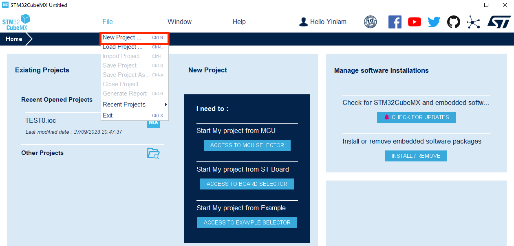
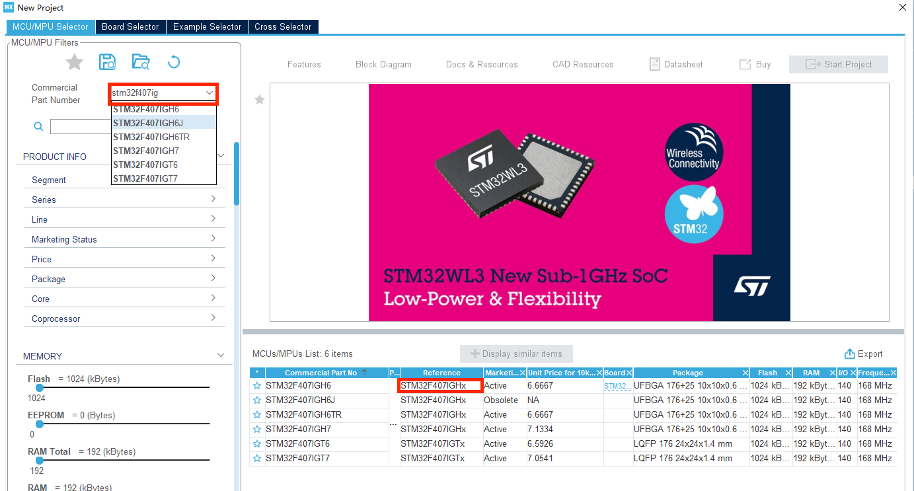
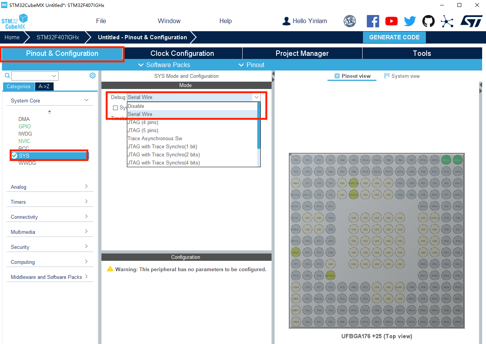
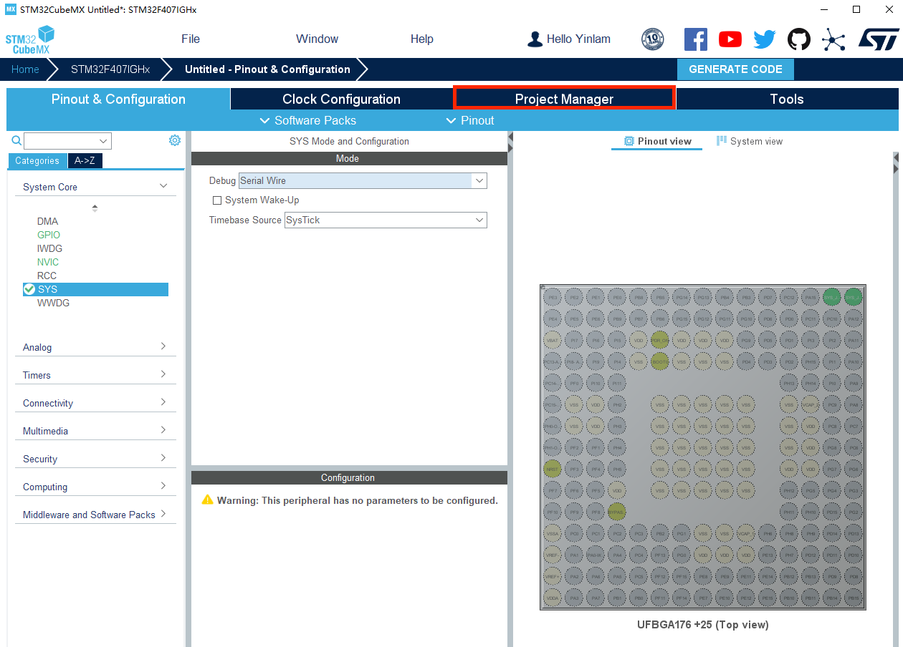
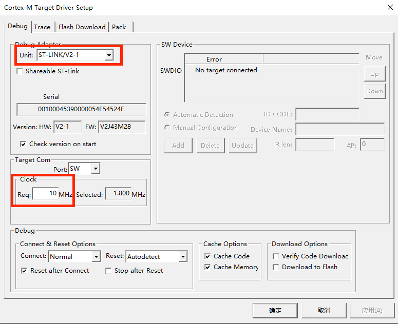
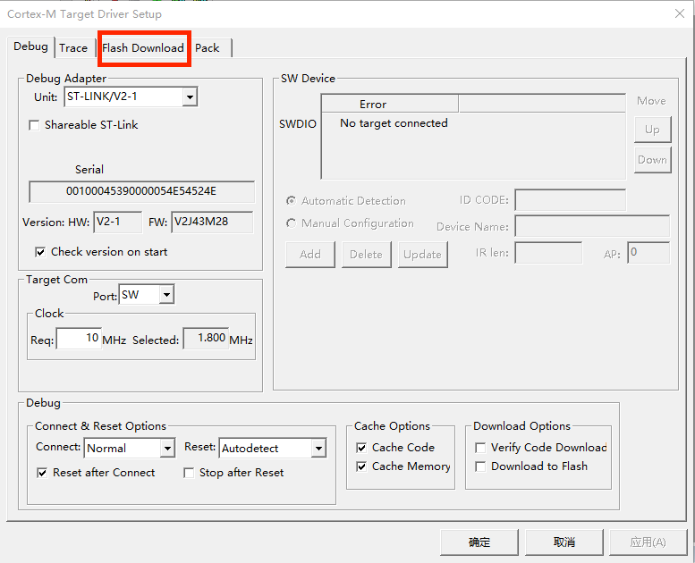
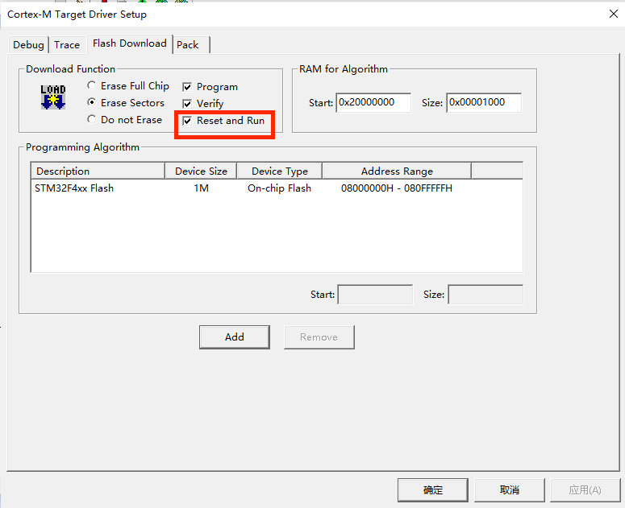
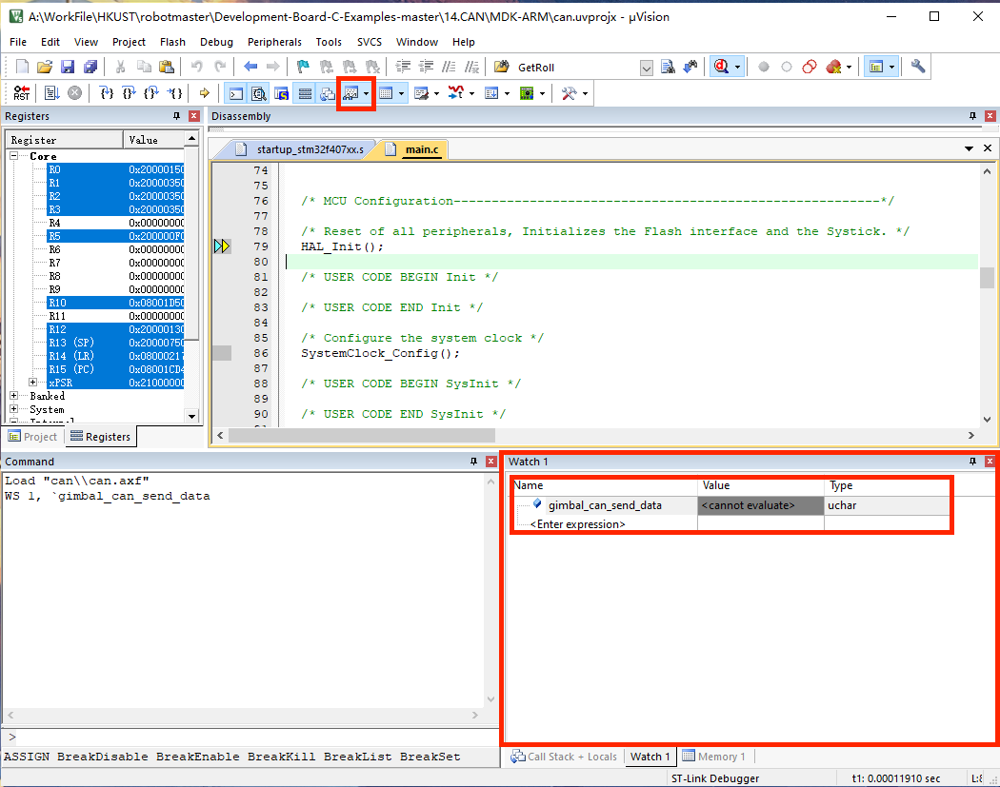

## 基础

### CAN通信理论知识

[传送门](https://blog.csdn.net/weixin_54448108/article/details/125881138?spm=1001.2014.3001.5501csdn的电机驱动教程)

### Github 官方例程

[传送门](https://github.com/RoboMaster/Development-Board-C-Examples) 一定要配合官方例程下面的文档食用

注意，如果使用官方CAN通信代码，检查自己的6020和3508分别接在CAN1，CAN2还是都接在CAN1。例程默认将3508接入CAN1，6020接入CAN2。如果发现只有3508转而6020转，很大可能是上面的这个问题

### 中南大学学长代码

[传送门](https://gitee.com/broofssy/rm_infantry?_from=gitee_search#3-%E6%9D%BF%E8%BD%BDled%E4%BB%BB%E5%8A%A1])

## CubeMX基本使用

1. 打开cubeMX软件，在file选项中选择“New Project”

2. 搜索stm32f407ig，选择STM32F407IGHx芯片（即开发板C的控制芯片），双击后等待加载

3. 在System Core下选择RCC选项，在RCC Mode and Configuration选项中的High Speed Clock（HSE）下选择Crystal/Ceramic Resonator

4. 点击顶部的 Clock Configuration，进行主频配置；将 Input frequecncy 设置为 12，点击

旁边的 HSE 圆形按钮，配置/M 为/6，配置*N 为 X168，配置/P 为/2 ，选择 PLLCLK 圆形

按钮，配置 APB1 Prescaler 为/4，配置 APB2 Prescaler 为/2

5. 点击顶部的 Pinout & Configuartion，选择 SYS，在 Debug 下拉框中选择 Serial Wire；

6. 点击顶部的 Project Manager，给工程起名，选择存放目录，在 Toolchain/IDE 中选择 MDK

	ARM V5

7. 点击旁边的 Code Generator，勾选 Copy only the necessary library files 以及 Generate 

	peripheral initialization as a pair of ‘.c/.h’ files per peripheral；

8. 如果不需要打开并初始化其他接口，就可以导出了

## Keil入门

1. 认识界面

	1.打开生成的工程，keil 界面如图所示，其中 1 为调试模式，2 为编译改变的文件，3 为编

	译全部的文件，4 为下载按键，5 为工程设置选项，6 为工程目录；

2. 点击 5 工程设置，进行工程相关设置，选择 Output，其中 Create HEX file 为是否生成

	HEX 文件，Browse Information 为是否增加浏览信息，选择是，可以使用鼠标右键点击函数

	进行跳转操作，但会增加编译时长；

3. 点击 C/C++，其中 1 方框为工程宏定义设置，可在此添加宏定义；2 方框为头文件引用目

	录，对于项目自行建立的 h 文件需要在此处进行目录录入; 3 如果要支持c++，可以在此加上--cpp11

4. 点击 Debug 选项，设置好对应的下载器；

5. 点击下载器旁边的 Settings 选项，进行下载器相关设置，其中 Clock 中设置下载器的频

	率，频率越高，下载速度越快，但容易受到干扰；

6. 点击 Flash Download，其中 Erase Full Chip 代表下载时擦除芯片内全部页面的 flash，

	Erase Sectors 代表下载时擦除部分页面的 flash，Do not Erase 代表下载时不擦除 flash ；

	点击 Reset and Run 代表下载完程序后立即运行程序。

	

### Keil调试

1. 在 keil 中编译之后，点击调试按键进入调试模式；

2. 进入调试模式后，可以选择 watch 窗口，watch 窗口可以参看变量的数值大小；

3. 可以在需要参看的变量点击右键，将其加入 watch 窗口；

4. 如果数据在程序运行中无变化，除了数据本身没有发生变化的场合，还可能由于未开启

	PeriodicWindows Update。

## 从零开始控制电机

