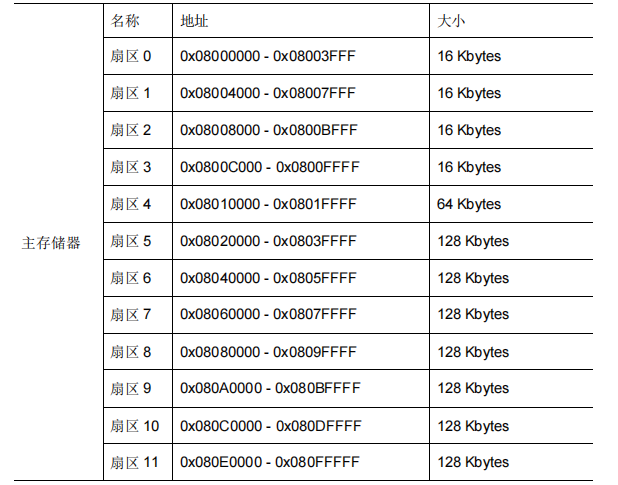

# Flash读写

### 引入

flash 用于存放数据，在 RM 比赛中常常将机

器人特征数据例(如云台电机中值)保存进 flash。在本课程内，学习 stm32 对 flash 进行数据

的读写，将 RoboMaster 字符写入 flash 中，并且从 flash 中读取写入的字符串数据。

### 基本介绍

个人计算机都均有内存和硬盘（外存）,开发板芯片 stm32 同样具有内存 192Kbytes 的 SRAM 和 1Mbytes 的外存 flash。Flash 和 SRAM 有如下特点。

| FLASH                        | SRAM               |
| ---------------------------- | ------------------ |
| 容量较大                     | 容量较小           |
| 读取和写入速度较慢           | 读取和写入速度较快 |
| 掉电不会丢失数据             | 掉电丢失数据       |
| 分扇区                       | 不分扇区           |
| 写入需要先擦除               | 写入不需擦除       |
| 存储程序，长时间保存的数据等 | 变量等             |

#### 特点 

1. 为了保护数据的安全性，flash 有专门的锁寄存器，每次要对 flash 页面进行修改时首先要通过锁寄存器对页面进行解锁，修改完成后要进行加锁。
2. flash 是不支持在保存原有数据的情况下进行修改的，因此要改变 flash 页面数据时，需要对这个页面进行擦除，擦除之后再写入新的数据。

### 函数介绍

#### HAL_FLASHEx_Erase

flash 擦除函数介绍

| 函数                |                                                              |
| ------------------- | ------------------------------------------------------------ |
| 函数名              | HAL_FLASHEx_Erase(FLASH_EraseInitTypeDef *pEraseInit, uint32_t *SectorError) |
| 函数作用            | 擦除指定的flash页面                                          |
| 返回值              | HAL_StatusTypeDef, HAL库定义的几种状态，如果成功完成flash页面擦除，则返回HAL_OK，失败会返回 HAL_ERROR, 超时会返回 HAL_TIMEOUT |
| 参数1：*pEraseInit  | *pEraseInit 擦除 flash 时使用的结构体指针,需要创建一个 FLASH_EraseInitTypeDef 类型的结构体作为参数输入函数 |
| 参数2：*SectorError | uint32_t *SectorError 如果本次 flash 擦除产生了错误，则发生擦除错误的 |

flash_erase这个结构体包含以下参数：Sector（要擦除的页面的首地址），TypeErase（擦除方式），VoltageRange（电压范围），NbSectors（待擦除页面数），最后我们将&flash_erase 作为参数输入函数

#### HAL_FLASH_Program

flash 写入函数介绍

| 函数               |                                                              |
| ------------------ | ------------------------------------------------------------ |
| 函数名             | HAL_FLASHEx_Program(uint32_t TypeProgram, uint32_t Address, uint64_t Data) |
| 函数作用           | 以指定的方式，向 flash 中的一页写入数据                      |
| 返回值             | HAL_StatusTypeDef, HAL库定义的几种状态，如果成功完成flash的数据写入，则返回HAL_OK，失败会返回 HAL_ERROR, 超时会返回 HAL_TIMEOUT |
| 参数1：TypeProgram | TypeProgram 选择写入的数据格式，可以选择8位字节FLASH_TYPEPROGRAM_BYTE，16位半字FLASH_TYPEPROGRAM_HALFWORD，32位字FLASH_TYPEPROGRAM_WORD，或者64位双字FLASH_TYPEPROGRAM_DOUBLEWORD |
| 参数2：Address     | Address 需要写入数据的地址                                   |
| 参数3：Data        | Data 需要写入的数据                                          |

#### flash_read

flash 读取函数介绍

| 函数           |                                                           |
| -------------- | --------------------------------------------------------- |
| 函数名         | flash_read(uint32_t address, uint32_t *buf, uint32_t len) |
| 函数作用       | 从flash 读取数据                                          |
| 返回值         | None                                                      |
| 参数1：Address | Flash 地址                                                |
| 参数2：buf     | 读取后的存储变量地址                                      |
| 参数3：len     | 字节长度                                                  |

#### HAL_FLASH_Unlock

flash 解锁函数介绍

| 函数     |                                                              |
| -------- | ------------------------------------------------------------ |
| 函数名   | HAL_FLASH_Unlock(void)                                       |
| 函数作用 | 为flash解锁，使用户可以修改 flash 内容                       |
| 返回值   | HAL_StatusTypeDef, HAL库定义的几种状态，如果成功完成flash的解锁，则返回HAL_OK，失败会返回 HAL_ERROR, 超时会返回 HAL_TIMEOUT |

#### HAL_FLASH_Lock

flash 加锁函数介绍

| 函数     |                                                              |
| -------- | ------------------------------------------------------------ |
| 函数名   | HAL_FLASH_Lock(void)                                         |
| 函数作用 | 为 flash 加锁，后续操作时只有先解锁才能对 flash 内容进行修改 |
| 返回值   | HAL_StatusTypeDef, HAL库定义的几种状态，如果成功完成flash的加锁，则返回HAL_OK，失败会返回 HAL_ERROR, 超时会返回 HAL_TIMEOUT |

### flash 分页

stm32 中共有12个flash 页分页

其中 stm32 上电时，会从 0x08000000 读取程序开始运行，故而在扇区 0 开始往往会存储程序，需要使用程序之后的扇区作为存储扇区。

### boot

boot 用于控制芯片在上电之后如何引导程序加载到芯片中开始执行。

STM32 的启动方式分为三种方式，采用哪一种方式启动可以通过芯片的 boot0 和 boot1 引

脚进行设置。

1. 最常用的方式，即从 flash 中读取烧录的程序，将其引导到 STM32 中执行。

2. 芯片从一块特殊的系统存储区启动，在系统存储区中存有芯片生产厂商已经写好的 bootloader 程序，这个程序的功能是通过串口将程序读取到 flash 中去，再将 flash 中的程序引导到单片机中执行。有一些特殊的下载软件可以让我们通过串口进行 STM32 程序的下载，其原理就是使用了这种 boot 方式。使用这种 boot 的优点是不需要额外的下载器，缺点是下载速度比较慢。

3. 从 STM32 内嵌的 SRAM 中启动，可以将一小段程序写入 SRAM 中用于调试，

但是因为 SRAM 有着掉电丢失的特性，所以一般不会采用这种方式进行 boot，否则每次重新给芯片上电就必须重新给 SRAM 写入一次程序。

| 1            | 方法1                                                      | 方法2                                                        | 方法3                                          |
| ------------ | ---------------------------------------------------------- | ------------------------------------------------------------ | ---------------------------------------------- |
| BOOT引脚状态 | BOOT0:GND BOOT1:GND or VCC                            | BOOT0:VCC BOOT1:GND                                     | BOOT0:VCC BOOT1:VCC                       |
| 启动区域     | Flash的用户程序存储区                                      | Bootloader 程序存储区                                        | 内嵌SRAM                                       |
| 功能         | 将用户通过下载器烧录的程序引导到单片机执行，是最常用的方式 | 通过串口将程序读取到 flash 中去，再将flash 中程序引导到单片机中执行。 | 将 SRAM 中的程序引导到单片机执行，一般用于调试 |

