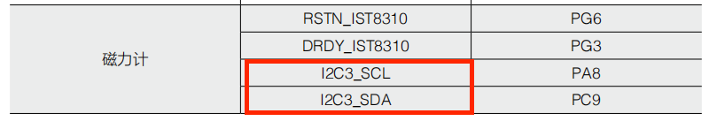
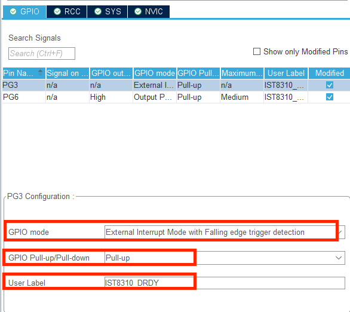

# I2C读取IST8310

### 引入

本课程中，将学习一种常用的串行同步通讯总线协议--I2C，并学习使用 I2C，配置和读取IST8310 磁力计的设置和数据。I2C 不仅仅用于磁力计的读取，而且可以读取其他众多的传感器，例如温度传感器，气压传感器，多路 ADC 模块等。磁力计是一种测量地球磁场强度的传感器，又名电子罗盘，可用于计算机器人的朝向。

### I2C

I2C 是 PHILIPS 公司开发的一种半双工、双向二线制同步串行总线。两线制代表 I2C 只需两根信号线，一根数据线 SDA，另一根是时钟线 SCL。

I2C 总线允许挂载多个主设备，但总线时钟同一时刻只能由一个主设备产生，并且要求每个连接到总线上的器件都有唯一的 I2C 地址，从设备可以被主设备寻址。

I2C 通信具有几类信号：

* 开始信号 S：当 SCL 处于高电平时，SDA 从高电平拉低至低电平，代表数据传输的开始。

* 结束信号 P：当 SCL 处于高电平时，SDA 从低电平拉高至高电平，代表数据传输结束。

* 数据信号：数据信号每次都传输 8 位数据，每一位数据都在一个时钟周期内传递，当

SCL 处于高电平时候，SDA 数据线上的电平需要稳定，当 SCL 处于低电平的时候，SDA 数据线上的电平才允许改变。

* 应答信号 ACK/NACK：应答信号是主机发送 8bit 数据，从机对主机发送低电平，表示

已经接受数据。

常见用于读取传感器数据的 I2C 传输过程如下表所示：

整个 I2C 通信过程理解成收发快递的过程，设备 I2C 地址理解成学校快递柜的地址，读写位代表寄出和签收快递，寄存器地址则是快递柜上的箱号，而数据便是需要寄出或者签收的快递。整个过程便是如同到学校的快递柜（从机 I2C 地址），对第几号柜箱（寄存器地址），进行寄出或者签收快递（数据）的过程。详细的过程可以参考进阶知识中的 IST8310 的读写过程。

### 磁力计

IST8310 是一款由 ISentek 公司推出的 3 轴磁场传感器，尺寸为 3.0\*3.0\*1.0mm，支持快速I2C 通信，可达 400kHz，14 位磁场数据，测量范围可达1600uT(x,y-axis)和 2500uT(z-axis)，最高 200Hz 输出频率。

磁场传感器常常用于电子罗盘，计算地磁场角度，而地磁场是源自于地球内部，并延伸到太空的磁场。磁场在地表上的强度在 25－65 微特斯拉之间。同时地磁场与地球自转轴并不重合，存在 11°的夹角，故而在地球表面存在一定磁偏角，并且随着纬度升高而变化越大。在中国大陆的大部分地区，磁偏角大概在-10°~+2°之间。使用 IST8310 磁力计可以检测地磁场强度，用于计算磁场角度。

IST8310 的 GPIO 管教各个功能如下表所示：

| 管脚 | 功能                              |
| ---- | --------------------------------- |
| SCL  | I2C的时钟线                       |
| SDA  | I2C的数据线                       |
| RSTN | IST8310的RESET, 低电平重启IST8310 |
| DRDY | IST8310的数据准备(data ready)     |

### CubeMX配置

1. 首先我们打开C型开发板用户手册，找到附表下的磁力计对应的IO口，我们发现磁力计连接的是I2C3

2. 我们将PG3设置为按键的外部中断，下降沿触发，PG6配置成GPIO的输出模式，上拉模式

3. 在Connectivity菜单栏下找到I2C3，打开I2C，速度模式选择快速模式，其他保持默认

4. 在完成其他配置如时钟树，晶振，debug等之后，我们就可以选择Generate Code生成代码了

### 函数介绍

#### HAL_I2C_Mem_Read

介绍HAL库自带I2C读取函数

| 函数               |                                                              |
| ------------------ | ------------------------------------------------------------ |
| 函数名             | HAL_I2C_Mem_Read(hi2c, DevAddress, MemAddress, MemAddSize, pData, Size, Timeout) |
| 函数作用           | 从I2C设备的寄存器读取数据                                    |
| 函数返回           | HAL状态，HAL_OK代表读取成功                                  |
| 参数 1：hi2c       | I2C句柄                                                      |
| 参数 2：DevAddress | I2C从机地址                                                  |
| 参数 3：MemAddress | 寄存器地址                                                   |
| 参数 4：MemAddSize | 寄存器地址增加大小 I2C_MEMADD_SIZE_8BIT: 增加八位 I2C_MEMADD_SIZE_8BIT: 增加十六位 |
| 参数 5：pData      | 数据指针                                                     |
| 参数 6：Size       | 数据长度                                                     |
| 参数 7：Timeout    | 超时时间                                                     |

#### HAL_I2C_Mem_Write

介绍HAL库自带I2C写入函数

| 函数               |                                                              |
| ------------------ | ------------------------------------------------------------ |
| 函数名             | HAL_I2C_Mem_Write(hi2c, DevAddress, MemAddress, MemAddSize, pData, Size, Timeout) |
| 函数作用           | 从I2C设备的寄存器写入数据                                    |
| 函数返回           | HAL状态，HAL_OK代表读取成功                                  |
| 参数 1：hi2c       | I2C句柄                                                      |
| 参数 2：DevAddress | I2C从机地址                                                  |
| 参数 3：MemAddress | 寄存器地址                                                   |
| 参数 4：MemAddSize | 寄存器地址增加大小 I2C_MEMADD_SIZE_8BIT: 增加八位 I2C_MEMADD_SIZE_8BIT: 增加十六位 |
| 参数 5：pData      | 数据指针                                                     |
| 参数 6：Size       | 数据长度                                                     |
| 参数 7：Timeout    | 超时时间                                                     |

### 代码流程

1. 初始化GPIO和I2C通信接口，保证正常通信（HAL库初始化已经配置，如果使用模拟I2C可以在这里进行初始化
2. 通过IST8310重启管脚进行重启

3. 验证设备ID，判断IST8310通信是否正常，判断WHO_AM_I的value
4. 配置IST8310，对寄存器处理，设置测量模式，采样模式，中断IO，采样平均，最后读取数据。

主要就是通过那个嵌套数列对IST8310的寄存器进行底层设置，然后验证是否写入正确，然后读取寄存器里面的数据，共6个，三轴，每个8位，将高八位，低八位合并在一起就成了一个轴的数据

### 解读例程

#### ist8310_init

这个存储的一堆东西就是for循环干的事情，这里加了挺多中文注释来帮助理解，具体的设置值请参考下面的寄存器，会用就行，不用强记。

#### ist8310_read_mag

添加中文注释版的，应该比较好理解。就是MAG_SEN（数值为0.3）那个就是物理上的或者数学上的东西了，知道就好。读取地址参考下面的寄存器

### IST8310寄存器

总之就是对底层的寄存器处理就按照寄存器的规则来就行了，不用硬记。试了一下它的温度传感器，怎么有两万多？？！可能单位不同。

#### 设备ID

#### 测量模式

#### 采样模式

#### 设置中断IO

#### 数据存储

##### 磁场

这里x轴磁场数据低八位寄存器地址好像写错了，应该0x03

##### 温度

### 模拟I2C--拓展(gpt内容)

模拟I2C（有时称为软件I2C或位带（bit-banging）I2C）是一种通过软件来控制I2C通信协议的方法，而不是通过硬件I2C模块。这种方法非常有用，尤其是在硬件不支持I2C或者I2C硬件接口数量不足的情况下。

#### 如何工作

模拟I2C通过软件精确控制两条线（SDA和SCL）上的电平状态来实现I2C协议的所有功能。SDA是数据线，SCL是时钟线。通过软件控制这两条线的高低电平，可以模拟I2C协议的起始信号、停止信号、字节发送、应答等。

#### 模拟I2C的主要步骤包括：

1. **生成起始条件**：通过将SDA线从高电平拉低到低电平，同时SCL线保持高电平。
2. **发送数据位**：通过在SCL线为低电平时改变SDA线的电平来设置数据位，然后将SCL线拉高来“锁定”这一位，之后再将SCL线拉低，准备发送下一位。
3. **读取应答**：在发送完8位数据后，将SDA线释放（设置为输入或高电平），然后拉高SCL线来读取从设备的应答位。
4. **生成停止条件**：通过在SCL线为高电平的情况下，将SDA线从低电平拉高到高电平。

#### 模拟I2C的优点和缺点

**优点**：
- **灵活性**：可以在任何GPIO引脚上实现I2C通信。
- **扩展性**：不受硬件I2C接口数量的限制，可以创建更多的I2C通道。
- **兼容性**：可以在不支持硬件I2C的微控制器上实现I2C通信。

**缺点**：
- **资源消耗**：由于全部操作都由CPU通过软件完成，可能会消耗较多的CPU资源。
- **速度限制**：通常比硬件I2C慢，因为每一位的读取和发送都需要通过软件控制。
- **实时性要求**：对于时序的控制较为严格，软件的执行时间波动可能影响通信的稳定性。

模拟I2C非常适合于资源受限或特殊需求的嵌入式应用场景，尤其在原型开发阶段，可以快速实现和测试I2C设备的通信。但在生产环境中，如果性能和响应时间是关键因素，通常推荐使用硬件I2C。