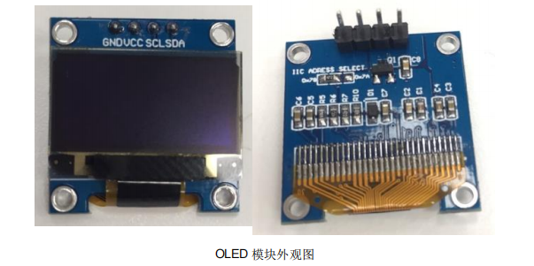
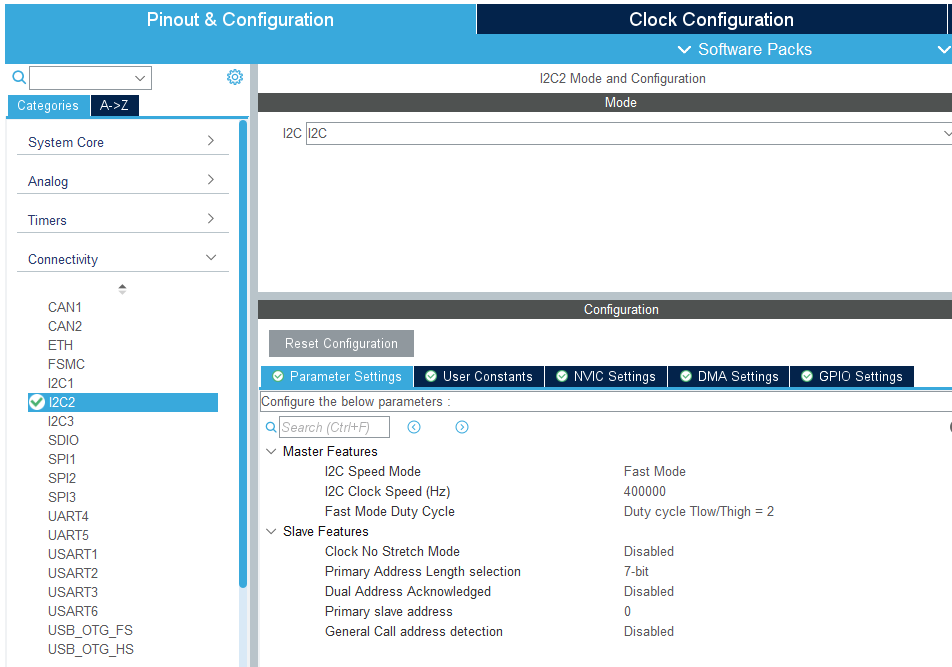

# OLED

之前学了一下，现在就不细看了，东西挺多的，会用就行。中文的话还需要有取模软件，推荐去keysking那里看看

之前看的时候写的英文笔记不想再看了。我把CubeMX的配置和函数写写吧

### 引入

在前面一章中，学习了 I2C 通信方式，使用 I2C 获取 IST8310 的磁场数据，本课程中接着使用 I2C 通信方式点亮 OLED 模块，并显示 Robomaster LOGO。由于 OLED 模块支持多种通信方式，OLED 模块的 I2C 通信过程与 IST8310 存在不同之处，通过在数据层进行二次打包，以达到分类数据包的目的，以便适配 OLED 的多种通信方式。

### 基本介绍

OLED (OrganicLight-Emitting Diode)，又称为有机电激光显示、有机发光半导体(OrganicElectroluminesence Display, OLED)。OLED 属于一种电流型的有机发光器件，发光原理是通过载流子的注入和复合而致发光，发光强度与注入的电流成正比。OLED 在电场的作用下，阳极产生的空穴和阴极产生的电子就会发生移动，分别向空穴传输层和电子传输层注入，迁移到发光层。当二者在发光层相遇时，产生能量激子，从而激发发光分子最终产生可见光。[百度百科]

OLED 屏幕模块在 RM 比赛中，具有显示数据，指引操作等作用，例如显示传感器数据，提醒队员检查机器人。OLED 模块价格便宜，很多店家都有出售，常见屏幕尺寸为 0.96 寸，分辨率为 128*64，常见的通信方式支持 6800,8080 两种并口接口，或者 SPI 接口和 I2C 接口。以下以一款引出 I2C 接口的 OLED 模块为例。

该 OLED 模块使用 I2C 通信，I2C 设备的默认地址为 0x78，可以通过手动修改左上方的电阻来配置 I2C 地址为 0x7A。由于OLED模块本身不会像IST8310有读取数据过程，整个过程均为主机不断向从机OLED模块发送数据，发送的数据中 I2C 地址后的第一个数据表示的是控制指令（0x00）还是数据指令（0x40）。它们的异同点如下表所示：

|        | IST8310                                                      | OLED                                                         |
| ------ | ------------------------------------------------------------ | ------------------------------------------------------------ |
| 不同   | 有读操作和写操作                                             | 只有写操作                                                   |
|        | 发送I2C地址后，发送寄存器地址信息                            | 发送I2C地址后,发送数据类型再发送数据，其中数据类型为0x00表示控制指令，0x40表示数据指令 |
| 相同点 | 都有固定的I2C地址 都支持最高400K的I2C频率 都传输8字节数据 | 同左                                                         |

可以看出 OLED 通信过程与 IST8310 通信过程最大不同在于传输 I2C 地址后的数据上，OLED 通过一个字节的数据，来区分之后的数据类型。

### CubeMX配置

1. 在连接之前，我们将OLED连接至stm32的I2C2，最好用比较短的杜邦线连接。这里不多讲
2. 我们打开CubeMX，在Connectivity菜单栏下选择I2C2，选择I2C，并打开Fast Mode

3. 完成其他基础设置后就可以Generate Code啦

### 函数介绍

#### HAL_I2C_Master_Transmit

| 函数              |                                                              |
| ----------------- | ------------------------------------------------------------ |
| 函数名            | HAL_I2C_Master_Tranmit(I2C_HandlerTypeDef *hi2c, uint16_t DevAddress, uint8_t *pData, uint16_t Size, uint32_t Timeout) |
| 函数作用          | 向某个I2C设备传输数据                                        |
| 返回值            | HAL_StatusTypeDef, HAL库定义的几种状态，如果成功完成数据传输，则返回HAL_OK，失败会返回 HAL_ERROR, 超时会返回 HAL_TIMEOUT |
| 参数1：hi2c       | I2C 句柄                                                     |
| 参数2：DevAddress | I2C 从机地址                                                 |
| 参数3：pData      | 数据指针                                                     |
| 参数4：Size       | 数据长度                                                     |
| 参数5：Timeout    | 超时时间                                                     |

