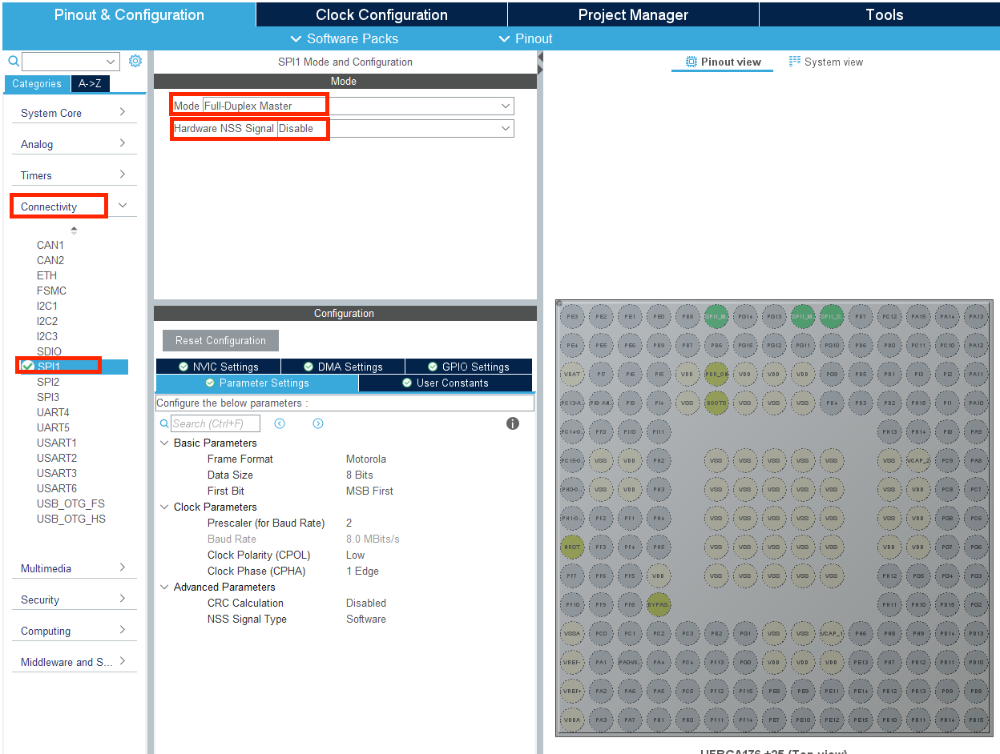
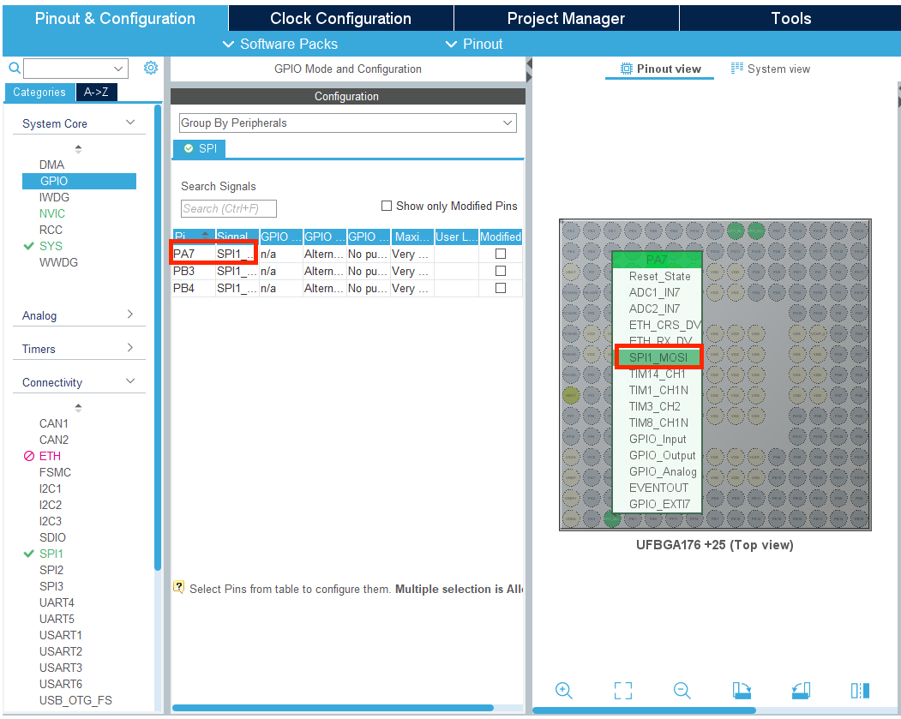
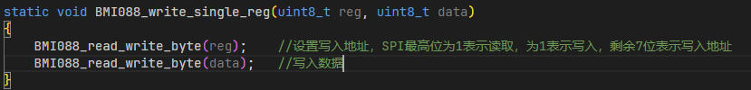

# BMI088

### 引入

本节课将介绍 BMI088 传感器的相关知识，BMI088 传感器是一个六轴惯性测量单元 (IMU)，能够应用于机器人上的姿态解算，将在本章节学习六轴惯性测量单元的内部结构——三轴陀螺仪和三轴加速度计，惯性测量单元的功能及其基本原理，同时我们将介绍一个重要的通信协议——SPI 协议，以及 BMI088 传感器的使用方法，并编写工程进行 BMI088 传感器的驱动。

### 陀螺仪

Bosch 公司生产的 BMI088 高性能惯性测量单元 (IMU) 专门设计用于无人机和机器人应用。该款 6 轴传感器在 3 x 4.5 x 0.95mm³小尺寸 LGA 封装中集成了 16 位 ADC 精度的三轴陀螺仪和三轴加速度计。

陀螺仪是测量角速度的传感器，是 IMU 的重要组成部分。陀螺仪能测量在三个正交方向上旋转的角速度，也可以用于估算在三个方向上的旋转角度。

陀螺仪有许多种类，不同的陀螺仪一般基于不同的工作原理，能够达到的精度也不一样，市场上最常用的微机电（MEMS）陀螺仪的基本原理是利用旋转时产生的科里奥利力引发电容的变化，从而将旋转的角速度转化为电信号。

### 加速度计

六轴 IMU 中的另一重要组成部分是加速度计；顾名思义，加速度计能够测量三个正交方向上的加速度。MEMS 加速度计原理是利用加速度变化使内部质量块产生的力发生变化，从而改变电容大小，转化为电信号。当物体静止时，加速度计测量重力加速度在三个正交方向上的分量，配合陀螺仪的角速度信息可以解算出物体的空间位姿，详细的解算过程可以参考第 18 章姿态解算任务章节。

### SPI协议

BMI088 支持 SPI 协议和 I2C 协议，通过 PS 引脚的电平状态决定是 SPI 协议或者 I2C 协议


当BMI088使用SPI协议时，各个管脚的功能可见下表


SPI 协议是摩托罗拉公司开发的一种高速的，全双工，同步的通信总线，使用四根线进行通信，具有简单易用，通讯速度高的特点。SPI 总线上可以挂载多个设备，这些设备被区分成主设备（Master）和从设备（Slave），主设备通过时钟线和片选线对从设备进行控制。SPI 协议所使用到的引脚及其功能见下表


SPI 是一种全双工的通信协议，主设备和从设备通信时，两端的收发是同步进行的，即主设备和从设备在向对方发送数据的同时，也在接收对方发来的数据。

SPI 的通信过程如下：

1. 主设备将要进行通讯的从设备的 SS/CS 片选拉低，
2. 主设备通过 SCK 向从设备提供同步通讯所需要的时钟信号

3. 主设备通过 MOSI 向从设备发送 8 位数据，同时通过 MISO 接收从设备发来的 8 位数据。

4. 通信结束，主设备拉高 SS/CS 片选。详细的 SPI 总线的连接方法和通信过程介绍可以见进阶学习部分。

### CubeMX配置

1. 我们首先打开C型开发板用户手册，在附表中找到6轴IMU(BMI088)，可以找到它对应的IO接口


2. 打开CubeMX，在Connectivity菜单栏中找到SPI1，进入它的配置页面，将模式选择为Full-Duplex Master，即让stm32工作在全双工SPI下，作为主机使用，将硬件片选信号Hardware NSS Signal 设为Disable。



3. 在下面的Configuration中，我们修改预分频值为256， 时钟优先级为High， Clock Phase为2 Edge


这里我们顺带介绍一下配置界面中的重要参数

| 参数                         | 功能                                                   |
| ---------------------------- | ------------------------------------------------------ |
| Frame Format                 | 设置SPI帧格式，可选Motorol摩托罗拉格式和TI德州仪器格式 |
| Data Size                    | 一帧中的数据长度，一般选为8bit                         |
| First Bit                    | 发送时先发最高位MSB还是最低位LSB                       |
| Prescaler                    | 总线分频值，设置SPI的通讯时钟频率                      |
| Clock Polarity & Clock Phase | 用于设置SPI的时序功能                                  |
| CRC Calculation              | CRC校验计算功能                                        |
| NSS Signal Type              | 片选信号类型，在这里为加速度计或者陀螺仪               |

4. 打开System Core菜单栏下的GPIO选项栏，在SPI选项卡下，我们找到目前设置的SPI模式对应的引脚配置。可以发现CubeMX默认开启PB5作为SPI1_MOSI，于用户手册中的选择不同。我们需要将它修改成PA7引脚。




5. 之后完成我们基本的配置就可以选择Generate Code生成代码啦

### BMI088寄存器简介

BMI088中包含了用于控制陀螺仪，加速度计以及通讯接口的控制寄存器，存储传感器数据的数据寄存器以及存储传感器 ID 的寄存器。

当要进行通讯时，我们有以下步骤

1. 首先读取 ID 寄存器， 验证ID。
2. 确认ID正确之后，我们往控制寄存器中写入数据，设置传感器的工作状态
3. 然后再从数据寄存器中进行数据的读取。


#### ID寄存器

为了验证加速度计和陀螺仪工作正常，需要读取它们各自的 ID 寄存器，ID 寄存器内存有特定的 ID 值，用户可以将读取到的寄存器值和标准 ID 值进行对比。

加速度计的 ID 寄存器地址为 0x00，标准 ID 值为 0x1E，陀螺仪的 ID 寄存器地址为 0x00，标准 ID 值为 0x0F


#### 初始化

加速度计可以使用软件重置寄存器对所有寄存器的值进行恢复，对地址为 0x7E 的ACC_SOFTRESET 寄存器写入 0xB6，就会将加速度计内所有寄存器恢复为默认值（一般为 0）。在初始化时，会通过软件重置寄存器进行重置。


同样的，陀螺仪初始化时，向地址为 0x14 的软件重置寄存器 GYRO_SOFTRESET 写入0xB6 进行重置。


#### 数据存储

##### 加速度计

加速度计三轴的加速度值（3 个数据，每个数据长度为 16 位）分成高八位和第八位分别存储在地址从 0x12 到 0x17 的 6 个八位寄存器 ACC_Z_MSB 到 ACC_X_LSB 中。


##### 陀螺仪

陀螺仪三轴的速度值（3 个数据，每个数据长度为 16 位）同样分成高八位和第八位分别存储在地址从 0x02 到 0x07 的 6 格八位寄存器中，为 RATE_Z_MSB 到 RATE_X_LSB。


##### 温度

此外加速度计内部还有存储温度值的数据寄存器，温度数据总长度为 11 位，前 3 位存储在八位的 TEMP_LSB 寄存器中的第六位到第八位，后 8 位存储在八位寄存器 TEMP_MSB 寄存器中。


### 函数介绍

#### HAL_SPI_TransmitReceive

| 函数             | 1                                                            |
| ---------------- | ------------------------------------------------------------ |
| 函数名           | HAL_SPI_TransmitReceive(SPI_HandleTypeDef *hspi, uint8_t *pTxData, uint8_t *pRxData, uint16_t Size, uint32_t Timeout) |
| 函数作用         | 通过SPI进行主机和从机的通信                                  |
| 返回值           | HAL_StatusTypeDef, HAL库定义的几种状态。如果本次SPI通信成功，则返回HAL_OK |
| 参数1： *hspi    | *hspi 即 SPI 的句柄指针，如果是SPI1则输入&hspi1, SPI2则输入&hspi2 |
| 参数2： *pTxData | *pTxData 待发送数据的首地址指针                              |
| 参数3：*pRxData  | *pRxData 接收数据的区域的首地址                              |
| 参数4： Size     | Size 待发送的数据长度                                        |
| 参数5： Timeout  | Timeout 最大发送时长                                         |


### 函数解读

#### BMI088_read


##### 温度计

在处理 11 位有符号整数时，这个整数的表示范围是 -1024 到 +1023。对于 11 位数，最高位（第 11 位）是符号位。当这个符号位为 0 时，数值为正或零；当符号位为 1 时，数值为负。这意味着：

- **0 到 1023**（二进制 `00000000000` 到 `01111111111`）：数值为正，符号位为 0。
- **1024 到 2047**（二进制 `10000000000` 到 `11111111111`）：数值为负，需要进行转换。具体来说，当值大于等于 1024 时，这是一个负数，并且需要从 2048 中减去它，来映射到 -1024 到 -1 的范围。

所以，你的代码中的这个条件检查和调整：

```cpp
if (bmi088_raw_temp > 1023)
{
    bmi088_raw_temp -= 2048;
}
```

这段代码的目的是将读取值从一个“偏移的”无符号整数转换为一个正确的有符号整数范围。当原始读取的温度值大于 1023 时，它实际上表示的是负数。从 2048 减去这个值，就可以将其转换到正确的负数范围 (-1024 到 -1)。

#### BMI088_write_single_reg



BMI088通信时需要先传输目标写入寄存器的地址，而其地址的最高位决定了是读取数据还是写入数据，所以它实际的目标写入寄存器地址只有7位

* 最高位为1表示读取
* 最高位为0表示写入

#### BMI088_read_single_reg


同样地我们需要传输目标读取寄存器地址，并且这里运用了与运算（reg | 0x80）。0x80的二进制为10000000。所以我们知道这里0x80的作用为设置读取模式。

下面一行的代码输入0x55用于读取数据。这里发送的0x55没有实际意义，是为了生成时钟脉冲，保证通信顺利进行的。


### 进阶学习

使用 SPI 进行通信时，各个设备的时钟引脚一起挂载在 SCK 线上，主设备的输入和各个从设备的输出连接 MISO/SDI，主设备的输出和各个从设备的输入连接 MOSI/SDO，同时主设备的 GPIO 口连接各个从设备的 CS。


SPI 的通讯过程开始时，如果一个主设备和一个从设备要进行通信，则主设备会通过 CS 信号线选中该从设备，其他未被选中的从设备不参与此次通信。SPI 的时序规定了不同的工作模式，如下表所示：


当主设备和从设备通信时，双方内部同时使用一个移位寄存器进行数据的存储和发送，每当主设备（从设备）完成一位发送的同时，移位寄存器进行一位的移位，并将接收到的数据存储入移位产生的新空间内，这样双方就可以同步同时的完成数据收发。这里以主机要将数据 10101010 发送给从机，从机要将数据 01010101 发送给主机为例，展示整个数据发送的过程，假设主机和从机移位寄存器移位方向向左。


可见到第 8 步时，主机数据要发送的数据全部进入从机的移位寄存器中，从机要发送的数据全部进入主机寄存器中，双方完成了此次的数据交换，此后主机取消对该从机的片选，继续和下一对象进行通信。


