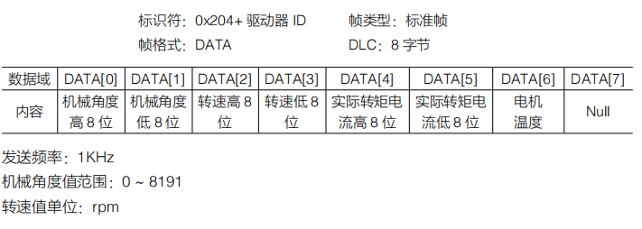
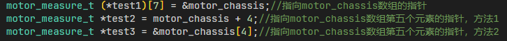
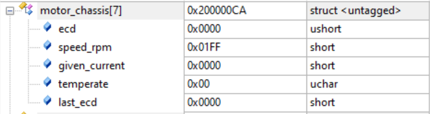

# CAN

### 引入

CAN 通讯是一种常见的现场总线通信方式，RoboMaster 大部分电机均是使用 CAN 通信进行控制的。

### 基础学习

CAN 是控制器域网 (Controller Area Network, CAN) 的简称，是由研发和生产汽车电子产品著称的德国 BOACH 公司开发，并最终成为国际标准（ISO11898），CAN 是国际上应用最广泛的现场总线之一。 在北美和西欧，CAN 总线协议已经成为汽车计算机控制系统和嵌入式工业控制局域网的标准总线，并且拥有以 CAN 为底层协议专为大型货车和重工机械车辆设计的 J1939 协议。

CAN 总线由 CAN_H 和 CAN_L 两根线构成，各个设备一起挂载在总线上。

RoboMaster 系列电机也采用 CAN 协议进行通信，CAN 协议比较复杂，一个完整的数据帧由下图中的各个部分组成：

这里重点介绍 CAN 的仲裁场和数据场的内容。和 I2C 总线一样，每一个挂载在 CAN 总线上的 CAN 都有一个自己独属的 ID，每当一个设备发送一帧数据时，总线其他设备会检查这个 ID 是否是自己需要接收数据的对象，如果是则接收本帧数据，如果不是则忽略。ID 存储在数据帧最前头的仲裁场内，CAN 的 ID 分为标准 ID 和拓展 ID 两类，标准 ID 长度为 11 位。如果设备过多，标准 ID 不够用的情况下，可以使用拓展 ID，拓展 ID 的长度有 29 位。

在通过 ID 判断本帧数据可以接收后，控制场中的 DLC 规定了本帧数据的长度，而数据场内的数据的大小为 8 Byte，即 8 个 8 位数据。CAN 总线的一个数据帧中所需要传输的有效数据实际上就是这 8Byte。

### RM电机

这里只介绍电机中CAN通信的部分，其他详见3508和6020的数据手册 

[3508传送门](https://www.robomaster.com/zh-CN/products/components/general/M3508)

[6020传送门](https://www.robomaster.com/zh-CN/products/components/general/GM6020)

#### 3508

##### 发送数据格式

我们向c620电调发送的是电流输出值，发送的数据里包含两个标识符(0x200和0x1FF)各自对应控制4个ID的电调。控制电流值范围为-16384-0-16384，对应电调输出的转矩电流范围 -20-0-20A

#### 接收数据格式

电调向总线上发送的反馈数据。标识符为0x200+电调ID（如：ID为1，该标识符为0x201）。发送频率为1KHz。转子机械角度值范围0-8191（对应转子机械角度为0-360），转子的转速值的单位为：RPM，电机温度的单位为摄氏度

#### 6020

##### 发送数据格式（电压

控制驱动器的电压输出，一条指令最多可以同时控制四个电机，电压给定值范围-25000-0-25000

##### 发送数据格式（电流

控制驱动器的电流输出，一条指令最多可以同时控制4个电机

##### 接收数据格式

电机向总线上发送的反馈数据，包含机械角度，转速，电流，温度信息

### CubeMX配置

1. 首先理清需求，我们知道C型开发板上有两个CAN口，分别为CAN1和CAN2。而因为CAN2还需要专门焊线，所以这里我们选择只用CAN1加上分电板来连接一个GM3508和GM6020电机（官方例程是选择开启CAN1和CAN2，将CAN1连接3508，CAN2连接6020）如果直接使用例程运行务必确认连接。
2. 接着我们打开C型开发板用户手册，在附表中找到CAN1对应的IO口

3. 我们打开CubeMX，在Connectivity菜单栏下找到CAN1，选中Activated

4. 在右边的引脚视图中，我们发现CubeMX默认打开的是PB8，PB9，与手册中的不符合，于是我们修改引脚的配置，改为PD1，PD0

5. 然后，我们对CAN1进行配置，在刚刚Activated选项的下面，Configuration下选中Parameter Setting菜单栏，将Prescaler设置为3，Time Quanta in Bit Segment 1 设置为 10 Times， Time Quanta in Bit Segment 2 设置为3 Times

> [!caution]
>
> 这里是还没有配置时钟树时进行的修改，如果已经将时钟树修改成平常配置，要先设置 Time Quanta in Bit Segment 1 为 10 Times, Time Quanta in Bit Segment 2 为 3 Times，再配置Prescaler为3（要注意的是顺序）不然会报错。

6. 接着我们选中NVIC Setting菜单栏，将CAN1 RX0 interrupts打开

7. 之后再完成其他的基础配置就好啦

### 函数介绍

#### HAL_CAN_AddTxMessage

| 函数              |                                                              |
| ----------------- | ------------------------------------------------------------ |
| 函数名            | HAL_CAN_AddTxMessage(CAN_HandleTypeDef *hcan, CAN_TxHeaderTypeDef *pHeader, uint8_t aData[], uint32_t *pTxMailbox) |
| 函数功能          | 将一段数据通过CAN总线发送                                    |
| 返回值            | HAL_StatusTypeDef, HAL库定义的几种状态，如果本次CAN发送成功，则返回HAL_OK |
| 参数1 *hcan       | *hcan can的句柄指针，如果是can1就输入&hcan1， can2就输入&hcan2 |
| 参数2 *pHeader    | *pHeader 待发送的CAN数据帧信息的结构体指针，包含了CAN的ID，格式等重要信息 |
| 参数3 aData[]     | aData[] 装载了待发送的数据的数组名称                         |
| 参数4 *pTxMailbox | 用于存储CAN发送所使用的邮箱号                                |

#### HAL_CAN_RxFifo0MsgPendingCallback

CAN的接收中断回调函数

#### HAL_CAN_GetRxMessage

| 函数           |                                                              |
| -------------- | ------------------------------------------------------------ |
| 函数名         | HAL_CAN_GetRxMessage(CAN_HandleTypeDef *hcan, uint32_t RxFifo, CAN_RxHeaderTypeDef *pHeader, uint8_t aData[]) |
| 函数功能       | 接收CAN总线上发送来的数据                                    |
| 返回值         | HAL_StatusTypeDef, HAL库定义的几种状态，如果本次CAN接收成功，则返回HAL_OK |
| 参数1 *hcan    | *hcan can的句柄指针，如果是can1就输入&hcan1， can2就输入&hcan2 |
| 参数2 RxFifo   | RxFifo 接收时使用的CAN接收FIFO号，一般为CAN_RX_FIFO0         |
| 参数3 *pHeader | *pHeader 待发送的CAN数据帧信息的结构体指针，包含了CAN的ID，格式等重要信息 |
| 参数4 aData[]  | 存储接收到的数据的数组名称                                   |

### 函数解读

#### CAN_cmd_gimbal

补充一下，gimbal_tx_message.RTR,这个字段设置消息是数据帧还是远程帧。数据帧（`CAN_RTR_DATA`）包含数据，而远程帧（`CAN_RTR_REMOTE`）是一种请求，用于从另一个节点请求数据。在这个例子中，我们正在发送实际的数据（如云台的位置和射击命令）。

#### HAL_CAN_RxFifo0MsgPendingCallback

其中rx_header存储了包括标识符，发送字符长度，ID等重要信息

### 接收数据注意要点

以下三种是可以在debug模式中的watch看到数据的声明方式，分别对应如下的watch界面

错误示范：

如果直接将这个东西加进watch，会什么都看不到。

### CAN波特率

CAN总线波特率计算原理如下图所示

根据上图，CAN 总线波特率和 tq (Time Quantum)，tBS1 (Time Quanta in Bit Segment 1)和 tBS2 (Time Quanta in Bit Segment 1) 的值直接相关，tq 通过总线分频后直接得到，tBS1和 tBS2 则通过 TS1 和 TS2 放大为 tq 的若干倍，需要注意的是下图中 tBS1 和 tBS2 的计算是通过 tq*(TS1+1)和 tq*(TS2+1)得到的，而在 cubeMX 中，我们配置的 Time Quanta in Bit Segment 的值对应的就是 (TS1+1)和(TS2+1)。本小节以 CAN1 为例，演示 CAN 的波特率计算过程。首先通过数据手册可以知道 CAN1 和 CAN2 都挂载在 APB1 总线上。

在CubeMx的时钟树种，我们设置APB1总线的外设频率为42MHz。而我们在配置中，将prescaler分频设置为3，所以我们可以计算出tq的值
$$
t_q = \frac{1}{\frac{42MHz}{3}} = 71.42857142857143ns
$$
接着我们知道我们在配置中将TS1+1设置成10,TS2+1设置为3，通过tq，TS1和TS2我们可以计算出tBS1和tBS2了
$$
t_{BS1} = t_q * (TS1 + 1) = 71.42857142857143ns * 10 = 714.2857142857143ns\\
t_{BS2} = t_q * (TS2 + 1) = 71.42857142857143ns * 3 = 214.28571428571428ns
$$
我们知道 $波特率 = \frac{1}{标称位时间}$ ， $标称位时间t = t_q + t_{BS1} + t_{BS2} = 1000ns$​，于是我们就可以算出波特率
$$
R_b = \frac{1}{t} = \frac{1}{1000ns} = 1Mbps
$$
 通过以上配置就可以配置出和电机通讯所需要的波特率1Mbps
