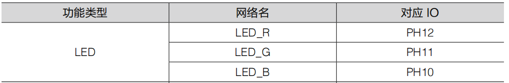
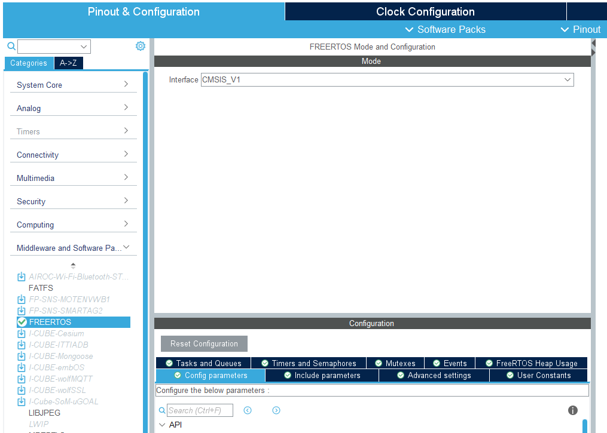
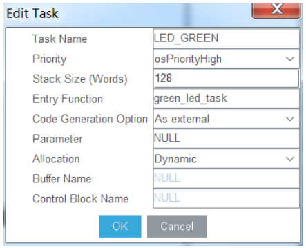

# FreeRTOS

### 基本介绍

操作系统 (Operating System) 的本质是一个帮助用户进行功能管理的软件。操作系统运行在硬件之上，为其他工作的软件执行资源分配等管理工作。


一般称呼不使用操作系统的单片机开发方式为“裸机开发”，当进行裸机开发时，需要自己设计循环，中断，定时等功能来控制各个任务的执行顺序。而使用操作系统进行开发时，只需要创建任务，操作系统会自动按照一些特定的机制自动进行任务的运行和切换。除了任务管理之外，操作系统还可以提供许多功能，比如各个任务之间的通信，同步，任务的堆栈管理，控制任务对重要资源的互斥访问等。

由于单片机的资源比较少，显然无法运行如 Windows，MacOS 等计算机操作系统，一般在单片机上运行的是经过专门设计的嵌入式实时操作系统 (RTOS)。

本节课要介绍的 freeRTOS 就是其中一种，其他比较常见的嵌入式实时操作系统还有uCOSⅡ，RTThread 等。freeRTOS 操作系统是完全免费的操作系统，具有源码公开、可移植、可裁减、调度策略灵活的特点，可以方便地移植到各种单片机上运行，并且有着庞大的社区和生态。

freeRTOS 对各个任务的切换调度需要遵循一定的规则，在进阶学习部分中有详细的介绍。

### CubeMX配置

为了熟悉这个操作系统，我们来试着用操作系统来简单地点一下灯

1. 看C型开发板用户手册，我们可以知道LED灯对应的IO引脚，我们将它对应的GPIO口打开，这里不多讲



2. 打开CubeMX，新建项目，在左侧菜单栏中可以找到Middleware标签页，选中其中的FREERTOS选项，进入FREERTOS的配置页面。在Mode页面下，选择interface版本，这里选择CMSIS_V1。

> [!note]
>
> CMSIS 是由 Keil 提供的一套特殊的函数接口，他对 freeRTOS 的功能函数进行了封装，使其变得更加易用，在使用freeRTOS 时，不需要再去直接调用 freeRTOS 的函数，只需要调用 CMSIS 为我们提供的函数即可，目前 CMSIS 有 V1 和 V2 两个版本。



通过以上方式就可以完成 freeRTOS 的开启，在生成代码之后，freeRTOS 会自动被移植到工程中。

3. 接着在 Configuration 页面下进行 freeRTOS 的配置。在页面中，可以配置 freeRTOS 的一些重要的属性，包括是否支持抢占机制，freeRTOS 的

	系统时钟速率，最大优先级数量，最小任务栈尺寸，最大任务名称长度等。针对一些比较重要的配置列表如下：


| 名称               | 功能                                                         |
| ------------------ | ------------------------------------------------------------ |
| USE_PREEMPTION     | 是否支持抢占机制，支持则设为Enabled                          |
| TICK_RATE_HZ       | 系统时钟速率，时钟按照该速率为诶 freeRTOS 中各个任务执行计时，设置为 1000Hz，则每个任务的最小调度时间为1ms |
| MAX_PRIORITIES     | 最大优先级数量，默认为 7                                     |
| MINIMAL_STACK_SIZE | 最小任务栈大小，每当创建一个任务时，都需要为该任务分配一定大小的栈空间，任务需要使用的变量等都存储在该栈空间中。默认的最小值为 128 个字。 |
| MAX_TASK_NAME_LEN  | 最大任务名称长度，在创建任务时，需要给每个任务起名作为标识，这个名称可以用一个字符串表示，本参数规定了字符串长度的上限值，默认为 16 |

### CubeMX中创建任务

1. 首先在 freeRTOS 的配置页面中的Configuration 下，选中 Tasks and Queues 标签页，存在一个已经创建的默认任务为“defaultTask”，点击进入配置选项修改为如下图所示。


各个参数的具体功能见下表：

| 名称                   | 功能                                                         |
| ---------------------- | ------------------------------------------------------------ |
| Task Name              | 任务名称                                                     |
| Priority               | 任务创建时的优先级                                           |
| Stack Size(Words)      | 任务栈的大小，默认单位为字                                   |
| Entry Function         | 任务函数的入口                                               |
| Code Generation Option | 任务函数代码生成方式，设置为Default则会产生一个普通的任务函数，As weak: 产生一个用_weak修饰符修饰的任务函数；As external：产生一个外部引用的任务函数，用户需要自己实现该函数；Default: 产生一个默认格式的任务函数，用户需要在该函数实现功能 |

2. 接着我们再试着新建一个任务，点击Tasks那一栏的Add选项，我们就成功创建了一个新的任务。将任务配置成如下所示，配置完毕之后点击OK。我们就可以看到列表中多出了自己创建的任务




3. 将其他的基础配置处理好，就可以点击generate code 啦

4. 在代码中，我们可以看到在freeRTOS中创建的任务


因为red_led_task 我们选择了weak，green_led_task我们选择了external，所以生成了上面的代码。由于新建了任务“LED_GREEN”，并且设置为 Asexternal，故而需要再在别处实现任务函数。程序执行时会自动寻找到实现的任务函数。

### 代码中创建任务

1. 打开 freertos.c 文件，在 MX_FREERTOS_Init 中，找到创建两个进程的代码，分别是LED_RED 和 LED_GREEN。可以看到要创建任务时，只需要调用 osThreadDef 和osThreadCreate 即可，创建“LED_BLUE”任务。


我们在这里先介绍以下osThreadDef， 这是一个由CMSIS提供的宏定义，用于对要创建的任务进行设置。

#### osThreadDef

```c++
#define osThreadDef(name, thread, priority, instances, stacksz)  \
extern const osThreadDef_t os_thread_def_##name
```

| 函数  |                                        |
| ----- | -------------------------------------- |
| 名称  | osThreadDef                            |
| 功能  | 对要创建的任务进行设置                 |
| 参数1 | name，要创建的任务的名称               |
| 参数2 | thread，要创建的任务代码的人口名称     |
| 参数3 | priority， 要创建的任务的优先级        |
| 参数4 | instances， 任务下可以创建的线程的数量 |
| 参数5 | stacksz， 任务栈大小                   |

#### osThreadCreate

| 函数     |                                                              |
| -------- | ------------------------------------------------------------ |
| 函数名称 | osThreadCreate(const osThreadDef_t *thread_def, void *argument) |
| 函数功能 | 创建一个任务                                                 |
| 返回值   | osThreadId，任务ID，ID是一个任务的重要标识，当在创建完任务后需要执行修改这个任务的优先级，或者销毁该任务时，就需要调用任务ID，需要提前声明一个类型为osThreadID的变量在此处存储返回值 |
| 参数1    | *thread_def，我们通过osThreadDef所设置的任务参数，采用强制转换+任务名的方式进行输入，比如在osThreadDef中设置任务名为LED_RED，则在此处输入osThread(LED_RED) |
| 参数2    | argument, 任务需要的初始化参数，一般填为NULL                 |

2. 接着，还需要在上面的代码加上任务的Handle和申明函数名


3. 通过以上两步，一个任务就成功创建了，创建一个名称和 osThreadDef 中的 thread 参数一致的函数，操作系统会自动找到该函数并将其作为一个进程来执行。比如声明 thread 为blue_led_task，则还需要执行函数 void blue_led_task(void const * argument)，while(1)循环中的内容为用户自己的代码，这里是控制蓝色 led 灯闪烁。

### IMPORTANT

如果你出现用--cpp11编译莫名奇妙出现18个报错，且都是与FreeRTOS有关的问题，或者是上面的例程明明include 了外部hpp头文件但是系统没编译且在乱说没找到，请看下面的这篇文章!

[FreeRTOS c与c++混合编译报错传送门](https://blog.csdn.net/weixin_59383360/article/details/131958534)

[方法2](https://kurumi-guyi.top/2019/10/30/cubemx-HAL-freertos_complie_CC_file_err/) 


出现这个报错的话看一下

[传送门1](http://www.cppblog.com/LT450196683/archive/2021/07/14/217750.html)

[传送门2](https://blog.csdn.net/a1347065101/article/details/131587246)