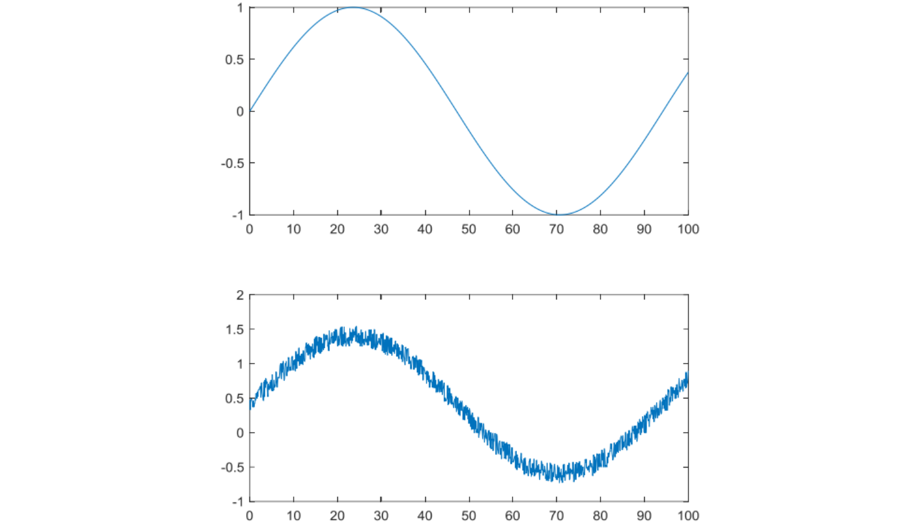
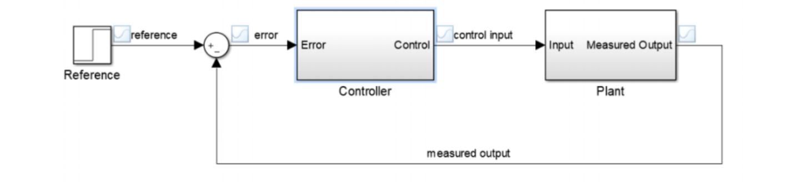

# IMU_PID

### 引入

本节课将学习使用 PID 控制算法对 IMU 进行温度控制，对 IMU 进行温度控制可以有效降低温度零漂。其中在文档控制中使用 PID 控制算法，而 PID 控制算法则是一种常见的控制算法，也将在这章进行简单的介绍。

### IMU

在第 13 章 BMI088 章节介绍过了 BMI088 由陀螺仪和加速度计两个传感器组合而成。传感器的基本功能便是把外界不同的物理量，化学量和生物量变换容易处理的电信号或者数字信号并输出。而由于实际上传感器中在放大，滤波，采样等过程不可避免地引入噪声，其中一个重要的噪声便是热噪声。热噪声是指由于电子热运动产生的随机电信号，如图所示，上图是一个理想的正弦信号，在实际传播过程中正弦信号叠加热噪声后会变成下图中带有杂波且 y 轴方向具有偏移的信号。

热噪声导致 IMU 数据偏移是 IMU 会产生零漂现象的重要原因之一。

零漂现象是指当物理量输入为零，传感器测量的输出量不为零的现象。即 IMU 没有任何运动，陀螺仪和加速度计也会读取到一定大小的数据，并将其当作是由 IMU 运动产生的。因此需要在 IMU 上电时首先测量出零漂的大小，将 IMU 测量到的值与零漂值相减，从而减少零漂的影响。这种方法的前提是 IMU 的零漂值保持固定，否则依然会引入误差。

热噪声的幅度和温度成正相关，所以零漂值受到温度的影响，因此需要控制 IMU 的温度保持一个恒定的范围内，从而减少零漂带来的影响。

### PID

#### 理论

PID 是一种常用的闭环控制算法，其基本思想是利用期望值和实际值的误差作为控制量决定最终的输出。

如上图所示，一个控制过程分别为：

* 控制目标输入值 (reference)

* 作差得出误差值 (error)

* 控制器 (controller)

* 系统对象 (plant)

* 反馈值 (measured output)

而 PID 控制属于控制器的一种，由 P（比例），I（积分），D（微分）三项构成。我们这里先介绍增量式 PID 控制器。PID 输出值 U(t)的表达式如下，其中 err(t)即误差值，Kp，Ki，Kd 分别为比例，积分，微分三项的系数。
$$
U(t) = K_p * err(t) + K_i * \int_{}^{}err(t)dt + K_d * \frac{derr(t)}{dt}
$$
**比例项 Kp：**控制器比例项输出值和误差值保持线性关系，误差值放大一倍则输出值也同样放大一倍，误差值缩小一倍则输出值也同样缩小一倍。只依靠比例项进行控制的方法称为比例控制，比例控制可以很简单的实现控制器的基本功能， 但往往存在静差以及过大引起系统振荡的问题。

**积分项 Ki：**控制器积分项输出值与误差值的积分值成线性关系，即误差值的累计值乘以一个常数。通过对误差累积的作用影响控制器的输出，并通过系统的负反馈作用减小偏差 ，只要有足够的时间，积分控制将能够消除稳态误差，但积分增益过大容易引起积分超调的现象。

**微分项 Kd：**微分项的大小和输出值的变化量成正相关，微分项计算误差的一阶导数，并和一个常数相乘，得到微分项的输出值。微分项可以对系统的改变做出反应，对系统的短期改变很有帮助。

#### 实践

由于数字系统是离散的，在单片机中实现 PID 控制算法时，需要将 PID 控制器的输出表达式改写成离散形式，其具体的做法就是将输出 u(t)和误差 e(t)由函数改成数组 u(k)和 e(k)，积分换成求和，微分换成差分。离散化后的 PID 表达式如下：
$$
u(k) = K_p * e(k) + K_i *\sum_{i = 0}^{k}e(i) + K_d *[e(k)- e(k-1)]
$$
上文我们介绍了位置式PID控制器，即误差值直接决定最后的输出，而在实践中，增量式则有更好的表现。增量式PID控制器则用误差值来控制每次输出的改变量 $\Delta u$， 我们有
$$
\Delta u(k) = u(k) - u(k-1)
$$
其表达式为:
$$
\Delta u (k) = K_p*[e(k)-e(k-1)] + K_i * e(k) + K_d * [e(k) - 2*e(k-1) + e(k-2)]
$$
相比位置式PID，增量式PID控制有以下优点：

* 不需要累加计算累加，输出增量只和前三次误差采样值有关，参数更容易调节
* 每次只输出控制增量，故发生故障时产生的影响较小

使用增量式 PID 时需要记忆上一次的输出值，将上一次的输出值和增量相加才能得到本次输出值

### 函数介绍

#### 任务唤醒功能

在某些情况下，某些任务需要通过某些特定条件（比如中断或者是另一个任务执行完成）来触发执行。通常使用任务通知功能来完成，主任务在没有接到任务通知时会保持休眠，当满足触发条件时发出任务通知，等待触发的主任务接到任务通知后就会进入就绪状态等待一次执行，在执行完毕之后又进入休眠状态，直到下一次任务通知到来。

在实例程序中使用外部中断作为触发条件，在外部中断处理函数中发出任务通知，IMU 的温度控制任务 imu_temp_control_task 等待任务通知的唤醒。

#### vTaskNotifyGiveFromISR

freeRTOS 提供了从中断发出任务通知的函数 vTaskNotifyGiveFromISR

| 函数     |                                                              |
| -------- | ------------------------------------------------------------ |
| 函数名   | vTaskNotifyGiveFromISR(TaskHandle_t **xTaskToNotify**, BaseType_t ***pxHigherPriorityTaskWoken**) |
| 函数功能 | 从中断处理函数中发出一个任务通知，唤醒等待中的任务           |
| 返回值   | 无                                                           |
| 参数 1   | xTaskToNotify 被通知的任务的任务句柄                         |
| 参数 2   | *pxHigherPriorityTaskWoken 用于保存是否有高优先级任务准备就绪。如果函数执行完毕，此参数的数值为 pdTRUE，说明有高优先级任务要执行，否则没有 |

#### xTaskGetHandle

freeRTOS 提供了为等待唤醒的任务获取任务句柄的函数 xTaskGetHandle，这个任务句柄需要和发送任务通知中的参数一致

> [!caution]
>
> 必须要在CubeMX中使能"xTaskGetHandle"

| 函数     |                                               |
| -------- | --------------------------------------------- |
| 函数名   | xTaskGetHandle(const char ***pcNameToQuery**) |
| 函数功能 | 获取任务句柄                                  |
| 返回值   | TaskHandle_t 任务句柄                         |
| 参数 1   | *pcNameToQuery 需要获取句柄的任务的名称       |

#### pcTaskGetName

freeRTOS 提供了获取任务名称的函数pcTaskGetName

| 函数     |                                                              |
| -------- | ------------------------------------------------------------ |
| 函数名   | pcTaskGetName(TaskHandle_t **xTaskToQuery**)                 |
| 函数功能 | 获取任务名称                                                 |
| 返回值   | char* 任务名称                                               |
| 参数 1   | TaskHandle_t xTaskToQuery 需要获取名称的任务的句柄，如果为NULL则获取当前运行任务的名称 |

#### ulTaskNotifyTake

freeRTOS 提供了实现接收任务通知，唤醒休眠任务的机制

| 函数     |                                                              |
| -------- | ------------------------------------------------------------ |
| 函数名   | ulTaskNotifyTake(BaseType_t **xClearCountOnExit**, TickType_t **xTicksToWait**) |
| 函数功能 | 接收任务通知，唤醒休眠任务                                   |
| 返回值   | 调用函数前已经累积的该任务的通知计数                         |
| 参数 1   | xClearCountOnExit 选择是否清零用于任务通知 的ulNotifiedValue，配置为 pdFALSE 表示函数在返回累积的通知计数后将它减一。 参数配置为 pdTRUE 表示函数在返回累积的通知计数后将其清零 |
| 参数 2   | xTicksToWait 等待信号量可用的最大等待时间                    |

这里我们用一个例子讲解一下这个xClearCountOnExit

假如我们每次唤醒任务只需要处理一次，那么我们就会选择pdTRUE，也就是在我们执行任务中，不管发送了多少通知我也只处理一次。

假如我们在任务等待期间发送了多个通知，那么它们会被累积起来。每次处理完一个事件，通知数减一直到所有累积的事件都被处理完。

* pdTRUE适用于每次只处理最新的事件
* pdFALSE适用于需要逐一处理每个累计事件的情况

### 控制链路

整个运行任务的控制链路为：IMU 的加速度计外部中断引脚 INT1_ACCEL_Pin 触发外部中断，外部中断回调函数 HAL_GPIO_EXTI_Callback 中调用 vTaskNotifyGiveFromISR 函数发送任务通知，IMU 温度控制任务 imu_temp_control_task 接收到任务通知之后开始执行，执行完毕之后进入休眠，等待下一次任务通知，流程图如下：

