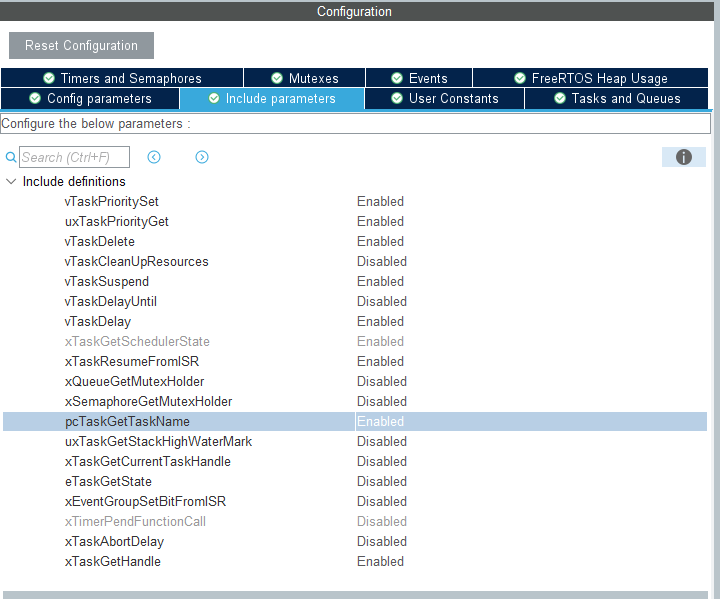
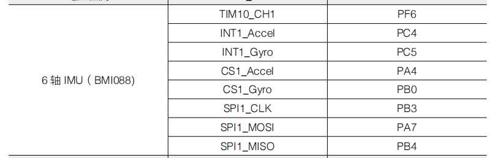
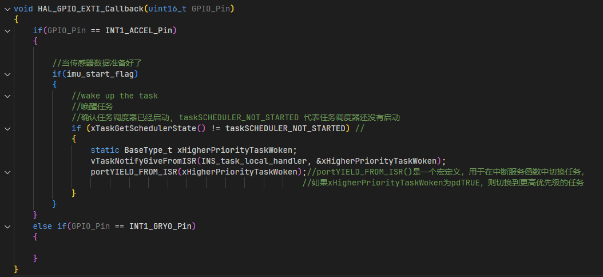
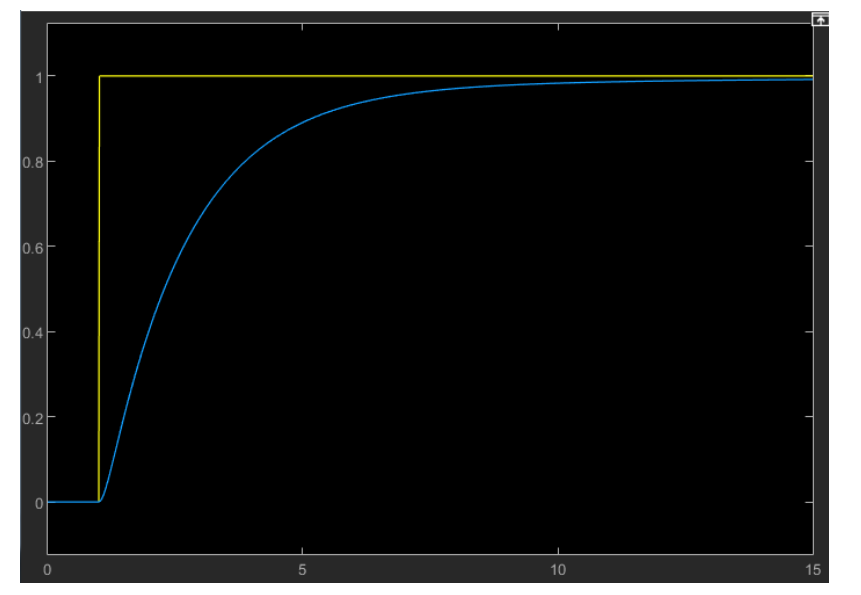
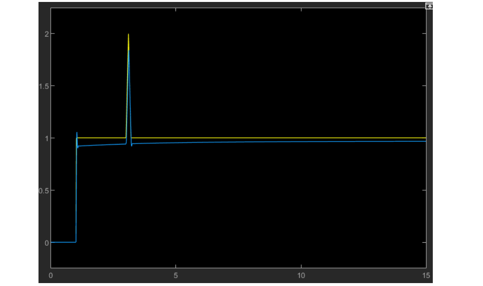

# IMU_PID

### 引入

本节课将学习使用 PID 控制算法对 IMU 进行温度控制，对 IMU 进行温度控制可以有效降低温度零漂。其中在文档控制中使用 PID 控制算法，而 PID 控制算法则是一种常见的控制算法，也将在这章进行简单的介绍。

### IMU

在第 13 章 BMI088 章节介绍过了 BMI088 由陀螺仪和加速度计两个传感器组合而成。传感器的基本功能便是把外界不同的物理量，化学量和生物量变换容易处理的电信号或者数字信号并输出。而由于实际上传感器中在放大，滤波，采样等过程不可避免地引入噪声，其中一个重要的噪声便是热噪声。热噪声是指由于电子热运动产生的随机电信号，如图所示，上图是一个理想的正弦信号，在实际传播过程中正弦信号叠加热噪声后会变成下图中带有杂波且 y 轴方向具有偏移的信号。

热噪声导致 IMU 数据偏移是 IMU 会产生零漂现象的重要原因之一。

零漂现象是指当物理量输入为零，传感器测量的输出量不为零的现象。即 IMU 没有任何运动，陀螺仪和加速度计也会读取到一定大小的数据，并将其当作是由 IMU 运动产生的。因此需要在 IMU 上电时首先测量出零漂的大小，将 IMU 测量到的值与零漂值相减，从而减少零漂的影响。这种方法的前提是 IMU 的零漂值**保持固定**，否则依然会引入误差。

热噪声的幅度和温度成正相关，因此如果我们将IMU的温度控制在一个恒定的范围内，我们就可以将零漂的幅度控制在一定的范围内，使它接近恒定，从而减小误差。那么我们该如何控制 IMU 的温度保持在一定范围内呢？这里我们就需要用到闭环控制这样一种控制方法啦。

### 控制算法

我们在控制电机的时候应用的经典控制算法可以分为开环控制和闭环控制。

* 开环控制

	即只受系统输入控制的没有反馈回路的控制。比如我向电机发送电流值，那么电机就转起来了，但是我不知道电机的转速如何，跟我想要达到的效果相差多少。所以当我们想要对电机进行精细的控制时比如说转速为100rpm，开环控制就不够用了，所以就衍生出了闭环控制

* 闭环控制

	与开环控制相反，闭环控制在接收系统输入控制的同时，会将电机目前的状态，比如电压电流，转速，温度等通过反馈回路发送回系统。这时候我们就知道目标值与实际值相差多少，也就可以有精确控制的余地，那么我们接下来介绍的PID控制算法就是闭环控制算法的一种。

* 进阶算法

	可以看看这一位up主[传送门](https://space.bilibili.com/230105574/channel/series) ，讲得很棒

### PID

#### 理论

PID 是一种常用的闭环控制算法，其基本思想是利用期望值和实际值的误差作为控制量决定最终的输出。

如上图所示，一个控制过程分别为：

* 控制目标输入值 (reference)

* 作差得出误差值 (error)

* 控制器 (controller)

* 系统对象 (plant)

* 反馈值 (measured output)

而 PID 控制属于控制器的一种，由 P（比例），I（积分），D（微分）三项构成。我们这里先介绍增量式 PID 控制器。PID 输出值 U(t)的表达式如下，其中 err(t)即误差值，Kp，Ki，Kd 分别为比例，积分，微分三项的系数。
$$
U(t) = K_p * err(t) + K_i * \int_{}^{}err(t)dt + K_d * \frac{derr(t)}{dt}
$$
**比例项 Kp：**控制器比例项输出值和误差值保持线性关系，误差值放大一倍则输出值也同样放大一倍，误差值缩小一倍则输出值也同样缩小一倍。只依靠比例项进行控制的方法称为比例控制，比例控制可以很简单的实现控制器的基本功能， 但往往存在静差以及过大引起系统振荡的问题。

**积分项 Ki：**控制器积分项输出值与误差值的积分值成线性关系，即误差值的累计值乘以一个常数。通过对误差累积的作用影响控制器的输出，并通过系统的负反馈作用减小偏差 ，只要有足够的时间，积分控制将能够消除稳态误差，但积分增益过大容易引起积分超调的现象。

**微分项 Kd：**微分项的大小和输出值的变化量成正相关，微分项计算误差的一阶导数，并和一个常数相乘，得到微分项的输出值。微分项可以对系统的改变做出反应，对系统的短期改变很有帮助。

#### 实践

由于数字系统是离散的，在单片机中实现 PID 控制算法时，需要将 PID 控制器的输出表达式改写成离散形式，其具体的做法就是将输出 u(t)和误差 e(t)由函数改成数组 u(k)和 e(k)，积分换成求和，微分换成差分。离散化后的 PID 表达式如下：
$$
u(k) = K_p * e(k) + K_i *\sum_{i = 0}^{k}e(i) + K_d *[e(k)- e(k-1)]
$$
上文我们介绍了位置式PID控制器，即误差值直接决定最后的输出，而在实践中，增量式则有更好的表现。增量式PID控制器则用误差值来控制每次输出的改变量 $\Delta u$， 我们有
$$
\Delta u(k) = u(k) - u(k-1)
$$
其表达式为:
$$
\Delta u (k) = K_p*[e(k)-e(k-1)] + K_i * e(k) + K_d * [e(k) - 2*e(k-1) + e(k-2)]
$$
相比位置式PID，增量式PID控制有以下优点：

* 不需要累加计算累加，输出增量只和前三次误差采样值有关，参数更容易调节
* 每次只输出控制增量，故发生故障时产生的影响较小

使用增量式 PID 时需要记忆上一次的输出值，将上一次的输出值和增量相加才能得到本次输出值

### CubeMX配置

1. 关于BMI088的配置参见相关章节，这里主要配置相关的温度控制回路
2. 打开C型开发板用户手册，找到BMI088的相关内容，可以看到里面关于加热电路的介绍

3. 继续往下看，可以看到关于加热电路的原理图部分，我们发现，这个加热电路是通过TIM10的通道1用PWM控制的

	

4. 打开CubeMX，在Timers菜单栏中找到TIM10，在右侧点击activated，Channel 1选中PWM Generation CH1。在Configuration下找到自动重载寄存器 AutoReload Register，将它设置为4999

	

5. 在Middleware and Software Packs菜单栏下找到FREERTOS，Interface选择CMSIS_V1

6. 接下来我们配置一下需要用到的函数。除了PID控制之外，我们本节课的目的还有学习更进一步地使用FREERTOS。除了我们上节课使用的不断循环的LED灯逻辑，很多任务我们希望它能有像中断一样的功能。那么这里有着很多FREERTOS中可以使用的函数。在本节课中，我们将会介绍几种函数的使用方法。我们先来配置一下它们。在Configuration下找到Include parameter 标签页，将pcTaskGetTaskName 和 xTaskGetHandle 选项设置成Enabled，这样我们就使能了这两个函数，这两个函数的具体功能参见下面的函数介绍章节。

7. 之后我们来配置一下我们的任务。在Configuration 下的Tasks and Queues 标签页，我们向系统中添加如下任务。将优先级设置为osPriorityNormal， Stack Size设置成512，Entry Function 这里按照例程名字编写，可以自定义。Code Generation 设置为 as weak， 

8. 作为唤醒任务的条件，我们将使用引脚的外部中断，并设置BMI088的外部输出模式。我们找到这两个中断引脚(INT1_Accel和INT1_Gyro)对应的IO口，分别为PC4，PC5。将它们设置成外部中断模式

	

	

	

9. 在GPIO的配置页面，我们找到System Core下的NVIC标签页，将EXTI line 4 interrupt 和 EXTI line[9:5] interrupt打开

10. 之后完成常规配置就好啦。

### 函数介绍

#### 任务唤醒功能

在某些情况下，某些任务需要通过某些特定条件（比如中断或者是另一个任务执行完成）来触发执行。通常使用任务通知功能来完成，主任务在没有接到任务通知时会保持休眠，当满足触发条件时发出任务通知，等待触发的主任务接到任务通知后就会进入就绪状态等待一次执行，在执行完毕之后又进入休眠状态，直到下一次任务通知到来。

在实例程序中使用外部中断作为触发条件，在外部中断处理函数中发出任务通知，IMU 的温度控制任务 imu_temp_control_task 等待任务通知的唤醒。

#### vTaskNotifyGiveFromISR

freeRTOS 提供了从中断发出任务通知的函数 vTaskNotifyGiveFromISR

| 函数     |                                                              |
| -------- | ------------------------------------------------------------ |
| 函数名   | vTaskNotifyGiveFromISR(TaskHandle_t **xTaskToNotify**, BaseType_t ***pxHigherPriorityTaskWoken**) |
| 函数功能 | 从中断处理函数中发出一个任务通知，唤醒等待中的任务           |
| 返回值   | 无                                                           |
| 参数 1   | xTaskToNotify 被通知的任务的任务句柄                         |
| 参数 2   | *pxHigherPriorityTaskWoken 用于保存是否有高优先级任务准备就绪。如果函数执行完毕，此参数的数值为 pdTRUE，说明有高优先级任务要执行，否则没有 |

#### xTaskGetHandle

freeRTOS 提供了为等待唤醒的任务获取任务句柄的函数 xTaskGetHandle，这个任务句柄需要和发送任务通知中的参数一致

> [!caution]
>
> 必须要在CubeMX中使能"xTaskGetHandle"，详见下面的使能介绍

| 函数     |                                                              |
| -------- | ------------------------------------------------------------ |
| 函数名   | xTaskGetHandle(const char ***pcNameToQuery**)                |
| 函数功能 | 获取任务句柄                                                 |
| 返回值   | TaskHandle_t 任务句柄                                        |
| 参数 1   | *pcNameToQuery 需要获取句柄的任务的名称，如果为NULL则获取当前运行任务的名称 |

#### pcTaskGetName

freeRTOS 提供了获取任务名称的函数pcTaskGetName

| 函数     |                                                              |
| -------- | ------------------------------------------------------------ |
| 函数名   | pcTaskGetName(TaskHandle_t **xTaskToQuery**)                 |
| 函数功能 | 获取任务名称                                                 |
| 返回值   | char* 任务名称                                               |
| 参数 1   | TaskHandle_t xTaskToQuery 需要获取名称的任务的句柄，如果为NULL则获取当前运行任务的名称 |

#### ulTaskNotifyTake

freeRTOS 提供了实现接收任务通知，唤醒休眠任务的机制

| 函数     |                                                              |
| -------- | ------------------------------------------------------------ |
| 函数名   | ulTaskNotifyTake(BaseType_t **xClearCountOnExit**, TickType_t **xTicksToWait**) |
| 函数功能 | 接收任务通知，唤醒休眠任务                                   |
| 返回值   | 调用函数前已经累积的该任务的通知计数                         |
| 参数 1   | xClearCountOnExit 选择是否清零用于任务通知 的ulNotifiedValue，配置为 pdFALSE 表示函数在返回累积的通知计数后将它减一。 参数配置为 pdTRUE 表示函数在返回累积的通知计数后将其清零 |
| 参数 2   | xTicksToWait 等待信号量可用的最大等待时间                    |

这里我们用一个例子讲解一下这个xClearCountOnExit

假如我们每次唤醒任务只需要处理一次，那么我们就会选择pdTRUE，也就是在我们执行任务中，不管发送了多少通知我也只处理一次。

假如我们在任务等待期间发送了多个通知，那么它们会被累积起来。每次处理完一个事件，通知数减一直到所有累积的事件都被处理完。

* pdTRUE适用于每次只处理最新的事件
* pdFALSE适用于需要逐一处理每个累计事件的情况

### FreeRTOS 函数使能

在Middleware and Software Packs 菜单栏下找到 FREERTOS 标签页，在右侧的Configuration 下找到 Include parameter。这里我们以使能xTaskGetHandle 为例子，找到这个函数，将它改为Enabled。其他函数同理。

### 控制链路

整个运行任务的控制链路为：IMU 的加速度计外部中断引脚 INT1_ACCEL_Pin 触发外部中断，外部中断回调函数 HAL_GPIO_EXTI_Callback 中调用 vTaskNotifyGiveFromISR 函数发送任务通知，IMU 温度控制任务 imu_temp_control_task 接收到任务通知之后开始执行，执行完毕之后进入休眠，等待下一次任务通知，流程图如下：

### 函数解读

#### imu_temp_control_task

FREERTOS的任务函数

#### HAL_GPIO_EXTI_Callback

这个函数就是外部中断的函数。虽然我们启用了两个外部中断，不过INT1_GRYO_Pin没用到。

### 进阶学习-PID调参

前面我们介绍了PID的原理并学习了如何用PID控制来稳定IMU的温度。那么在我们的RM电机上，我们也会经常碰到器件的实际输出和输入的期望值不一致的情况，甚至相差甚远。

在电机上，假设我们输入电机的转速期望为 100rpm，当电机为空载时它的输出转速也恰好是 100rpm，但是当我们给电机加上轮子或者其他负载之后，它的转速就无法达到 100rpm 的期望值了，而是降低到 80rpm。假如电机转动了一段时间后电池电压开始下降了，电机的转速又会进一步的降低。

所以我们也需要对我们的电机进行PID控制，来使它的输出和我们的期望值靠近。那么实际中，应该按照怎样的标准来调参呢，下面我们就分别介绍PID三项中在调参时的具体应用。

#### Kp

控制器比例项输出值和误差值保持线性关系。

比例项 Kp 过小时，PID 控制器的反应速度较慢且存在静差。静差是指控制器的最终输出保持为一个和期望值存在一定误差的值，引发静差的原因时由于比例控制的输出和误差成线性关系，如果当误差值减小时，比例控制器的输出值同样会减少，导致比例控制器不可能达到和期望值完全相同，即误差值为零的情况，因为如果误差值为零则比例控制器的输出也会为零。

下图为 PID 控制器比例项过小的仿真，蓝色曲线为系统的输出，黄色曲线为设定的输入，可以看到最终输出值和期望值之间保持一个恒定的误差值，这个误差值就是静差。

通过增大比例系数 Kp 可以减小静差，提高反应速度。但如果 Kp 过大则会导致输出严重震荡，如下图所示。震荡会使系统的稳定性大大下降。

#### Ki

为了克服静差，可以引入积分项，由于积分的累积性，积分项的输出值由之前所有时刻的误差值决定。因此即使在误差值为零的情况下，积分项也会保持作用，使控制器的输出量不为零，引入积分项之后控制器的输出值才有可以真正等于期望值。

但是引入积分控制器后会延长系统的调节时间，比例-积分控制器的输出值需要相较比例控制器更长的时间趋于稳定，导致系统的响应速度变慢。

如果积分项过小，或者积分上限限幅过小，则输出收敛的时间会非常长，这就导致系统的响应速度非常慢，如下图所示。

而如果积分项过大，或者积分上限过大，则会带来严重的超调。超调即系统输出的峰值远远高于期望值，超调会导致系统需要很长时间才能够趋于稳定，甚至可能无法趋于稳定，会严重影响系统的稳定性，降低系统响应速度，如下图所示。

#### Kd

为了提高系统的响应速度和减少超调量，我们可以引入微分项，微分项的大小和输出值的变化量成正相关，因此每当输入产生急剧变化时，就会产生一个很大的微分项来迅速跟上这一变化，这就可以使得超调量减小。另外由于微分项抵消变化的这一性质，输出波动就可以更快的衰减，减少系统输出稳定需要的时间，从而加快响应速度。

但是如果 D 项过大则输出的一点小变化都会产生很大的输出变化，导致系统发生震荡，如下图所示：

一般我们设计 PID控制器时，需要根据 PID 的实际输出情况对 PID 三项的系数的进行调节，从而让系统的输出快速且稳定。

#### 总结

我们总结一下各个项的功能：

|         | 功能                                   |
| ------- | -------------------------------------- |
| 比例项P | 根据误差值线性调控输出，存在静差和超调 |
| 积分项I | 能够消除静差，但会导致系统响应速度变慢 |
| 微分项D | 减小超调，加快系统响应                 |

