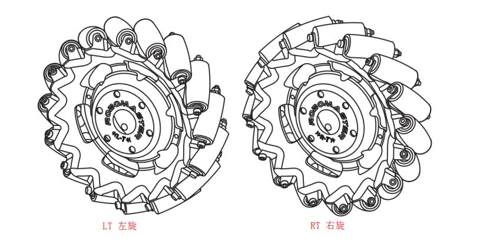
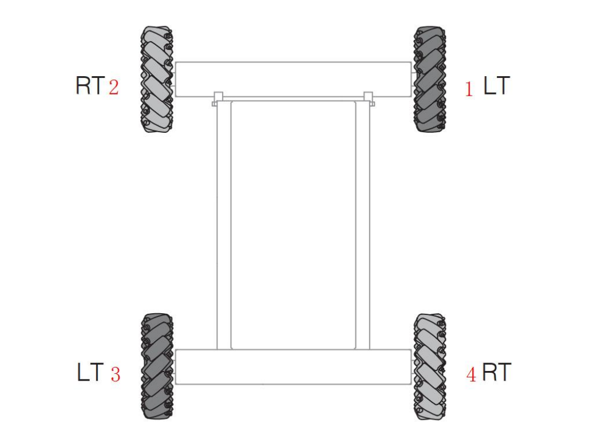
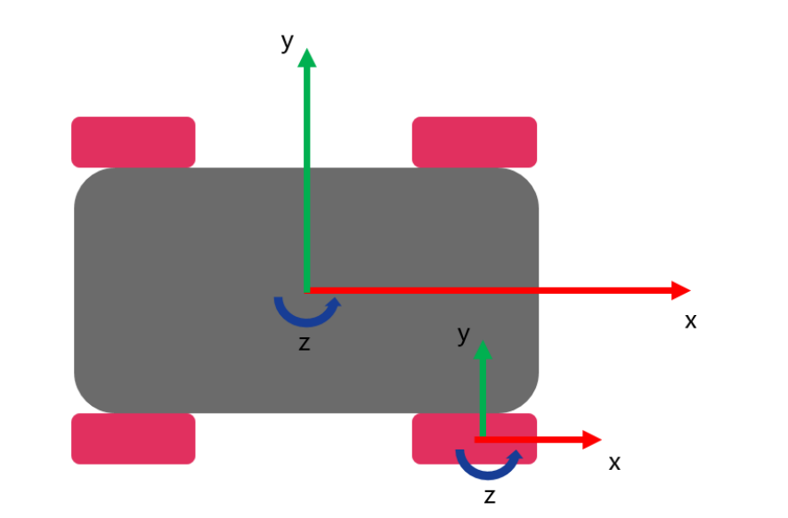

# chassis

### 引入

从这节课开始，我们就将正式介绍RM中的各个部分的控制。首先我们来学习一下底盘的控制。底盘是承载 RoboMaster 机器人运动的机械结构，底盘一般由轮组，悬挂，车架等组成。其中 RoboMaster 比赛底盘轮组使用的是麦克纳姆轮，每个麦克纳姆轮都由单独的电机驱动，以完成全向移动的功能。RoboMaster机器人底盘往往需要配合云台进行配合控制，例如 RoboMaster 机器人底盘角度控制就需要跟随云台角度进行控制,同时底盘在运动过程也需要云台角度进行旋转操作以到达平稳运动的效果。

### 麦轮

RoboMaster 麦克纳姆轮是一款直径为 152.5mm 的 45°全向轮，在轮毂周围分布着 16 个橡胶小滚子，与车轮的轴线成 45°角，机械结构如图所示。麦克纳姆轮根据小胶轮的角度分为左旋麦克纳姆轮和右旋麦克纳姆轮，它们是手性对称，必须成套使用。

在底盘上，根据运动学的解算，我们有如下的安装顺序（俯视图）。1，2，3，4分别代表四个不同的轮子。1，3为左旋，2，4为右旋。

### 底盘运动学

底盘运动方向，需要建立一个坐标系进行讲解，如图所示。底盘前进方向为 x 轴，左移方向为 y 轴，z 轴竖直向上，底盘逆时针旋转为旋转正方向。

一个刚体在平面内具有三个自由度运动，沿 x 轴方向的前后运动 Vx，沿 y 轴方向的左右运动 Vy，绕 z 轴的旋转运动 Wz。根据底盘的三个自由度运动计算四个麦克纳姆轮的运动的过程，称为底盘的正运动过程。根据底盘速度计算麦克纳姆轮的速度如下表所示。

| 底盘速度    | 麦轮速度                                         |
| ----------- | ------------------------------------------------ |
| 前进速度 Vx | V1 = Vx V2 = Vx V3 = Vx V4 = Vx   |
| 左右速度 Vy | V1 = Vy V2 = -Vy V3 = Vy V4 = -Vy |
| 旋转速度 Wz | V1 = Wz V2 = -Wz V3 = -Wz V4 = Wz |

#### 正运动

将他们结合起来我们得到了麦轮各个轮子的速度
$$
v_1 = v_x+v_y+w_y\\
v_2 = v_x-v_y-w_y\\
v_3 = v_x+v_y-w_y\\
v_4 = v_x-v_y+w_y
$$
因为电机1和电机4处于前进速度的时候，它们是顺时针旋转，应该是负值，而电机2，电机3是逆时针旋转是正值，所以修正后的公式为
$$
v_1 = -v_x-v_y-w_y\\
v_2 = v_x-v_y-w_y\\
v_3 = v_x+v_y-w_y\\
v_4 = -v_x+v_y-w_y
$$
由于云台安装位置不在底盘中心，往往是在底盘前部，故而在旋转时，电机 1 和电机 2需要较慢的速度 ， 电机 3 和电 机 4 需要较快的速度，需要一个修正因子

CHASSIS_WZ_SET_SCALE(小于 1)，假定为 a 参数，故而修改后的公式为：
$$
v_1 = -v_x -v_y + (a-1)*w_y\\
v_2 = v_x -v_y + (a-1)*w_y\\
v_3 = v_x + v_y + (-a-1)*w_y\\
v_4 = -v_x +v_y + (-a-1)*w_y
$$
不理解下面两个(-a-1)怎么来的，之后再看吧，下面是两个参考文档

[传送门1](https://www.robotsfan.com/posts/b6e9d4e.html)

[传送门2](https://zhuanlan.zhihu.com/p/20282234) 

#### 逆运动

由上面我们修正后的第一条公式，我们通过数学换算可以反推得到 $v_x, v_y, w_z$ 。这里只简单列出我们的结论
$$
v_x = 0.25[(v_2 + v_3)-(v_1 + v_4)]\\
v_y = 0.25[(v_3 + v_4)-(v_1 +v_2)] \\
w_z = -0.25(v_1 +v_2 + v_3 + v_4)
$$
