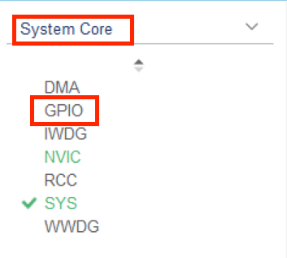
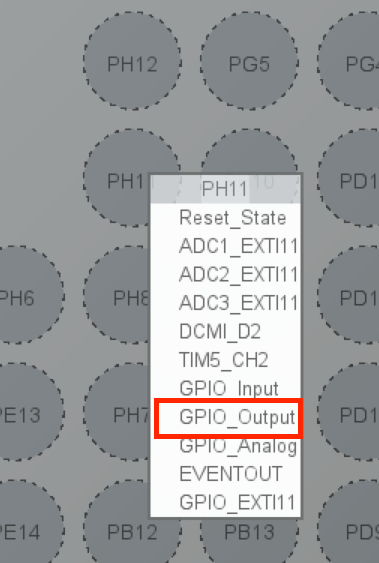
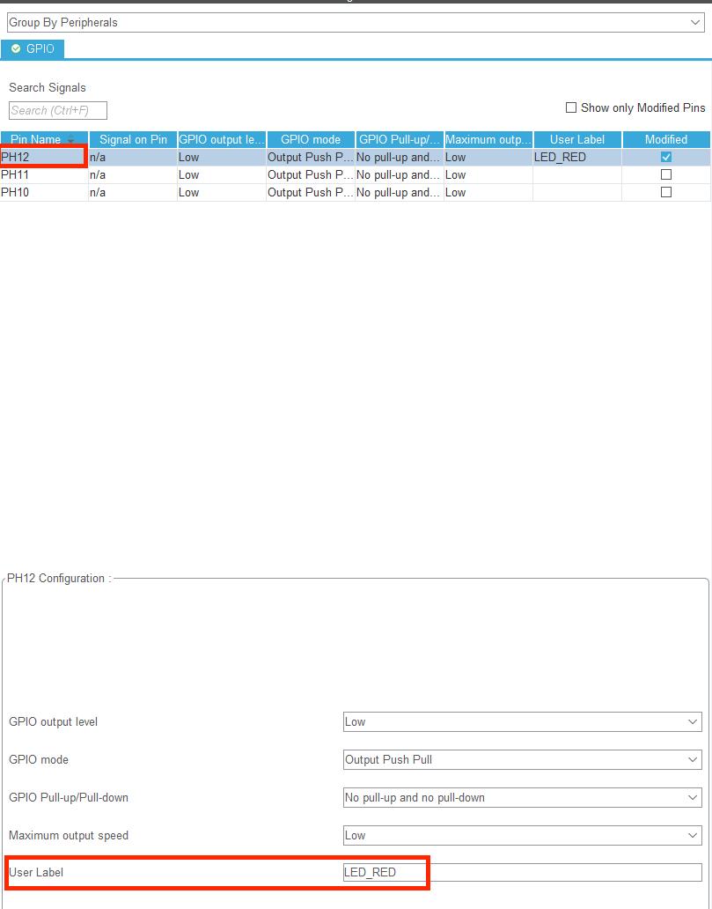
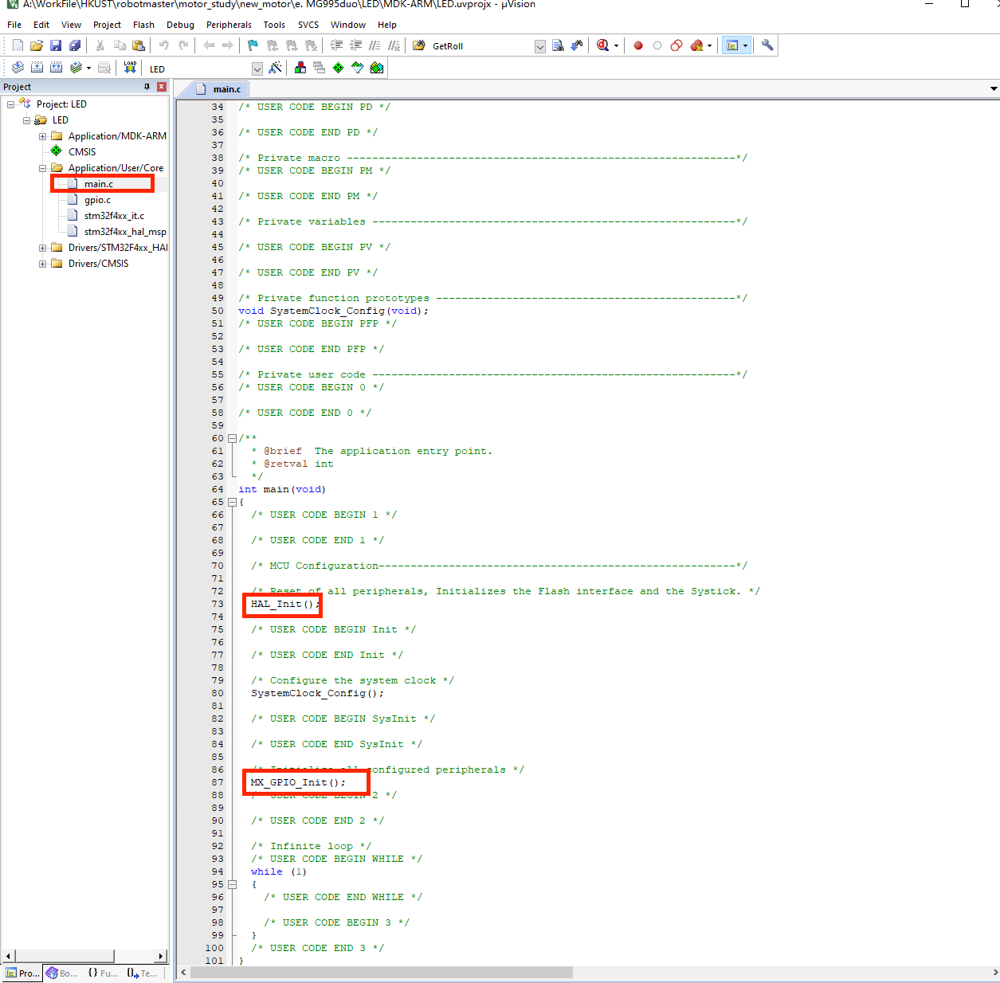

# 点亮LED

### 原理

LED 即发光二极管，当 LED 内有电流通过时会发光，在安全电流范围内，电流越大，亮度越亮。

那么在stm32中，我们主要通过GPIO口输出高低电平，产生电势差，使电流通过LED来发光。因此我们需要先查询C型开发板上的LED所在端口

1. 打开C型开发板用户手册，翻到17页的附录，我们可以看到LED对应IO一栏有对应的IO口


可以发现对应的IO口为PH12, PH11, PH10

### cubemx配置

2. 打开CubeMx，按照上面基本配置之外，我们找到system core下的GPIO选项




3. 在软件右侧的引脚视图中找到PH11等引脚，配置为GPIO_Output模式



4. 依次对三个引脚都这么做我们就可以在左边那一栏看到这三个打开的引脚的信息

	

5. 在cubemx中修改对应引脚的名字（方便之后写代码的时候用）

	

	举例来说，我们点击PH12引脚，在下面的User Label一栏中填入方便自己记忆的这个引脚名字，比如这里因为PH12映射到红色LED小灯，所以命名为LED_RED。其他小灯也类似地分别命名为LED_BLUE, LED_GREEN

6. 确保自己按照CubeMx基本使用中的步骤完成后就可以点击Generate Code按键了

### 代码

#### 函数

首先介绍一下这次我们将使用的函数 HAL_GPIO_WritePin， 它的作用对指定的引脚输出高电平或者低电平

```
void HAL_GPIO_WritePin(GPIO_TypeDef* GPIOx, uint16_t GPIO_Pin, GPIO_PinState PinState)
```

* 第一个参数 GPIOx 是对应GPIO总线，其中x可以是A...I 具体要参考原理图 e.g. PH10 代表Pin H10，那么就是H总线，所以我们这里填入GPIOH
* 第二个参数 GPIO_Pin是对应引脚数，可以是0-15， e.g. PH10 则我们输入GPIO_PIN_10
* 第三个参数是设置高电平或者低电平， GPIO_PIN_RESET -> 代表术输出低电平 GPIO_PIN_SET -> 代表输出高电平

``` 
void HAL_GPIO_WritePin(GPIOH, GPIO_PIN_10, GPIO_PIN_SET)
```

> [!note]
>
> 这是标准的函数写法，如果在第5步我们修改了引脚标签，那么就应该改为 void HAL_GPIO_WritePin(LED_RED_GPIO_Port, LED_RED_Pin, GPIO_PIN_SET) 就比较好记

#### 程序



1. 用keil打开我们的程序， 找到main.c并双击，我们看到了我们的主程序页面，我们可以看到我们的程序经过HAL_Init(), MX_GPIO_Init()已经完成了初始化，那么我们就在这之后的部分进行书写
2. 我们可以将程序写在while中使得灯常亮，程序如下

```c++
		HAL_GPIO_WritePin(LED_RED_GPIO_Port,LED_RED_Pin, GPIO_PIN_SET);
		HAL_GPIO_WritePin(LED_BLUE_GPIO_Port,LED_BLUE_Pin, GPIO_PIN_SET);
		HAL_GPIO_WritePin(LED_GREEN_GPIO_Port,LED_GREEN_Pin, GPIO_PIN_SET);
```

3. 烧录代码
4. 登登，可以发现小灯亮了（如果没有亮，可以试试按一下reset键）， 至此我们就点亮了一盏小灯啦，可以试着将三盏灯按照不同的组合输出高电平来得到不同颜色噢
5. 进阶学习可以参见keysking中的下拉电阻部分或者C板配套说明文档。这个三极管的地方看的不是很明白，寄，有个传送门可以试试看[gate](https://www.bilibili.com/video/BV1Co4y1Q7rN/?vd_source=4ae85c9aa63e99071b3c53715d6ff461) 

