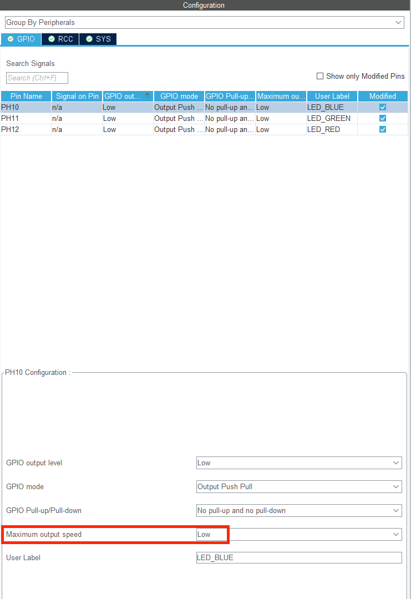

# LED闪烁

### 原理

这节课我们将学习用Cubemx配置GPIO的翻转速度

### CubeMX配置

1. 与上一节课相同，我们打开PH10， PH11， PH12引脚的GPIO输出，并设置好CubeMX基本的时钟等等
2. 回到CubeMX的左侧system core 下的GPIO选项


3. 在这个标签页下我们可以选中需要配置的GPIO口，其中Maximum output speed就是可以选择的翻转速度模式，如图对应的模式就是low，为低速输出模式

	

4. 点击右端小箭头可以发现有 Low, Medium, High, Very High四档可以选择，一般用GPIO口驱动LED灯功能选择Low档就可以，不过用于通信的GPIO口需要设置为High，Very High

### 代码

#### 延时函数

##### 计数延时

在很多情况中，我们希望指令晚一点结束又或是一些外设（电机，传感器）需要微秒级的计数和操作。在stm32中 内执行任何一条指令是需要消耗时间的。我们可以让 stm32 持续执行一段计数循环，直到其计数到设定的数目后，再让 stm32 退出循环来实现延时效果。

在程序中，我们可以通过简单的两个for循环来做到

```c++
void user_delay_us(uint16 us)
{
  for(; us > 0; us--)
  {
    for(uint8_t i = 50; i > 0; i--)\
    {
      
    }
  }
}
```

其中输入值us就是我们想要延时的长度。疑问？**为什么i设置为50实现微秒的计时，跟设置的stm32频率有关系，具体还不太清楚**

至于毫秒的话可以用 HAL_Delay()

##### nop延时

原理与计时延时一样，都是重复执行指令，直到消耗时间。不同的是nop延时通过空操作指令函数__nop()函数来实现延时。执行到\_\_nop()可以理解为这时候stm32没有进行任何操作

```c++
void user_delay_us(uint16 us)
{
  for(; us > 0; us--)
  {
    for(uint8_t i = 10; i > 0; i--)
    {
      __nop();
      __nop();
      __nop();
      __nop();
      __nop();
      __nop();
      __nop();
      __nop();
      __nop();
      __nop();
      __nop();
      __nop();
      __nop();
      __nop();
      __nop();
    }
  }
}
```

##### HAL_Delay函数

在介绍第三种延时方法之前，先介绍滴答定时器及其初始化。滴答定时器也称为 SysTick，是 stm32 内置的倒计时定时器，每当计数到 0 时，触发一次SysTick 中断，并重载寄存器值。

接下来我们介绍一下HAL_Delay函数

```c++
void HAL_Delay(uint32_t Delay)
```

* 参数Delay代表想要延时的时长，ms级别，1秒 就为1000

##### 总结

以上三种延时方法各自有各自的特点，计数延时与 nop 延时都需要用户编写函数来自行实现，比较麻烦，而直接调用 HAL 库提供的 HAL_Delay 函数会更加方便一些。但 HAL_Delay只能够实现毫秒级的延时，如果需要时间更短的延时函数则必须使用用户编写的延时函数。

#### 翻转函数 HAL_GPIO_TogglePin

上一讲我们介绍了设置GPIO口电平的函数HAL_GPIO_WritePin,通过这个函数我们可以设置它输出高低电平。而实现LED灯的闪烁，我们需要不断地交替输出高低电平。简单点，我们可以在while循环中分别设置输出高电平和低电平来达到。

但处理上面地方法之外，HAL库还给我们提供了一个更简单地方法来翻转电平---HAL_GPIO_TogglePin 函数

```c++
void HAL_GPIO_TogglePin(GPIO_TypeDef* GPIOx, uint16_t GPIO_Pin)
```

* 第一个参数 GPIOx 是对应GPIO总线，其中x可以是A...I 具体要参考原理图 e.g. PH10 代表Pin H10，那么就是H总线，所以我们这里填入GPIOH
* 第二个参数 GPIO_Pin是对应引脚数，可以是0-15， e.g. PH10 则我们输入GPIO_PIN_10

#### 程序

1. 同样地，我们打开keil工程文件，找到main.c文件，双击打开。滑到User code begin PFP(private function prototype)，在这里定义函数


2. 定义如下四个函数，user_delay_us(), nop_delay_us()微秒级别的延时，user_delay_ms(), nop_delay_ms()毫秒级别的延时


附代码

```c++
void user_delay_us(uint16_t us);
void nop_delay_us(uint16_t us);
void user_delay_ms(uint16_t ms);
void nop_delay_us(uint16_t ms);

void user_delay_us(uint16_t us)
{
	for(; us > 0;us--)
	{
		for(uint8_t i = 10; i > 0; i--)
		{
			__nop();
			__nop();
			__nop();
			__nop();
			__nop();
			__nop();
			__nop();
			__nop();
			__nop();
			__nop();
			__nop();
			__nop();
			__nop();
			__nop();
			__nop();
		}
	}
}

void nop_delay_us(uint16_t us)
{
	for(; us > 0;us--)
	{
		for(uint8_t i = 50; i > 0; i--)
		{
		
		}
	}
}

void user_delay_ms(uint16_t ms)
{
	for(; ms > 0;ms--)
	{
		user_delay_us(1000);
	}
}

void nop_delay_ms(uint16_t ms)
{
	for(; ms > 0;ms--)
	{
		nop_delay_us(1000);
	}
}
```

3. 之后我们就可以在main函数里调用他们啦。同样地，我们放在while循环里，分别用三个延时函数。


这里我只翻转蓝色和绿色。因为比较好看。可以试试用不同时长的延时看看效果。附代码

```c++
		HAL_GPIO_TogglePin(LED_BLUE_GPIO_Port, LED_BLUE_Pin); //翻转蓝色LED灯
		HAL_GPIO_TogglePin(LED_GREEN_GPIO_Port, LED_GREEN_Pin); //翻转绿色LED灯
		nop_delay_ms(1000);
		
		HAL_GPIO_TogglePin(LED_BLUE_GPIO_Port, LED_BLUE_Pin); //翻转蓝色LED灯
		HAL_GPIO_TogglePin(LED_GREEN_GPIO_Port, LED_GREEN_Pin); //翻转绿色LED灯
		HAL_Delay(1000);
		
		HAL_GPIO_TogglePin(LED_BLUE_GPIO_Port, LED_BLUE_Pin); //翻转蓝色LED灯
		HAL_GPIO_TogglePin(LED_GREEN_GPIO_Port, LED_GREEN_Pin); //翻转绿色LED灯
	  user_delay_ms(1000);
```

4. 这样就成功让LED灯闪烁啦