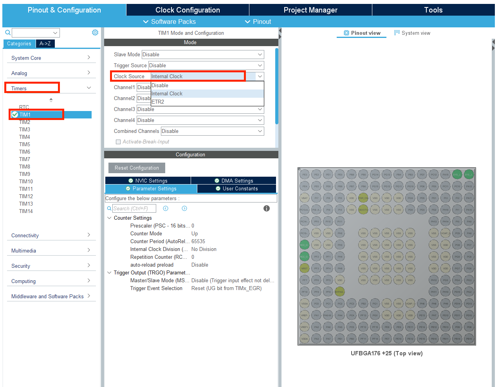
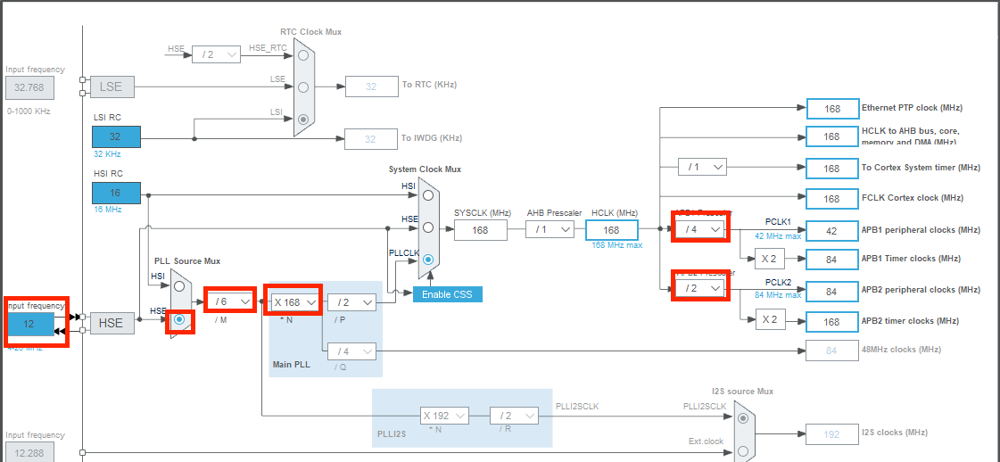
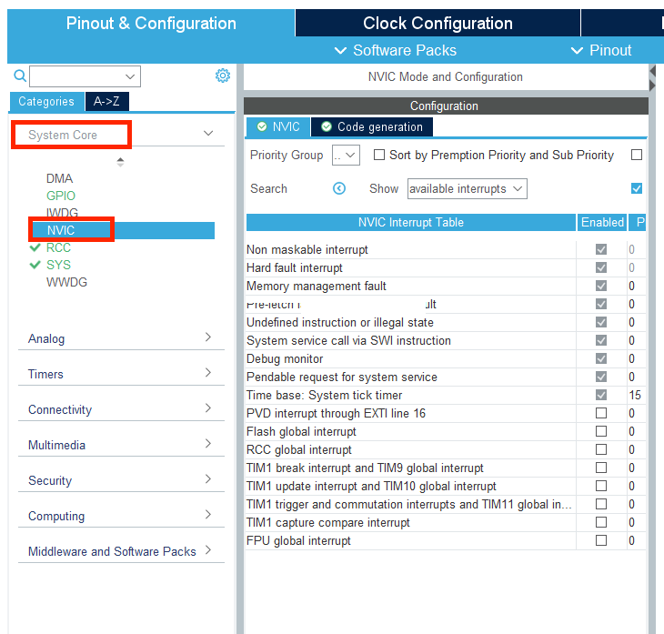

# 定时器闪烁LED

### 计时器基本介绍

计时器就是计数器！就跟闹钟一样会在设定好的时间响起

在使用定时器时，会涉及到三个非常重要的概念——分频，计数，重载。这三个概念可以结合生活中使用的时钟来理解。

* 分频：时钟上不同的指针需要有不同的速度，也就是不同的频率，从而精确的表示时间，比如秒针，分针，时针，这三者相邻的频率之比都是 60:1，即秒针每转过 60 格分针转动 1 格，分针转动 60 格时针转动 1 格，所以分针对于秒针的分频为 60。

* 计数：时钟所对应的值都是与工作时间成正比的，比如秒针转动 10 格，意味着过了 10秒，同样定时器中的计数也是和计数时间成正比的值，频率越高增长速度越快。

* 重载：时、分、秒的刻度都是有上限的，一个表盘最多记 12 小时，60 分钟，60 秒，如果继续增加的话就会回到 0。同样的在定时器中也需要重载，当定时器中的计数值达到重载值时，计数值就会被清零。

现在介绍与定时器有关的三个重要寄存器。

* 预分频寄存器 TIMx_PSC

* 计数器寄存器 TIMx_CNT

* 自动重装载寄存器 TIMx_ARR

时钟源处的时钟信号经过预分频寄存器，按照预分频寄存器内部的值进行分频。比如时钟源的频率为 16MHz，而预分频寄存器中设置的值为 16：1，那么通过预分频后进入定时器的时钟频率就下降到了 1MHz。**这个分频是在时钟树界面完成的**

在已经分频后的定时器时钟驱使下，TIMx_CNT 根据该时钟的频率向上计数，直到TIMx_CNT 的值增长到与设定的自动重装载寄存器 TIMx_ARR 相等时，TIMx_CNT 被清空，并重新从 0 开始向上计数，TIMx_CNT 增长到 TIMx_ARR 中的值后被清空时产生一个定时中断触发信号。

综上定时器触发中断的时间是由设定的 TIMx_PSC 中的分频比和TIMx_ARR 中的自动重装载值共同决定的。

定时器是 stm32 中非常重要的外设。在大多数应用场景中，部分任务需要周期性的执行，比如上一讲中提到的 LED 闪烁，这个功能就可以依靠定时器来实现，此外 stm32 的定时器还能够提供 PWM 输出，输入捕获，输出比较等多种功能。

### CubeMX配置定时器

1. 首先我们再左侧的标签页中选择Timers, 点击标签页下的TIM1，在弹出的TIM1 Mode and Configuration中，在Clock Source 的右侧下拉菜单中选中Internal Clock

	

2. 此时TIM1 得到使能， 接下来我们需要配置TIM1 的运转周期。 我们打开Clock Configuration标签页

	

3. 下图为STM32的时钟树结构，我们可以通过这个图形化界面配置各处的分频/倍频比，控制最后输出到各个外设的时钟。下图中的配置与Keil&CubeMX那节中的配置相同（记得要按照那一节的指示打开外部晶振）

	

4. 通过查阅数据手册资料，可以知道 TIM1 的时钟源来自 APB2 总线。

	注意到在时钟树配置页面下的 APB2 Timer clocks（MHz)为 168MHz，这意味着提供给TIM1 预分频寄存器的频率就是 168MHz。

	

	下面通过设置分频比和重载值来控制定时器的周期，详细的计算步骤可以查看进阶学习的部分。如果想要得到周期为 500 毫秒的定时器，则可以按照进阶学习介绍的公式来对分频值和重载值进行设定。回到 Pinout&Configuration 标签页下，对应 TIMx_PSC 寄存器的 Prescaler项和对应 TIMx_ARR 寄存器的 Counter Period 项。500ms 对应的频率为 2Hz，为了得到2Hz 的频率，可以将分频值设为 16799，重载值设为 4999，则可以计算出定时器触发频率为
	$$
	f = \frac{168000000Hz}{(16799+1)(4999+1)} = 2Hz
	$$
	因为定时器使从零开始计数的，所以需要加一

### 中断

在 STM32 中，对信号的处理可以分为2种

* 轮询方式就是不断去访问一个信号的端口，看看有没有信号进入，有则进行处理
* 中断方式则是当输入产生的时候，产生一个触发信号告诉 STM32 有输入信号进入，需要进行处理。

轮询的问题在于如果不断访问一个信号，那么cpu就完全被占用不能做其他事情。

而相反中断就很好地解决了这个问题。

每一种中断都有对应的中断函数，当中断发生时，程序会自动跳转到处理函数处运行，而不需要人为进行调用。而计时器便是运用到了这一点，每当定时器地计数值增长到重载值时，在清空计数值的同时，会触发一次定时器中断，即定时器更新中断。只要设定好定时器的重载值，就可以保证定时器中断以固定的频率被触发。

### 中断优先级

回顾之前所说的中断概念，在 STM32 专门用于处理中断的控制器叫做 NVIC，即嵌套向量中断控制器 (Nested Vectored Interrupt Controller)。

NVIC 的功能非常强大，支持中断优先级和中断嵌套的功能。

* 中断优先级即给不同的中断划分不同的响应等级，如果多个中断同时产生，则 STM32 优先处理高优先级的中断。

* 中断嵌套即允许在处理中断时，如果有更高优先级的中断产生，则挂起当前中断，先去处理产生的高优先级中断，处理完后再恢复到原来的中断继续处理。

这个过程理解起来就像是在上文的情境中，主人听到水烧开了，正打算去厨房时突然听到门口响起了急促的敲门声，那么主人就会先去执行开门的操作，然后再去厨房处理开水。

为了在有限的寄存器位数中实现更加丰富的中断优先级，NVIC 使用了中断分组机制。

STM32 将先将中断进行分组，然后又将优先级划分为抢占优先级 (Prem priority) 和响应优先级 (Subpriority)，抢占优先级和响应优先级的数量均可以通过 NVIC 中 AIRCR 寄存器的PRIGROUP[8:10]位进行配置，从而规定了两种优先级对 NVIC_IPRx[7:4]的划分，根据划分决定两种优先级的数量。总共可以分成下表中的 5 种情况，拥有相同抢占优先级的中断处于同一个中断分组下。

|      | 抢占优先级 | 响应优先级 |
| ---- | ---------- | ---------- |
| 000  | 0          | 0-15       |
| 001  | 0-1        | 0-7        |
| 010  | 0-3        | 0-3        |
| 011  | 0-7        | 0-1        |
| 100  | 0-15       | 0          |

当多个中断发生时，先根据抢占优先级判断哪个中断分组能够优先响应，再到这个中断分组中根据各个中断的响应优先级判断哪个中断优先响应。

### CubeMX配置中断

在CubeMX左侧的System Core 下的NVIC标签页下我们可以看到当前系统的中断配置

列表中显示了当前系统中所有中断的使能情况与优先级设置。要使能中断则在 Enable 一栏打勾，这里选中 TIM1 update interrupt，打勾，开启该中断。此外还可以在该页面下进行抢占优先级和响应优先级的分配和中断的两种优先级的配置。这里为定时器 1 的中断保持默认的 0，0 优先级。

点击 Generate code，生成代码。

### 中断实现

下面来看一下 HAL 库是如何对中断进行处理的。在 stm32f4xx_it.c 中，找到 cubeMX 自动生成的中断处理函数。

如果某个寄存器触发中断，该函数调用了 HAL 库提供的 HAL_TIM_IRQHandler。这一函数在 HAL_TIM_IRQHandler 对各个涉及中断的寄存器进行了处理之后，会自动调用中断回调函数 **HAL_TIM_PeriodElapsedCallback**，这个函数就是我们一般编写代码处理中断任务的地方。

而且该函数使用__weak 修饰符修饰，即用户可以在别处重新声明该函数，调用时将优先进入用户声明的函数。一般我们需要在中断回调函数中判断中断来源并执行相应的用户操作。

### 定时器回调函数介绍

如前文所介绍的，HAL 库在完成定时器的中断服务函数后会自动调用定时器回调函数。通过配置 TIM1 的分频值和重载值，使得 TIM1 的中断以 500ms 的周期被触发。因此中断回调函数也是以 500ms 为周期被调用。在 main.c 中重新声明定时器回调函数，并编写内容如下：

可以看到首先在回调函数中进行了中断来源的判断，判断其来源是否是定时器 1。如果有其他的定时器产生中断，同样会调用该定时器回调函数，因此需要进行来源的判断。在确认了中断源为定时器 1 后，我们就可以翻转 RGB 三色 LED 引脚的输出电平.

### 函数介绍

#### HAL_TIM_Base_Start

| 函数     |                                                              |
| -------- | ------------------------------------------------------------ |
| 函数名   | HAL_TIM_Base_Start                                           |
| 函数作用 | 使对应的定时器开始工作                                       |
| 返回值   | HAL_StatusTypeDef,HAL库定义的几种状态，如果成功使定时器开始工作，则返回HAL_OK |
| 参数1    | *htim 定时器的句柄指针，如定时器1就输入&htim1,定时器2就输入&htim2 |

#### HAL_TIM_Base_Start_IT

| 函数     |                                                              |
| -------- | ------------------------------------------------------------ |
| 函数名   | HAL_TIM_Base_Start_IT                                        |
| 函数作用 | 使对应的定时器开始工作，并使能其定时中断                     |
| 返回值   | HAL_StatusTypeDef,HAL库定义的几种状态，如果成功使定时器开始工作，则返回HAL_OK |
| 参数1    | *htim 定时器的句柄指针，如定时器1就输入&htim1,定时器2就输入&htim2 |

以上两个函数如果要使用都需要在主函数while(1)之前调用

#### HAL_TIM_PeriodElapsedCallback

| 函数     |                                                              |
| -------- | ------------------------------------------------------------ |
| 函数名   | HAL_TIM_PeriodElapsedCallback()                              |
| 函数作用 | 中断函数处理完中断寄存器后自动进入的函数                     |
| 返回值   | HAL_StatusTypeDef,HAL库定义的几种状态，如果成功使定时器开始工作，则返回HAL_OK |
| 参数1    | *htim 定时器的句柄指针，如定时器1就输入&htim1,定时器2就输入&htim2 |

该函数使用__weak 修饰符修饰，即用户可以在别处重新声明该函数，调用时将优先进入用户声明的函数。一般我们需要在中断回调函数中判断中断来源，并执行相应的用户操作。
