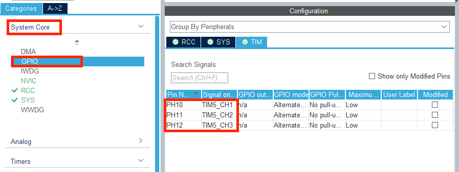
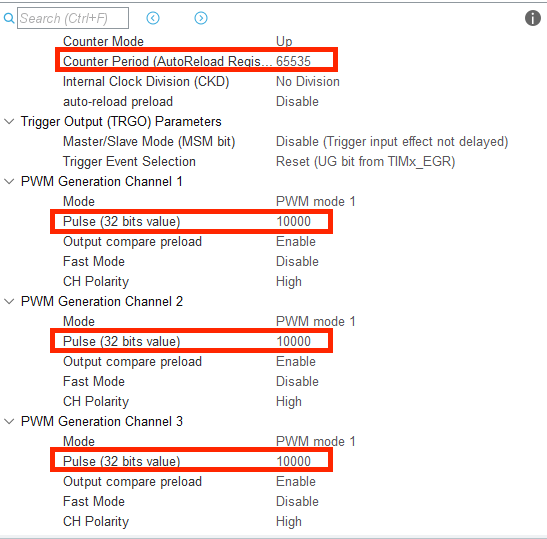

### PWM基础知识

PWM 即脉冲宽度调制是英文“Pulse Width Modulation”的缩写，简称脉宽调试。是利用微处理器的数字输出来对模拟电路进行控制的一种非常有效的技术。广泛应用在从测量、通信到功率控制与变换的许多领域中。


例如上图中，矩形脉冲是 stm32 输出的数字信号，当这个信号接到外设上时，效果可以等效为这个正弦波。

一个周期内高电平的持续时间占总周期的比例称为**占空比**，通过修改占空比，可以改变输出的等效模拟电压。

例如输出占空比为 50%，频率为 10Hz 的脉冲，高电平为 3.3V.则其输出的模拟效果相当于输出一个 1.65V 的高电平。此外 PWM 输出的频率也会影响最终的 PWM输出效果，PWM 输出的频率越高，最终输出的“连续性”越好，越接近模拟信号的效果，频率低则会增强离散性，最终的输出效果会有比较强的“突变”感。

脉冲调制有两个重要的参数

1. **输出频率**: 频率越高，则模拟的效果越好。
2. **占空比**: 占空比就是改变输出模拟效果的电压大小。占空比越大则模拟出的电压越大。

#### 占空比

在上一节课中介绍了 STM32 的定时器，并提到 PWM 输出是 STM32 的定时器的功能之一，为了实现 PWM 功能，需要使用定时器中的比较寄存器（TIMx_CCRx）。当定时器以 PWM 模式工作时，会自动将 TIMx_CCRx 的值与 TIMx_CNT（计数寄存器）中的值做比较，当 TIMx_CNT 中的值小于 TIMx_CCRx 的值时，PWM 输出引脚输出高电平，大于时则输出低电平。因此知道了 PWM 信号的周期和占空比可以通过设置比较寄存器TIMx_CCRx 和定时器重载寄存器 TIMx_ARR 来控制。PWM 的占空比可以通过下图公式计算：
$$
p = \frac{TIMx_{CCRx}-1}{TIMx_{ARR}}*100\%
$$
其中TIMx_CCRx 为定时器x的x比较寄存器，TIMxARR为定时器重载寄存器。以下图为例子，该定时器的重载值为8，比较寄存器的值为4，输出信号为OCXREF，则其占空比为44.4%


一个定时器工作在 PWM 输出模式下时，有 4 个通道可以进行 PWM 信号的输出，每一个定时器都有对应标号的比较寄存器，比如 5 号定时器的 1 号通道对应的比较寄存器为TIM5_CCR1。

### aRGB三原色

aRGB 为一种色彩模式，aRGB 分别代表了 alpha（透明度）Red（红色）Green（绿色）和Blue（蓝色）四个要素，一般我们给每个要素设置十进制下 0-255 的取值范围，通过 16 进制表示就是 0x00-0xFF，因此一个 aRGB 值可以通过八位十六进制数来描述，从前到后每两位依次对应 a，R，G，B。在 aRGB 中，alpha 值越大色彩越不透明，RGB 中哪个值越大，对应的色彩就越强。

比如纯红色可以用 8 位 16 进制表示为 0xFFFF0000，纯绿色可以表示为 0xFF00FF00，纯蓝色

可以表示为 0xFF0000FF，黄色由蓝色和绿色合成，所以可以表示为 0xFF00FFFF。

### CubeMX配置


1. 首先我们在左侧的菜单栏中Timers选项中找到TIM5， 并打开右侧的定时器5的1，2，3通道，设置为PWM输出。可以注意到三个通道对应的引脚是之前的LED引脚，如果你的CubeMX文件之前有打开过C板中LED小灯的GPIO口。那么需要去GPIO那里改回来，没有的话就可以跳过



2. 在菜单栏中GPIO选项中找到右边的TIM选项栏，确认我们刚刚打开的三个PWM通道对应的分别是PH10,PH11,PH12。如果是正确配置的那么就可以跳过步骤3。没有的话可以在右边的图形化界面中修改

	

3. 这里以PH12为例子，如果我们原本是GPIO口输出，那么就将它切换到TIM5_CH3输出。

	

	4. 回到我们TIM5的配置页面，我们将定时器重载值ARR设置为65535，并将每个PWM输出通道的Pulse设置为10000，这里设置pulse的值也就是设置比较寄存器的值。
	5. 时钟树保持默认设置，确保完成基础配置。后点击Generate Code生成工程代码

### 函数介绍

#### __HAL_TIM_SetCompare(*htim, TIM_CHANNEL_x, uint16_t)

| 函数     |                                                              |
| -------- | ------------------------------------------------------------ |
| 函数名   | __HAL_TIM_SetCompare                                         |
| 函数作用 | 设置定时器的某个通道的PWM值                                  |
| 返回值   | 无                                                           |
| 参数1    | *htim 定时器的句柄指针，如定时器1就输入&htim1,定时器2就输入&htim2 |
| 参数2    | Tim_Channel_x 定时器PWM输出的通道，如通道1为TIM_CHANNEL_1    |
| 参数3    | 设置定时器比较寄存器的值，范围为十进制下0-255，十六进制下0x00 - 0xFF |

#### HAL_TIM_PWM_Start

| 函数     |                                                              |
| -------- | ------------------------------------------------------------ |
| 函数名   | HAL_TIM_PWM_Start                                            |
| 函数作用 | 使对应定时器的对应通道开始PWM输出                            |
| 返回值   | HAL_StatusTypeDef,HAL库定义的几种状态，如果成功使定时器开始工作，则返回HAL_OK |
| 参数1    | *htim 定时器的句柄指针，如定时器1就输入&htim1,定时器2就输入&htim2 |
| 参数2    | Tim_Channel_x 定时器PWM输出的通道，如通道1为TIM_CHANNEL_1    |

一般来说我们可以直接把它当成没有return值的函数来处理

### 代码介绍

#### 初始化定时器

回忆上节课我们学到的HAL_TIM_Base_Start()函数，我们需要首先用它将我们的定时器使能。

接着用我们这节课新学的HAL_TIM_PWM_Start()函数，将定时器的对应通道开始PWM输出。

这样之后我们才可以正常地设置PWM的占空比，在keil中的位置代码如下


#### PWM输出

```c++
void aRGB_led_show(uint32_t aRGB)
{
  static uint8_t alpha;
  static uint16_t Red, Green, Blue;

  alpha = ((aRGB & 0xFF000000) >> 24);
  Red = ((aRGB & 0x00FF0000) >> 16) * alpha;
  Green = ((aRGB & 0x0000FF00) >> 8) * alpha;
  Blue = ((aRGB & 0x000000FF) >> 0) * alpha;

  __HAL_TIM_SetCompare(&htim5, TIM_CHANNEL_1, Blue);
  __HAL_TIM_SetCompare(&htim5, TIM_CHANNEL_2, Green);
  __HAL_TIM_SetCompare(&htim5, TIM_CHANNEL_3, Red);
};
```

我们将整个驱动LED小灯的功能封装成aRGB_led_show的函数，只需要输入小灯的32位的aRGB值就可以了

其中在计算每种颜色的占空比时，我们需要用与运算将不需要的数据置零

最后用__HAL_TIM_SetCompare()函数分别设置对应通道的占空比即可驱动小灯

> 官方例程中将这部分函数放进来BSP文件夹中，来做好文件归类，当然，功能完全一样的

之后在while循环中使用函数，我们就成功使小灯亮起啦