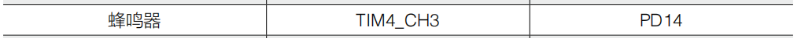
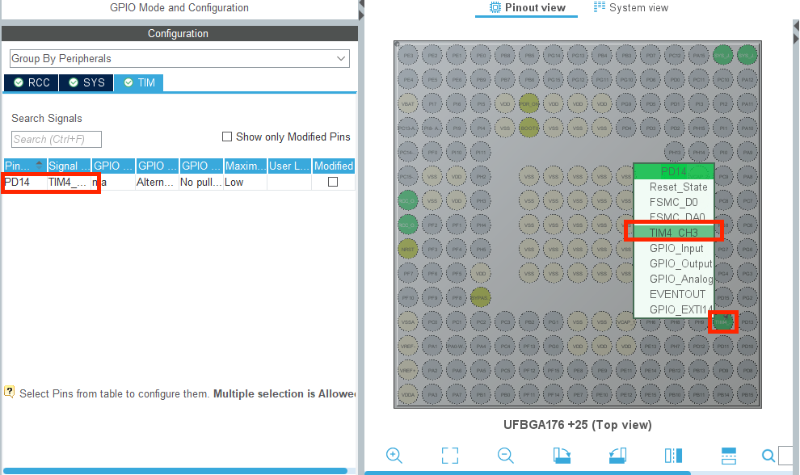
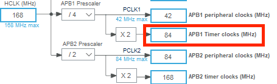
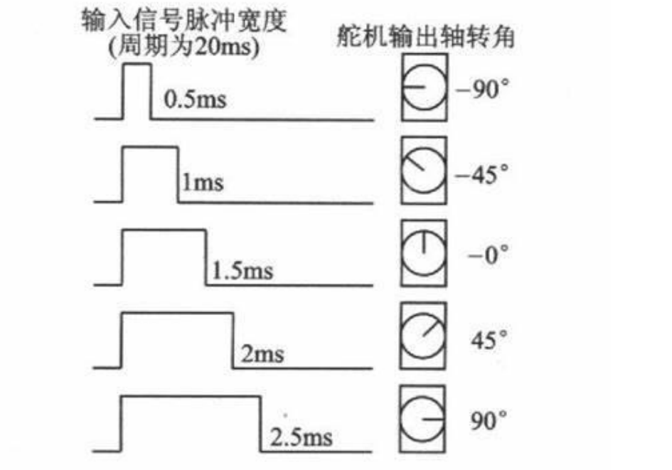
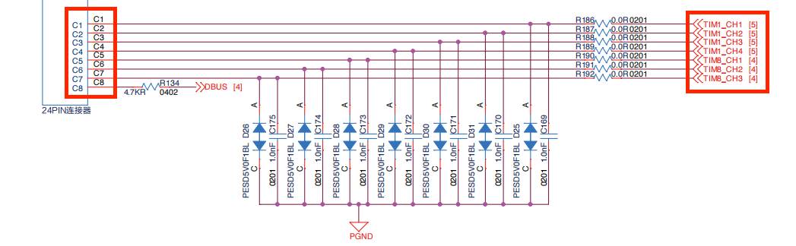
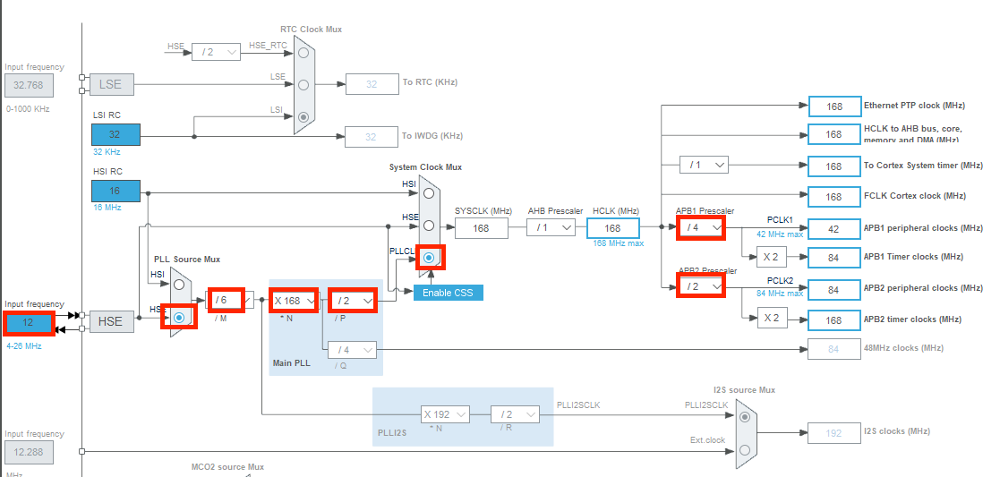

# 常见PWM设备

## 蜂鸣器

### 基本介绍

蜂鸣器是一种能够通过电子信号控制的发声器件。在生活中，几乎所有能够发出哔哔响声的电子器件中都装有蜂鸣器。蜂鸣器能够为使用者提供直观的声音信息，是一种常见的人机交互模式。在 RoboMaster 比赛中，常常用于提醒队员完成某项检查或者用于某个模块出问题时的报错。常见的蜂鸣器分为插针型和贴片型，在开发板 C 型使用到蜂鸣器为贴片型，

#### 分类

根据是否内置震荡电路可分为有源蜂鸣器和无源蜂鸣器。

* 有源蜂鸣器
	* 只需要提供直流电压就可以通过内部的震荡电路产生震荡电流进而发出声音。
	* 只能发出单一频率的声音
* 无源蜂鸣器
	* 需要输入特定频率的方波才能发出声音，控制起来比较麻烦。在stm32中，我们可以用PWM来使蜂鸣器发声。
	* 可以通过改变输入方波的频率发出不同音调的声音，甚至可以用来演奏乐曲。（原理相当于使发声原件震动，所以方波频率决定音调）


| 项目       | 有源蜂鸣器 | 无源蜂鸣器   |
| ---------- | ---------- | ------------ |
| 内置震荡源 | 有         | 无           |
| 激励方式   | 直流电压   | 特定频率方波 |
| 音调       | 固定       | 可变         |


### CubeMX配置

1. 首先我们打开C型开发板用户手册，翻到最下面的附表，找到蜂鸣器对应的IO口为PD14



2. 接着在CubeMX中找到对应的PD14 IO口，可以发现它是定时器4的通道3


3. 我们在Timers菜单栏下找到TIM4，将Clock Source选择为Internal Clock， 将Channel 3使能，选择为PWM Generation CH3


4. 我们发现配置完之后PD14的对应小圆圈并没有亮起，于是我们前往菜单栏System Core 下的GPIO菜单进行查看。在右边选择TIM定时器标签页，我们发现TIM4_CH3 默认打开PB8,我们右键PD14的小圆圈，点击TIM4_CH3，更改使能IO口。




5. 将工程其他部分按照基础配置完成(HSE,Serial Wire,时钟树)就完成了
6. 由数据手册我们直到定时器4挂载在APB1 总线上，对应总线频率为84MHZ，分频值即(prescaler)我们在第三步设定为0，重载值为20999，那么由公式计算得知，PWM波的输出频率为4000HZ



### 函数介绍

#### __HAL_TIM_PRESCALER

| 函数     |                                                              |
| -------- | ------------------------------------------------------------ |
| 函数名   | __HAL_TIM_PRESCALER                                          |
| 函数作用 | 设置定时器的分频值                                           |
| 返回值   | 无                                                           |
| 参数1    | *htim 定时器的句柄指针，如定时器1就输入&htim1,定时器2就输入&htim2 |
| 参数2    | 要分的频数                                                   |


### 程序实现

我们由介绍中可以知道，改变PWM的频率可以改变无源蜂鸣器的音调。所以如果改变定时器的分频系数和重载值，我们就可以改变PWM的频率从而控制无源蜂鸣器发出的声音频率（PWM频率越高，音调越高）。而改变PWM的占空比，我们会有不同音色和响度的声音。如果占空比为0，那么就没有声音了。（占空比越大，响度越大）

那么这里我们选择固定重载值，改变频率。用到我们上一节课学习的__HAL_TIM_SetCompare()函数

将设定分频值放在一个while循环里面，每一个循环改变分频值的大小，这样就可以输出不同音调的声音啦。

```c++
#define MAX_PSC    1000
psc = 0
pwm = 10000 // you can change the value of it 

HAL_TIM_Base_Start(&htim4); # start timer
HAL_TIM_PWM_Start(&htim4, TIM_CHANNEL_3); # start PWM
__HAL_TIM_SetCompare(&htim4, TIM_CHANNEL_3, pwm); # set CCR
while (1)
  {
    /* USER CODE BEGIN 3 */
		psc++;
		__HAL_TIM_PRESCALER(&htim4, psc);
		HAL_Delay(250);
		
		if(psc == MAX_PSC)
		{
			psc = 1000;
		}
```

在stm32中，修改分频器的影响是实时的，比如我现在一秒钟可以运行while循环3次，但是进入while循环之后，我又修改了分频器的值，那么这时候就会立刻刷新分频器，重新开始PWM，而不会说完成这次一秒钟的任务。

那么也就是说如果是按照这样psc++，每次加一的话，那么总的来说高音调（高频率，小分频）持续时间会比较短，低音调（低频率，大分频）持续时间会比较长


------

## 舵机

### 基本介绍

舵机是机器人中的常见的执行部件，通常使用特定频率的 PWM 进行控制。

舵机的主要组成部位由一个小型的电机和传动机构（齿轮组）构成，多被用于操控飞行器上的舵面，故而得名舵机。由于控制简单，价格便宜，在 RoboMaster 比赛中，用于简单的动作控制，例如使用舵机控制弹仓盖的开合。下图为市场上常见的舵机。


通常舵机的三根线按照颜色分别为：黑色-GND，红色-VCC，黄色-PWM 信号。

在使用舵机时，只需要使用杜邦线或者其他连接线接入开发板 C 型对应的 PWM 接口。

舵机使用的 PWM 信号一般为频率 50Hz，高电平时间 0.5ms-2.5ms 的 PWM 信号，不同占空比的 PWM 信号对应舵机转动的角度，以 180 度舵机为例，对应角度图如下图所示。



### CubeMX配置

1. 首先我们打开C型开发板用户手册，我们在直接去细则中找到PWM接口原理图可以发现从右到左为C1,C2,...,C7都为PWM，对应TIM1_CH1, 这里我们选择C1,TIM1_CH1来做例程示范，其他的口方法是一样的。TIM1_CH1连接到定时器1的通道1。




2. 我们接着去附表去查看TIM1_CH1对应的IO口,如下图，可以知道它对应PE9的IO口


3. 我们打开CubeMX，在菜单栏中Timers下将TIM1使能，并打开通道1的PWM输出通道。
	在PWM通道设置中，将预分频值设为167，重载值设为19999。将Pulse值设为2000，这样比较寄存器的初始值就会被设置成2000。


4. 在System Core下的GPIO中我们找到TIM选项栏，可以看到打开TIM的通道1默认打开的使PA8(经常遇到这种问题,以后直接在图里打开算了)，这里我们要改成上面找的PE9


5. 时钟树照旧



6. 然后generate code就可以啦

7. 我们知道定时器1挂载在APB2总线上，对应的总线频率为168MHZ，经过定时器的分频(167+1)：1，我们有1MHZ。再根据重载值19999，我们知道一秒钟内可以输出50个PWM波，输出频率为50HZ，对应周期为20ms。由此我们可以计算出它的占空比。因为我们设置了比较寄存器为2000，所以我们有2000/20000即10%，对应高电平时间为20ms*10% = 2ms。同样地，如果我们知道了高电平时间，我们就可以反推出比较寄存器设置的值

### 代码实现

在LED_PWM那一节课中，我们学习了__HAL_TIM_SetCompare函数来控制比较寄存器。而在前面的介绍我们有提到

舵机使用的 PWM 信号一般为频率 50Hz，高电平时间 0.5ms-2.5ms 的 PWM 信号，不同占空比的 PWM 信号对应舵机转动的角度，对 180 度舵机，对应角度图如下图所示。


所以我们的任务就是设置不同的占空比来使电机转动

```c++
HAL_TIM_Base_Start(&htim1);
HAL_TIM_PWM_Start(&htim1, TIM_CHANNEL_1);
while (1)
  {
    /* USER CODE BEGIN 3 */
		__HAL_TIM_SetCompare(&htim1, TIM_CHANNEL_1, 500);
		HAL_Delay(1000);
		__HAL_TIM_SetCompare(&htim1, TIM_CHANNEL_1, 2500);
		HAL_Delay(1000);
  }
```

这里设置500和2500相当于一次转了180度。我这个舵机是有默认位置的，可能是绝对编码器，所以这里面的每个角度都是一一对应的。

至此就完成啦。
