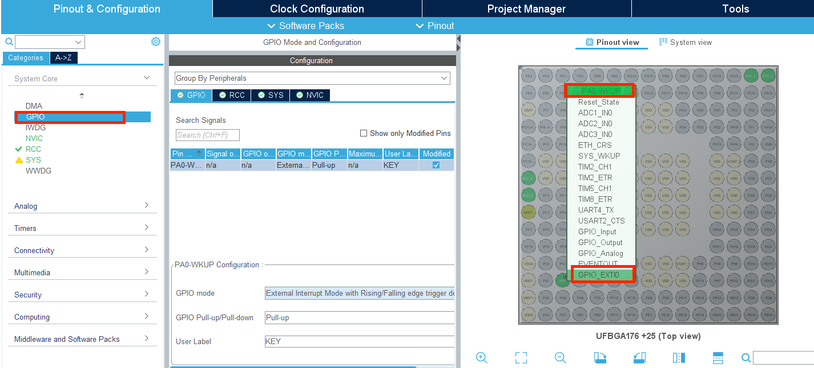
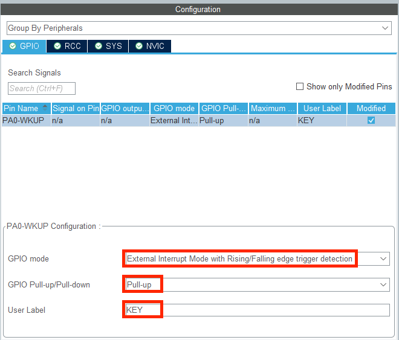

# 按键外部中断

### 基本介绍

开发板 C 型有两个按键，其中一个为复位按键，另一个为用户自定义按键，如图所示。当按键未按下时，引脚将被上拉电阻钳位在高电平；当按键按下时引脚将直连 GND，处于低电平。

#### 按键软件消抖

首先来介绍一下按键输入的抖动问题，由于按键的机械结构具有弹性，按下时开关不会立刻接通，断开时也不会立刻断开，这就导致按键的输入信号在按下和断开时都会存在抖动，如果不先将抖动问题进行处理，则读取的按键信号可能会出现错误。

为了消除这一问题，可以通过软件消抖和硬件消抖两种方式来实现，本节介绍软件滤波的实现方法。

软件滤波的思想非常简单，抖动产生在按键按下和松开的两个边沿时刻，也叫下降沿（电平从高到低）和上升沿（电平从低到高）时刻，所以只需要在边沿时进行延时，等到按键输入已经稳定再进行信号读取即可。

一般采用软件消抖时，会进行 20ms 的延时

#### 外部中断

外部中断通常是 GPIO 的电平跳变引起的中断。在 stm32 中，每一个 GPIO 都可以作为外

部中断的触发源，外部中断一共有 16 条线，对应着 GPIO 的 0-15 引脚，每一条外部中断

都可以与任意一组的对应引脚相连，但不能重复使用。例如外部中断 Line0 可以和 PA0，

PB0，PC0 等任意一条 0 号引脚相连，但如果已经和 PA0 相连，就不能同时和 PB0，PC0

其他引脚相连。

外部中断支持 GPIO 的三种电平跳变模式，如下所示：

* 上升沿中断：当 GPIO 的电平从低电平跳变成高电平时，引发外部中断。

* 下降沿中断：当 GPIO 的电平从高电平跳变成低电平时，引发外部中断。

* 上升沿和下降沿中断：当 GPIO 的电平从低电平跳变成高电平和从高电平跳变成低电平时，都能引发外部中断。

### CubeMX配置

1. 打开C型开发板用户手册的附表，我们可以找到按键对应的IO口为PA0

2. 打开CubeMX，在菜单栏中找到GPIO选项，在图中找到PA0小圆，右键点击，选中GPIO_EXT10。

3. 点开GPIO标签页，将GPIO模式设置为升降沿触发的外部中断，上下拉电阻设置为上拉电阻，这样用户标签设置为KEY，
	* *使用电源将GPIO口处电平拉高的操作称为上拉*
		* 通常需要搭配一个电阻使用，也常被称为“加个上拉电阻”

		* 此电阻作用为限流，防止电源与GND直接相连而短路

4. 在System Core 下的NVIC标签页，我们可以看到外部中断已经开启

5. 之后我们完成基础配置，时钟树，晶振源等配置（详见Keil&CubeMX.md）我们就可以按下Generate Code生成代码啦。

### 函数介绍

#### HAL_GPIO_ReadPin

| 函数           |                                                              |
| -------------- | ------------------------------------------------------------ |
| 函数名         | HAL_GPIO_ReadPin(GPIO_TypeDef* GPIOx, uint16_t GPIO_Pin)     |
| 函数作用       | 返回引脚的电平                                               |
| 返回值         | GPIO_PinState,如果是高电平则返回GPIO_PIN_SET（对应为1），如果是低电平则返回GPIO_PIN_RESET（对应为0） |
| 参数1：GPIOx   | 对应的是GPIO总线，其中x可以是A...I（根据每个芯片有所不同，需要看手册，这里以C板芯片为例子）。 例如PH10,则输入GPIOH |
| 参数2:GPIO_Pin | 对应引脚数，可以是0-15。例如PH10,则输入GPIO_PIN_10           |

#### HAL_GPIO_EXTI_Callback

每当产生外部中断的时候，程序首先会进入外部中断服务函数。在stm32f4xx_it.c中，可以找到函数EXTI0_IRQHandler，它通过调用函数HAL_GPIO_EXTI_IRQHandler对中断类型进行判断，并对涉及中断的寄存器进行处理，在处理完之后，它将调用中断回调函数HAL_GPIO_EXTI_Callback,我们一般在这个函数中编写此次中断中需要执行的功能

| 函数           |                                                    |
| -------------- | -------------------------------------------------- |
| 函数名         | HAL_GPIO_EXTI_Callback(uint16_t GPIO_Pin)          |
| 函数作用       | 中断回调函数，在此函数中编写此次中断需要执行的功能 |
| 参数1:GPIO_Pin | 对应引脚数，可以是0-15。例如PH10,则输入GPIO_PIN_10 |

需要注意的是，该函数使用__weak 修饰符修饰，即用户可以在别处重新声明该函数，调用时将优先进入用户声明的函数。所以可以把它放在main.c 或者其他用户编写的区域，这样有助于代码的维护。

### 程序解析

在本次实验中，发现主循环和中断回调函数中都有代码。这是一个非常典型的以前后台模式组织的工程。什么是前后台模式呢？想象一下一个餐厅的运作模式，餐厅往往分为前台的叫餐员和后台的大厨，前台只有在来了客人，或者后台做好了一道菜时才会工作，而后厨则一直在忙着做菜，只有前台来了新的单子或者已经有菜做好了才会停下一会手中的活。在单片机中，中断就是前台，而循环就是后台，中断只在中断源产生时才会进行相应的处理，而循环则一直保持工作，只有被中断打断时才会暂停。前后台程序的异同可以参见下表：

| 1              | 前台程序             | 后台程序         |
| -------------- | -------------------- | ---------------- |
| 运行方式       | 中断                 | 循环             |
| 处理的任务类型 | 突发型人物           | 重复性任务       |
| 任务特点       | 任务轻，要求响应及时 | 任务重，稳定执行 |

编写前后台程序时，需要注意尽量避免在前台程序中执行过长或者过于耗时的代码，让前台程序能够尽快执行完毕，以保证其能够实时响应突发的事件，比较繁杂和耗时的任务一般放在后台程序中处理。前后台模式可以帮助我们提高单片机的时间利用率，从而组织起比较复杂的工程。

### 代码实现

em，有点长，看例程吧