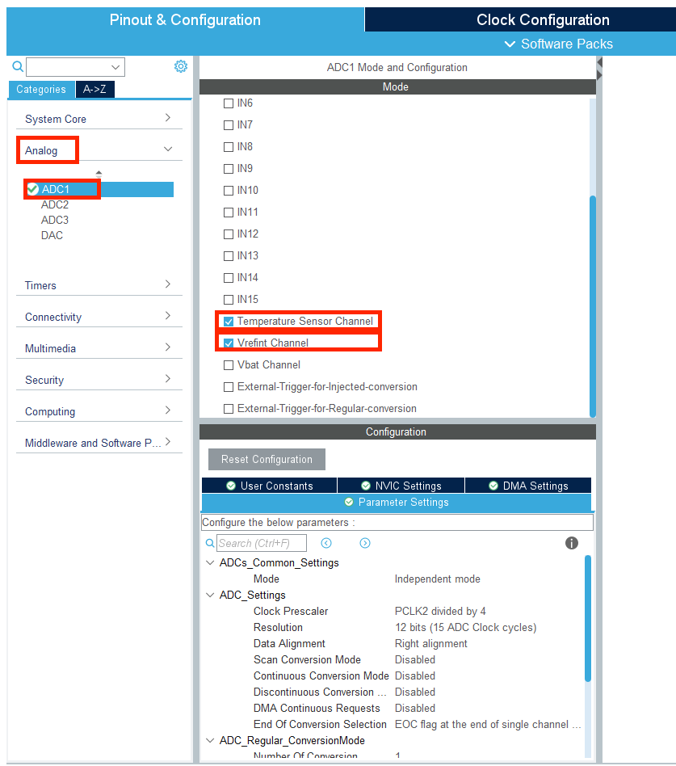

# ADC采样电池电压

### 基本介绍

ADC(Analog to Digital Converter)，承担着stm32中的模数转换功能。我们在单片机中传输的信号均为数字信号，通过离散的高低电平表示数字逻辑的 1 和 0，但是在现实的物理世界中只存在模拟信号，即连续变化的信号。所以，我们需要通过ADC功能将连续的模拟信号转化为离散的数字信号给单片机进行处理，这样才能处理我们用传感器收集到的连续变化的信号，比如光，热，声音，速度等等。

一般的ADC的工作流程为采样，比较，转换

* 采样：是指对某一时刻的模拟电压进行采集
* 比较：是指将采样的电压在比较电路中进行比较
* 转换：是指将比较电路中结果转换成数字量

stm32f4 采用 12 位逐次逼近型 ADC（SAR-ADC）。以下图为例，介绍 3 位 ADC 的比较过程


不同的位数分别赋予 1/2，1/4，1/8 的权值，模拟信号的采样值为 Vin，

1. 与 1/2Vref 进行比较，Vin 大于 1/2Vref，则将第一位标记为 1，
2. 与 3/4Vref 进行比较，Vin 小于 3/4Vref，则将第二位标记为 0，
3. 与 5/8Vref 进行比较，Vin 小于 5/8Vref，则将第三位标记为 0。

图中的 Vin 通过这个三位的 ADC 后输出的结果为 100。转换的结果为 1/2Vref,通过这样逐次比较过程，将采样取得的模拟电压和内部参考电压 Vref 的加权值进行比较，不同的位数赋予不同的权值。

stm32 支持最高 12 位 ADC，一般 ADC 的位数越多则转换精度越高，但与此同时转换的速度也会变慢。

此外，stm32 内部有一个校准电压 VREFINT，电压为 1.2V，当供电电压不为 3.3V，可以使用内部的 vrefint 通道采集 1.2V 电压作为 Vref，以提高精度。

### 电阻分压介绍

下图为一个用于读取电池电压使用的电阻分压电路。由于电池提供的电源是24V的高电压，而单片机引脚的耐压只有 0-3.3V，所以需要通过分压电路进行处理，并使用滤波和二极管限幅电路进行保护。


这里通过一个 200KΩ和 22KΩ的分压电路将 24V 电压进行分压
$$
V_{out} = 24V * \frac{22K\Omega}{22K\Omega + 200k\Omega} = 2.38V
$$
可以得到分压后的电压大约 2.38V，然后将该电压送至次级电路，在次级电路中，首先通过一个 100nF 的电容进行滤波，使输出的电压更加稳定，接着用二极管保护电路将电压限制在 3.3V 和 0V 之间，当电压大于 3.3V 时，二极管正向导通，电压被限制在 3.3V，当产生负压（电压小于 0V）时，二极管正向导通，输出点接地电压被限制在 0V。

<font color='#3e9e02'>不是很懂，之后再看</font>

### CubeMX配置

1. 我们首先打开C型开发板用户手册，找到附表中电源检测对应的IO口为PF10


2. 在原理图中，我们发现电源ADC使用的是ADC3的通道8。而stm32内部的1.2V校准电压Vrefint在ADC1中。


3. 打开CubeMX,在Analog菜单栏下找到ADC1，勾选Temperature Sensor Channel和Vrefint Channel用于读取内部参考电压。其余保持默认

	

4. 在ADC3选项中，打开IN8通道用于电池电压的读取，其余设置和ADC1一致保持默认即可，可以看到右边引脚图像中ADC3对应PF10变绿


5. 这里用一张表格表示CubeMX中ADC设置的功能

| 名称                          | 功能                                                        |
| ----------------------------- | ----------------------------------------------------------- |
| Clock Presecaler              | 设置采样时钟频率                                            |
| Resolution                    | 设置采样精度                                                |
| Data Alignment                | 设置数据对齐方式                                            |
| Scan Conversion Mode          | 扫描转换方式开启/关闭                                       |
| Continuous Conversion Mode    | 连续转换模式开启/关闭                                       |
| Discontinuous Conversion Mode | 非连续转换模式开启/关闭                                     |
| DMA Continuous Requests       | DMA连续启动开启/关闭                                        |
| End of Conversion Selection   | 每个通道转换结束后发送EOC标志/所有通道转换结束后发送EOC标志 |

6. 配置完之后，我们完成其他基础设置后就可以点击Generate Code生成对应的代码文件了。

### Vrefint电压的使用

在stm32中，我们可以选择使用不同的参考电压源进行ADC转换。

1. Vcc，通常为供电电压。但这种情况下ADC的精度会受到电源电压波动的影响
2. Vrefint内部参考电压，通常为1.2V。因为内部电压由芯片输出，所以相对稳定，用于提供更稳定和精确的ADC测量结果。

通过一个函数对 1.2V 的内部参考电压进行多次（这里是200次）采样，并计算其平均值,接着将其与 ADC 采出的数据值做对比。我们可以得到单位数字电压对应的模拟电压值 voltage_vrefint_proportion，其计算公式如下，设采样得到的数字值为 average_adc：
$$
average\_adc = \frac{total\_adc}{200} \\
voltage\_vrefint\_proportion = \frac{1.2v}{average\_adc} = 200*1.2/total\_adc
$$
用代码来表示就是

```cpp
void init_vrefint_reciprocal(void)
{
	uint8_t i = 0;
	uint32_t total_adc = 0;
	for(i = 0; i < 200; i++) //算200次的总和
	{
		total_adc += adcx_get_chx_value(&hadc1, ADC_CHANNEL_VREFINT);
	} 
	
	voltage_vrefint_proportion = 200*1.2f/total_adc //算比例
}

	
```

### 函数介绍

#### HAL_ADC_ConfigChannel

| 函数          |                                                              |
| ------------- | ------------------------------------------------------------ |
| 函数名        | HAL_ADC_ConfigChannel(ADC_HandleTypeDef* hadc, ADC_ChannelConfTypeDef* sConfig) |
| 函数作用      | 设置ADC通道的各个属性值，包括转换通道，序列排序，采样时间等  |
| 返回值        | HAL_StatusTypeDef, HAL库定义的几种状态，如果成功使ADC开始工作，则返回HAL_OK |
| 参数1：*hadc  | *hadc即ADC的句柄指针，如果是adc1则输入&hadc1,adc2则输入&hadc2 |
| 参数2:sConfig | *sConfig即指向ADC设置的结构体指针。我们先对sConfig结构体进行赋值，然后将其指针作为参数输入函数 |

sConfig结构体示例

```cpp
static ADC_ChannelConfTypeDef sConfig = {0};
sConfig.Channel = ADC_CHANNEL_VREFINT; //这里的Channel代表ADC的通道，ADC_CHANNEL_VREFINT是stm32自己定义的宏
sConfig.Rank = 1; //是指在采样序列中的位置，只有单通道时设置为1就好啦，多通道的时候需要设置2，3，4等等
sConfig.SamplingTime = ADC_SAMPLETIME_3CYCLES; // 采样时间，这里选择了3个周期，是stm32的宏定义，其他的宏定义还有15周期，28周期等等，可以自己看看
```


#### HAL_ADC_Start

| 函数         |                                                              |
| ------------ | ------------------------------------------------------------ |
| 函数名       | HAL_ADC_Start(ADC_HandleTypeDef* hadc)                       |
| 函数作用     | 开启ADC的采样                                                |
| 返回值       | HAL_StatusTypeDef, HAL库定义的几种状态，如果成功使ADC开始工作，则返回HAL_OK |
| 参数1：*hadc | *hadc即ADC的句柄指针，如果是adc1则输入&hadc1,adc2则输入&hadc2 |

#### HAL_ADC_PollForConversion

| 函数           |                                                              |
| -------------- | ------------------------------------------------------------ |
| 函数名         | HAL_ADC_PollForConversion(ADC_HandleTypeDef* hadc, uint32_t Timeout) |
| 函数作用       | 等待ADC转换结束                                              |
| 返回值         | HAL_StatusTypeDef, HAL库定义的几种状态，如果成功使ADC开始工作，则返回HAL_OK |
| 参数1：*hadc   | *hadc即ADC的句柄指针，如果是adc1则输入&hadc1,adc2则输入&hadc2 |
| 参数2：Timeout | Timeout 为等待的最大时间，单位为毫秒                         |

#### HAL_ADC_GetValue

| 函数         |                                                              |
| ------------ | ------------------------------------------------------------ |
| 函数名       | HAL_ADC_GetValue(ADC_HandleTypeDef* hadc)                    |
| 函数作用     | 获取adc值                                                    |
| 返回值       | HAL_StatusTypeDef, HAL库定义的几种状态，如果成功使ADC开始工作，则返回HAL_OK |
| 参数1：*hadc | *hadc即ADC的句柄指针，如果是adc1则输入&hadc1,adc2则输入&hadc2 |

### ADC典型使用步骤

1. **配置ADC通道**：
	* 使用 `HAL_ADC_ConfigChannel` 函数配置ADC通道的特定设置，如采样时间、通道号等。这个步骤通常在初始化阶段进行，但也可以在需要时更改通道配置。
	* 并用if语句判断是否完成配置，如果完成，应该返回的是HAL_OK
2. **启动ADC**：
	* 使用 `HAL_ADC_Start` 函数启动ADC。这个函数准备ADC硬件进行数据转换。
	* 我看的是每次采样都要启动
3. **轮询转换完成**：
	* 使用 `HAL_ADC_PollForConversion` 函数等待转换完成。这个函数检查ADC是否完成了数据转换，可以指定超时时间。
4. **获取ADC值**：
	* 使用 `HAL_ADC_GetValue` 函数读取转换结果。
5. **停止ADC**（如果需要）：
	* 使用 `HAL_ADC_Stop` 可以停止ADC，这通常在连续采样模式下不是必须的，但在单次采样模式中，可能每次采样后都需要停止ADC。

### 程序思路

#### 电池电压

1. 我们的目的是通过ADC找出输入电压。
2. 因此我们首先通过内部参考电压计算数字电压与模拟电压之比
3. 然后通过采样得出电池的模拟电压
4. 与前面计算出的比例相乘就得到了分压之后的输入电压的数字电压啦。
5. 我们在前面的电阻分压模块知道了我们ADC是通过 $22K\Omega$ 和 $200K\Omega$ 的两个电阻串联分压之后采样的，所以我们的结果需要再乘上 $\frac{22+200}{22}\approx 10.090909090909090f$ 
6. 这样就得到了我们的电压值

#### 板子温度

同样地我们还可以通过ADC获得板载的温度传感器的温度值

1. 同样先经过ADC值进行采样
2. 采样结束之后将ADC采样结果adc乘上前面的比例
3. 之后将我们第二步的结果代入公式temperature = (adc - 0.76f)*400.0f + 25.0f 从而计算出温度值

> [!note]
>
> 根据STM32的数据手册，温度传感器的输出电压在25°C时约为0.76伏特，且每度温度变化约有2.5毫伏的变化（相当于400°C每伏特）。因此，这个公式首先计算传感器电压与基准电压（0.76V）的差值，然后将差值转换为温度变化量，并加上基准温度25°C。

