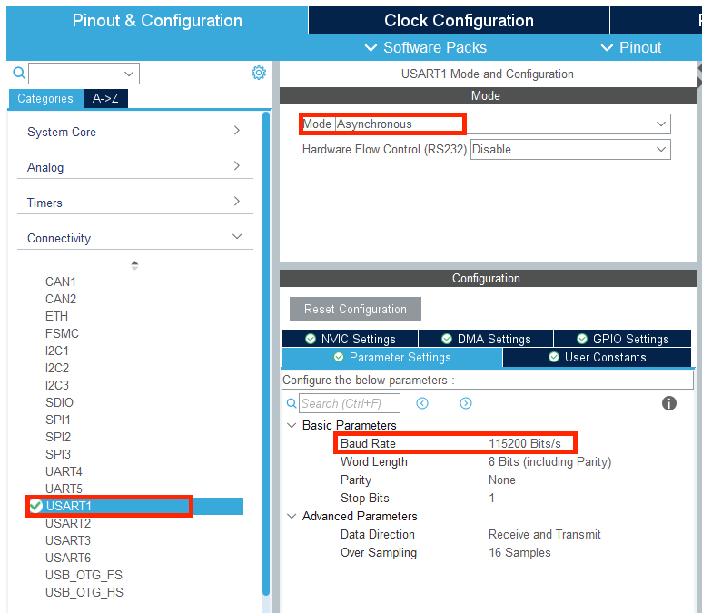
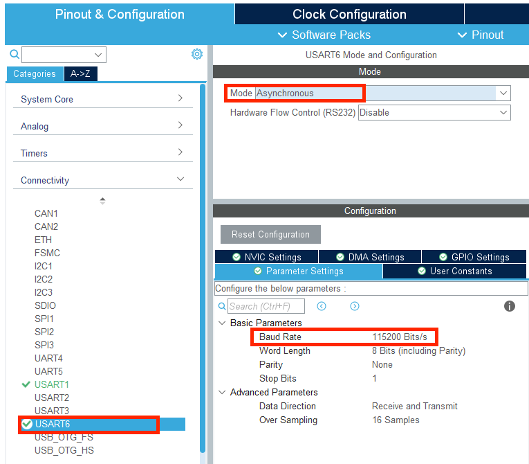
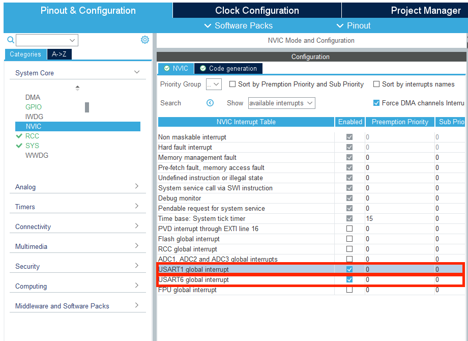

# 串口

### 引入

串口是一种在单片机，传感器，执行模块等诸多设备上常用的通讯接口，在比赛中，可以通过串口读取遥控器发送来的数据，也可以通过串

口读取超声波等传感器的数据，也可以使用串口在单片机和运行计算机视觉的电脑之间进行通讯。通过本节课的学习，将掌握如何通过 APB 时钟计算串口的波特率，串口在 cubeMX 中的配置方法，串口的接收中断与空闲中断功能，串口的发送函数与发送中断。

### 基本介绍

串口全称为通用串行通信接口(UART，Universal Asynchronous Receiver/Transmitter)，是一种非常常用的通信接口。串行即以高低电平表示 1 和 0，将数据一位一位顺序发送给接收方。通用串行通信接口有着协议简单，易于控制的优点。

串口的通讯协议由开始位，数据位，校验位，结束位构成。一般以一个低电平作为一帧数据的起始，接着跟随 8 位或者 9 位数据位，之后为校验位，分为奇校验，偶校验和无校验，最后以一个先高后低的脉冲表示结束位，长度可以设置为 0.5，1，1.5 或 2 位长度。

奇偶校验位的原理是统计发送数据中高电平即’1’的奇偶，将结果记录在奇偶校验位中发送给接收方，接收方收到奇偶校验位后和自己收到的数据进行对比，如果奇偶性一致就接受这帧数据，否则认为这帧数据出错。

下图是一个 8 位数据位，1 位奇偶校验位，1 位结束位的串口数据帧。

一般进行串口通讯时，收发双方要保证遵守同样的协议才能正确的完成收发，除了协议要一致之外，还有一个非常重要的要素要保持一致，那就是通讯的速率，即波特率。波特率是指发送数据的速率,单位为波特每秒，一般串口常用的波特率有 115200，38400，9600 等。串口的波特率和总线时钟周期（clock）成倒数关系，即总线时钟周期越短，单位时间内发送的码元数量越多，串口波特率就越高。

### CubeMX配置

1. 首先我们打开C型开发板用户手册，在附表中找到UART对应的IO口。我们发现C板只有两个串口可供使用。分别为UART1和UART6。

2. 回到CubeMX，我们首先在菜单栏的Connectivity下找到UART1，将其mode设置为Asynchronous异步通讯方式。异步通讯即发送方和接收方之间不依靠同步时钟信号的通讯方式。接着将其波特率设置为115200，数据帧设置为8位数据位，无校验位，1位停止位

注意，直接开启的话UART1_TX默认开启PB6，记得要去引脚那里将它改为PA9才能正常工作

3. 同样地，对UART6进行相同的配置

4. 接着我们前往NVIC标签页下，开启UART1和UART6的中断

5. 其他配置如时钟树和晶振则按常规设置配置。
6. 完成后点击Generate Code生成工程

### 串口接收中断和空闲中断

本小节介绍串口的接收中断与空闲中断，这两种中断都是在串口进行接收时可能会发生的中断。

|                       | 接收中断                           | 空闲中断                                                   |
| --------------------- | ---------------------------------- | ---------------------------------------------------------- |
| 处理函数              | USARTx_IRQHandler                  | USARTx_IRQHandler                                          |
| 回调函数              | HAL_UART_RxCpltCallback            | HAL库没有提供                                              |
| USART状态寄存器中的位 | UART_FLAG_RXNE                     | UART_FLAG_IDLE                                             |
| 触发条件              | 完成一帧数据的接收之后触发一次中断 | 串口接受完一帧数据后又过了一个字节的时间没有接收到任何数据 |

串口接收中断即每当串口完成一次接收之后触发一次中断。在 STM32 中相应的中断处理函数为 USARTx_IRQHandler，中断回调函数为 HAL_UART_RxCpltCallback。可以通过USART 状态寄存器中的 UART_FLAG_RXNE 位判断 USART 是否发生了接收中断。

串口空闲中断即每当串口接收完一帧数据后又过了一个字节的时间没有接收到任何数据则触发一次中断，中断处理函数同样为 USARTx_IRQHandler，可以通过 USART 状态寄存器中的 UART_FLAG_IDLE 判断是否发生了空闲中断。

### 函数介绍

#### HAL_UART_Transmit

通过这个函数可以从指定的串口发送数据

| 函数           |                                                              |
| -------------- | ------------------------------------------------------------ |
| 函数名         | HAL_UART_Transmit(UART_HandleTypeDef *huart, uint8_t *pData, uint16_t Size, uint32_t Timeout) |
| 函数作用       | 从指定的串口发送一段数据                                     |
| 返回值         | HAL_StatusTypeDef, HAL库定义的几种状态，如果成功使UART开始工作，则返回HAL_OK |
| 参数1：*huart  | *huart 要进行发送的串口的句柄指针，如串口1就是如&huart1，串口2就输入&huart2 |
| 参数2：*pData  | *pData 要发送的数据的首地址，比如要发送buf[] = "Helloworld"则输入buf,也可以直接输入要发送的字符串 |
| 参数3：Size    | Size 要发送的数据的大小，及输入的字符串的长度，也可以通过sizeof关键字获取数据大小 |
| 参数4：Timeout | 发送超时时间，如果发送时间超出该时间则取消本次发送           |

使能发送完成中断后，每当完成一次串口发送，串口会触发一次发送完成中断，对应的中断回调函数为 HAL_UART_TxCpltCallback。

#### __HAL_UART_ENABLE_IT

通过这个函数可以开启串口的指定中断

| 函数             |                                                              |
| ---------------- | ------------------------------------------------------------ |
| 函数名           | __HAL_UART_ENABLE_IT(UART_HandleTypeDef *huart, interrupt)   |
| 函数作用         | 开启串口指定的中断                                           |
| 返回值           | HAL_StatusTypeDef, HAL库定义的几种状态，如果成功使UART开始工作，则返回HAL_OK |
| 参数1：*huart    | *huart 要进行发送的串口的句柄指针，如串口1就是如&huart1，串口2就输入&huart2 |
| 参数2：interrupt | interrupt 指定需要启用的具体UART中断类型宏，常见的如UART_IT_RXNE,UART_IT_IDLE |

* RXNE(Receive Not Empty Interrupt)接收中断
* IDLE(Idle Line Interrupt)空闲中断

### 记录

不知道怎么原本的一个keil工程怎么改都没反应，搞了一天了，真的吐血了。新建了个工程就行了，唉真的奇怪。

**解决！** 就是在代码中我们需要重新定义一个USART_IRQHandler，那么为了让系统能够检测到你对这个函数的重定义，需要在你定义这个函数的地方引用stm32_f4xx_it这个文件才能用到你这个函数

但是为什么新建一个文件就又可以了呢，这就不清楚了。

### APB时钟计算串口波特率

本小结将学习如何通过 APB 时钟计算串口的波特率。计算串口的波特率时首先要通过在定时器章节介绍的方法，通过 datasheet 查找到使用的串口对应的总线是 APB1 还是 APB2，然后再在 cube 中找到对应总线的速率。

在获取总线速率后，可以通过 USART_BRR 寄存器中的 USARTDIV 值来计算串口的通讯速率。在该寄存器中，前 12 位用来表示 USARTDIV 的整数部分，后 4 位用来表示小数部分，小数部分乘以 16 后取整，然后存储在后 4 位中。

使用 USARTDIV 计算波特率的公式为：

​			Tx / Rx 波特率 ＝ fPCLKx/（16*USARTDIV）

在数据手册中查出 USART1 连接在 APB1 总线上， APB1 速率 PCLK1 为 42MHz。而期望的 USART1 的串口通讯速率为 115200。

1. 通过上述的波特率计算公式，计算出 USARTDIV 值为 42MHz/115200/16=22.786；
2. 将整数 22 转化为 16 进制 0x16，小数 0.786*16=12.576（取整 12）用 16 进制表示为0x0C，所以存储在 USART_BRR 中的值最终为 0x16C。

由于这里采取了一些取整和舍弃尾数的近似手段，所以通过寄存器产生的波特率和最终期望的波特率之间是存在误差的，一般较小的误差不会影响最终的串口通讯，但是如果通讯时出现问题的话，要记得检查是否与通讯速率的实际值与理想值相差较大有关
