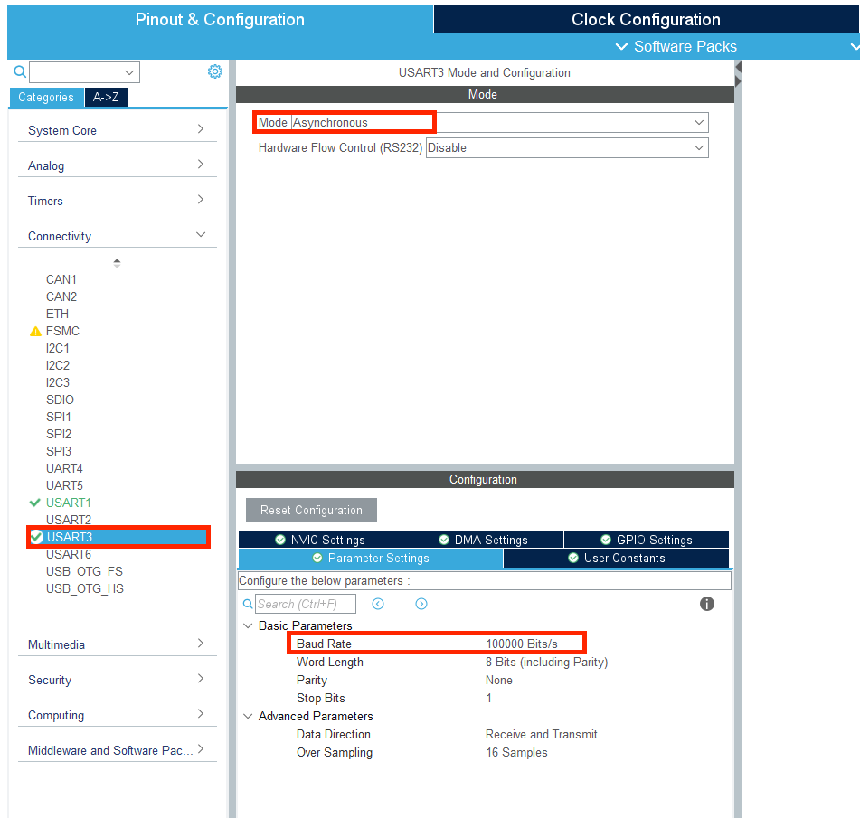
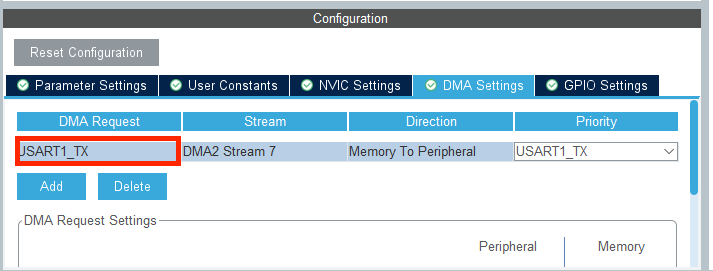

# DMA

### 引入

本节课程中将介绍 STM32 串口的 DMA 功能，DMA 是在使用串口进行通讯时常用的一个功能，使用该功能能够完成串口和内存之间直接的数据传送，而不需要 CPU 进行控制，从而节约 CPU 的处理时间。

通过实验的方式学习如何通过 DMA 功能读取遥控器的数据，接着将学习如何在 STM32 上实现用 DMA 进行串口输出的 printf 函数，并使用其将遥控器的数据传输到串口工具。

### DMA

DMA 全称为 Direct Memory Access（直接存储器访问），当需要将外部设备发来的数据存储在存储器中时，如果不使用 DMA 方式则首先需要将外部设备数据先读入 CPU 中，再由CPU 将数据存储到存储器中，如果数据量很大的话，那么将会占用大量的 CPU 时间，而通过使用 DMA 控制器直接将外部设备数据送入存储器，不需要占用 CPU。

STM32 中的许多通讯如 USART，SPI，IIC 都支持 DMA 方式进行数据的收发。

### DBus

遥控器和 stm32 之间采用 DBUS 协议进行通讯。DBUS 通讯协议和串口类似，DBUS 的传输速率为 100k bit/s，数据长度为 8 位，奇偶校验位为偶校验，结束位 1 位。需要注意的是DBUS 使用的电平标准和串口是相反的，在 DBUS 协议中高电平表示 0，低电平表示 1，如果使用串口进行接收需要在接收电路上添加一个反相器。

使用 DBUS 接收遥控器的数据，一帧数据的长度为 18 字节，一共 144 位，根据遥控器的说明书可以查出各段数据的含义，从而进行数据拼接，完成遥控器的解码，如图所示。

### CubeMX配置

1. 打开C型开发板的用户手册，我们找到DBus相关信息，可以发现，DBus经反相电路连接到了stm32的UART3，且波特率一般为100kbps

2. 于是对于CubeMX,我们要打开USART1和USART3进行配置，其中USART1开启串口的DMA发送，用于数据发送PC的串口工具，USART3开启串口的DMA接收，用于遥控器数据的接收

3. 打开CubeMX,我们在Connectivity标签页下将USART1打开，设置为Asynchronous异步通信方式。波特率设置为115200，数据帧设置为8位数据位，无校验位，1位停止位

	

	

注意这里和第8节一样，直接开启USART1默认开启的是PB6作为Tx，需要在引脚设置中改为PA9，不然无法正常工作

4. 接着，我们在Connectivity标签页下将USART3打开，设置为Asynchronous异步通信方式。波特率设置为100k（100000），数据帧设置为8位数据位，无校验位，1位停止位

5. 之后，我们分别打开USART1和USART3的DMA功能。点开USART1的设置页面，打开DMA Settings的标签页，点击Add

6. 在弹出的新条目中，将 DMA Request 选为 USART1_TX，数据从存储器流向外设，Priority 选为 Very High这两张图有点问题，晚点换一下。

7. 同样地，我们在USART3下找到DMA Settings标签页，在USART3中将DMA Request选择USART3_RX，数据从外设流向存储器，Priority选为Very High

8. 这样之后，在完成对cubeMx的基础设置之后，我们就完成了对DMA的设置

### 代码实现

说实话例程全是对寄存器进行操作，看不懂一点。。。。应该会用就完事了把。

要自己用那个return RC_ctrl的函数来获取对应的遥控器的参数，如果想看10进制的数字的把那个存储每个通道的数值的数据类型改为float就可以看到了，然后是放到main里面定义的变量，debug才能看到

那个printf我就不看了，感觉没啥用，而且需要个串口的调试器

### 踩过的坑

1. 要看看自己的这个选项有没有开，不然只能debug才能看到dr16传回来的数据

2. 如果想看10进制的数字的把那个存储每个通道的数值的数据类型改为float

3. 好像说只能是放在main里面debug的东西才能看到数据，未证实
4. 如果改了中断函数USART_IRQHandler()，要引用"stm32f4xx_it.h"这个头文件，不然这个函数会编译不了，看一个函数是否编译得了，就看他能不能打断点。我的两个文件都是这个问题

