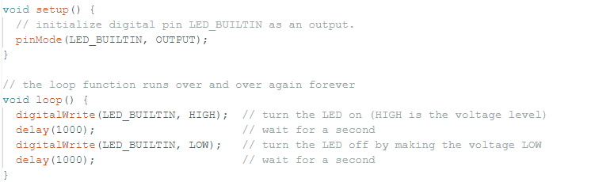
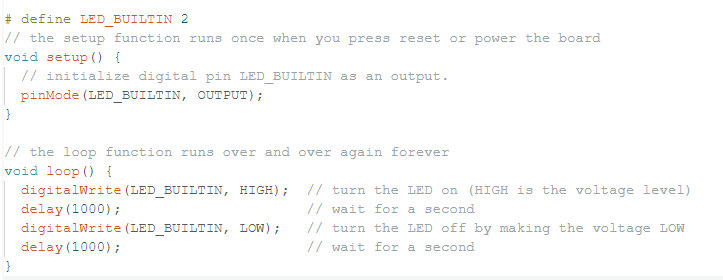
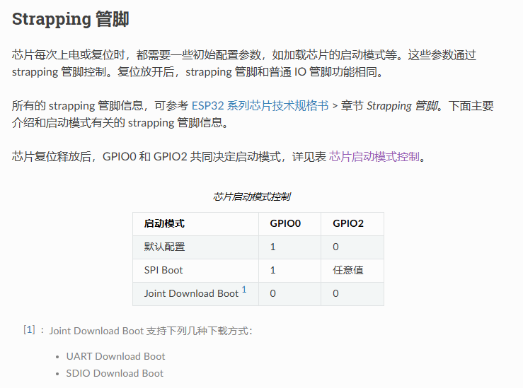
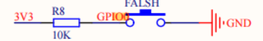

# ESP32入门

### ESP32与vscode开发环境搭建

#### 参考

1. https://blog.csdn.net/XiaoXiaoPengBo/article/details/123979246
2. https://www.esp32.com/viewtopic.php?t=23976

#### 问题

按照这个流程钟的第一个方法试了不行，于是去试第二个方法

第二个方法遇到下面这两个问题

* 一个是文件夹重名，我一个文件夹叫Espressif，一个叫Espressif_body它说我不行。。反正注意分开把
* 第二个是python.eve -m pip not valid

我试了上面参考2的方法，不行，放弃了，怕搞出问题，跳槽了

### Arduino IDE

#### 参考

1. https://blog.csdn.net/as480133937/article/details/105331315 CSDN下载教程
2. https://docs.espressif.com/projects/esp-hardware-design-guidelines/zh_CN/latest/esp32/schematic-checklist.html#tab-chip-boot-mode-control 乐鑫官网手册

#### 正文

1. 第一次下载之后打开要好久，差点又以为出问题了

2. 按照CDSN教程走，在开发板选型那一步选择ESP32 Dev Module

3. 在应用示例程序的Blink时如果直接对代码不做修改就编译有可能会报错，我这里报错的原因是程序使用了LED_BUILTIN这个变量但是没有定义它。我们首先查看自己开发板上LED小灯对应的GPIO口，我这里是GPIO2，所以只需要在void函数之外宏定义LED_BUILTIN就好

加上之后编译顺利通过

4. 通过之后我们来看看esp32的下载模式。打开参考2的乐鑫官网，我们找到Strapping 引脚。Strapping 引脚负责esp32启动的配置。

我们现在只是简单的下载，所以我们只需要关注这个芯片启动模式。这里有两个，SPI Boot 和 Joint Download Boot。SPI Boot其实就是正常的运行模式，此时GPIO0为高电平，而Joint Download Boot则是下载模式，GPIO0为低电平。在Esp32上，这个GPIO0的电平被设计成了按键触发，可以看下面这个原理图，虽然它画得很烂。

我们可以看到GPIO0加了一个10k欧的上拉电阻默认为3.3V，而当我们按下按键之后由于阻值更小所以变成了GND。

> 那么也就说我们下载的时候需要一直按着这个GPIO0的按键。下载完之后才能松开!